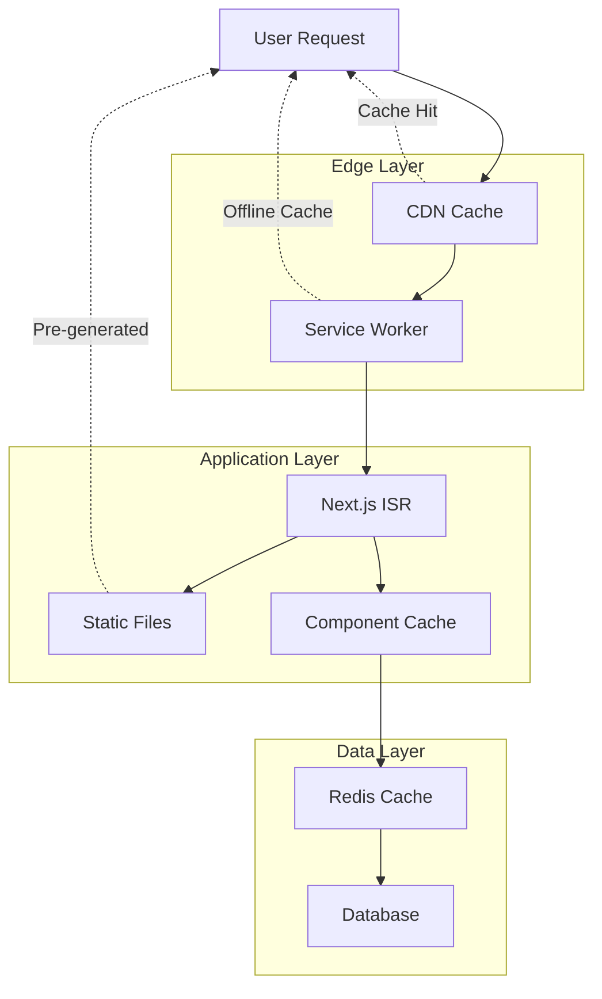

# itellico Mono Promo Pages - Advanced Caching Strategy

## 🚀 Overview

This document outlines the comprehensive caching strategy for itellico Mono promo pages, designed to deliver static-like performance while maintaining dynamic content capabilities. The strategy employs multiple caching layers to ensure optimal user experience and minimal server load.

## 📋 Table of Contents

- [Caching Architecture Overview](#caching-architecture-overview)
- [Static Generation + ISR](#static-generation--isr)
- [Multi-Layer Caching Strategy](#multi-layer-caching-strategy)
- [Build-Time Static Generation](#build-time-static-generation)
- [Client-Side Hydration Strategy](#client-side-hydration-strategy)
- [Smart Cache Invalidation](#smart-cache-invalidation)
- [Implementation Guide](#implementation-guide)
- [Performance Monitoring](#performance-monitoring)
- [Best Practices](#best-practices)

---

## 🏗️ Caching Architecture Overview

### Multi-Layer Caching Strategy



### Cache Performance Targets

| Cache Layer | Target Hit Rate | Max Response Time | TTL Strategy |
|-------------|----------------|-------------------|--------------|
| **CDN Edge** | >95% | <50ms | 5 minutes with stale-while-revalidate |
| **Service Worker** | >80% | <10ms | 24 hours for static, 5 minutes for dynamic |
| **Next.js ISR** | >90% | <100ms | 5 minutes revalidation |
| **Component Cache** | >85% | <200ms | Variable by component type |
| **Redis Cache** | >75% | <50ms | 5-30 minutes based on data volatility |

---

## 🔄 Static Generation + ISR

### Next.js ISR Implementation

```typescript
// pages/[...slug].tsx - Catch-all route for promo pages
export async function getStaticPaths() {
  // Pre-generate paths for popular pages at build time
  const popularPages = await getPopularPromoPages();
  
  return {
    paths: popularPages.map(page => ({
      params: { slug: page.slug.split('/') }
    })),
    fallback: 'blocking' // Generate other pages on-demand
  };
}

export async function getStaticProps({ params, locale }) {
  const slug = Array.isArray(params.slug) ? params.slug.join('/') : params.slug;
  
  try {
    const page = await fetchPromoPage(slug, locale);
    const renderedComponents = await preRenderComponents(page.sections);
    
    return {
      props: {
        page,
        renderedComponents,
        lastGenerated: new Date().toISOString()
      },
      revalidate: 300, // Regenerate every 5 minutes if requested
    };
  } catch (error) {
    return { notFound: true };
  }
}

// Pre-render all components with live data
async function preRenderComponents(sections: PageSection[]) {
  const renderedSections = await Promise.all(
    sections.map(async (section) => ({
      ...section,
      components: await Promise.all(
        section.components.map(async (component) => {
          // Fetch live data and render component
          const liveData = await fetchComponentData(component);
          return {
            ...component,
            renderedHTML: await renderComponentToString(component, liveData),
            dataFetchedAt: new Date().toISOString()
          };
        })
      )
    }))
  );
  
  return renderedSections;
}
```

### Component-Level Static Rendering

```typescript
// lib/static-component-renderer.ts
class StaticComponentRenderer {
  async renderComponent(
    component: ComponentInstance,
    tenantId: number
  ): Promise<RenderedComponent> {
    const cacheKey = `static-component:${tenantId}:${component.type}:${component.id}`;
    const cached = await this.cache.get(cacheKey);
    
    if (cached && !this.isStale(cached)) {
      return cached;
    }
    
    // Fetch fresh data
    const liveData = await this.fetchComponentData(component, tenantId);
    
    // Render to static HTML
    const html = await this.renderToStaticHTML(component, liveData);
    
    const rendered: RenderedComponent = {
      id: component.id,
      type: component.type,
      html,
      data: liveData,
      renderedAt: new Date(),
      ttl: this.getComponentTTL(component.type)
    };
    
    // Cache the rendered component
    await this.cache.set(cacheKey, rendered, rendered.ttl);
    
    return rendered;
  }
  
  private getComponentTTL(componentType: string): number {
    const TTL_MAP = {
      'MODEL_SHOWCASE': 300,      // 5 minutes - dynamic content
      'JOB_LISTINGS': 300,        // 5 minutes - frequently updated
      'BLOG_PREVIEW': 600,        // 10 minutes - moderately dynamic
      'STATS_COUNTER': 1800,      // 30 minutes - slow changing
      'TESTIMONIAL_CAROUSEL': 3600, // 1 hour - rarely changes
      'HERO_BANNER': 86400,       // 24 hours - mostly static
      'CONTACT_FORM': 86400,      // 24 hours - static
    };
    
    return TTL_MAP[componentType] || 1800; // Default 30 minutes
  }
  
  async renderToStaticHTML(
    component: ComponentInstance,
    data: any
  ): Promise<string> {
    // Use React Server Components or similar
    const ComponentClass = this.getComponentClass(component.type);
    
    return await renderToString(
      React.createElement(ComponentClass, {
        ...component.config,
        ...data,
        isStatic: true
      })
    );
  }
}

interface RenderedComponent {
  id: string;
  type: string;
  html: string;
  data: any;
  renderedAt: Date;
  ttl: number;
}
```

---

## 🗄️ Multi-Layer Caching Strategy

### CDN + Edge Caching Configuration

```typescript
// lib/edge-cache-config.ts
export const EDGE_CACHE_CONFIG = {
  // Static assets - cache for 1 year
  assets: {
    match: /\.(js|css|png|jpg|jpeg|gif|ico|svg|webp|woff|woff2)$/,
    headers: {
      'Cache-Control': 'public, max-age=31536000, immutable',
      'CDN-Cache-Control': 'max-age=31536000'
    }
  },
  
  // Promo pages - cache for 5 minutes, stale-while-revalidate
  promoPages: {
    match: /^\/(?!api|admin|blog|academy)/,
    headers: {
      'Cache-Control': 'public, max-age=300, stale-while-revalidate=3600',
      'CDN-Cache-Control': 'max-age=300, stale-while-revalidate=3600',
      'Vary': 'Accept-Language, Accept-Encoding'
    }
  },
  
  // API responses for promo components
  componentAPI: {
    match: /^\/api\/v1\/promo\/featured-content/,
    headers: {
      'Cache-Control': 'public, max-age=180, stale-while-revalidate=600',
      'CDN-Cache-Control': 'max-age=180'
    }
  }
};

// middleware.ts - Edge caching middleware
export function middleware(request: NextRequest) {
  const response = NextResponse.next();
  const pathname = request.nextUrl.pathname;
  
  // Apply cache headers based on route
  for (const [key, config] of Object.entries(EDGE_CACHE_CONFIG)) {
    if (config.match.test(pathname)) {
      Object.entries(config.headers).forEach(([header, value]) => {
        response.headers.set(header, value);
      });
      break;
    }
  }
  
  return response;
}
```

### Service Worker Implementation

```typescript
// public/sw.js - Service Worker for aggressive caching
const CACHE_NAME = 'promo-pages-v1';
const STATIC_CACHE_URLS = [
  '/favicon.ico',
  '/robots.txt',
  // Add other static assets
];

const DYNAMIC_CACHE_STRATEGIES = {
  // Promo pages - Cache first, network fallback
  promoPages: {
    match: /^\/(?!api|admin|_next)/,
    strategy: 'cacheFirst',
    maxAge: 24 * 60 * 60 * 1000, // 24 hours
    maxEntries: 50
  },
  
  // Component data - Network first, cache fallback
  componentData: {
    match: /\/api\/v1\/promo\/featured-content/,
    strategy: 'networkFirst',
    maxAge: 5 * 60 * 1000, // 5 minutes
    maxEntries: 100
  },
  
  // Images - Cache first
  images: {
    match: /\.(png|jpg|jpeg|gif|webp|svg)$/,
    strategy: 'cacheFirst',
    maxAge: 7 * 24 * 60 * 60 * 1000, // 7 days
    maxEntries: 200
  }
};

self.addEventListener('install', (event) => {
  event.waitUntil(
    caches.open(CACHE_NAME)
      .then(cache => cache.addAll(STATIC_CACHE_URLS))
  );
});

self.addEventListener('fetch', (event) => {
  const { request } = event;
  const url = new URL(request.url);
  
  // Find matching cache strategy
  const strategy = Object.values(DYNAMIC_CACHE_STRATEGIES)
    .find(s => s.match.test(url.pathname));
  
  if (strategy) {
    event.respondWith(handleRequest(request, strategy));
  }
});

async function handleRequest(request, strategy) {
  const cache = await caches.open(CACHE_NAME);
  
  switch (strategy.strategy) {
    case 'cacheFirst':
      return cacheFirst(request, cache, strategy);
    case 'networkFirst':
      return networkFirst(request, cache, strategy);
    default:
      return fetch(request);
  }
}

async function cacheFirst(request, cache, strategy) {
  const cached = await cache.match(request);
  
  if (cached) {
    // Check if cache is still valid
    const cacheTime = new Date(cached.headers.get('sw-cache-time'));
    if (Date.now() - cacheTime.getTime() < strategy.maxAge) {
      return cached;
    }
  }
  
  // Fetch fresh content
  try {
    const response = await fetch(request);
    if (response.ok) {
      const responseToCache = response.clone();
      responseToCache.headers.set('sw-cache-time', new Date().toISOString());
      await cache.put(request, responseToCache);
    }
    return response;
  } catch (error) {
    // Return stale cache if network fails
    return cached || new Response('Network error', { status: 503 });
  }
}

async function networkFirst(request, cache, strategy) {
  try {
    const response = await fetch(request);
    if (response.ok) {
      const responseToCache = response.clone();
      responseToCache.headers.set('sw-cache-time', new Date().toISOString());
      await cache.put(request, responseToCache);
    }
    return response;
  } catch (error) {
    const cached = await cache.match(request);
    if (cached) {
      return cached;
    }
    throw error;
  }
}
```

---

## 🏗️ Build-Time Static Generation

### Pre-build Script for Popular Pages

```typescript
// scripts/prebuild-promo-pages.ts
class PromoPrebuildGenerator {
  async generateStaticPages(): Promise<void> {
    console.log('🚀 Starting promo pages static generation...');
    const tenants = await this.getActiveTenants();
    
    for (const tenant of tenants) {
      await this.generateTenantPages(tenant);
    }
    
    console.log('✅ Promo pages static generation completed');
  }
  
  private async generateTenantPages(tenant: Tenant): Promise<void> {
    const pages = await this.getPublishedPromoPages(tenant.id);
    console.log(`📄 Generating ${pages.length} pages for tenant: ${tenant.slug}`);
    
    for (const page of pages) {
      for (const language of page.supportedLanguages) {
        await this.generateStaticPage(tenant, page, language);
      }
    }
  }
  
  private async generateStaticPage(
    tenant: Tenant,
    page: PromoPage,
    language: string
  ): Promise<void> {
    console.log(`Generating static page: ${tenant.slug}/${page.slug} (${language})`);
    
    try {
      // Fetch all component data
      const componentData = await this.fetchAllComponentData(page, tenant.id);
      
      // Render page to static HTML
      const html = await this.renderPageToHTML(page, componentData, language);
      
      // Generate file path
      const filePath = this.getStaticFilePath(tenant.slug, page.slug, language);
      
      // Write static file
      await this.writeStaticFile(filePath, html);
      
      // Generate metadata file for cache invalidation
      await this.writeMetadataFile(filePath, {
        generatedAt: new Date(),
        pageId: page.uuid,
        tenantId: tenant.id,
        language,
        dependencies: this.extractDependencies(page.sections)
      });
      
      console.log(`✅ Generated: ${filePath}`);
    } catch (error) {
      console.error(`❌ Failed to generate page: ${tenant.slug}/${page.slug}`, error);
    }
  }
  
  private async fetchAllComponentData(
    page: PromoPage,
    tenantId: number
  ): Promise<ComponentDataMap> {
    const dataMap: ComponentDataMap = {};
    
    for (const section of page.sections) {
      for (const component of section.components) {
        if (this.needsLiveData(component.type)) {
          try {
            dataMap[component.id] = await this.promoContentService
              .getFeaturedContent(component.config, tenantId);
          } catch (error) {
            console.warn(`Failed to fetch data for component ${component.id}:`, error);
            // Use empty data as fallback
            dataMap[component.id] = this.getEmptyComponentData(component.type);
          }
        }
      }
    }
    
    return dataMap;
  }
  
  private async renderPageToHTML(
    page: PromoPage,
    componentData: ComponentDataMap,
    language: string
  ): Promise<string> {
    // Use React Server Components or similar rendering
    const pageProps = {
      page,
      componentData,
      language,
      isStatic: true
    };
    
    return await renderToString(
      React.createElement(PromoPageComponent, pageProps)
    );
  }
  
  private getStaticFilePath(
    tenantSlug: string,
    pageSlug: string,
    language: string
  ): string {
    const langPrefix = language === 'en' ? '' : `/${language}`;
    return `./static-pages/${tenantSlug}${langPrefix}/${pageSlug}.html`;
  }
  
  private async writeStaticFile(filePath: string, html: string): Promise<void> {
    // Ensure directory exists
    await fs.mkdir(path.dirname(filePath), { recursive: true });
    
    // Write HTML file
    await fs.writeFile(filePath, html, 'utf8');
  }
  
  private async writeMetadataFile(filePath: string, metadata: any): Promise<void> {
    const metadataPath = filePath.replace('.html', '.metadata.json');
    await fs.writeFile(metadataPath, JSON.stringify(metadata, null, 2), 'utf8');
  }
  
  private extractDependencies(sections: PageSection[]): string[] {
    const dependencies: string[] = [];
    
    for (const section of sections) {
      for (const component of section.components) {
        if (this.needsLiveData(component.type)) {
          dependencies.push(`component:${component.type}`);
          
          // Add specific dependencies based on component type
          if (component.type === 'MODEL_SHOWCASE' && component.config.categories) {
            dependencies.push(`models:${component.config.categories.join(',')}`);
          }
          if (component.type === 'BLOG_PREVIEW' && component.config.categories) {
            dependencies.push(`blog:${component.config.categories.join(',')}`);
          }
        }
      }
    }
    
    return [...new Set(dependencies)]; // Remove duplicates
  }
  
  private needsLiveData(componentType: string): boolean {
    const dynamicComponents = [
      'MODEL_SHOWCASE',
      'JOB_LISTINGS',
      'BLOG_PREVIEW',
      'STATS_COUNTER'
    ];
    
    return dynamicComponents.includes(componentType);
  }
  
  private getEmptyComponentData(componentType: string): any {
    const emptyData = {
      'MODEL_SHOWCASE': { models: [] },
      'JOB_LISTINGS': { jobs: [] },
      'BLOG_PREVIEW': { posts: [] },
      'STATS_COUNTER': { stats: [] }
    };
    
    return emptyData[componentType] || {};
  }
}

interface ComponentDataMap {
  [componentId: string]: any;
}

// package.json script
{
  "scripts": {
    "prebuild": "tsx scripts/prebuild-promo-pages.ts",
    "build": "npm run prebuild && next build",
    "dev": "next dev"
  }
}
```

### Build Pipeline Integration

```yaml
# .github/workflows/build-promo-pages.yml
name: Build Promo Pages with Static Generation

on:
  push:
    branches: [main]
    paths: 
      - 'src/components/promo/**'
      - 'scripts/prebuild-promo-pages.ts'

jobs:
  build-static-pages:
    runs-on: ubuntu-latest
    steps:
      - uses: actions/checkout@v3
      
      - name: Setup Node.js
        uses: actions/setup-node@v3
        with:
          node-version: '18'
          
      - name: Install dependencies
        run: npm ci
        
      - name: Generate static promo pages
        run: npm run prebuild
        env:
          DATABASE_URL: ${{ secrets.DATABASE_URL }}
          REDIS_URL: ${{ secrets.REDIS_URL }}
          
      - name: Build Next.js application
        run: npm run build
        
      - name: Upload static pages
        uses: actions/upload-artifact@v3
        with:
          name: static-pages
          path: ./static-pages/
          
      - name: Deploy to CDN
        run: |
          aws s3 sync ./static-pages/ s3://${{ secrets.CDN_BUCKET }}/static-pages/
          aws cloudfront create-invalidation --distribution-id ${{ secrets.CLOUDFRONT_ID }} --paths "/static-pages/*"
```

---

## 📱 Client-Side Hydration Strategy

### Selective Hydration for Dynamic Components

```typescript
// components/HybridPromoPage.tsx
interface HybridPromoPageProps {
  page: PromoPage;
  staticHTML: string;
  dynamicComponents: string[]; // Component IDs that need hydration
  initialData?: ComponentDataMap;
}

export function HybridPromoPage({ 
  page, 
  staticHTML, 
  dynamicComponents,
  initialData = {}
}: HybridPromoPageProps) {
  const [hydratedComponents, setHydratedComponents] = useState<Set<string>>(new Set());
  const [isHydrating, setIsHydrating] = useState(false);
  
  useEffect(() => {
    // Hydrate dynamic components on demand
    const observer = new IntersectionObserver((entries) => {
      entries.forEach((entry) => {
        if (entry.isIntersecting) {
          const componentId = entry.target.getAttribute('data-component-id');
          if (componentId && dynamicComponents.includes(componentId)) {
            hydrateComponent(componentId);
            observer.unobserve(entry.target);
          }
        }
      });
    }, {
      rootMargin: '50px' // Start hydration 50px before component enters viewport
    });
    
    // Observe all dynamic component containers
    document.querySelectorAll('[data-component-id]').forEach((el) => {
      observer.observe(el);
    });
    
    return () => observer.disconnect();
  }, [dynamicComponents]);
  
  const hydrateComponent = async (componentId: string) => {
    if (hydratedComponents.has(componentId)) return;
    
    setIsHydrating(true);
    
    try {
      // Use initial data if available, otherwise fetch fresh
      let freshData = initialData[componentId];
      
      if (!freshData) {
        freshData = await fetchComponentData(componentId);
      }
      
      // Replace static content with live component
      const container = document.querySelector(`[data-component-id="${componentId}"]`);
      if (container) {
        const root = createRoot(container);
        const Component = getComponentClass(componentId);
        
        root.render(
          <Suspense fallback={<ComponentLoadingSkeleton />}>
            <Component {...freshData} isHydrated={true} />
          </Suspense>
        );
      }
      
      setHydratedComponents(prev => new Set(prev).add(componentId));
      
      // Track hydration analytics
      analytics.track('component_hydrated', {
        componentId,
        componentType: getComponentType(componentId),
        pageSlug: page.slug
      });
      
    } catch (error) {
      console.error(`Failed to hydrate component ${componentId}:`, error);
      
      // Track hydration errors
      analytics.track('component_hydration_error', {
        componentId,
        error: error.message,
        pageSlug: page.slug
      });
    } finally {
      setIsHydrating(false);
    }
  };
  
  return (
    <div className="promo-page">
      {/* Static HTML content */}
      <div 
        dangerouslySetInnerHTML={{ __html: staticHTML }}
        className="static-content"
      />
      
      {/* Hydration indicator */}
      {isHydrating && (
        <div className="hydration-indicator">
          <span>Loading fresh content...</span>
        </div>
      )}
      
      {/* Preload critical dynamic content */}
      <ComponentPreloader
        componentIds={dynamicComponents.slice(0, 2)} // First 2 visible components
        pageData={page}
      />
    </div>
  );
}

// Component preloader for critical above-the-fold content
function ComponentPreloader({ componentIds, pageData }: {
  componentIds: string[];
  pageData: PromoPage;
}) {
  useEffect(() => {
    // Preload data for critical components
    componentIds.forEach(async (componentId) => {
      try {
        const data = await fetchComponentData(componentId);
        // Cache in memory for immediate use
        componentDataCache.set(componentId, data);
      } catch (error) {
        console.warn(`Failed to preload component ${componentId}:`, error);
      }
    });
  }, [componentIds]);
  
  return null; // This component doesn't render anything
}

// Component loading skeleton
function ComponentLoadingSkeleton() {
  return (
    <div className="component-skeleton">
      <div className="skeleton-header" />
      <div className="skeleton-content">
        <div className="skeleton-line" />
        <div className="skeleton-line" />
        <div className="skeleton-line short" />
      </div>
    </div>
  );
}
```

### Progressive Enhancement Hook

```typescript
// hooks/useProgressiveEnhancement.ts
export function useProgressiveEnhancement(
  componentId: string,
  initialData?: any
) {
  const [data, setData] = useState(initialData);
  const [isLoading, setIsLoading] = useState(!initialData);
  const [error, setError] = useState<Error | null>(null);
  const [isStale, setIsStale] = useState(false);
  
  const refreshData = useCallback(async () => {
    setIsLoading(true);
    setError(null);
    
    try {
      const freshData = await fetchComponentData(componentId);
      setData(freshData);
      setIsStale(false);
    } catch (err) {
      setError(err as Error);
      console.error(`Failed to refresh data for ${componentId}:`, err);
    } finally {
      setIsLoading(false);
    }
  }, [componentId]);
  
  // Auto-refresh stale data
  useEffect(() => {
    if (initialData) {
      const dataAge = Date.now() - new Date(initialData.fetchedAt || 0).getTime();
      const maxAge = getComponentMaxAge(componentId);
      
      if (dataAge > maxAge) {
        setIsStale(true);
        refreshData();
      }
    } else {
      refreshData();
    }
  }, [componentId, initialData, refreshData]);
  
  // Set up polling for real-time components
  useEffect(() => {
    const shouldPoll = getRealTimeComponents().includes(getComponentType(componentId));
    
    if (shouldPoll && data && !isLoading) {
      const interval = setInterval(refreshData, 30000); // Poll every 30 seconds
      return () => clearInterval(interval);
    }
  }, [componentId, data, isLoading, refreshData]);
  
  return {
    data,
    isLoading,
    error,
    isStale,
    refresh: refreshData
  };
}

function getComponentMaxAge(componentId: string): number {
  const ageMap = {
    'MODEL_SHOWCASE': 5 * 60 * 1000,     // 5 minutes
    'JOB_LISTINGS': 5 * 60 * 1000,       // 5 minutes
    'BLOG_PREVIEW': 10 * 60 * 1000,      // 10 minutes
    'STATS_COUNTER': 30 * 60 * 1000,     // 30 minutes
  };
  
  const componentType = getComponentType(componentId);
  return ageMap[componentType] || 15 * 60 * 1000; // Default 15 minutes
}

function getRealTimeComponents(): string[] {
  return ['MODEL_SHOWCASE', 'JOB_LISTINGS', 'STATS_COUNTER'];
}
```

---

## 🔄 Smart Cache Invalidation

### Intelligent Cache Invalidation System

```typescript
// lib/cache-invalidation.ts
class SmartCacheInvalidator {
  private invalidationQueue = new Map<string, InvalidationTask>();
  
  async invalidatePageCache(
    tenantId: number,
    trigger: CacheInvalidationTrigger
  ): Promise<InvalidationResult> {
    const taskId = this.generateTaskId(tenantId, trigger);
    
    // Avoid duplicate invalidations
    if (this.invalidationQueue.has(taskId)) {
      return { status: 'queued', taskId };
    }
    
    const task: InvalidationTask = {
      id: taskId,
      tenantId,
      trigger,
      startedAt: new Date(),
      status: 'processing'
    };
    
    this.invalidationQueue.set(taskId, task);
    
    try {
      const affectedPages = await this.findAffectedPages(tenantId, trigger);
      
      // Execute invalidation in parallel
      const results = await Promise.allSettled([
        this.invalidateStaticFiles(affectedPages),
        this.invalidateCDNCache(affectedPages),
        this.invalidateServiceWorkerCache(affectedPages),
        this.invalidateISRCache(affectedPages),
        this.invalidateComponentCache(tenantId, trigger)
      ]);
      
      // Check for failures
      const failures = results
        .map((result, index) => ({ result, layer: this.getCacheLayerName(index) }))
        .filter(({ result }) => result.status === 'rejected');
      
      if (failures.length > 0) {
        console.warn('Some cache invalidations failed:', failures);
      }
      
      // Trigger background regeneration for high-priority pages
      const priorityPages = affectedPages.filter(p => p.priority === 'high');
      await this.backgroundRegenerate(priorityPages);
      
      task.status = 'completed';
      task.completedAt = new Date();
      task.affectedPages = affectedPages.length;
      
      return { 
        status: 'completed', 
        taskId,
        affectedPages: affectedPages.length,
        failures: failures.length
      };
      
    } catch (error) {
      task.status = 'failed';
      task.error = error.message;
      task.completedAt = new Date();
      
      console.error('Cache invalidation failed:', error);
      return { status: 'failed', taskId, error: error.message };
      
    } finally {
      // Clean up completed task after delay
      setTimeout(() => {
        this.invalidationQueue.delete(taskId);
      }, 300000); // 5 minutes
    }
  }
  
  private async findAffectedPages(
    tenantId: number,
    trigger: CacheInvalidationTrigger
  ): Promise<AffectedPage[]> {
    switch (trigger.type) {
      case 'content_update':
        return this.findPagesByContentReference(tenantId, trigger.contentId);
      case 'component_data_change':
        return this.findPagesByComponentType(tenantId, trigger.componentType);
      case 'user_action':
        return this.findPagesByUserAction(tenantId, trigger);
      case 'manual':
        return this.findPagesByManualTrigger(tenantId, trigger);
      default:
        return [];
    }
  }
  
  private async findPagesByComponentType(
    tenantId: number,
    componentType: string
  ): Promise<AffectedPage[]> {
    // Find all pages that use this component type
    const pages = await this.db.promoPage.findMany({
      where: {
        tenantId,
        status: 'PUBLISHED',
        sections: {
          path: '$[*].components[*].type',
          array_contains: componentType
        }
      },
      select: {
        uuid: true,
        slug: true,
        language: true,
        updatedAt: true
      }
    });
    
    return pages.map(page => ({
      pageId: page.uuid,
      slug: page.slug,
      language: page.language,
      priority: this.getPagePriority(page.slug),
      lastModified: page.updatedAt
    }));
  }
  
  private async invalidateStaticFiles(pages: AffectedPage[]): Promise<void> {
    const deletePromises = pages.flatMap(page => {
      const filePaths = this.getStaticFilePaths(page);
      return filePaths.map(async (path) => {
        try {
          await fs.unlink(path);
          console.log(`🗑️ Deleted static file: ${path}`);
        } catch (error) {
          if (error.code !== 'ENOENT') {
            console.warn(`Failed to delete static file ${path}:`, error);
          }
        }
      });
    });
    
    await Promise.allSettled(deletePromises);
  }
  
  private async invalidateCDNCache(pages: AffectedPage[]): Promise<void> {
    const urls = pages.flatMap(page => this.getPageURLs(page));
    
    if (urls.length === 0) return;
    
    try {
      await this.cdnService.purgeCache(urls);
      console.log(`🌐 Purged CDN cache for ${urls.length} URLs`);
    } catch (error) {
      console.error('Failed to purge CDN cache:', error);
      throw error;
    }
  }
  
  private async invalidateServiceWorkerCache(pages: AffectedPage[]): Promise<void> {
    // Send cache invalidation message to all connected service workers
    const urls = pages.flatMap(page => this.getPageURLs(page));
    
    await this.serviceWorkerMessaging.broadcast({
      type: 'CACHE_INVALIDATION',
      urls,
      timestamp: new Date().toISOString()
    });
    
    console.log(`📱 Sent cache invalidation to service workers for ${urls.length} URLs`);
  }
  
  private async invalidateISRCache(pages: AffectedPage[]): Promise<void> {
    // Use Next.js revalidation API
    const revalidationPromises = pages.map(async (page) => {
      try {
        await fetch(`/api/revalidate?path=${encodeURIComponent(page.slug)}`, {
          method: 'POST',
          headers: { 'Authorization': `Bearer ${process.env.REVALIDATION_TOKEN}` }
        });
        console.log(`🔄 Revalidated ISR for: ${page.slug}`);
      } catch (error) {
        console.warn(`Failed to revalidate ISR for ${page.slug}:`, error);
      }
    });
    
    await Promise.allSettled(revalidationPromises);
  }
  
  private async invalidateComponentCache(
    tenantId: number,
    trigger: CacheInvalidationTrigger
  ): Promise<void> {
    const cachePatterns = this.getComponentCachePatterns(tenantId, trigger);
    
    for (const pattern of cachePatterns) {
      try {
        await this.redis.del(pattern);
        console.log(`🗄️ Invalidated component cache: ${pattern}`);
      } catch (error) {
        console.warn(`Failed to invalidate component cache ${pattern}:`, error);
      }
    }
  }
  
  private async backgroundRegenerate(pages: AffectedPage[]): Promise<void> {
    // Queue background regeneration for high-priority pages
    const regenerationPromises = pages.map(async (page) => {
      try {
        // Trigger page regeneration without waiting
        fetch(`/api/regenerate?path=${encodeURIComponent(page.slug)}`, {
          method: 'POST',
          headers: { 'Authorization': `Bearer ${process.env.REGENERATION_TOKEN}` }
        }).catch(error => {
          console.warn(`Failed to trigger regeneration for ${page.slug}:`, error);
        });
      } catch (error) {
        console.warn(`Failed to queue regeneration for ${page.slug}:`, error);
      }
    });
    
    // Don't wait for completion
    Promise.allSettled(regenerationPromises);
    console.log(`🔄 Queued background regeneration for ${pages.length} pages`);
  }
  
  private getPagePriority(slug: string): 'high' | 'medium' | 'low' {
    // Home page and main landing pages are high priority
    if (slug === '/' || slug === 'home' || slug.includes('landing')) {
      return 'high';
    }
    
    // Category and product pages are medium priority
    if (slug.includes('category') || slug.includes('product') || slug.includes('service')) {
      return 'medium';
    }
    
    return 'low';
  }
  
  private getStaticFilePaths(page: AffectedPage): string[] {
    const paths: string[] = [];
    const basePath = `./static-pages/${page.tenantSlug}`;
    
    if (page.language === 'en') {
      paths.push(`${basePath}/${page.slug}.html`);
    } else {
      paths.push(`${basePath}/${page.language}/${page.slug}.html`);
    }
    
    // Include metadata file
    paths.push(`${paths[0].replace('.html', '.metadata.json')}`);
    
    return paths;
  }
  
  private getPageURLs(page: AffectedPage): string[] {
    const urls: string[] = [];
    const domain = this.getTenantDomain(page.tenantId);
    
    if (page.language === 'en') {
      urls.push(`https://${domain}/${page.slug}`);
    } else {
      urls.push(`https://${domain}/${page.language}/${page.slug}`);
    }
    
    return urls;
  }
  
  private getCacheLayerName(index: number): string {
    const layers = ['static-files', 'cdn', 'service-worker', 'isr', 'component'];
    return layers[index] || 'unknown';
  }
  
  private generateTaskId(tenantId: number, trigger: CacheInvalidationTrigger): string {
    const triggerHash = Buffer.from(JSON.stringify(trigger)).toString('base64').slice(0, 8);
    return `invalidation-${tenantId}-${trigger.type}-${triggerHash}`;
  }
}

interface CacheInvalidationTrigger {
  type: 'content_update' | 'component_data_change' | 'user_action' | 'manual' | 'scheduled';
  contentId?: string;
  componentType?: string;
  tenantId: number;
  pageIds?: string[];
  metadata?: any;
}

interface InvalidationTask {
  id: string;
  tenantId: number;
  trigger: CacheInvalidationTrigger;
  startedAt: Date;
  completedAt?: Date;
  status: 'processing' | 'completed' | 'failed';
  affectedPages?: number;
  error?: string;
}

interface InvalidationResult {
  status: 'queued' | 'completed' | 'failed';
  taskId: string;
  affectedPages?: number;
  failures?: number;
  error?: string;
}

interface AffectedPage {
  pageId: string;
  slug: string;
  language: string;
  priority: 'high' | 'medium' | 'low';
  lastModified: Date;
  tenantId?: number;
  tenantSlug?: string;
}
```

### Automated Cache Invalidation Triggers

```typescript
// lib/cache-invalidation-triggers.ts
class CacheInvalidationTriggers {
  constructor(
    private invalidator: SmartCacheInvalidator,
    private eventBus: EventBus
  ) {
    this.setupEventListeners();
  }
  
  private setupEventListeners(): void {
    // Content update triggers
    this.eventBus.on('blog.post.published', this.handleBlogPostUpdate.bind(this));
    this.eventBus.on('blog.post.updated', this.handleBlogPostUpdate.bind(this));
    this.eventBus.on('academy.course.published', this.handleCourseUpdate.bind(this));
    
    // Model/job data changes
    this.eventBus.on('model.featured.changed', this.handleModelDataChange.bind(this));
    this.eventBus.on('job.published', this.handleJobDataChange.bind(this));
    this.eventBus.on('job.updated', this.handleJobDataChange.bind(this));
    
    // User actions
    this.eventBus.on('user.registered', this.handleUserAction.bind(this));
    this.eventBus.on('user.profile.updated', this.handleUserAction.bind(this));
    
    // Admin actions
    this.eventBus.on('promo.page.updated', this.handlePromoPageUpdate.bind(this));
    this.eventBus.on('promo.component.updated', this.handleComponentUpdate.bind(this));
  }
  
  private async handleBlogPostUpdate(event: any): Promise<void> {
    await this.invalidator.invalidatePageCache(event.tenantId, {
      type: 'component_data_change',
      componentType: 'BLOG_PREVIEW',
      tenantId: event.tenantId,
      metadata: { blogPostId: event.postId }
    });
  }
  
  private async handleModelDataChange(event: any): Promise<void> {
    await this.invalidator.invalidatePageCache(event.tenantId, {
      type: 'component_data_change',
      componentType: 'MODEL_SHOWCASE',
      tenantId: event.tenantId,
      metadata: { modelId: event.modelId }
    });
  }
  
  private async handleJobDataChange(event: any): Promise<void> {
    await this.invalidator.invalidatePageCache(event.tenantId, {
      type: 'component_data_change',
      componentType: 'JOB_LISTINGS',
      tenantId: event.tenantId,
      metadata: { jobId: event.jobId }
    });
  }
  
  private async handlePromoPageUpdate(event: any): Promise<void> {
    await this.invalidator.invalidatePageCache(event.tenantId, {
      type: 'content_update',
      contentId: event.pageId,
      tenantId: event.tenantId,
      pageIds: [event.pageId]
    });
  }
  
  private async handleComponentUpdate(event: any): Promise<void> {
    await this.invalidator.invalidatePageCache(event.tenantId, {
      type: 'component_data_change',
      componentType: event.componentType,
      tenantId: event.tenantId,
      metadata: { componentId: event.componentId }
    });
  }
}
```

---

## 🚀 Implementation Guide

### Phase 1: Basic ISR Setup (Week 1)

```typescript
// Start with Next.js ISR for immediate benefits
// 1. Convert promo pages to use getStaticProps
export const getStaticProps = async ({ params }) => {
  return {
    props: { page: await fetchPromoPage(params.slug) },
    revalidate: 300 // 5 minutes
  };
};

// 2. Add basic edge caching headers
export function middleware(request: NextRequest) {
  const response = NextResponse.next();
  
  if (request.nextUrl.pathname.startsWith('/promo/')) {
    response.headers.set(
      'Cache-Control', 
      'public, max-age=300, stale-while-revalidate=3600'
    );
  }
  
  return response;
}
```

### Phase 2: Component-Level Caching (Week 2)

```typescript
// 3. Implement component-level caching
const CachedModelShowcase = withStaticCache(ModelShowcase, {
  ttl: 300,
  key: (props) => `models-${props.tenantId}-${props.categories?.join(',')}`
});

// 4. Add Redis caching for component data
class ComponentCacheService {
  async getOrSet<T>(
    key: string, 
    fetcher: () => Promise<T>, 
    ttl: number = 300
  ): Promise<T> {
    const cached = await this.redis.get(key);
    if (cached) return JSON.parse(cached);
    
    const data = await fetcher();
    await this.redis.setex(key, ttl, JSON.stringify(data));
    return data;
  }
}
```

### Phase 3: Service Worker & Offline Support (Week 3)

```typescript
// 5. Implement service worker for offline support
if ('serviceWorker' in navigator) {
  navigator.serviceWorker.register('/sw.js');
}

// 6. Add smart prefetching
const PreloadedLink = ({ href, children }) => {
  return (
    <Link
      href={href}
      onMouseEnter={() => prefetchPage(href)}
      onTouchStart={() => prefetchPage(href)}
    >
      {children}
    </Link>
  );
};
```

### Phase 4: Smart Invalidation (Week 4)

```typescript
// 7. Set up automatic cache invalidation
const invalidator = new SmartCacheInvalidator();

// 8. Add event-driven invalidation
eventBus.on('content.updated', async (event) => {
  await invalidator.invalidatePageCache(event.tenantId, {
    type: 'content_update',
    contentId: event.contentId,
    tenantId: event.tenantId
  });
});
```

---

## 📊 Performance Monitoring

### Cache Performance Metrics

```typescript
// lib/cache-metrics.ts
class CacheMetrics {
  private metrics = new Map<string, MetricData>();
  
  trackCacheHit(cacheType: string, key: string, responseTime: number): void {
    this.incrementMetric(`cache.hit.${cacheType}`);
    this.recordResponseTime(`cache.response_time.${cacheType}`, responseTime);
    
    this.analytics.track('cache_hit', { 
      type: cacheType, 
      key: this.hashKey(key),
      responseTime
    });
  }
  
  trackCacheMiss(cacheType: string, key: string, responseTime: number): void {
    this.incrementMetric(`cache.miss.${cacheType}`);
    this.recordResponseTime(`cache.response_time.${cacheType}`, responseTime);
    
    this.analytics.track('cache_miss', { 
      type: cacheType, 
      key: this.hashKey(key),
      responseTime
    });
  }
  
  trackCacheInvalidation(
    cacheType: string, 
    reason: string, 
    affectedKeys: number
  ): void {
    this.incrementMetric(`cache.invalidation.${cacheType}`);
    
    this.analytics.track('cache_invalidation', {
      type: cacheType,
      reason,
      affectedKeys,
      timestamp: new Date().toISOString()
    });
  }
  
  async generateCacheReport(tenantId: number): Promise<CacheReport> {
    const timeRange = {
      start: new Date(Date.now() - 24 * 60 * 60 * 1000), // Last 24 hours
      end: new Date()
    };
    
    return {
      tenantId,
      timeRange,
      staticGeneration: await this.getStaticGenerationMetrics(tenantId, timeRange),
      cdn: await this.getCDNMetrics(tenantId, timeRange),
      serviceWorker: await this.getServiceWorkerMetrics(tenantId, timeRange),
      isr: await this.getISRMetrics(tenantId, timeRange),
      component: await this.getComponentCacheMetrics(tenantId, timeRange),
      recommendations: await this.generateOptimizationRecommendations(tenantId)
    };
  }
  
  private async getStaticGenerationMetrics(
    tenantId: number, 
    timeRange: TimeRange
  ): Promise<StaticGenerationMetrics> {
    const metrics = await this.queryMetrics({
      metric: 'static_generation.*',
      tenantId,
      timeRange
    });
    
    return {
      pagesGenerated: metrics.sum('static_generation.pages_generated'),
      generationTime: metrics.avg('static_generation.generation_time'),
      generationErrors: metrics.sum('static_generation.errors'),
      hitRate: this.calculateHitRate(metrics, 'static_generation')
    };
  }
  
  private async getCDNMetrics(
    tenantId: number, 
    timeRange: TimeRange
  ): Promise<CDNMetrics> {
    // Query CDN provider API for metrics
    const cdnData = await this.cdnProvider.getMetrics({
      tenantId,
      timeRange
    });
    
    return {
      requests: cdnData.requests,
      hits: cdnData.cacheHits,
      misses: cdnData.cacheMisses,
      hitRate: (cdnData.cacheHits / cdnData.requests) * 100,
      bandwidth: cdnData.bandwidth,
      responseTime: cdnData.averageResponseTime
    };
  }
  
  private async generateOptimizationRecommendations(
    tenantId: number
  ): Promise<CacheOptimizationRecommendation[]> {
    const recommendations: CacheOptimizationRecommendation[] = [];
    const report = await this.generateCacheReport(tenantId);
    
    // CDN hit rate optimization
    if (report.cdn.hitRate < 85) {
      recommendations.push({
        type: 'cdn_optimization',
        priority: 'high',
        title: 'Improve CDN Cache Hit Rate',
        description: `Current CDN hit rate is ${report.cdn.hitRate.toFixed(1)}%. Consider increasing cache TTL for static content.`,
        impact: 'high',
        effort: 'low'
      });
    }
    
    // Component cache optimization
    if (report.component.hitRate < 75) {
      recommendations.push({
        type: 'component_optimization',
        priority: 'medium',
        title: 'Optimize Component Cache Strategy',
        description: `Component cache hit rate is ${report.component.hitRate.toFixed(1)}%. Review component TTL settings.`,
        impact: 'medium',
        effort: 'medium'
      });
    }
    
    // Static generation optimization
    if (report.staticGeneration.generationTime > 5000) {
      recommendations.push({
        type: 'static_optimization',
        priority: 'medium',
        title: 'Optimize Static Generation Performance',
        description: `Average generation time is ${report.staticGeneration.generationTime}ms. Consider parallel component rendering.`,
        impact: 'medium',
        effort: 'high'
      });
    }
    
    return recommendations;
  }
  
  private calculateHitRate(metrics: any, prefix: string): number {
    const hits = metrics.sum(`${prefix}.hits`) || 0;
    const misses = metrics.sum(`${prefix}.misses`) || 0;
    const total = hits + misses;
    
    return total > 0 ? (hits / total) * 100 : 0;
  }
  
  private hashKey(key: string): string {
    // Hash sensitive keys for privacy
    return Buffer.from(key).toString('base64').slice(0, 8);
  }
}

interface CacheReport {
  tenantId: number;
  timeRange: TimeRange;
  staticGeneration: StaticGenerationMetrics;
  cdn: CDNMetrics;
  serviceWorker: ServiceWorkerMetrics;
  isr: ISRMetrics;
  component: ComponentCacheMetrics;
  recommendations: CacheOptimizationRecommendation[];
}

interface CacheOptimizationRecommendation {
  type: string;
  priority: 'low' | 'medium' | 'high';
  title: string;
  description: string;
  impact: 'low' | 'medium' | 'high';
  effort: 'low' | 'medium' | 'high';
}
```

### Real-Time Cache Monitoring Dashboard

```typescript
// components/CacheMonitoringDashboard.tsx
export function CacheMonitoringDashboard({ tenantId }: { tenantId: number }) {
  const [metrics, setMetrics] = useState<CacheReport | null>(null);
  const [realTimeData, setRealTimeData] = useState<RealTimeCacheData>({});
  
  useEffect(() => {
    // Load initial metrics
    loadCacheReport();
    
    // Set up real-time updates
    const ws = new WebSocket(`/api/cache/metrics/stream?tenantId=${tenantId}`);
    ws.onmessage = (event) => {
      const data = JSON.parse(event.data);
      setRealTimeData(prev => ({ ...prev, ...data }));
    };
    
    return () => ws.close();
  }, [tenantId]);
  
  const loadCacheReport = async () => {
    try {
      const report = await fetch(`/api/cache/metrics?tenantId=${tenantId}`)
        .then(res => res.json());
      setMetrics(report);
    } catch (error) {
      console.error('Failed to load cache metrics:', error);
    }
  };
  
  if (!metrics) return <LoadingSpinner />;
  
  return (
    <div className="cache-monitoring-dashboard">
      <h2>Cache Performance Dashboard</h2>
      
      {/* Overview Cards */}
      <div className="metrics-grid">
        <MetricCard
          title="CDN Hit Rate"
          value={`${metrics.cdn.hitRate.toFixed(1)}%`}
          target={85}
          trend={realTimeData.cdnHitRate}
          status={metrics.cdn.hitRate >= 85 ? 'good' : 'warning'}
        />
        
        <MetricCard
          title="ISR Cache Hits"
          value={metrics.isr.hits}
          trend={realTimeData.isrHits}
          status="good"
        />
        
        <MetricCard
          title="Component Cache Hit Rate"
          value={`${metrics.component.hitRate.toFixed(1)}%`}
          target={75}
          trend={realTimeData.componentHitRate}
          status={metrics.component.hitRate >= 75 ? 'good' : 'warning'}
        />
        
        <MetricCard
          title="Avg Response Time"
          value={`${metrics.cdn.responseTime}ms`}
          target={100}
          trend={realTimeData.responseTime}
          status={metrics.cdn.responseTime <= 100 ? 'good' : 'warning'}
        />
      </div>
      
      {/* Cache Layer Breakdown */}
      <div className="cache-layers">
        <h3>Cache Layer Performance</h3>
        <CacheLayerChart data={metrics} />
      </div>
      
      {/* Optimization Recommendations */}
      {metrics.recommendations.length > 0 && (
        <div className="recommendations">
          <h3>Optimization Recommendations</h3>
          {metrics.recommendations.map((rec, index) => (
            <RecommendationCard key={index} recommendation={rec} />
          ))}
        </div>
      )}
      
      {/* Real-time Cache Events */}
      <div className="cache-events">
        <h3>Recent Cache Events</h3>
        <CacheEventStream tenantId={tenantId} />
      </div>
    </div>
  );
}
```

---

## 📋 Best Practices

### Cache Strategy Guidelines

1. **Layer-Appropriate TTL**
   - **CDN**: 5 minutes with stale-while-revalidate for promo pages
   - **Service Worker**: 24 hours for static assets, 5 minutes for dynamic content
   - **Component Cache**: Variable based on data volatility (5 minutes to 1 hour)
   - **Database Cache**: 5-30 minutes based on update frequency

2. **Smart Invalidation**
   - Use event-driven invalidation for content updates
   - Implement cascade invalidation for dependent content
   - Queue background regeneration for high-priority pages
   - Monitor invalidation performance and failures

3. **Progressive Enhancement**
   - Start with static generation for immediate benefits
   - Add selective hydration for dynamic components
   - Implement service worker for offline capability
   - Monitor and optimize based on actual usage patterns

4. **Performance Monitoring**
   - Track cache hit rates across all layers
   - Monitor response times and user experience metrics
   - Set up alerts for cache performance degradation
   - Generate regular optimization recommendations

### Cache Key Naming Conventions

```typescript
// Consistent cache key patterns
const CACHE_KEY_PATTERNS = {
  // Static pages
  staticPage: (tenantId: number, slug: string, lang: string) => 
    `static:${tenantId}:${lang}:${slug}`,
  
  // Component data
  componentData: (tenantId: number, componentType: string, configHash: string) =>
    `component:${tenantId}:${componentType}:${configHash}`,
  
  // Featured content
  featuredContent: (tenantId: number, contentType: string, filters: string) =>
    `featured:${tenantId}:${contentType}:${filters}`,
  
  // User-specific cache
  userCache: (tenantId: number, userId: number, dataType: string) =>
    `user:${tenantId}:${userId}:${dataType}`
};
```

### Error Handling & Fallbacks

```typescript
// Robust error handling for cache operations
class CacheWithFallback {
  async getOrFetch<T>(
    key: string,
    fetcher: () => Promise<T>,
    options: CacheOptions = {}
  ): Promise<T> {
    try {
      // Try cache first
      const cached = await this.cache.get(key);
      if (cached && !this.isStale(cached, options.maxAge)) {
        return cached;
      }
    } catch (error) {
      console.warn('Cache read failed:', error);
    }
    
    try {
      // Fetch fresh data
      const data = await fetcher();
      
      // Cache asynchronously (don't block response)
      this.cache.set(key, data, options.ttl).catch(error => {
        console.warn('Cache write failed:', error);
      });
      
      return data;
    } catch (error) {
      // Return stale cache as last resort
      try {
        const stale = await this.cache.get(key);
        if (stale) {
          console.warn('Returning stale cache due to fetch error:', error);
          return stale;
        }
      } catch (cacheError) {
        console.warn('Stale cache fallback failed:', cacheError);
      }
      
      throw error;
    }
  }
}
```

This comprehensive caching strategy ensures that itellico Mono promo pages deliver exceptional performance while maintaining the flexibility to display dynamic, up-to-date content when needed.