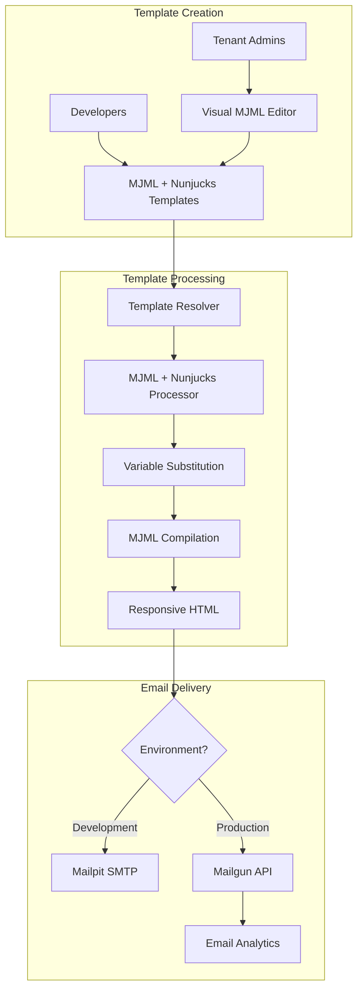

# 📧 Simplified Email System - Nunjucks Only

> **FINAL ARCHITECTURE: MJML + Nunjucks for Everything (Maximum Simplicity)**

## 🎯 Simplified Architecture Summary

**SINGLE TECHNOLOGY STACK:**
- **All Templates**: MJML + Nunjucks (Smarty-like syntax)
- **Development Email**: Mailpit (local SMTP testing)
- **Production Email**: Mailgun (with API monitoring)
- **Template Editor**: Custom-built visual editor

**Benefits: Single templating system + Zero complexity + Zero paid dependencies**

---

## 🏗️ Simplified System Architecture



**Key Simplification**: One rendering engine for everything!

---

## 📂 Simplified Project Structure

```
src/emails/
├── templates/                        # All email templates
│   ├── system/                       # System templates (developer-managed)
│   │   ├── auth/
│   │   │   ├── welcome.mjml          # User registration
│   │   │   ├── password-reset.mjml   # Password reset
│   │   │   └── verification.mjml     # Email verification
│   │   ├── platform/
│   │   │   ├── maintenance.mjml      # System maintenance
│   │   │   └── notification.mjml     # Platform notifications
│   │   └── workflows/
│   │       ├── user-onboarding.mjml  # Multi-step onboarding
│   │       └── account-setup.mjml    # Account configuration
│   │
│   ├── tenant/                       # Tenant templates (admin-customizable)
│   │   ├── workflow/
│   │   │   ├── application-status.mjml
│   │   │   ├── approval-request.mjml
│   │   │   └── workflow-complete.mjml
│   │   ├── messaging/
│   │   │   ├── new-message.mjml
│   │   │   ├── digest.mjml
│   │   │   └── escalation.mjml
│   │   └── marketing/
│   │       ├── newsletter.mjml
│   │       ├── announcement.mjml
│   │       └── event-invitation.mjml
│   │
│   ├── layouts/                      # Shared layouts
│   │   ├── base.mjml                 # Base email layout
│   │   ├── system.mjml               # System email layout
│   │   └── tenant.mjml               # Tenant-branded layout
│   │
│   └── components/                   # Reusable components
│       ├── header.mjml
│       ├── footer.mjml
│       ├── button.mjml
│       ├── user-card.mjml
│       └── status-badge.mjml
│
├── services/                         # Email processing
│   ├── email-service.ts              # Main email service
│   ├── template-renderer.ts          # MJML + Nunjucks renderer
│   ├── mailpit-service.ts            # Development email
│   └── mailgun-service.ts            # Production email
│
└── components/admin/                 # Admin interface
    ├── TemplateEditor.tsx            # Visual MJML editor
    ├── TemplateLibrary.tsx           # Template management
    └── EmailAnalytics.tsx            # Email performance
```

---

## 📧 Template Examples

### **System Template: Welcome Email**

```mjml
<!-- src/emails/templates/system/auth/welcome.mjml -->






  <mj-section background-color="#ffffff" padding="30px">
    <mj-column>
      <!-- Welcome Message -->
      <mj-text align="center">
        <h1 style="color: #1f2937; margin: 0 0 16px 0;">
          Welcome, {{ userName }}! 👋
        </h1>
        <p style="color: #6b7280; font-size: 18px; line-height: 1.6;">
          We're excited to have you join our creative community as a 
          <strong>{{ userType }}</strong>.
        </p>
      </mj-text>
      
      <!-- User Type Specific Message -->
      
        <mj-text>
          <p>Ready to build your modeling portfolio and connect with top agencies? 
          Let's get you started with creating your professional profile.</p>
        </mj-text>
      
        <mj-text>
          <p>Discover talented models and showcase your photography skills. 
          Your creative journey begins here!</p>
        </mj-text>
      
        <mj-text>
          <p>Manage your talent roster and find the perfect models for your projects. 
          Welcome to streamlined talent management.</p>
        </mj-text>
      
      
      <!-- Activation Button -->
      <mj-button 
        href="{{ activationUrl }}" 
        background-color="#3b82f6"
        color="#ffffff"
        font-size="16px"
        font-weight="600"
        padding="12px 24px"
        border-radius="8px"
      >
        Activate Your Account
      </mj-button>
      
      <!-- Next Steps -->
      
        <mj-text>
          <h3 style="color: #1f2937;">What's Next?</h3>
          <ol style="color: #6b7280; padding-left: 20px;">
            
              <li>{{ step.title }} - {{ step.description }}</li>
            
          </ol>
        </mj-text>
      
      
      <!-- Security Notice -->
      <mj-divider border-color="#e5e7eb" padding="20px 0" />
      
      <mj-text color="#9ca3af" font-size="14px">
        <p style="margin: 0;">
          <strong>Security Notice:</strong> If you didn't create this account, 
          please ignore this email or contact our support team.
        </p>
        <p style="margin: 8px 0 0 0;">
          This activation link expires in 24 hours for your security.
        </p>
      </mj-text>
    </mj-column>
  </mj-section>

```

### **Tenant Template: Application Status**

```mjml
<!-- src/emails/templates/tenant/workflow/application-status.mjml -->






  <mj-section background-color="#ffffff" padding="30px">
    <mj-column>
      <!-- Header -->
      <mj-text>
        <h1 style="color: {{ tenantBranding.primaryColor | default('#1f2937') }};">
          Application Update: {{ jobTitle }}
        </h1>
        <p style="font-size: 16px; color: #6b7280;">
          Hi {{ applicantName }},
        </p>
      </mj-text>
      
      <!-- Status Badge and Message -->
      
        
        
        
          <mj-text>
            <div style="background: #f8fafc; border-radius: 8px; padding: 20px; margin: 20px 0;">
              <h3 style="margin: 0 0 12px 0; color: #1f2937;">Next Steps:</h3>
              <p style="margin: 0; color: #4b5563;">{{ nextSteps }}</p>
            </div>
          </mj-text>
        
        
      
        
        
      
        
        
        
          <mj-text>
            <div style="background: #f0f9ff; border-radius: 8px; padding: 20px; margin: 20px 0;">
              <h3 style="margin: 0 0 16px 0; color: #1e40af;">Callback Details:</h3>
              <table style="width: 100%; border-collapse: collapse;">
                <tr>
                  <td style="padding: 8px 0; color: #374151; font-weight: 600;">Date:</td>
                  <td style="padding: 8px 0; color: #6b7280;">{{ callbackDetails.date | dateformat('MMMM DD, YYYY') }}</td>
                </tr>
                <tr>
                  <td style="padding: 8px 0; color: #374151; font-weight: 600;">Time:</td>
                  <td style="padding: 8px 0; color: #6b7280;">{{ callbackDetails.time }}</td>
                </tr>
                <tr>
                  <td style="padding: 8px 0; color: #374151; font-weight: 600;">Location:</td>
                  <td style="padding: 8px 0; color: #6b7280;">{{ callbackDetails.location }}</td>
                </tr>
                
                  <tr>
                    <td style="padding: 8px 0; color: #374151; font-weight: 600;">Requirements:</td>
                    <td style="padding: 8px 0; color: #6b7280;">{{ callbackDetails.requirements }}</td>
                  </tr>
                
              </table>
            </div>
          </mj-text>
        
        
      
        
      
      
      <!-- Action Button -->
      
        <mj-button 
          href="{{ actionUrl }}" 
          background-color="{{ tenantBranding.primaryColor | default('#3b82f6') }}"
          color="#ffffff"
          font-size="16px"
          font-weight="600"
          padding="12px 24px"
          border-radius="8px"
        >
          
            View Contract Details
          
            Confirm Callback Attendance
          
        </mj-button>
      
      
      <!-- Application Details -->
      <mj-divider border-color="#e5e7eb" padding="30px 0 20px 0" />
      
      <mj-text font-size="14px" color="#6b7280">
        <h4 style="margin: 0 0 12px 0; color: #374151;">Application Details:</h4>
        <table style="width: 100%; border-collapse: collapse;">
          <tr>
            <td style="padding: 4px 0; font-weight: 600;">Job:</td>
            <td style="padding: 4px 0;">{{ jobTitle }}</td>
          </tr>
          <tr>
            <td style="padding: 4px 0; font-weight: 600;">Applied:</td>
            <td style="padding: 4px 0;">{{ applicationDate | dateformat('MMMM DD, YYYY') }}</td>
          </tr>
          <tr>
            <td style="padding: 4px 0; font-weight: 600;">Reference:</td>
            <td style="padding: 4px 0;">#{{ applicationId }}</td>
          </tr>
          
            <tr>
              <td style="padding: 4px 0; font-weight: 600;">Agency:</td>
              <td style="padding: 4px 0;">{{ agency.name }}</td>
            </tr>
          
        </table>
        
        
          <p style="margin: 16px 0 0 0;">
            Questions? Contact us at 
            <a href="mailto:{{ contactEmail }}" style="color: {{ tenantBranding.primaryColor | default('#3b82f6') }};">
              {{ contactEmail }}
            </a>
          </p>
        
      </mj-text>
    </mj-column>
  </mj-section>

```

### **Reusable Component: Status Badge**

```mjml
<!-- src/emails/templates/components/status-badge.mjml -->
<mj-text>
  <div style="
    background: {{ bgColor | default('#f8fafc') }}; 
    border-left: 4px solid {{ borderColor | default('#64748b') }}; 
    border-radius: 8px;
    padding: 16px; 
    margin: 20px 0;
  ">
    <p style="
      color: {{ textColor | default('#64748b') }}; 
      margin: 0; 
      font-weight: {{ status == 'success' and '600' or '500' }};
      line-height: 1.5;
    ">
      {{ message }}
    </p>
  </div>
</mj-text>
```

---

## 🛠️ Simplified Services

### **Single Template Renderer**

```typescript
// src/emails/services/template-renderer.ts
import mjml from 'mjml';
import nunjucks from 'nunjucks';
import path from 'path';

export class TemplateRenderer {
  private nunjucksEnv: nunjucks.Environment;
  
  constructor() {
    // Configure Nunjucks with all template directories
    this.nunjucksEnv = new nunjucks.Environment(
      new nunjucks.FileSystemLoader([
        path.join(process.cwd(), 'src/emails/templates'),
        path.join(process.cwd(), 'src/emails/templates/system'),
        path.join(process.cwd(), 'src/emails/templates/tenant'),
        path.join(process.cwd(), 'src/emails/templates/layouts'),
        path.join(process.cwd(), 'src/emails/templates/components')
      ]),
      {
        autoescape: true,
        throwOnUndefined: false,
        trimBlocks: true,
        lstripBlocks: true
      }
    );
    
    this.registerFilters();
    this.registerGlobals();
  }
  
  async renderTemplate(
    templatePath: string,
    variables: Record<string, any>
  ): Promise<{ html: string; text: string; subject: string }> {
    try {
      // 1. Render MJML template with Nunjucks variables
      const mjmlTemplate = this.nunjucksEnv.render(`${templatePath}.mjml`, variables);
      
      // 2. Compile MJML to responsive HTML
      const mjmlResult = mjml(mjmlTemplate, {
        validationLevel: 'strict',
        keepComments: false,
        beautify: true
      });
      
      if (mjmlResult.errors.length > 0) {
        console.warn('MJML compilation warnings:', mjmlResult.errors);
      }
      
      // 3. Generate text version
      const textVersion = this.generateTextVersion(mjmlResult.html);
      
      // 4. Extract subject from variables or template
      const subject = variables.emailTitle || 
                     variables.subject || 
                     `Email from ${variables.tenantName || variables.platformName || 'itellico Mono'}`;
      
      return {
        html: mjmlResult.html,
        text: textVersion,
        subject
      };
      
    } catch (error) {
      console.error('Template rendering failed:', error);
      throw new Error(`Failed to render template ${templatePath}: ${error.message}`);
    }
  }
  
  private registerFilters() {
    // Date formatting
    this.nunjucksEnv.addFilter('dateformat', (date: string | Date, format: string = 'MMMM DD, YYYY') => {
      const d = new Date(date);
      const options: Intl.DateTimeFormatOptions = {
        year: 'numeric',
        month: 'long',
        day: 'numeric'
      };
      
      if (format.includes('h') || format.includes('H')) {
        options.hour = 'numeric';
        options.minute = '2-digit';
      }
      
      return d.toLocaleDateString('en-US', options);
    });
    
    // Currency formatting
    this.nunjucksEnv.addFilter('currency', (amount: number, currency: string = 'USD') => {
      return new Intl.NumberFormat('en-US', {
        style: 'currency',
        currency
      }).format(amount);
    });
    
    // Text truncation
    this.nunjucksEnv.addFilter('truncate', (text: string, length: number = 100) => {
      return text.length > length ? text.substring(0, length) + '...' : text;
    });
    
    // Capitalize first letter
    this.nunjucksEnv.addFilter('capitalize', (text: string) => {
      return text.charAt(0).toUpperCase() + text.slice(1);
    });
    
    // URL safe string
    this.nunjucksEnv.addFilter('urlsafe', (text: string) => {
      return encodeURIComponent(text);
    });
  }
  
  private registerGlobals() {
    // Platform defaults
    this.nunjucksEnv.addGlobal('platformName', 'itellico Mono');
    this.nunjucksEnv.addGlobal('currentYear', new Date().getFullYear());
    this.nunjucksEnv.addGlobal('supportEmail', 'support@mono-platform.com');
  }
  
  private generateTextVersion(html: string): string {
    return html
      .replace(/<style[^>]*>.*?<\/style>/gs, '')
      .replace(/<script[^>]*>.*?<\/script>/gs, '')
      .replace(/<[^>]*>/g, '')
      .replace(/&nbsp;/g, ' ')
      .replace(/&amp;/g, '&')
      .replace(/&lt;/g, '<')
      .replace(/&gt;/g, '>')
      .replace(/&quot;/g, '"')
      .replace(/&#39;/g, "'")
      .replace(/\s+/g, ' ')
      .trim();
  }
}
```

### **Simplified Email Service**

```typescript
// src/emails/services/email-service.ts
import { TemplateRenderer } from './template-renderer';
import { MailpitService } from './mailpit-service';
import { MailgunService } from './mailgun-service';

interface SendEmailOptions {
  to: string | string[];
  templatePath: string; // e.g., 'system/auth/welcome' or 'tenant/workflow/application-status'
  variables: Record<string, any>;
  tenantId?: number;
  category?: string;
  tags?: string[];
}

export class EmailService {
  private renderer = new TemplateRenderer();
  private mailpitService = new MailpitService();
  private mailgunService = new MailgunService();
  
  async sendEmail({
    to,
    templatePath,
    variables,
    tenantId,
    category = 'transactional',
    tags = []
  }: SendEmailOptions) {
    try {
      // 1. Enhance variables with tenant/platform data
      const enrichedVariables = await this.enrichVariables(variables, tenantId);
      
      // 2. Render template
      const renderedEmail = await this.renderer.renderTemplate(templatePath, enrichedVariables);
      
      // 3. Choose delivery service
      const emailService = process.env.NODE_ENV === 'development' 
        ? this.mailpitService 
        : this.mailgunService;
      
      // 4. Send email
      const result = await emailService.sendEmail({
        to: Array.isArray(to) ? to : [to],
        subject: renderedEmail.subject,
        html: renderedEmail.html,
        text: renderedEmail.text,
        category,
        tags: [
          ...tags,
          templatePath.split('/')[0], // 'system' or 'tenant'
          ...(tenantId ? [`tenant-${tenantId}`] : [])
        ]
      });
      
      // 5. Log email
      await this.logEmail({
        templatePath,
        tenantId,
        recipients: Array.isArray(to) ? to : [to],
        category,
        messageId: result.messageId,
        status: 'sent'
      });
      
      return result;
      
    } catch (error) {
      console.error('Email sending failed:', error);
      
      await this.logEmail({
        templatePath,
        tenantId,
        recipients: Array.isArray(to) ? to : [to],
        category,
        status: 'failed',
        error: error.message
      });
      
      throw error;
    }
  }
  
  private async enrichVariables(
    variables: Record<string, any>, 
    tenantId?: number
  ): Promise<Record<string, any>> {
    const enriched = { ...variables };
    
    // Add tenant branding if tenantId provided
    if (tenantId) {
      const tenantBranding = await this.getTenantBranding(tenantId);
      enriched.tenantBranding = tenantBranding;
      enriched.tenantName = tenantBranding.companyName;
      enriched.unsubscribeUrl = `${tenantBranding.domain}/unsubscribe`;
    }
    
    // Add platform defaults
    enriched.platformName = 'itellico Mono';
    enriched.platformUrl = 'https://mono-platform.com';
    enriched.supportEmail = 'support@mono-platform.com';
    
    return enriched;
  }
  
  private async getTenantBranding(tenantId: number) {
    const tenant = await prisma.tenant.findUnique({
      where: { id: tenantId },
      include: { branding: true }
    });
    
    return {
      companyName: tenant?.name || 'itellico Mono',
      logoUrl: tenant?.branding?.logoUrl || '/default-logo.png',
      primaryColor: tenant?.branding?.primaryColor || '#3b82f6',
      fontFamily: tenant?.branding?.fontFamily || 'Arial, sans-serif',
      domain: tenant?.customDomain || `${tenant?.subdomain}.mono-platform.com`,
      websiteUrl: tenant?.branding?.websiteUrl || `https://${tenant?.subdomain}.mono-platform.com`
    };
  }
  
  private async logEmail(emailLog: any) {
    await prisma.emailLog.create({
      data: {
        ...emailLog,
        sentAt: new Date()
      }
    });
  }
}
```

---

## 🎨 Visual Template Editor (Simplified)

```typescript
// src/components/admin/email/SimplifiedTemplateEditor.tsx
import { useState, useEffect } from 'react';
import { Card, CardContent, CardHeader, CardTitle } from '@/components/ui/card';
import { Button } from '@/components/ui/button';
import { Textarea } from '@/components/ui/textarea';
import { Badge } from '@/components/ui/badge';
import { Tabs, TabsContent, TabsList, TabsTrigger } from '@/components/ui/tabs';

interface TemplateEditorProps {
  templatePath: string;
  tenantId?: number;
  initialTemplate?: string;
  availableVariables: TemplateVariable[];
  onSave: (mjmlContent: string) => void;
}

export function SimplifiedTemplateEditor({
  templatePath,
  tenantId,
  initialTemplate = '',
  availableVariables,
  onSave
}: TemplateEditorProps) {
  const [mjmlContent, setMjmlContent] = useState(initialTemplate);
  const [previewHtml, setPreviewHtml] = useState('');
  const [isLoading, setIsLoading] = useState(false);

  // Sample variables for preview
  const sampleVariables = {
    userName: 'John Doe',
    userType: 'model',
    tenantName: 'Demo Agency',
    jobTitle: 'Fashion Photographer',
    applicationDate: new Date().toISOString(),
    activationUrl: 'https://example.com/activate',
    status: 'approved',
    ...generateSampleData(templatePath)
  };

  const generatePreview = async () => {
    setIsLoading(true);
    try {
      const response = await fetch('/api/v1/admin/email-templates/preview', {
        method: 'POST',
        headers: { 'Content-Type': 'application/json' },
        body: JSON.stringify({
          templatePath,
          mjmlTemplate: mjmlContent,
          variables: sampleVariables,
          tenantId
        })
      });
      
      const result = await response.json();
      setPreviewHtml(result.html);
    } catch (error) {
      console.error('Preview generation failed:', error);
    }
    setIsLoading(false);
  };

  const insertVariable = (variableName: string) => {
    const textarea = document.getElementById('mjml-editor') as HTMLTextAreaElement;
    const cursorPos = textarea?.selectionStart || 0;
    const beforeCursor = mjmlContent.substring(0, cursorPos);
    const afterCursor = mjmlContent.substring(cursorPos);
    const variableTag = `{{ ${variableName} }}`;
    
    setMjmlContent(beforeCursor + variableTag + afterCursor);
  };

  const insertMJMLComponent = (component: string) => {
    const components = {
      'text': `
<mj-text>
  <h2>{{ heading | default('Your Heading') }}</h2>
  <p>{{ message | default('Your message here') }}</p>
</mj-text>`,
      'button': `
<mj-button 
  href="{{ actionUrl }}" 
  background-color="{{ tenantBranding.primaryColor | default('#3b82f6') }}"
>
  {{ buttonText | default('Click Here') }}
</mj-button>`,
      'image': `
<mj-image 
  src="{{ imageUrl }}" 
  alt="{{ imageAlt | default('Description') }}" 
/>`,
      'divider': `
<mj-divider border-color="#e5e7eb" padding="20px 0" />`,
      'status-badge': `
`,
      'user-card': `
`
    };

    const componentCode = components[component as keyof typeof components];
    if (componentCode) {
      setMjmlContent(prev => prev + '\n' + componentCode + '\n');
    }
  };

  return (
    <div className="h-full">
      <Tabs defaultValue="editor" className="h-full">
        <TabsList>
          <TabsTrigger value="editor">Template Editor</TabsTrigger>
          <TabsTrigger value="variables">Variables</TabsTrigger>
          <TabsTrigger value="components">Components</TabsTrigger>
        </TabsList>
        
        <TabsContent value="editor" className="h-full mt-4">
          <div className="grid grid-cols-1 lg:grid-cols-2 gap-6 h-full">
            {/* MJML Editor */}
            <Card>
              <CardHeader>
                <CardTitle>MJML Template</CardTitle>
                <div className="flex gap-2">
                  <Button onClick={generatePreview} disabled={isLoading} size="sm">
                    {isLoading ? 'Generating...' : 'Preview'}
                  </Button>
                  <Button onClick={() => onSave(mjmlContent)} variant="default" size="sm">
                    Save Template
                  </Button>
                </div>
              </CardHeader>
              <CardContent>
                <Textarea
                  id="mjml-editor"
                  value={mjmlContent}
                  onChange={(e) => setMjmlContent(e.target.value)}
                  className="font-mono text-sm h-96 resize-none"
                  placeholder="Enter your MJML template here..."
                />
              </CardContent>
            </Card>

            {/* Preview */}
            <Card>
              <CardHeader>
                <CardTitle>Live Preview</CardTitle>
              </CardHeader>
              <CardContent>
                <div 
                  className="border rounded h-96 overflow-auto bg-white"
                  dangerouslySetInnerHTML={{ __html: previewHtml }}
                />
              </CardContent>
            </Card>
          </div>
        </TabsContent>
        
        <TabsContent value="variables" className="mt-4">
          <Card>
            <CardHeader>
              <CardTitle>Available Variables</CardTitle>
              <p className="text-sm text-gray-600">Click any variable to copy it to your clipboard</p>
            </CardHeader>
            <CardContent>
              <div className="grid grid-cols-1 md:grid-cols-2 lg:grid-cols-3 gap-4">
                {availableVariables.map(variable => (
                  <div 
                    key={variable.variable_name}
                    className="border rounded-lg p-3 cursor-pointer hover:bg-blue-50 transition-colors"
                    onClick={() => {
                      navigator.clipboard.writeText(`{{ ${variable.variable_name} }}`);
                      insertVariable(variable.variable_name);
                    }}
                  >
                    <Badge variant="outline" className="mb-2">
                      {{ {variable.variable_name} }}
                    </Badge>
                    <p className="text-sm font-medium">{variable.display_name}</p>
                    <p className="text-xs text-gray-500">{variable.description}</p>
                    <p className="text-xs text-blue-600 mt-1">Example: {variable.example_value}</p>
                  </div>
                ))}
              </div>
            </CardContent>
          </Card>
        </TabsContent>
        
        <TabsContent value="components" className="mt-4">
          <Card>
            <CardHeader>
              <CardTitle>MJML Components & Includes</CardTitle>
              <p className="text-sm text-gray-600">Click to insert pre-built components</p>
            </CardHeader>
            <CardContent>
              <div className="grid grid-cols-2 md:grid-cols-3 lg:grid-cols-4 gap-3">
                {[
                  { key: 'text', label: '📝 Text Block', desc: 'Heading and paragraph' },
                  { key: 'button', label: '🔘 Button', desc: 'Call-to-action button' },
                  { key: 'image', label: '🖼️ Image', desc: 'Responsive image' },
                  { key: 'divider', label: '➖ Divider', desc: 'Section separator' },
                  { key: 'status-badge', label: '🏷️ Status Badge', desc: 'Colored status message' },
                  { key: 'user-card', label: '👤 User Card', desc: 'User information display' }
                ].map(component => (
                  <Button
                    key={component.key}
                    variant="outline"
                    className="h-auto p-4 flex flex-col items-start"
                    onClick={() => insertMJMLComponent(component.key)}
                  >
                    <span className="font-medium">{component.label}</span>
                    <span className="text-xs text-gray-500 mt-1">{component.desc}</span>
                  </Button>
                ))}
              </div>
            </CardContent>
          </Card>
        </TabsContent>
      </Tabs>
    </div>
  );
}

function generateSampleData(templatePath: string) {
  const pathParts = templatePath.split('/');
  const category = pathParts[1]; // auth, workflow, etc.
  
  const sampleData: Record<string, any> = {
    auth: {
      activationUrl: 'https://example.com/activate/abc123',
      onboardingSteps: [
        { title: 'Complete Profile', description: 'Add your professional information' },
        { title: 'Upload Portfolio', description: 'Showcase your best work' },
        { title: 'Get Verified', description: 'Verify your identity' }
      ]
    },
    workflow: {
      jobTitle: 'Fashion Photographer',
      applicantName: 'Jane Smith',
      status: 'approved',
      applicationId: 'APP-789',
      actionUrl: 'https://example.com/contract/456',
      nextSteps: 'Please review and sign the attached contract within 48 hours.',
      callbackDetails: {
        date: new Date(Date.now() + 7 * 24 * 60 * 60 * 1000),
        time: '2:00 PM - 4:00 PM',
        location: 'Downtown Studio, 123 Fashion Ave',
        requirements: 'Bring portfolio and 2 forms of ID'
      },
      contactEmail: 'casting@agency.com'
    },
    messaging: {
      senderName: 'Sarah Johnson',
      messagePreview: 'Hi! I saw your portfolio and would love to...',
      conversationUrl: 'https://example.com/messages/456'
    }
  };
  
  return sampleData[category] || {};
}
```

---

## 📊 Usage Examples (Simplified)

### **System Email (Authentication)**

```typescript
// Send welcome email
await emailService.sendEmail({
  to: 'user@example.com',
  templatePath: 'system/auth/welcome',
  variables: {
    userName: 'John Doe',
    userType: 'model',
    activationUrl: 'https://platform.com/activate/abc123',
    onboardingSteps: [
      { title: 'Complete Profile', description: 'Add your information' },
      { title: 'Upload Portfolio', description: 'Showcase your work' }
    ]
  },
  category: 'authentication',
  tags: ['welcome', 'new-user']
});
```

### **Tenant Email (Workflow)**

```typescript
// Send application status
await emailService.sendEmail({
  to: 'applicant@example.com',
  templatePath: 'tenant/workflow/application-status',
  tenantId: 123,
  variables: {
    applicantName: 'Jane Smith',
    jobTitle: 'Fashion Photographer',
    status: 'approved',
    actionUrl: 'https://agency.com/contract/456',
    nextSteps: 'Please review and sign the contract.',
    applicationDate: new Date('2025-01-10'),
    applicationId: 'APP-789',
    contactEmail: 'casting@agency.com'
  },
  category: 'workflow',
  tags: ['application', 'approved']
});
```

---

## 🎯 Benefits of Simplified Architecture

### **✅ Advantages:**
- **Single templating system** - Only learn Nunjucks + MJML
- **Consistent syntax** - Smarty-like everywhere
- **Simpler architecture** - One rendering engine
- **Easier maintenance** - No React Email complexity
- **Unified developer experience** - Same patterns for all templates
- **Better template sharing** - Components work across all templates

### **✅ What We Gain:**
- **Simplicity** - Much easier to understand and maintain
- **Consistency** - Same syntax for developers and tenant admins
- **Power** - Nunjucks handles complex logic well
- **Flexibility** - Template inheritance and includes
- **Zero paid dependencies** - Everything is open source

### **✅ Zero Compromises:**
- **Still responsive** - MJML handles email clients
- **Still powerful** - Nunjucks has all the features we need
- **Still customizable** - Visual editor for tenant admins
- **Still professional** - Enterprise-grade email system

---

## 📋 Final Implementation Plan

### **Week 1: Core Setup**
- [ ] Set up MJML + Nunjucks pipeline
- [ ] Create base layouts and components
- [ ] Configure Mailpit for development
- [ ] Build simplified email service

### **Week 2: Template Library**
- [ ] Create all system templates (auth, platform)
- [ ] Build tenant template examples
- [ ] Implement template inheritance system
- [ ] Add Nunjucks filters and helpers

### **Week 3: Visual Editor**
- [ ] Build simplified template editor
- [ ] Add component insertion system
- [ ] Create live preview functionality
- [ ] Build template management interface

### **Week 4: Production & Analytics**
- [ ] Configure Mailgun production service
- [ ] Implement email analytics
- [ ] Set up email monitoring
- [ ] Performance optimization

---

**Perfect decision!** 🎯 **Single system = Maximum simplicity + All the power we need!**

The simplified Nunjucks-only architecture gives us everything we wanted:
- **Smarty-like syntax** for everyone
- **Powerful templating** with inheritance
- **Visual editor** for tenant admins
- **Zero complexity** - one system to learn
- **Zero paid dependencies** - completely open source

**Much better architecture!** 🚀

---

**Last Updated**: January 13, 2025  
**Architecture**: Simplified Nunjucks-Only  
**Status**: Ready for Implementation  
**Complexity**: Minimal