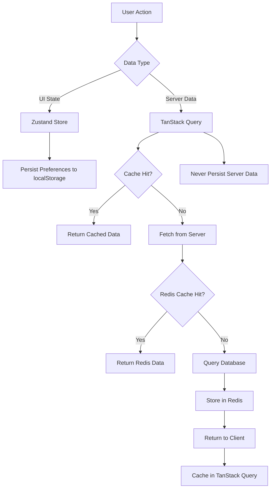

# Comprehensive State Management Strategy - itellico Mono

## Executive Summary

This document defines the **complete state management architecture** for the itellico Mono, establishing clear boundaries and best practices for **Zustand**, **TanStack Query**, **Redis**, **Database**, and **Authentication Storage**. Based on comprehensive research and audit of current implementation, this strategy ensures optimal performance, security, and developer experience across the entire platform.

## 🏗️ **State Management Architecture Overview**

### **Four-Layer State Architecture**

```
┌─────────────────────────────────────────────────────────────┐
│                     CLIENT SIDE                            │
├─────────────────────────────────────────────────────────────┤
│ Layer 1: UI State (Zustand)                               │
│ - Component state, preferences, modal states               │
│ - Form state, filters, UI interactions                     │
├─────────────────────────────────────────────────────────────┤
│ Layer 2: Server State Cache (TanStack Query)              │
│ - API responses, server data cache                         │
│ - Optimistic updates, background sync                      │
└─────────────────────────────────────────────────────────────┘
┌─────────────────────────────────────────────────────────────┐
│                     SERVER SIDE                            │
├─────────────────────────────────────────────────────────────┤
│ Layer 3: Application Cache (Redis)                        │
│ - Session data, frequently accessed data                   │
│ - Computed results, temporary state                        │
├─────────────────────────────────────────────────────────────┤
│ Layer 4: Persistent Storage (Database)                    │
│ - Source of truth, permanent data                          │
│ - Transactional data, audit trails                        │
└─────────────────────────────────────────────────────────────┘
```

## 📊 **Data Storage Strategy Matrix**

| Data Type | Zustand | TanStack Query | Redis | Database | Notes |
|-----------|---------|----------------|-------|----------|-------|
| **Authentication Tokens** | ❌ | ❌ | ✅ Session ID | ✅ Refresh Token | Access tokens in memory only |
| **User Permissions** | ❌ | ✅ Cache | ✅ Cache | ✅ Source | Never in client storage |
| **UI Preferences** | ✅ Primary | ❌ | ❌ | ✅ Backup | User interface state |
| **Form State** | ✅ Primary | ❌ | ❌ | ❌ | Temporary UI state |
| **API Responses** | ❌ | ✅ Primary | ✅ L2 Cache | ✅ Source | Server state only |
| **Session Data** | ❌ | ❌ | ✅ Primary | ✅ Backup | Server-side only |
| **Modal States** | ✅ Primary | ❌ | ❌ | ❌ | Pure UI state |
| **Filter Settings** | ✅ Active | ❌ | ❌ | ✅ Saved | UI state + persistence |
| **Computed Data** | ❌ | ✅ Cache | ✅ Cache | ❌ | Derived data caching |
| **Translation Strings** | ❌ | ✅ Cache | ✅ Cache | ✅ Source | Multilayer caching |

## 🎯 **Layer-Specific Best Practices**

### **Layer 1: Zustand (Client-Side UI State)**

#### **✅ What to Store in Zustand**
- **UI Component State**: Modal open/closed, drawer states, tab selections
- **Form State**: Active form data, validation states, step navigation
- **User Preferences**: Theme, language, layout preferences, table configurations
- **Filter & Search State**: Active filters, search queries, sort preferences
- **Navigation State**: Breadcrumbs, active menu items, sidebar collapse state
- **Temporary Data**: Shopping cart, form drafts, unsaved changes

#### **❌ What NEVER to Store in Zustand**
- Server data or API responses
- Authentication tokens or sensitive data
- User permissions or security-related information
- Data that needs to be shared across browser tabs
- Data that requires server-side validation

#### **Implementation Pattern**
```typescript
// ✅ CORRECT: UI-only Zustand store
interface AdminUIState {
  // Modal states
  modals: {
    deleteConfirm: { isOpen: boolean; entityId?: string };
    userForm: { isOpen: boolean; mode: 'create' | 'edit'; userId?: string };
  };
  
  // Filter states
  filters: {
    users: UserFilters;
    tenants: TenantFilters;
  };
  
  // Preferences (persisted to localStorage)
  preferences: {
    theme: 'light' | 'dark';
    language: string;
    tablePageSize: number;
  };
  
  // Never store server data
  // users: User[]; ❌ Wrong - use TanStack Query
  // permissions: Permission[]; ❌ Wrong - security risk
}

// Store configuration with selective persistence
export const useAdminUIStore = create<AdminUIState>()(
  devtools(
    persist(
      immer((set, get) => ({
        // Initial state...
      })),
      {
        name: 'admin-ui-state',
        partialize: (state) => ({
          // Only persist preferences, not temporary UI state
          preferences: state.preferences
        })
      }
    )
  )
);
```

### **Layer 2: TanStack Query (Server State Cache)**

#### **✅ What to Store in TanStack Query**
- **API Response Data**: Users, tenants, products, orders, any server data
- **Computed Server Data**: Analytics, reports, aggregated data
- **User Permissions**: Security data (cached, never persisted to localStorage)
- **Translation Strings**: Localization data with cache invalidation
- **Configuration Data**: Settings, platform configuration, metadata
- **Real-time Data**: WebSocket data, live updates, notifications

#### **❌ What NOT to Store in TanStack Query**
- Pure UI state (use Zustand)
- Authentication tokens (security risk)
- Large binary data (use direct file URLs)
- Temporary form state (use Zustand)

#### **Implementation Pattern**
```typescript
// ✅ CORRECT: Server state with TanStack Query
export function useUserPermissions(userId: string) {
  return useQuery({
    queryKey: ['user', 'permissions', userId],
    queryFn: async () => {
      const response = await fetch(`/api/v1/users/${userId}/permissions`);
      return response.json();
    },
    staleTime: 5 * 60 * 1000, // 5 minutes
    gcTime: 10 * 60 * 1000,   // 10 minutes
    // Never store in localStorage
    // This data is automatically cached in memory only
  });
}

// Tenant-aware query pattern
export function useTenantUsers(tenantId: string) {
  return useQuery({
    queryKey: ['tenants', tenantId, 'users'],
    queryFn: async () => fetchTenantUsers(tenantId),
    enabled: !!tenantId,
    staleTime: 2 * 60 * 1000, // 2 minutes for user data
  });
}
```

### **Layer 3: Redis (Server-Side Application Cache)**

#### **✅ What to Store in Redis**
- **Session Data**: User sessions, authentication state, session metadata
- **Permission Cache**: User permissions with TTL for security
- **Frequently Accessed Data**: Hot data, computed results, API rate limiting
- **Temporary Processing State**: Background job status, processing queues
- **Real-time Data**: WebSocket connections, presence data, live notifications
- **Cache Warming Data**: Precomputed expensive queries, aggregations

#### **❌ What NOT to Store in Redis**
- Permanent user data (use database)
- Large binary files (use file storage)
- Critical transactional data without database backup
- Sensitive data without encryption

#### **Implementation Pattern**
```typescript
// ✅ CORRECT: Redis caching with tenant isolation
class CacheService {
  // Session management
  async storeSession(sessionId: string, sessionData: SessionData): Promise<void> {
    const key = `session:${sessionId}`;
    await redis.setex(key, 3600, JSON.stringify(sessionData)); // 1 hour TTL
  }

  // Permission caching with tenant context
  async cacheUserPermissions(userId: string, tenantId: string, permissions: string[]): Promise<void> {
    const key = `tenant:${tenantId}:user:${userId}:permissions`;
    await redis.setex(key, 1800, JSON.stringify(permissions)); // 30 minutes TTL
  }

  // Multi-tenant key pattern
  async cacheData(tenantId: string, entity: string, id: string, data: any): Promise<void> {
    const key = `cache:${tenantId}:${entity}:${id}`;
    await redis.setex(key, 600, JSON.stringify(data)); // 10 minutes TTL
  }
}
```

### **Layer 4: Database (Persistent Storage)**

#### **✅ What to Store in Database**
- **Source of Truth**: All permanent user data, business data, configuration
- **Transactional Data**: Orders, payments, critical business operations
- **Audit Trails**: All user actions, system events, security logs
- **Metadata**: System configuration, schema definitions, relationships
- **Historical Data**: Versioning, change history, compliance records

#### **❌ What NOT to Store in Database**
- Temporary UI state (use Zustand)
- Short-lived cache data (use Redis)
- Session tokens (use Redis for sessions)
- Computed data that can be regenerated

## 🔐 **Authentication & Security State Management**

### **Authentication Token Storage Strategy**

#### **✅ RECOMMENDED: Hybrid Secure Approach**
```typescript
// ✅ BEST PRACTICE: Secure token management
interface AuthenticationStrategy {
  // Access tokens: In-memory only (most secure)
  accessToken: {
    storage: 'memory'; // JavaScript variable, lost on refresh
    lifetime: '15 minutes';
    location: 'React state or TanStack Query';
    security: 'Cannot be accessed by XSS attacks';
  };

  // Refresh tokens: HttpOnly cookies (secure + persistent)
  refreshToken: {
    storage: 'httpOnly cookie';
    lifetime: '7 days';
    flags: 'httpOnly, secure, sameSite=strict';
    security: 'Cannot be accessed by JavaScript';
  };

  // Session metadata: Redis (server-side)
  sessionData: {
    storage: 'Redis cache';
    lifetime: '24 hours';
    contents: 'User ID, tenant ID, permissions, metadata';
    security: 'Server-side only, encrypted';
  };
}

// Implementation example
export function useAuth() {
  // Access token in memory (React state)
  const [accessToken, setAccessToken] = useState<string | null>(null);
  
  // Session data via TanStack Query (from server)
  const { data: session } = useQuery({
    queryKey: ['auth', 'session'],
    queryFn: fetchCurrentSession, // Uses httpOnly cookie automatically
    staleTime: 5 * 60 * 1000, // 5 minutes
    retry: false,
  });

  // Refresh token handled automatically by interceptor
  // Never exposed to JavaScript
}
```

#### **❌ AVOID: Insecure Storage Patterns**
```typescript
// ❌ NEVER DO: Insecure token storage
localStorage.setItem('accessToken', token); // Vulnerable to XSS
localStorage.setItem('refreshToken', token); // Vulnerable to XSS
sessionStorage.setItem('jwt', token); // Still vulnerable to XSS

// ❌ NEVER DO: Storing in Zustand without encryption
useAuthStore.setState({ accessToken: token }); // Vulnerable if persisted
```

### **Permission State Management**

#### **✅ SECURE: Multi-Layer Permission Caching**
```typescript
// ✅ CORRECT: Secure permission management
interface PermissionStrategy {
  // Level 1: Server-side Redis cache (fast access)
  redisCache: {
    key: 'tenant:{tenantId}:user:{userId}:permissions';
    ttl: '30 minutes';
    contents: 'Resolved permission list';
    security: 'Server-side only, tenant-isolated';
  };

  // Level 2: TanStack Query cache (client-side)
  clientCache: {
    storage: 'TanStack Query memory';
    ttl: '5 minutes';
    security: 'Memory only, never localStorage';
    refresh: 'Background refresh, optimistic updates';
  };

  // Level 3: Database source of truth
  database: {
    storage: 'PostgreSQL';
    tables: 'UserRole, Role, Permission, RolePermission';
    security: 'Row-level security, audit trail';
  };
}

// Implementation with security
export function useUserPermissions(userId: string) {
  return useQuery({
    queryKey: ['user', userId, 'permissions'],
    queryFn: async () => {
      // Server checks Redis first, then database
      const response = await fetch(`/api/v1/users/${userId}/permissions`, {
        credentials: 'include', // Includes httpOnly cookies
      });
      return response.json();
    },
    staleTime: 5 * 60 * 1000, // 5 minutes client cache
    // NEVER persist to localStorage
    // This data stays in memory only
  });
}
```

## 🚀 **Performance Optimization Strategies**

### **Cache Hierarchy & TTL Strategy**

```typescript
interface CacheStrategy {
  // Client-side (fastest access)
  zustandUI: {
    ttl: 'Session duration';
    invalidation: 'Manual or component unmount';
    scope: 'Component/page specific';
  };

  // Client-side server data (fast access)
  tanstackQuery: {
    ttl: '2-10 minutes (based on data type)';
    invalidation: 'Background refresh, mutation-based';
    scope: 'Application-wide';
  };

  // Server-side cache (medium access)
  redis: {
    ttl: '10-60 minutes (based on data type)';
    invalidation: 'Event-driven, TTL-based';
    scope: 'Tenant-isolated';
  };

  // Database (authoritative)
  postgresql: {
    ttl: 'Permanent';
    invalidation: 'Transaction-based updates';
    scope: 'Global with tenant isolation';
  };
}
```

### **Data Flow & Synchronization**



## 🔧 **Implementation Guidelines**

### **State Boundaries**

| State Type | Primary Storage | Fallback | Persistence | TTL |
|------------|----------------|----------|-------------|-----|
| **Modal States** | Zustand | None | No | Session |
| **Form Data** | Zustand | None | Temporary | Session |
| **User Preferences** | Zustand | localStorage | Yes | Permanent |
| **API Data** | TanStack Query | None | No | 2-10 min |
| **Permissions** | TanStack Query | Redis | No | 5 min |
| **Session Data** | Redis | Database | Yes | 24 hours |
| **User Data** | Database | None | Yes | Permanent |

### **Error Handling Strategy**

```typescript
// ✅ CORRECT: Proper error boundaries
interface ErrorHandlingStrategy {
  // Zustand: UI errors (non-critical)
  zustandErrors: {
    handling: 'Local error state, user notification';
    fallback: 'Default UI state';
    logging: 'Client-side logging only';
  };

  // TanStack Query: Network errors (critical)
  tanstackErrors: {
    handling: 'Automatic retry, error boundaries';
    fallback: 'Cached data or loading state';
    logging: 'Full error reporting';
  };

  // Redis: Cache misses (graceful degradation)
  redisErrors: {
    handling: 'Fallback to database';
    fallback: 'Direct database query';
    logging: 'Server-side monitoring';
  };

  // Database: Critical errors (system level)
  databaseErrors: {
    handling: 'Transaction rollback, error response';
    fallback: 'Graceful degradation or maintenance mode';
    logging: 'Critical alert system';
  };
}
```

## 📏 **Migration Guidelines**

### **From Current Implementation to Best Practices**

#### **Phase 1: Authentication Security (Week 1)**
1. **Migrate tokens to memory + httpOnly cookies**
2. **Remove any token storage from localStorage**
3. **Implement refresh token rotation**
4. **Add session management in Redis**

#### **Phase 2: State Separation (Week 2-3)**
1. **Audit existing Zustand stores** - remove server data
2. **Migrate server data to TanStack Query**
3. **Implement permission caching in Redis**
4. **Add proper error boundaries**

#### **Phase 3: Performance Optimization (Week 4)**
1. **Complete Redis integration** for all services
2. **Implement cache coordination** between layers
3. **Add performance monitoring**
4. **Optimize TTL strategies**

## 🎯 **Success Metrics**

### **Performance Targets**
- **Zustand operations**: <1ms average response time
- **TanStack Query cache hits**: >95% hit rate
- **Redis cache hits**: >90% hit rate
- **Database query reduction**: >80% reduction through caching

### **Security Targets**
- **Zero token exposure**: No tokens in localStorage/sessionStorage
- **Permission cache security**: <30 second permission propagation
- **Audit compliance**: 100% authentication actions logged
- **Session security**: <1 hour session timeout

### **Developer Experience Targets**
- **Clear state boundaries**: Zero confusion about where to store data
- **Type safety**: 100% TypeScript coverage for all state
- **Error handling**: Graceful degradation for all failure modes
- **Documentation**: Complete examples for all patterns

## 📚 **Related Documentation**

- [Three-Layer Caching Strategy](./THREE_LAYER_CACHING_STRATEGY.md)
- [Authentication Best Practices](./AUTHENTICATION_BEST_PRACTICES.md)
- [Multi-Tenant Architecture](./MULTI_TENANT_ARCHITECTURE_RECOMMENDATIONS.md)
- [Permission System Implementation](../features/PERMISSION_SYSTEM_IMPLEMENTATION.md)

---

*This document represents the definitive state management strategy for itellico Mono. All new development should follow these patterns, and existing code should be migrated according to the outlined phases.*