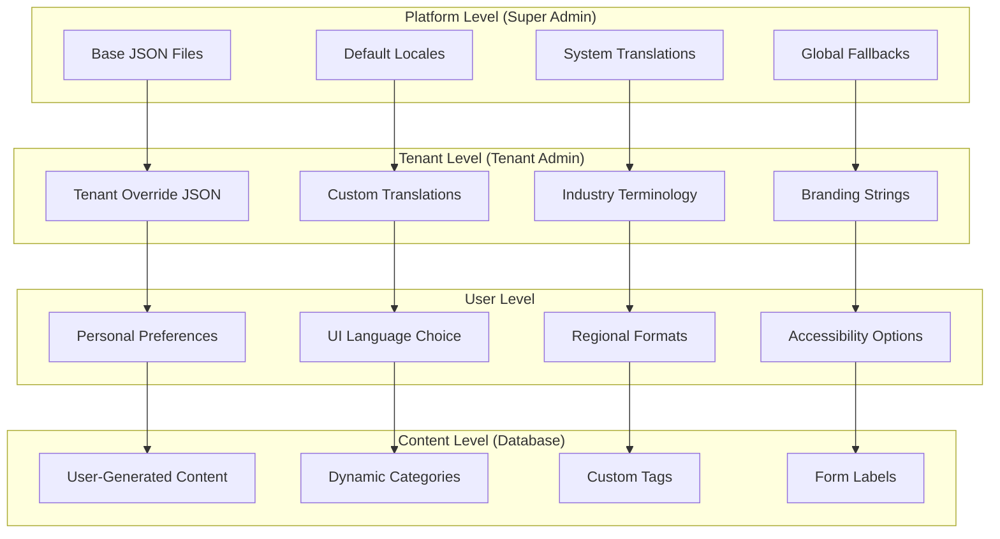
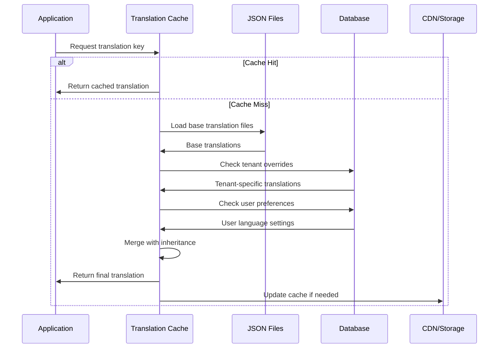

# 🌍 itellico Mono - I18n Heritable Translation System Best Practices

## 📋 Overview

The itellico Mono implements a **comprehensive multi-level heritable translation system** designed to support **Super Admins**, **Tenant Admins**, and **end users** with intelligent inheritance, fallback mechanisms, and JSON-based translations optimized for performance and maintainability.

### **Key Principles**

- **📁 JSON-First Architecture**: Primary translations stored in structured JSON files
- **🏢 Three-Level Hierarchy**: Platform → Tenant → User inheritance
- **⚡ Performance-Optimized**: Cached translations with intelligent fallbacks
- **🎯 Role-Based Management**: Different admin levels can manage their scope
- **🌐 Database-Enhanced**: User-generated content translations via database
- **🔄 Live Updates**: Real-time translation management with deployment

---

## 🏗️ Architecture Overview

### **Translation Hierarchy Structure**



### **Translation Resolution Flow**



---

## 📁 File Structure & Organization

### **JSON File Hierarchy**

```
src/locales/
├── platform/                    # Platform-level (Super Admin managed)
│   ├── en-US/
│   │   ├── admin-common.json     # Core admin interface
│   │   ├── admin-users.json      # User management
│   │   ├── admin-tenants.json    # Tenant management
│   │   ├── admin-settings.json   # System settings
│   │   ├── admin-monitoring.json # Platform monitoring
│   │   └── platform.json         # Platform-specific strings
│   ├── en-GB/
│   ├── de-DE/
│   └── ...
├── tenant-overrides/             # Tenant-level (Tenant Admin managed)
│   ├── {tenant-id}/
│   │   ├── en-US/
│   │   │   ├── common.json       # Tenant-specific overrides
│   │   │   ├── branding.json     # Tenant branding
│   │   │   ├── industry.json     # Industry terminology
│   │   │   └── custom.json       # Custom strings
│   │   └── ...
├── user/                         # User-facing (End user accessible)
│   ├── en-US/
│   │   ├── common.json           # General UI
│   │   ├── auth.json             # Authentication
│   │   ├── dashboard.json        # User dashboard
│   │   ├── profile.json          # User profile
│   │   └── forms.json            # Form interfaces
│   └── ...
└── generated/                    # Auto-generated merged files
    ├── {tenant-id}/
    │   └── {locale}/
    │       └── merged.json       # Final compiled translations
```

### **Namespace Organization**

**Platform-Level Namespaces (Super Admin)**
- `admin-common` - Core admin navigation, actions, permissions
- `admin-users` - User management interface
- `admin-tenants` - Tenant management
- `admin-settings` - System configuration
- `admin-monitoring` - Monitoring dashboard
- `platform` - Platform-specific functionality

**Tenant-Level Namespaces (Tenant Admin)**
- `common` - General UI overrides
- `branding` - Tenant-specific branding strings
- `industry` - Industry-specific terminology
- `custom` - Fully custom tenant strings

**User-Level Namespaces**
- `common` - General user interface
- `auth` - Authentication flows
- `dashboard` - User dashboard
- `profile` - User profile management
- `forms` - Dynamic form interfaces

---

## 🛠️ Implementation Best Practices

### **1. JSON File Structure Standards**

**✅ Good: Hierarchical Structure**
```json
{
  "navigation": {
    "dashboard": "Admin Dashboard",
    "users": {
      "title": "User Management",
      "actions": {
        "create": "Create User",
        "edit": "Edit User",
        "delete": "Delete User"
      }
    }
  },
  "messages": {
    "success": {
      "userCreated": "User created successfully",
      "userUpdated": "User updated successfully"
    },
    "errors": {
      "userNotFound": "User not found",
      "permissionDenied": "Permission denied"
    }
  }
}
```

**❌ Bad: Flat Structure**
```json
{
  "navigation_dashboard": "Admin Dashboard",
  "navigation_users_title": "User Management",
  "navigation_users_actions_create": "Create User",
  "messages_success_userCreated": "User created successfully"
}
```

### **2. Translation Key Naming Conventions**

**Pattern**: `{category}.{subcategory}.{action|state|type}`

**Examples:**
```typescript
// ✅ Good: Clear hierarchy
t('users.actions.create')          // "Create User"
t('users.messages.createSuccess')  // "User created successfully"
t('users.form.fields.email')       // "Email Address"
t('users.table.columns.lastLogin') // "Last Login"

// ✅ Good: Consistent patterns
t('admin.permissions.accessDenied')
t('admin.navigation.platformUsers')
t('admin.stats.totalUsers')
```

### **3. Inheritance & Override Patterns**

**Base Platform Translation (platform/en-US/admin-common.json)**
```json
{
  "navigation": {
    "users": "User Management",
    "settings": "Settings"
  },
  "actions": {
    "create": "Create",
    "edit": "Edit",
    "delete": "Delete"
  }
}
```

**Tenant Override (tenant-overrides/123/en-US/common.json)**
```json
{
  "navigation": {
    "users": "Model Management"  // Override for modeling agency
  },
  "actions": {
    "create": "Add New"          // Tenant prefers different wording
  }
}
```

**Final Merged Result:**
```json
{
  "navigation": {
    "users": "Model Management",  // Tenant override
    "settings": "Settings"       // Platform default
  },
  "actions": {
    "create": "Add New",         // Tenant override
    "edit": "Edit",              // Platform default
    "delete": "Delete"           // Platform default
  }
}
```

### **4. Variable & Interpolation Standards**

**✅ Good: Consistent Variable Format**
```json
{
  "messages": {
    "welcome": "Welcome back, {{userName}}!",
    "itemCount": "You have {{count}} {{type}} in your library",
    "dateRange": "Data from {{startDate}} to {{endDate}}"
  }
}
```

**Usage in Components:**
```typescript
// ✅ Good: Type-safe usage
const t = useTranslations('common');

const welcomeMessage = t('messages.welcome', { userName: user.name });
const countMessage = t('messages.itemCount', { 
  count: items.length, 
  type: items.length === 1 ? 'item' : 'items' 
});
```

### **5. Pluralization Support**

```json
{
  "itemCount": {
    "zero": "No items",
    "one": "1 item",
    "other": "{{count}} items"
  },
  "timeAgo": {
    "minute": {
      "one": "1 minute ago",
      "other": "{{count}} minutes ago"
    },
    "hour": {
      "one": "1 hour ago", 
      "other": "{{count}} hours ago"
    }
  }
}
```

---

## 🏢 Role-Based Management Patterns

### **Super Admin Capabilities**

**File Management:**
```typescript
// Super admins can manage platform-level translations
interface SuperAdminTranslationService {
  // Platform-wide translations
  updatePlatformTranslation(namespace: string, key: string, value: string): Promise<void>;
  
  // Default locale management
  addSupportedLocale(locale: string, config: LocaleConfig): Promise<void>;
  
  // Global fallback configuration
  setGlobalFallbacks(config: FallbackConfig): Promise<void>;
  
  // Tenant translation oversight
  reviewTenantOverrides(tenantId: number): Promise<TenantOverride[]>;
  
  // Platform deployment
  deployPlatformTranslations(): Promise<DeploymentResult>;
}
```

**Platform Translation Management:**
```typescript
// Super admin can set base translations that all tenants inherit
const platformTranslationManager = {
  async setPlatformDefault(namespace: string, key: string, translations: Record<string, string>) {
    // Update platform base files
    await updatePlatformFile(`platform/${locale}/${namespace}.json`, key, translations);
    
    // Trigger recompilation for all tenants
    await recompileAllTenantTranslations();
    
    // Deploy to CDN
    await deployTranslationFiles();
  },
  
  async addNewAdminFeature(featureName: string, translations: FeatureTranslations) {
    // Add new namespace for admin feature
    await createNamespace(`admin-${featureName}`, translations);
    
    // Update admin interface configuration
    await updateAdminNavigation(featureName);
  }
};
```

### **Tenant Admin Capabilities**

**Tenant-Scoped Management:**
```typescript
interface TenantAdminTranslationService {
  // Tenant-specific overrides
  setTenantOverride(namespace: string, key: string, value: string): Promise<void>;
  
  // Industry terminology
  updateIndustryTerms(terms: Record<string, string>): Promise<void>;
  
  // Branding customization
  updateBrandingStrings(branding: BrandingStrings): Promise<void>;
  
  // Custom namespace creation
  createCustomNamespace(name: string, translations: CustomTranslations): Promise<void>;
  
  // Tenant deployment
  deployTenantTranslations(): Promise<DeploymentResult>;
}
```

**Tenant Override Patterns:**
```typescript
// Tenant admin customizes UI for their industry
const tenantTranslationManager = {
  async customizeForIndustry(industry: 'modeling' | 'photography' | 'creative') {
    const industryOverrides = {
      modeling: {
        'users.title': 'Model Management',
        'users.actions.create': 'Add Model',
        'users.form.fields.portfolio': 'Model Portfolio'
      },
      photography: {
        'users.title': 'Photographer Management', 
        'users.actions.create': 'Add Photographer',
        'users.form.fields.portfolio': 'Photography Portfolio'
      }
    };
    
    await this.bulkUpdateOverrides(industryOverrides[industry]);
  },
  
  async setBrandingStrings(config: BrandingConfig) {
    await this.setTenantOverride('branding', 'companyName', config.companyName);
    await this.setTenantOverride('branding', 'tagline', config.tagline);
    await this.setTenantOverride('branding', 'welcomeMessage', config.welcomeMessage);
  }
};
```

---

## ⚡ Performance Optimization Strategies

### **1. Translation Caching Architecture**

```typescript
// Multi-layer caching strategy
class TranslationCacheService {
  private memoryCache = new Map<string, any>();
  private redisCache: RedisClient;
  private compiledFilesCache = new Map<string, CompiledTranslations>();

  async getTranslations(tenantId: number, locale: string, namespace: string): Promise<any> {
    const cacheKey = `translations:${tenantId}:${locale}:${namespace}`;
    
    // Level 1: Memory cache (fastest)
    if (this.memoryCache.has(cacheKey)) {
      return this.memoryCache.get(cacheKey);
    }
    
    // Level 2: Redis cache (fast)
    const redisResult = await this.redisCache.get(cacheKey);
    if (redisResult) {
      const parsed = JSON.parse(redisResult);
      this.memoryCache.set(cacheKey, parsed);
      return parsed;
    }
    
    // Level 3: Compiled file cache (medium)
    const compiledKey = `${tenantId}:${locale}`;
    if (this.compiledFilesCache.has(compiledKey)) {
      const compiled = this.compiledFilesCache.get(compiledKey);
      const namespaceData = compiled[namespace];
      
      await this.redisCache.setex(cacheKey, 3600, JSON.stringify(namespaceData));
      this.memoryCache.set(cacheKey, namespaceData);
      return namespaceData;
    }
    
    // Level 4: Dynamic compilation (slowest)
    const compiled = await this.compileTranslations(tenantId, locale);
    this.compiledFilesCache.set(compiledKey, compiled);
    
    const namespaceData = compiled[namespace];
    await this.redisCache.setex(cacheKey, 3600, JSON.stringify(namespaceData));
    this.memoryCache.set(cacheKey, namespaceData);
    return namespaceData;
  }
  
  async invalidateCache(tenantId: number, locale?: string, namespace?: string): Promise<void> {
    if (namespace && locale) {
      // Specific namespace invalidation
      const specificKey = `translations:${tenantId}:${locale}:${namespace}`;
      this.memoryCache.delete(specificKey);
      await this.redisCache.del(specificKey);
    } else if (locale) {
      // Locale-wide invalidation
      const pattern = `translations:${tenantId}:${locale}:*`;
      await this.invalidatePattern(pattern);
      this.compiledFilesCache.delete(`${tenantId}:${locale}`);
    } else {
      // Tenant-wide invalidation
      const pattern = `translations:${tenantId}:*`;
      await this.invalidatePattern(pattern);
      
      // Clear compiled files for tenant
      for (const key of this.compiledFilesCache.keys()) {
        if (key.startsWith(`${tenantId}:`)) {
          this.compiledFilesCache.delete(key);
        }
      }
    }
  }
}
```

### **2. Lazy Loading & Code Splitting**

```typescript
// Dynamic namespace loading
export const useTranslations = (namespace: string) => {
  const [translations, setTranslations] = useState<Record<string, any>>({});
  const [loading, setLoading] = useState(true);
  
  useEffect(() => {
    const loadNamespace = async () => {
      try {
        // Only load the specific namespace needed
        const namespaceTranslations = await import(
          `@/locales/${locale}/${namespace}.json`
        );
        
        setTranslations(namespaceTranslations.default);
      } catch (error) {
        // Fallback to default locale
        const fallbackTranslations = await import(
          `@/locales/en-US/${namespace}.json`
        );
        setTranslations(fallbackTranslations.default);
      } finally {
        setLoading(false);
      }
    };
    
    loadNamespace();
  }, [namespace, locale]);
  
  return { t: createTranslationFunction(translations), loading };
};

// Pre-loading for critical namespaces
export const preloadCriticalTranslations = async (locale: string) => {
  const criticalNamespaces = ['common', 'auth', 'navigation'];
  
  return Promise.all(
    criticalNamespaces.map(namespace =>
      import(`@/locales/${locale}/${namespace}.json`)
    )
  );
};
```

### **3. Build-Time Optimization**

```typescript
// Build-time translation compilation
class TranslationCompiler {
  async compileTenantTranslations(tenantId: number): Promise<void> {
    const supportedLocales = await this.getTenantLocales(tenantId);
    
    for (const locale of supportedLocales) {
      const compiled = await this.compileLocale(tenantId, locale);
      
      // Write optimized files
      await this.writeCompiledFile(
        `generated/${tenantId}/${locale}/merged.json`,
        compiled
      );
      
      // Generate TypeScript definitions
      await this.generateTypeDefinitions(
        `generated/${tenantId}/${locale}/types.d.ts`,
        compiled
      );
    }
  }
  
  private async compileLocale(tenantId: number, locale: string): Promise<CompiledTranslations> {
    // 1. Load platform base translations
    const platformBase = await this.loadPlatformTranslations(locale);
    
    // 2. Load tenant overrides
    const tenantOverrides = await this.loadTenantOverrides(tenantId, locale);
    
    // 3. Merge with proper inheritance
    const merged = this.mergeTranslations(platformBase, tenantOverrides);
    
    // 4. Optimize for runtime
    return this.optimizeForRuntime(merged);
  }
  
  private optimizeForRuntime(translations: any): CompiledTranslations {
    return {
      // Flatten deep objects for faster lookups
      flattened: this.flattenTranslations(translations),
      
      // Pre-compile frequently used patterns
      compiled: this.compilePatterns(translations),
      
      // Generate lookup indexes
      indexes: this.createLookupIndexes(translations),
      
      // Metadata for runtime decisions
      metadata: {
        version: Date.now(),
        keyCount: this.countKeys(translations),
        lastModified: new Date().toISOString()
      }
    };
  }
}
```

---

## 🔧 Database-Enhanced Translation System

### **Database Schema for Dynamic Content**

```sql
-- User-generated content translations
CREATE TABLE content_translations (
    id SERIAL PRIMARY KEY,
    tenant_id INTEGER REFERENCES tenants(id) ON DELETE CASCADE,
    content_type VARCHAR(50) NOT NULL, -- 'category', 'tag', 'form_label', etc.
    content_id INTEGER NOT NULL,       -- ID of the translated content
    language_code VARCHAR(10) NOT NULL,
    field_name VARCHAR(100) NOT NULL,  -- 'name', 'description', etc.
    translated_text TEXT NOT NULL,
    created_by INTEGER REFERENCES users(id),
    created_at TIMESTAMP DEFAULT NOW(),
    updated_at TIMESTAMP DEFAULT NOW(),
    
    UNIQUE(tenant_id, content_type, content_id, language_code, field_name)
);

-- Translation preferences per user
CREATE TABLE user_translation_preferences (
    id SERIAL PRIMARY KEY,
    user_id INTEGER REFERENCES users(id) ON DELETE CASCADE,
    preferred_language VARCHAR(10) NOT NULL,
    fallback_language VARCHAR(10) DEFAULT 'en-US',
    admin_language VARCHAR(10) DEFAULT 'en-US', -- Separate admin interface language
    auto_translate_content BOOLEAN DEFAULT true,
    date_format VARCHAR(20) DEFAULT 'MM/dd/yyyy',
    time_format VARCHAR(10) DEFAULT '12h',
    number_format VARCHAR(20) DEFAULT 'en-US',
    currency_format VARCHAR(10) DEFAULT 'USD',
    timezone VARCHAR(50) DEFAULT 'UTC',
    created_at TIMESTAMP DEFAULT NOW(),
    updated_at TIMESTAMP DEFAULT NOW(),
    
    UNIQUE(user_id)
);

-- Tenant translation configuration
CREATE TABLE tenant_translation_config (
    id SERIAL PRIMARY KEY,
    tenant_id INTEGER REFERENCES tenants(id) ON DELETE CASCADE,
    supported_languages JSONB NOT NULL DEFAULT '["en-US"]',
    default_language VARCHAR(10) NOT NULL DEFAULT 'en-US',
    fallback_language VARCHAR(10) NOT NULL DEFAULT 'en-US',
    auto_translate_enabled BOOLEAN DEFAULT false,
    custom_overrides JSONB DEFAULT '{}',
    branding_strings JSONB DEFAULT '{}',
    industry_terms JSONB DEFAULT '{}',
    created_at TIMESTAMP DEFAULT NOW(),
    updated_at TIMESTAMP DEFAULT NOW(),
    
    UNIQUE(tenant_id)
);

-- Indexes for performance
CREATE INDEX idx_content_translations_lookup ON content_translations(tenant_id, content_type, content_id, language_code);
CREATE INDEX idx_user_translation_preferences_user ON user_translation_preferences(user_id);
CREATE INDEX idx_tenant_translation_config_tenant ON tenant_translation_config(tenant_id);
```

### **Service Integration Pattern**

```typescript
// Hybrid JSON + Database translation service
export class HybridTranslationService {
  constructor(
    private tenantId: number,
    private userId?: number
  ) {}

  async getTranslation(key: string, locale: string): Promise<string> {
    // 1. Check if it's a dynamic content key (starts with 'dynamic.')
    if (key.startsWith('dynamic.')) {
      return this.getDynamicTranslation(key, locale);
    }
    
    // 2. Check tenant overrides first
    const tenantOverride = await this.getTenantOverride(key, locale);
    if (tenantOverride) {
      return tenantOverride;
    }
    
    // 3. Fall back to compiled JSON translations
    return this.getJSONTranslation(key, locale);
  }
  
  private async getDynamicTranslation(key: string, locale: string): Promise<string> {
    // Parse dynamic key: 'dynamic.category.123.name'
    const [, contentType, contentId, fieldName] = key.split('.');
    
    const translation = await db.contentTranslation.findFirst({
      where: {
        tenantId: this.tenantId,
        contentType,
        contentId: parseInt(contentId),
        languageCode: locale,
        fieldName,
      },
    });
    
    if (translation) {
      return translation.translatedText;
    }
    
    // Fallback to default language
    const fallback = await db.contentTranslation.findFirst({
      where: {
        tenantId: this.tenantId,
        contentType,
        contentId: parseInt(contentId),
        fieldName,
        languageCode: await this.getDefaultLanguage(),
      },
    });
    
    return fallback?.translatedText || `[Missing: ${key}]`;
  }
  
  async setDynamicTranslation(
    contentType: string,
    contentId: number,
    fieldName: string,
    locale: string,
    text: string
  ): Promise<void> {
    await db.contentTranslation.upsert({
      where: {
        tenantId_contentType_contentId_languageCode_fieldName: {
          tenantId: this.tenantId,
          contentType,
          contentId,
          languageCode: locale,
          fieldName,
        },
      },
      update: {
        translatedText: text,
        updatedAt: new Date(),
      },
      create: {
        tenantId: this.tenantId,
        contentType,
        contentId,
        languageCode: locale,
        fieldName,
        translatedText: text,
        createdBy: this.userId,
      },
    });
    
    // Invalidate relevant caches
    await this.invalidateContentCache(contentType, contentId);
  }
}
```

---

## 🚀 Deployment & Best Practices

### **1. Translation File Compilation Pipeline**

```typescript
// CI/CD Integration for translation deployment
export class TranslationDeploymentPipeline {
  async deployTranslations(environment: 'development' | 'staging' | 'production'): Promise<void> {
    // 1. Validate all translation files
    await this.validateTranslationFiles();
    
    // 2. Compile tenant-specific translations
    await this.compileAllTenantTranslations();
    
    // 3. Generate optimized bundles
    await this.generateOptimizedBundles();
    
    // 4. Deploy to CDN
    await this.deployToCDN(environment);
    
    // 5. Update application configuration
    await this.updateAppConfig(environment);
    
    // 6. Invalidate caches
    await this.invalidateTranslationCaches();
  }
  
  private async validateTranslationFiles(): Promise<void> {
    const validationErrors = [];
    
    // Check for missing keys across locales
    const keyConsistencyErrors = await this.validateKeyConsistency();
    validationErrors.push(...keyConsistencyErrors);
    
    // Validate variable placeholders
    const placeholderErrors = await this.validatePlaceholders();
    validationErrors.push(...placeholderErrors);
    
    // Check for duplicate keys
    const duplicateErrors = await this.validateDuplicates();
    validationErrors.push(...duplicateErrors);
    
    if (validationErrors.length > 0) {
      throw new ValidationError('Translation validation failed', validationErrors);
    }
  }
}
```

### **2. Development Workflow Best Practices**

```typescript
// Development helpers for translation management
export const translationDevHelpers = {
  // Extract new translation keys from code
  async extractNewKeys(filePaths: string[]): Promise<string[]> {
    const newKeys = [];
    
    for (const filePath of filePaths) {
      const content = await fs.readFile(filePath, 'utf8');
      
      // Extract t('key') and t("key") patterns
      const keyMatches = content.match(/t\(['"`]([^'"`]+)['"`]\)/g);
      
      if (keyMatches) {
        for (const match of keyMatches) {
          const key = match.replace(/t\(['"`]([^'"`]+)['"`]\)/, '$1');
          if (!(await this.keyExists(key))) {
            newKeys.push(key);
          }
        }
      }
    }
    
    return [...new Set(newKeys)]; // Remove duplicates
  },
  
  // Generate TypeScript definitions from translations
  async generateTypes(locale: string = 'en-US'): Promise<void> {
    const translations = await this.loadAllTranslations(locale);
    const types = this.generateTypeDefinitions(translations);
    
    await fs.writeFile(
      'src/types/translations.generated.d.ts',
      types
    );
  },
  
  // Detect unused translation keys
  async findUnusedKeys(): Promise<string[]> {
    const allKeys = await this.getAllTranslationKeys();
    const usedKeys = await this.findUsedKeysInCode();
    
    return allKeys.filter(key => !usedKeys.includes(key));
  },
  
  // Auto-fix common translation issues
  async autoFixTranslations(): Promise<FixReport> {
    const fixes = [];
    
    // Sort keys alphabetically
    await this.sortTranslationKeys();
    fixes.push('Sorted translation keys');
    
    // Fix inconsistent spacing
    await this.normalizeSpacing();
    fixes.push('Normalized spacing');
    
    // Remove unused keys
    const removedKeys = await this.removeUnusedKeys();
    fixes.push(`Removed ${removedKeys.length} unused keys`);
    
    return { fixes, timestamp: new Date() };
  }
};
```

### **3. Quality Assurance Checklist**

**Translation Quality Standards:**

✅ **Key Consistency**
- All locales have the same translation keys
- No missing keys in any supported language
- Consistent key naming conventions

✅ **Content Quality**
- Professional tone and grammar
- Industry-appropriate terminology
- Culturally sensitive content
- Proper variable placeholder usage

✅ **Performance Standards**
- Translation files under 100KB per namespace
- Lazy loading for non-critical namespaces
- Proper caching strategy implementation
- CDN deployment for global access

✅ **Developer Experience**
- TypeScript definitions for all translation keys
- Development-time validation warnings
- Hot-reload support during development
- Easy-to-use translation management tools

---

## 📊 Monitoring & Analytics

### **Translation Performance Metrics**

```typescript
// Translation system monitoring
export class TranslationMonitoringService {
  async collectMetrics(): Promise<TranslationMetrics> {
    return {
      // Performance metrics
      cacheHitRate: await this.calculateCacheHitRate(),
      averageLoadTime: await this.getAverageLoadTime(),
      translationFileSize: await this.getTranslationFileSizes(),
      
      // Usage metrics
      mostUsedKeys: await this.getMostUsedKeys(),
      languageUsageStats: await this.getLanguageUsage(),
      tenantOverrideStats: await this.getTenantOverrideStats(),
      
      // Quality metrics
      missingTranslations: await this.findMissingTranslations(),
      inconsistentKeys: await this.findInconsistentKeys(),
      unusedKeys: await this.findUnusedKeys(),
      
      // Business metrics
      multilingualUserPercentage: await this.getMultilingualUsers(),
      tenantLocalizationLevel: await this.getTenantLocalization(),
    };
  }
  
  async generateTranslationReport(): Promise<TranslationReport> {
    const metrics = await this.collectMetrics();
    
    return {
      summary: {
        totalKeys: metrics.totalKeys,
        supportedLanguages: metrics.supportedLanguages,
        tenantsWithCustomizations: metrics.tenantsWithCustomizations,
        overallQualityScore: this.calculateQualityScore(metrics),
      },
      recommendations: this.generateRecommendations(metrics),
      alerts: this.generateAlerts(metrics),
      trends: await this.generateTrends(metrics),
    };
  }
}
```

---

## 🎯 Success Metrics & KPIs

### **Technical Performance KPIs**

- **Translation Load Time**: < 100ms for cached translations
- **Cache Hit Rate**: > 95% for frequently used translations
- **File Size Optimization**: < 50KB per namespace in production
- **CDN Coverage**: 99.9% availability across all regions

### **Business Impact KPIs**

- **Multi-language Adoption**: % of tenants using multiple languages
- **User Preference Utilization**: % of users setting language preferences
- **Content Localization Rate**: % of user-generated content translated
- **Admin Efficiency**: Time saved on translation management tasks

### **Quality Assurance KPIs**

- **Translation Completeness**: 100% key coverage across supported languages
- **Consistency Score**: > 95% consistency in terminology usage
- **User Satisfaction**: Feedback scores on translation quality
- **Error Rate**: < 1% missing or broken translations in production

---

## 🔮 Future Enhancements

### **Planned Features**

1. **AI-Powered Translation Suggestions**
   - Context-aware translation recommendations
   - Industry-specific terminology suggestions
   - Quality assessment scoring

2. **Real-Time Collaboration**
   - Multi-user translation editing
   - Review and approval workflows
   - Translation memory sharing

3. **Advanced Analytics**
   - Translation usage heatmaps
   - Performance impact analysis
   - ROI tracking for localization efforts

4. **Enhanced Developer Tools**
   - VS Code extension for translation management
   - CLI tools for translation operations
   - Automated translation extraction

---

**Last Updated:** January 13, 2025  
**Version:** 2.0.0  
**Status:** Comprehensive Best Practices - Ready for Implementation

This heritable translation system provides enterprise-grade internationalization with role-based management, optimal performance, and maintainable architecture designed to scale with global platform growth.