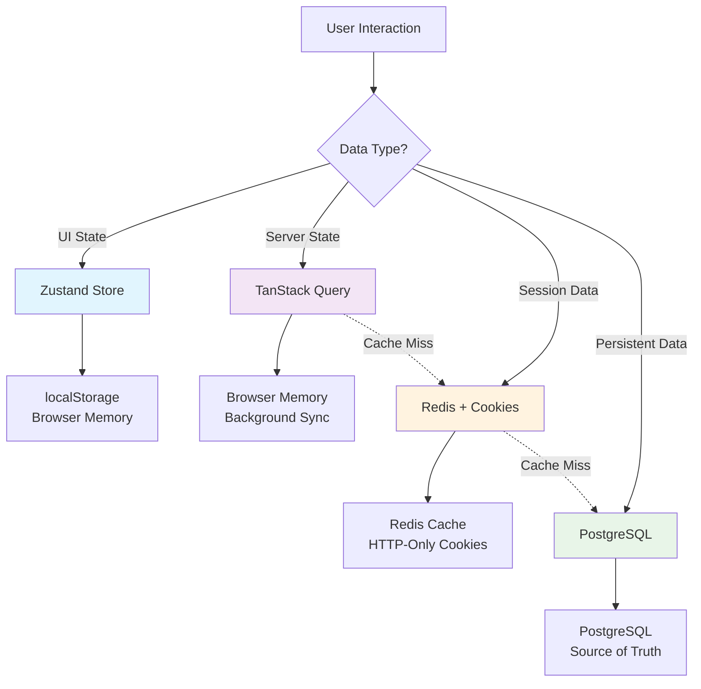

# itellico Mono - Storage Strategy & Best Practices

## Executive Summary

This document defines the definitive storage strategy for itellico Mono, establishing clear boundaries between different storage layers and providing best practices for data placement, caching, and state management across the entire platform.

## 🏗️ Storage Architecture Overview



## 📊 Storage Layer Definitions

### 1. **Zustand (Client-side UI State)**
**Purpose**: Temporary UI state and user preferences that enhance UX
**Characteristics**: Fast, reactive, browser-specific, non-critical

### 2. **TanStack Query (Server State Cache)**
**Purpose**: Server data caching with intelligent synchronization
**Characteristics**: Background sync, optimistic updates, request deduplication

### 3. **Redis (Distributed Application Cache)**
**Purpose**: Fast access to frequently used server data
**Characteristics**: Shared across instances, tenant-isolated, TTL-managed

### 4. **HTTP-Only Cookies (Secure Authentication)**
**Purpose**: Secure token storage and session management
**Characteristics**: XSS-resistant, server-accessible, automatic transmission

### 5. **PostgreSQL (Source of Truth)**
**Purpose**: Persistent, consistent, ACID-compliant data storage
**Characteristics**: Transactional, relational, audit-logged

---

## 🔒 Authentication & Security Storage

### **User Permissions & RBAC**

#### ✅ **Store in Redis** (Server-side cache)
```typescript
// Cache user permissions for 5 minutes
const cacheKey = `tenant:${tenantId}:user:${userId}:permissions`;
const permissions = await redis.setex(cacheKey, 300, JSON.stringify(userPermissions));

// Why Redis?
// ✓ Shared across all server instances
// ✓ Fast permission checks (<5ms)
// ✓ Automatic TTL prevents stale permissions
// ✓ Tenant-isolated keys
// ✓ Survives server restarts
```

#### ❌ **DON'T store in:**
- **Zustand**: Client-side = security risk, can be manipulated
- **localStorage**: Accessible via XSS, not secure
- **TanStack Query**: Permission checks happen server-side
- **Cookies**: Too large, sent with every request

### **Authentication Tokens**

#### ✅ **Store in HTTP-Only Cookies**
```typescript
// Secure token storage
reply.setCookie('accessToken', jwt, {
  httpOnly: true,           // Prevents XSS access
  secure: isProduction,     // HTTPS only in production
  sameSite: 'lax',         // CSRF protection
  path: '/',               // Available to entire app
  maxAge: 15 * 60          // 15 minutes
});

// Why HTTP-Only Cookies?
// ✓ XSS resistant (JavaScript cannot access)
// ✓ Automatic transmission with requests
// ✓ Built-in expiry handling
// ✓ Server-controlled
```

#### ❌ **DON'T store in:**
- **localStorage**: Vulnerable to XSS attacks
- **Zustand**: Persists to localStorage = security risk
- **sessionStorage**: Lost on tab close
- **Memory**: Lost on page refresh

### **Session Data**

#### ✅ **Hybrid Approach: Redis + Lean Cookies**
```typescript
// 1. Store minimal session in cookie (<1KB)
const leanSession = {
  userId: user.id,
  tenantId: user.tenantId,
  sessionId: sessionId,
  expires: expiryDate
};

// 2. Store full session data in Redis
const fullSessionKey = `session:${sessionId}`;
await redis.setex(fullSessionKey, 900, JSON.stringify({
  permissions: user.permissions,
  roles: user.roles,
  enhancedData: user.enhancedProfile
}));

// Why Hybrid?
// ✓ Cookies stay small (faster requests)
// ✓ Sensitive data in secure Redis
// ✓ Scalable across multiple servers
// ✓ Easy session management
```

---

## 🎨 UI State Management

### **What Goes in Zustand**

#### ✅ **Store in Zustand:**
```typescript
interface UIState {
  // Visual preferences
  sidebarCollapsed: boolean;
  theme: 'light' | 'dark' | 'auto';
  selectedView: 'grid' | 'list' | 'cards';
  
  // Modal and overlay states
  isUserModalOpen: boolean;
  isConfirmDialogOpen: boolean;
  activeTooltip: string | null;
  
  // Form states (temporary)
  searchQuery: string;
  activeFilters: FilterOptions;
  selectedItems: string[];
  
  // Navigation state
  currentPage: number;
  breadcrumbs: BreadcrumbItem[];
  
  // Developer tools
  devMode: boolean;
  debugPanel: boolean;
  
  // Performance tracking
  operationalModes: {
    godMode: boolean;
    developerMode: boolean;
    debugMode: boolean;
  };
}

// Why Zustand for these?
// ✓ Instant UI responsiveness
// ✓ Persists user preferences across sessions
// ✓ No network requests needed
// ✓ Component-level optimization with selectors
// ✓ User-specific, not security-sensitive
```

#### ❌ **DON'T store in Zustand:**
```typescript
// ❌ Server data (use TanStack Query)
users: User[];
profiles: Profile[];
tenantSettings: TenantConfig;

// ❌ Authentication data (use cookies/Redis)
currentUser: User;
permissions: string[];
sessionToken: string;

// ❌ Large datasets (use proper caching)
searchResults: SearchResult[];
analytics: AnalyticsData;

// ❌ Sensitive business data
financialData: any;
personalInformation: any;
```

### **Best Practices for Zustand**

```typescript
// ✅ Use selectors for performance
const sidebarState = useUIStore(useShallow((state) => ({
  collapsed: state.sidebarCollapsed,
  toggle: state.toggleSidebar
})));

// ✅ Partition state appropriately
const useUIStore = create<UIState>()(
  persist(
    (set) => ({ /* state */ }),
    {
      name: 'mono-ui-store',
      partialize: (state) => ({
        // Only persist preferences, not temporary state
        sidebarCollapsed: state.sidebarCollapsed,
        theme: state.theme,
        selectedView: state.selectedView,
        // Don't persist: modals, search, selections
      }),
    }
  )
);

// ✅ Use version control for breaking changes
{
  name: 'mono-ui-store',
  version: 2,
  migrate: (persistedState, version) => {
    if (version < 2) {
      // Handle migration from v1 to v2
      return { ...persistedState, newField: defaultValue };
    }
    return persistedState;
  }
}
```

---

## 🔄 Server State Management

### **TanStack Query Configuration**

#### ✅ **Optimal Configuration:**
```typescript
const queryClient = new QueryClient({
  defaultOptions: {
    queries: {
      staleTime: 5 * 60 * 1000,      // 5 minutes - data fresh time
      gcTime: 10 * 60 * 1000,       // 10 minutes - memory cleanup
      refetchOnWindowFocus: false,   // Prevent excessive refetching
      refetchOnMount: false,         // Use cached data if available
      retry: (failureCount, error) => {
        // Don't retry client errors (4xx)
        if (error?.status >= 400 && error?.status < 500) return false;
        return failureCount < 3;
      },
    },
    mutations: {
      retry: false,                  // Don't retry mutations
    },
  },
});

// Why these settings?
// ✓ Reduces unnecessary API calls
// ✓ Balances freshness with performance
// ✓ Prevents retry storms on client errors
// ✓ Efficient memory management
```

#### ✅ **What to Cache in TanStack Query:**

```typescript
// User data with smart caching
export const userKeys = {
  all: (tenantId: number) => ['users', tenantId] as const,
  lists: (tenantId: number) => [...userKeys.all(tenantId), 'list'] as const,
  list: (tenantId: number, filters: UserFilters) => 
    [...userKeys.lists(tenantId), filters] as const,
  detail: (tenantId: number, id: number) => 
    [...userKeys.all(tenantId), 'detail', id] as const,
};

// Long-lived data (infrequent changes)
export function useUsers(tenantId: number, filters: UserFilters = {}) {
  return useQuery({
    queryKey: userKeys.list(tenantId, filters),
    queryFn: () => fetchUsers(tenantId, filters),
    staleTime: 5 * 60 * 1000,      // 5 minutes
    enabled: !!tenantId,
  });
}

// Real-time data (frequent updates)
export function useNotifications(userId: number) {
  return useQuery({
    queryKey: ['notifications', userId],
    queryFn: () => fetchNotifications(userId),
    staleTime: 30 * 1000,          // 30 seconds
    refetchInterval: 60 * 1000,    // Poll every minute
    enabled: !!userId,
  });
}

// Static/reference data (rarely changes)
export function usePermissions() {
  return useQuery({
    queryKey: ['permissions'],
    queryFn: fetchAllPermissions,
    staleTime: 30 * 60 * 1000,     // 30 minutes
    gcTime: 60 * 60 * 1000,        // 1 hour
  });
}
```

### **Optimistic Updates Pattern**

```typescript
export function useUpdateUser(tenantId: number) {
  const queryClient = useQueryClient();
  
  return useMutation({
    mutationFn: (data: UpdateUserData) => updateUser(tenantId, data),
    
    onMutate: async (newUserData) => {
      // Cancel outgoing refetches
      await queryClient.cancelQueries({ 
        queryKey: userKeys.lists(tenantId) 
      });
      
      // Snapshot previous value
      const previousUsers = queryClient.getQueryData(
        userKeys.lists(tenantId)
      );
      
      // Optimistically update
      queryClient.setQueryData(
        userKeys.lists(tenantId), 
        (old: any) => updateUserInList(old, newUserData)
      );
      
      return { previousUsers };
    },
    
    onError: (err, newUserData, context) => {
      // Rollback on error
      if (context?.previousUsers) {
        queryClient.setQueryData(
          userKeys.lists(tenantId),
          context.previousUsers
        );
      }
    },
    
    onSettled: () => {
      // Always refetch to ensure consistency
      queryClient.invalidateQueries({ 
        queryKey: userKeys.lists(tenantId) 
      });
    },
  });
}

// Why Optimistic Updates?
// ✓ Instant UI feedback
// ✓ Better user experience
// ✓ Graceful error handling
// ✓ Automatic rollback on failure
```

---

## 🚀 Redis Caching Strategy

### **What to Cache in Redis**

#### ✅ **High-Value Cache Targets:**

```typescript
// 1. User permissions (security-critical, frequently accessed)
const permissionsKey = `tenant:${tenantId}:user:${userId}:permissions`;
await redis.setex(permissionsKey, 300, JSON.stringify(permissions)); // 5 min TTL

// 2. Search results (expensive to compute)
const searchKey = `tenant:${tenantId}:search:profiles:${queryHash}`;
await redis.setex(searchKey, 300, JSON.stringify(results)); // 5 min TTL

// 3. Computed analytics (expensive aggregations)
const analyticsKey = `tenant:${tenantId}:analytics:dashboard:${dateRange}`;
await redis.setex(analyticsKey, 3600, JSON.stringify(analytics)); // 1 hour TTL

// 4. Frequent API responses (reduce database load)
const apiResponseKey = `tenant:${tenantId}:api:users:list:${filtersHash}`;
await redis.setex(apiResponseKey, 300, JSON.stringify(response)); // 5 min TTL

// 5. Session data (fast session lookup)
const sessionKey = `session:${sessionId}`;
await redis.setex(sessionKey, 900, JSON.stringify(sessionData)); // 15 min TTL

// 6. International reference data (rarely changes, frequently accessed)
const countriesKey = `cache:global:countries:${locale}`;
await redis.setex(countriesKey, 86400, JSON.stringify(countries)); // 24 hour TTL

const timezonesKey = `cache:global:timezones`;
await redis.setex(timezonesKey, 86400, JSON.stringify(timezones)); // 24 hour TTL

const currenciesKey = `cache:global:currencies:${locale}`;
await redis.setex(currenciesKey, 86400, JSON.stringify(currencies)); // 24 hour TTL

// 7. User international preferences (timezone, locale, phone format)
const userIntlKey = `tenant:${tenantId}:user:${userId}:intl-prefs`;
await redis.setex(userIntlKey, 1800, JSON.stringify(preferences)); // 30 min TTL

// Why Redis for these?
// ✓ Sub-5ms response times
// ✓ Shared across all server instances
// ✓ Automatic TTL management
// ✓ Tenant isolation built-in
// ✓ Reduces database load significantly
// ✓ Perfect for reference data (countries, timezones, currencies)
```

#### ❌ **Don't Cache in Redis:**

```typescript
// ❌ Large binary data (use object storage)
const profileImage = "data:image/jpeg;base64,/9j/4AAQ..."; // Too large

// ❌ Frequently changing data (cache thrashing)
const realTimeEvents = getCurrentEvents(); // Changes every second

// ❌ Rarely accessed data (waste of memory)
const archivedData = getArchivedProfiles(); // Accessed once a month

// ❌ Data that must be perfectly consistent
const financialTransactions = getTransactions(); // Use database directly
```

### **Redis Key Naming Strategy**

```typescript
// Implement consistent naming from /docs/redis-cache-hierarchy.md
class CacheKeyBuilder {
  // Tenant-scoped data
  static user(tenantId: number, userId: string, field: string): string {
    return `tenant:${tenantId}:user:${userId}:${field}`;
  }
  
  // Search results
  static search(tenantId: number, entity: string, queryHash: string): string {
    return `tenant:${tenantId}:search:${entity}:${queryHash}`;
  }
  
  // Lists with pagination
  static list(tenantId: number, entity: string, page: number, filters: any): string {
    const filterHash = createHash('md5').update(JSON.stringify(filters)).digest('hex');
    return `tenant:${tenantId}:list:${entity}:page:${page}:${filterHash}`;
  }
  
  // International reference data
  static international(type: 'countries' | 'currencies' | 'languages' | 'timezones', locale?: string): string {
    const localeSegment = locale ? `:${locale}` : '';
    return `cache:global:${type}${localeSegment}`;
  }
  
  // User international preferences
  static userIntlPrefs(tenantId: number, userId: string): string {
    return `tenant:${tenantId}:user:${userId}:intl-prefs`;
  }
  
  // Phone number formatting cache (per country)
  static phoneFormat(countryCode: string): string {
    return `cache:global:phone:format:${countryCode}`;
  }
  
  // Timezone data for country
  static countryTimezones(countryCode: string): string {
    return `cache:global:country:${countryCode}:timezones`;
  }
  
  // Temporary data
  static temp(purpose: string, identifier: string): string {
    return `temp:${purpose}:${identifier}`;
  }
}

// Benefits:
// ✓ Consistent across entire platform
// ✓ Easy to debug and monitor
// ✓ Tenant isolation built-in
// ✓ Pattern-based invalidation
// ✓ Clear hierarchy
```

### **Cache Invalidation Patterns**

```typescript
// Coordinated invalidation across all layers
export class CacheInvalidationService {
  static async invalidateUserData(tenantId: number, userId: string) {
    await Promise.allSettled([
      // 1. Next.js cache
      revalidateTag(`tenant-${tenantId}-user-${userId}`),
      
      // 2. Redis cache
      this.invalidateRedisPattern(`tenant:${tenantId}:user:${userId}:*`),
      
      // 3. Client cache (via WebSocket/SSE)
      this.notifyClientInvalidation(tenantId, 'user', userId),
    ]);
  }
  
  private static async invalidateRedisPattern(pattern: string) {
    const redis = await getRedisClient();
    const keys = await redis.keys(pattern);
    if (keys.length > 0) {
      await redis.del(...keys);
    }
  }
}

// Why Coordinated Invalidation?
// ✓ Ensures data consistency
// ✓ Prevents stale data issues  
// ✓ Works across distributed systems
// ✓ Handles all cache layers
```

---

## 📊 Storage Decision Matrix

| Data Type | Zustand | TanStack Query | Redis | Cookies | Database |
|-----------|---------|----------------|-------|---------|----------|
| **UI Preferences** | ✅ Primary | ❌ No | ❌ No | ❌ No | ❌ No |
| **Modal States** | ✅ Primary | ❌ No | ❌ No | ❌ No | ❌ No |
| **Form State (temp)** | ✅ Primary | ❌ No | ❌ No | ❌ No | ❌ No |
| **Search Query** | ✅ Primary | ❌ No | ❌ No | ❌ No | ❌ No |
| **Auth Tokens** | ❌ Security Risk | ❌ No | ❌ No | ✅ Primary | ❌ No |
| **User Permissions** | ❌ Security Risk | ❌ Server-side | ✅ Primary | ❌ Too large | ✅ Source |
| **Session Data** | ❌ Security Risk | ❌ No | ✅ Primary | ✅ Minimal | ✅ Backup |
| **User Lists** | ❌ Server data | ✅ Primary | ✅ L2 Cache | ❌ No | ✅ Source |
| **Search Results** | ❌ Server data | ✅ Primary | ✅ L2 Cache | ❌ No | ✅ Source |
| **Real-time Data** | ❌ Server data | ✅ Primary | ❌ Too volatile | ❌ No | ✅ Source |
| **Analytics** | ❌ Server data | ✅ Primary | ✅ Computed | ❌ No | ✅ Source |
| **Static Config** | ❌ Server data | ✅ Primary | ✅ Long TTL | ❌ No | ✅ Source |

### **Legend:**
- ✅ **Primary**: Best choice for this data type
- ✅ **L2 Cache**: Secondary cache layer
- ✅ **Source**: Source of truth
- ✅ **Minimal**: Store minimal version only
- ✅ **Computed**: Store computed/processed version
- ❌ **Security Risk**: Could compromise security
- ❌ **Server data**: Should use server state management
- ❌ **No**: Not appropriate for this data type

---

## 🛠️ Implementation Guidelines

### **1. Authentication Storage Implementation**

```typescript
// ✅ CORRECT: Secure authentication storage
export class AuthService {
  // Store tokens in HTTP-only cookies
  static setAuthCookies(reply: FastifyReply, tokens: AuthTokens) {
    reply.setCookie('accessToken', tokens.accessToken, {
      httpOnly: true,
      secure: process.env.NODE_ENV === 'production',
      sameSite: 'lax',
      path: '/',
      maxAge: 15 * 60 // 15 minutes
    });
    
    reply.setCookie('refreshToken', tokens.refreshToken, {
      httpOnly: true,
      secure: process.env.NODE_ENV === 'production',
      sameSite: 'lax',
      path: '/api/v1/auth/refresh',
      maxAge: 7 * 24 * 60 * 60 // 7 days
    });
  }
  
  // Cache permissions in Redis (server-side only)
  static async cacheUserPermissions(
    tenantId: number, 
    userId: string, 
    permissions: string[]
  ) {
    const key = `tenant:${tenantId}:user:${userId}:permissions`;
    await redis.setex(key, 300, JSON.stringify(permissions)); // 5 min TTL
  }
  
  // Store session data in Redis
  static async createSession(sessionData: SessionData) {
    const sessionKey = `session:${sessionData.sessionId}`;
    await redis.setex(sessionKey, 900, JSON.stringify(sessionData)); // 15 min TTL
  }
}

// ❌ INCORRECT: Client-side authentication storage
const authStore = create((set) => ({
  currentUser: null,        // ❌ Security risk
  permissions: [],          // ❌ Can be manipulated
  sessionToken: '',         // ❌ XSS vulnerable
}));
```

### **2. UI State Management Implementation**

```typescript
// ✅ CORRECT: Zustand for UI state only
interface UIStore {
  // Visual preferences
  theme: 'light' | 'dark' | 'auto';
  sidebarCollapsed: boolean;
  gridView: 'compact' | 'comfortable';
  
  // Temporary interaction state
  selectedItems: Set<string>;
  searchQuery: string;
  activeFilters: FilterOptions;
  
  // Modal and overlay states
  modals: {
    userCreate: boolean;
    confirmDelete: boolean;
  };
  
  // Actions
  setTheme: (theme: Theme) => void;
  toggleSidebar: () => void;
  toggleSelection: (id: string) => void;
  updateFilters: (filters: Partial<FilterOptions>) => void;
}

export const useUIStore = create<UIStore>()(
  devtools(
    persist(
      immer((set) => ({
        // State implementation...
      })),
      {
        name: 'mono-ui-store',
        version: 1,
        partialize: (state) => ({
          // Only persist preferences, not temporary state
          theme: state.theme,
          sidebarCollapsed: state.sidebarCollapsed,
          gridView: state.gridView,
          // Don't persist: modals, selections, search
        }),
      }
    ),
    { name: 'UI Store' }
  )
);

// ❌ INCORRECT: Server data in Zustand
const dataStore = create((set) => ({
  users: [],              // ❌ Use TanStack Query
  currentUser: null,      // ❌ Use authentication system
  permissions: [],        // ❌ Security risk
  searchResults: [],      // ❌ Use TanStack Query
}));
```

### **3. Server State Management Implementation**

```typescript
// ✅ CORRECT: TanStack Query for server state
export const userKeys = {
  all: (tenantId: number) => ['users', tenantId] as const,
  lists: (tenantId: number) => [...userKeys.all(tenantId), 'list'] as const,
  list: (tenantId: number, filters: UserFilters) => 
    [...userKeys.lists(tenantId), filters] as const,
  detail: (tenantId: number, id: number) => 
    [...userKeys.all(tenantId), 'detail', id] as const,
};

// Appropriate caching based on data characteristics
export function useUsers(tenantId: number, filters: UserFilters = {}) {
  return useQuery({
    queryKey: userKeys.list(tenantId, filters),
    queryFn: () => fetchUsers(tenantId, filters),
    staleTime: 5 * 60 * 1000,      // 5 minutes - users don't change often
    enabled: !!tenantId,
  });
}

export function useNotifications(userId: number) {
  return useQuery({
    queryKey: ['notifications', userId],
    queryFn: () => fetchNotifications(userId),
    staleTime: 30 * 1000,          // 30 seconds - more dynamic
    refetchInterval: 60 * 1000,    // Poll every minute
    enabled: !!userId,
  });
}

// Optimistic updates for better UX
export function useCreateUser(tenantId: number) {
  const queryClient = useQueryClient();
  
  return useMutation({
    mutationFn: (userData: CreateUserData) => createUser(tenantId, userData),
    onMutate: async (newUser) => {
      await queryClient.cancelQueries({ 
        queryKey: userKeys.lists(tenantId) 
      });
      
      const previousUsers = queryClient.getQueryData(userKeys.lists(tenantId));
      
      queryClient.setQueryData(userKeys.lists(tenantId), (old: any) => ({
        ...old,
        data: [...(old?.data || []), { ...newUser, id: `temp-${Date.now()}` }],
      }));
      
      return { previousUsers };
    },
    onError: (err, newUser, context) => {
      queryClient.setQueryData(userKeys.lists(tenantId), context?.previousUsers);
    },
    onSettled: () => {
      queryClient.invalidateQueries({ queryKey: userKeys.lists(tenantId) });
    },
  });
}
```

### **4. Redis Caching Implementation**

```typescript
// ✅ CORRECT: Strategic Redis caching
export class UserService {
  private readonly CACHE_TTL = {
    permissions: 300,     // 5 minutes
    profile: 1800,        // 30 minutes  
    list: 300,           // 5 minutes
    search: 600,         // 10 minutes
  };

  async getUserPermissions(tenantId: number, userId: string): Promise<string[]> {
    const cacheKey = `tenant:${tenantId}:user:${userId}:permissions`;
    
    // Try cache first
    try {
      const cached = await redis.get(cacheKey);
      if (cached) {
        console.log('Redis cache HIT:', cacheKey);
        return JSON.parse(cached);
      }
    } catch (error) {
      console.warn('Redis cache read failed:', error);
    }
    
    // Cache miss - fetch from database
    const permissions = await this.fetchPermissionsFromDatabase(tenantId, userId);
    
    // Update cache
    try {
      await redis.setex(cacheKey, this.CACHE_TTL.permissions, JSON.stringify(permissions));
      console.log('Redis cache SET:', cacheKey);
    } catch (error) {
      console.warn('Redis cache write failed:', error);
    }
    
    return permissions;
  }

  async invalidateUserCache(tenantId: number, userId: string): Promise<void> {
    try {
      const pattern = `tenant:${tenantId}:user:${userId}:*`;
      const keys = await redis.keys(pattern);
      
      if (keys.length > 0) {
        await redis.del(...keys);
        console.log('Redis cache invalidated:', pattern);
      }
    } catch (error) {
      console.warn('Redis cache invalidation failed:', error);
    }
  }
}
```

---

## 🚨 Migration Recommendations

### **Current Issues to Address**

Based on the codebase analysis, here are critical areas that need attention:

#### **1. NextAuth Migration (High Priority)**
```typescript
// Current issue: NextAuth partially disabled but still referenced
// ❌ PROBLEM: Runtime errors in layout.tsx line 47
// ❌ PROBLEM: PermissionInspector component has undefined property access

// ✅ SOLUTION: Complete NextAuth removal
// 1. Remove all NextAuth imports and references
// 2. Update PermissionInspector to use new auth system
// 3. Migrate any remaining NextAuth session usage to custom auth
// 4. Update middleware.ts to use new authentication flow
```

#### **2. Permission Storage Consistency**
```typescript
// Current state: Mixed permission storage patterns
// ❌ PROBLEM: Some components check permissions client-side
// ❌ PROBLEM: Inconsistent permission caching

// ✅ SOLUTION: Standardize permission checking
export function usePermission(permission: string) {
  // Always check permissions server-side
  return useQuery({
    queryKey: ['permissions', 'check', permission],
    queryFn: () => checkPermissionOnServer(permission),
    staleTime: 5 * 60 * 1000, // 5 minutes
    // Never cache permission checks longer than this
  });
}

// Server-side permission middleware
export async function requirePermission(permission: string) {
  const userPermissions = await getUserPermissionsFromRedis(userId, tenantId);
  
  if (!userPermissions.includes(permission)) {
    throw new UnauthorizedError(`Missing permission: ${permission}`);
  }
}
```

#### **3. Storage Layer Cleanup**
```typescript
// Audit existing stores for inappropriate data storage

// ❌ CURRENT PROBLEM: Some Zustand stores contain server data
// ✅ SOLUTION: Move server data to TanStack Query
const dataToMigrate = {
  users: 'Move to useUsers() hook',
  tenants: 'Move to useTenants() hook', 
  permissions: 'Move to server-side only',
  currentUser: 'Move to auth context with server verification'
};

// ❌ CURRENT PROBLEM: Authentication data in client storage
// ✅ SOLUTION: Move to HTTP-only cookies + Redis sessions
const securityMigrations = {
  sessionToken: 'Move to HTTP-only cookie',
  userPermissions: 'Move to Redis cache',
  refreshToken: 'Move to HTTP-only cookie with path restriction'
};
```

### **Implementation Timeline**

#### **Phase 1: Security Critical (Week 1)**
1. Complete NextAuth removal and fix runtime errors
2. Move all authentication tokens to HTTP-only cookies
3. Implement Redis-based permission caching
4. Fix PermissionInspector component

#### **Phase 2: Data Migration (Week 2)**  
1. Audit all Zustand stores for server data
2. Migrate server data to TanStack Query
3. Implement proper cache invalidation
4. Add security middleware validation

#### **Phase 3: Optimization (Week 3)**
1. Implement three-layer caching strategy
2. Add performance monitoring
3. Optimize cache TTL values
4. Add cache debugging tools

#### **Phase 4: Documentation & Testing (Week 4)**
1. Update all documentation
2. Create developer guidelines
3. Add automated tests for storage patterns
4. Performance benchmarking

---

## 📋 Best Practices Summary

### **✅ Do This:**

1. **Authentication & Security**
   - Store tokens in HTTP-only cookies
   - Cache permissions in Redis (server-side only)
   - Use lean sessions with Redis hydration
   - Implement proper CSRF protection

2. **UI State Management**
   - Use Zustand only for UI state and preferences
   - Persist only user preferences, not temporary data
   - Use selectors with shallow comparison
   - Version your persisted state schema

3. **Server State Management**
   - Use TanStack Query for all server data
   - Implement proper cache keys and invalidation
   - Use optimistic updates for better UX
   - Configure appropriate stale times per data type

4. **Redis Caching**
   - Cache frequently accessed data with appropriate TTLs
   - Use consistent tenant-isolated key naming
   - Implement coordinated cache invalidation
   - Monitor cache hit rates and performance

5. **General Principles**
   - Always consider security implications
   - Design for multi-tenant isolation
   - Implement graceful degradation
   - Monitor and measure performance

### **❌ Don't Do This:**

1. **Security Anti-patterns**
   - Never store tokens in localStorage or Zustand
   - Never cache permissions client-side
   - Never put sensitive data in browser storage
   - Never skip server-side validation

2. **State Management Anti-patterns**
   - Don't put server data in Zustand
   - Don't cache authentication state client-side
   - Don't persist temporary UI state
   - Don't mix UI state with server state

3. **Caching Anti-patterns**
   - Don't cache data without tenant isolation
   - Don't use indefinite cache TTLs
   - Don't cache data that changes frequently
   - Don't skip cache invalidation on mutations

4. **Performance Anti-patterns**
   - Don't refetch data unnecessarily
   - Don't store large datasets in browser memory
   - Don't skip error handling in cache operations
   - Don't ignore memory management

---

## 📊 Monitoring & Metrics

### **Key Performance Indicators**

```typescript
// Cache performance monitoring
export class StorageMetrics {
  static trackCacheHit(layer: 'zustand' | 'tanstack' | 'redis', key: string) {
    // Track cache hit rates
  }
  
  static trackAuthLatency(operation: 'login' | 'refresh' | 'permission-check') {
    // Track authentication performance
  }
  
  static trackStateUpdateFrequency(store: string) {
    // Monitor state update patterns
  }
}

// Target metrics:
// - Redis cache hit rate: >90%
// - TanStack Query cache hit rate: >85%
// - Authentication latency: <100ms
// - Permission check latency: <5ms
// - State update frequency: <10 updates/second per store
```

### **Health Checks**

```typescript
// Regular health monitoring
export class StorageHealthCheck {
  static async checkRedisHealth(): Promise<boolean> {
    try {
      await redis.ping();
      return true;
    } catch {
      return false;
    }
  }
  
  static checkZustandPersistence(): boolean {
    return localStorage.getItem('mono-ui-store') !== null;
  }
  
  static async checkAuthCookies(): Promise<boolean> {
    // Verify cookies are properly set and accessible
  }
}
```

---

This comprehensive storage strategy provides clear guidelines for data placement across all storage layers while maintaining security, performance, and consistency throughout the itellico Mono. Follow these practices to ensure optimal user experience and system reliability.

---

**Last Updated**: January 2025  
**Version**: 1.0.0  
**Status**: Production Ready  
**Next Review**: Quarterly or when major architecture changes occur