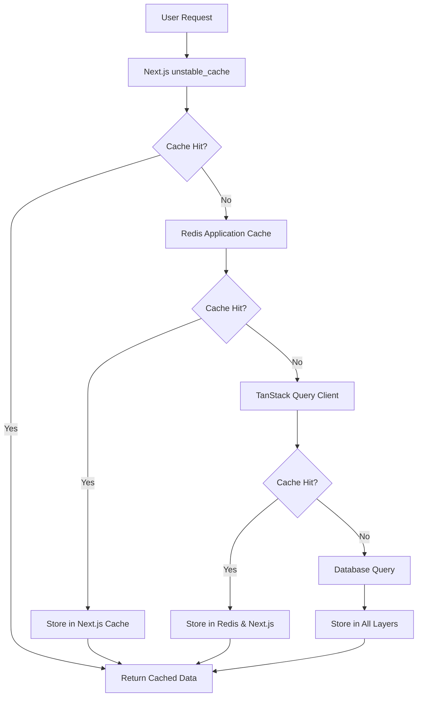

# itellico Mono - Three-Layer Caching Strategy

## 📋 Overview

The itellico Mono implements a sophisticated **three-layer caching strategy** that ensures optimal performance while maintaining data consistency across all tenant operations. This comprehensive guide covers implementation, best practices, and monitoring for all three caching layers.

### **The Three Layers**



**Layer 1:** **Next.js `unstable_cache`** - React Server Components caching  
**Layer 2:** **Redis** - Application-level distributed caching (REQUIRED)  
**Layer 3:** **TanStack Query** - Client-side state management  

---

## 🏗️ Architecture Principles

### **Critical Rules (P0 - NEVER violate)**

From `CLAUDE.md`:
> - ALWAYS implement all three caching layers
> - ALL layers must invalidate together on mutations to ensure data consistency
> - NEVER use Zustand for server state
> - ALWAYS use service layer pattern with Redis

### **Cache Hierarchy Design**

1. **Fastest:** Next.js cache (in-memory, per-request)
2. **Fast:** Redis cache (distributed, shared across instances)  
3. **Fallback:** TanStack Query (client-side, optimistic updates)
4. **Source of Truth:** PostgreSQL database

### **Tenant Isolation**

Every cache key MUST include `tenantId` for proper multi-tenant isolation:

```typescript
// ✅ CORRECT - Includes tenant isolation
`cache:${tenantId}:users:list:${hash}`

// ❌ WRONG - Missing tenant isolation
`cache:users:list:${hash}`
```

---

## 📖 Layer 1: Next.js `unstable_cache`

### **Purpose & Scope**
- React Server Components caching
- Request-level deduplication
- Fastest cache layer (in-memory)
- Automatically handles cache tags for invalidation

### **Implementation Pattern**

```typescript
import { unstable_cache } from 'next/cache';
import { db } from '@/lib/db';

// Service function with Next.js caching
export const getUsersByTenant = unstable_cache(
  async (tenantId: number) => {
    console.log('Cache MISS - Fetching from database');
    
    return await db.user.findMany({
      where: { tenantId },
      select: {
        id: true,
        email: true,
        name: true,
        createdAt: true,
      },
    });
  },
  ['users-by-tenant'], // Cache key
  {
    tags: [`tenant-${tenantId}-users`], // Invalidation tags
    revalidate: 300, // 5 minutes TTL
  }
);
```

### **Cache Invalidation**

```typescript
import { revalidateTag } from 'next/cache';

// Invalidate specific tenant's user cache
export async function invalidateUserCache(tenantId: number) {
  revalidateTag(`tenant-${tenantId}-users`);
}

// Invalidate all caches for a tenant
export async function invalidateAllTenantCaches(tenantId: number) {
  revalidateTag(`tenant-${tenantId}`);
}
```

### **Best Practices**

```typescript
// ✅ DO: Use descriptive cache keys
unstable_cache(fetchFunction, ['users', 'by-tenant', tenantId.toString()])

// ✅ DO: Include tenant ID in tags
{ tags: [`tenant-${tenantId}-users`, `users`] }

// ✅ DO: Set appropriate TTL
{ revalidate: 300 } // 5 minutes for user data

// ❌ DON'T: Cache without tenant isolation
unstable_cache(fetchFunction, ['all-users']) // Missing tenant context

// ❌ DON'T: Use overly long TTL for critical data
{ revalidate: 86400 } // 24 hours is too long for user permissions
```

---

## 📖 Layer 2: Redis Application Cache

### **Purpose & Scope**
- Distributed caching across all application instances
- Service layer caching with tenant isolation
- Complex data structures and computed results
- Session storage and temporary data

### **Redis Connection Setup**

```typescript
// /src/lib/redis.ts
import Redis from 'ioredis';

const redis = new Redis({
  host: process.env.REDIS_HOST || 'localhost',
  port: parseInt(process.env.REDIS_PORT || '6379'),
  password: process.env.REDIS_PASSWORD,
  db: 0,
  retryDelayOnFailover: 100,
  maxRetriesPerRequest: 3,
  enableOfflineQueue: false,
});

export async function getRedisClient(): Promise<Redis> {
  return redis;
}
```

### **Service Layer Pattern**

```typescript
// /src/lib/services/users.service.ts
import { getRedisClient } from '@/lib/redis';
import { createHash } from 'crypto';

export class UsersService {
  private readonly CACHE_TTL = 300; // 5 minutes

  /**
   * Generate tenant-isolated cache key
   */
  private generateCacheKey(tenantId: number, operation: string, params?: any): string {
    const paramHash = params ? createHash('md5').update(JSON.stringify(params)).digest('hex') : '';
    return `cache:${tenantId}:users:${operation}:${paramHash}`;
  }

  /**
   * Get users with Redis caching
   */
  async getUsers(tenantId: number, filters?: UserFilters): Promise<User[]> {
    const cacheKey = this.generateCacheKey(tenantId, 'list', filters);
    
    try {
      const redis = await getRedisClient();
      const cachedResult = await redis.get(cacheKey);
      
      if (cachedResult) {
        console.log('Redis cache HIT:', cacheKey);
        return JSON.parse(cachedResult);
      }
    } catch (error) {
      console.warn('Redis cache read failed:', error.message);
    }

    // Cache miss - fetch from database
    const users = await this.fetchUsersFromDatabase(tenantId, filters);

    // Store in Redis cache
    try {
      const redis = await getRedisClient();
      await redis.setex(cacheKey, this.CACHE_TTL, JSON.stringify(users));
      console.log('Redis cache SET:', cacheKey);
    } catch (error) {
      console.warn('Redis cache write failed:', error.message);
    }

    return users;
  }

  /**
   * Invalidate tenant's user cache
   */
  async invalidateUserCache(tenantId: number): Promise<void> {
    try {
      const redis = await getRedisClient();
      const pattern = `cache:${tenantId}:users:*`;
      const keys = await redis.keys(pattern);
      
      if (keys.length > 0) {
        await redis.del(...keys);
        console.log('Redis cache invalidated:', pattern, `${keys.length} keys`);
      }
    } catch (error) {
      console.warn('Redis cache invalidation failed:', error.message);
    }
  }
}
```

### **Redis Naming Conventions**

From `/docs/redis-cache-hierarchy.md`:

```typescript
// Base Pattern: cache:{tenantId}:{entity}:{operation}:{hash}

// Entity Lists
`cache:${tenantId}:users:list:${filtersHash}`
`cache:${tenantId}:profiles:list:${filtersHash}`
`cache:${tenantId}:jobs:list:${filtersHash}`

// Single Entities  
`cache:${tenantId}:user:${userId}`
`cache:${tenantId}:profile:${profileId}`
`cache:${tenantId}:job:${jobId}`

// Search Results
`cache:${tenantId}:search:users:${queryHash}`
`cache:${tenantId}:search:profiles:${queryHash}`

// Analytics & Reports
`cache:${tenantId}:analytics:dashboard:${dateRange}`
`cache:${tenantId}:reports:users:${reportType}:${dateRange}`

// International Reference Data (Global - No Tenant ID)
`cache:global:countries:${locale}`
`cache:global:timezones`
`cache:global:currencies:${locale}`
`cache:global:languages:${locale}`
`cache:global:phone:format:${countryCode}`

// User International Preferences
`cache:${tenantId}:user:${userId}:intl-prefs`
`cache:${tenantId}:user:${userId}:timezone`
`cache:${tenantId}:user:${userId}:locale`

// Sessions & Temporary Data
`session:${sessionId}`
`temp:${tenantId}:upload:${uploadId}`
`lock:${tenantId}:${entityType}:${entityId}`
```

### **Performance Optimization**

```typescript
// Use Redis pipeline for batch operations
export async function batchCacheOperations(operations: CacheOperation[]) {
  const redis = await getRedisClient();
  const pipeline = redis.pipeline();
  
  operations.forEach(op => {
    switch (op.type) {
      case 'set':
        pipeline.setex(op.key, op.ttl, JSON.stringify(op.data));
        break;
      case 'del':
        pipeline.del(op.key);
        break;
      case 'get':
        pipeline.get(op.key);
        break;
    }
  });
  
  return await pipeline.exec();
}

// Use Redis sets for efficient cache key tracking
export async function trackCacheKey(tenantId: number, category: string, key: string) {
  const redis = await getRedisClient();
  await redis.sadd(`cache_keys:${tenantId}:${category}`, key);
}

// Efficient cache invalidation using sets
export async function invalidateCacheCategory(tenantId: number, category: string) {
  const redis = await getRedisClient();
  const keys = await redis.smembers(`cache_keys:${tenantId}:${category}`);
  
  if (keys.length > 0) {
    await redis.del(...keys);
    await redis.del(`cache_keys:${tenantId}:${category}`);
  }
}
```

---

## 📖 Layer 3: TanStack Query Client-Side

### **Purpose & Scope**
- Client-side state management and caching
- Optimistic updates and background refetching
- Request deduplication and error handling
- Real-time data synchronization

### **Query Client Setup**

```typescript
// /src/lib/query-client.ts
import { QueryClient } from '@tanstack/react-query';

export const queryClient = new QueryClient({
  defaultOptions: {
    queries: {
      staleTime: 5 * 60 * 1000, // 5 minutes
      gcTime: 10 * 60 * 1000, // 10 minutes (formerly cacheTime)
      refetchOnWindowFocus: false,
      refetchOnMount: false,
      retry: (failureCount, error) => {
        // Don't retry on 4xx errors
        if (error?.status >= 400 && error?.status < 500) {
          return false;
        }
        return failureCount < 3;
      },
    },
    mutations: {
      retry: false,
    },
  },
});
```

### **Query Hook Patterns**

```typescript
// /src/hooks/useUsers.ts
import { useQuery, useMutation, useQueryClient } from '@tanstack/react-query';
import { useShallow } from 'zustand/react/shallow';

// Query key factory for consistency
export const userKeys = {
  all: (tenantId: number) => ['users', tenantId] as const,
  lists: (tenantId: number) => [...userKeys.all(tenantId), 'list'] as const,
  list: (tenantId: number, filters: UserFilters) => 
    [...userKeys.lists(tenantId), filters] as const,
  details: (tenantId: number) => [...userKeys.all(tenantId), 'detail'] as const,
  detail: (tenantId: number, id: number) => 
    [...userKeys.details(tenantId), id] as const,
};

// Users list query
export function useUsers(tenantId: number, filters: UserFilters = {}) {
  return useQuery({
    queryKey: userKeys.list(tenantId, filters),
    queryFn: () => fetchUsers(tenantId, filters),
    enabled: !!tenantId,
    staleTime: 5 * 60 * 1000, // 5 minutes
  });
}

// User detail query
export function useUser(tenantId: number, userId: number) {
  return useQuery({
    queryKey: userKeys.detail(tenantId, userId),
    queryFn: () => fetchUser(tenantId, userId),
    enabled: !!tenantId && !!userId,
  });
}

// User mutation with optimistic updates
export function useCreateUser(tenantId: number) {
  const queryClient = useQueryClient();
  
  return useMutation({
    mutationFn: (userData: CreateUserData) => createUser(tenantId, userData),
    onMutate: async (newUser) => {
      // Cancel outgoing refetches
      await queryClient.cancelQueries({ queryKey: userKeys.lists(tenantId) });
      
      // Snapshot previous value
      const previousUsers = queryClient.getQueryData(userKeys.lists(tenantId));
      
      // Optimistically update cache
      queryClient.setQueryData(userKeys.lists(tenantId), (old: any) => ({
        ...old,
        data: [...(old?.data || []), { ...newUser, id: 'temp-' + Date.now() }],
      }));
      
      return { previousUsers };
    },
    onError: (err, newUser, context) => {
      // Rollback on error
      queryClient.setQueryData(userKeys.lists(tenantId), context?.previousUsers);
    },
    onSettled: () => {
      // Always refetch after mutation
      queryClient.invalidateQueries({ queryKey: userKeys.lists(tenantId) });
    },
  });
}
```

### **Zustand Integration (UI State Only)**

```typescript
// /src/stores/ui-store.ts - UI state ONLY, never server state
import { create } from 'zustand';
import { devtools, persist, subscribeWithSelector } from 'zustand/middleware';
import { immer } from 'zustand/middleware/immer';

interface UIState {
  // UI preferences
  sidebarCollapsed: boolean;
  theme: 'light' | 'dark';
  selectedView: 'grid' | 'list';
  
  // Modal states
  isUserModalOpen: boolean;
  isConfirmModalOpen: boolean;
  
  // Form states
  searchQuery: string;
  activeFilters: Record<string, any>;
  
  // Actions
  toggleSidebar: () => void;
  setTheme: (theme: 'light' | 'dark') => void;
  openUserModal: () => void;
  closeUserModal: () => void;
  setSearchQuery: (query: string) => void;
  updateFilters: (filters: Record<string, any>) => void;
}

export const useUIStore = create<UIState>()(
  devtools(
    persist(
      subscribeWithSelector(
        immer((set) => ({
          // Initial state
          sidebarCollapsed: false,
          theme: 'light',
          selectedView: 'grid',
          isUserModalOpen: false,
          isConfirmModalOpen: false,
          searchQuery: '',
          activeFilters: {},
          
          // Actions
          toggleSidebar: () => set((state) => {
            state.sidebarCollapsed = !state.sidebarCollapsed;
          }),
          
          setTheme: (theme) => set((state) => {
            state.theme = theme;
          }),
          
          openUserModal: () => set((state) => {
            state.isUserModalOpen = true;
          }),
          
          closeUserModal: () => set((state) => {
            state.isUserModalOpen = false;
          }),
          
          setSearchQuery: (query) => set((state) => {
            state.searchQuery = query;
          }),
          
          updateFilters: (filters) => set((state) => {
            state.activeFilters = { ...state.activeFilters, ...filters };
          }),
        }))
      ),
      {
        name: 'mono-ui-store',
        partialize: (state) => ({
          // Only persist UI preferences
          sidebarCollapsed: state.sidebarCollapsed,
          theme: state.theme,
          selectedView: state.selectedView,
        }),
      }
    ),
    { name: 'UI Store' }
  )
);

// Usage with shallow comparison for performance
export function UsersList() {
  const { selectedView, searchQuery, updateFilters } = useUIStore(
    useShallow((state) => ({
      selectedView: state.selectedView,
      searchQuery: state.searchQuery,
      updateFilters: state.updateFilters,
    }))
  );
  
  // Server state via TanStack Query
  const { data: users, isLoading } = useUsers(tenantId, { search: searchQuery });
  
  return (
    <div>
      {/* UI using both stores appropriately */}
    </div>
  );
}
```

---

## 🌍 International Data Caching Patterns

### **Reference Data Caching (24-hour TTL)**

```typescript
// /src/lib/services/international-cache.service.ts
export class InternationalCacheService {
  private static readonly REFERENCE_TTL = 86400; // 24 hours
  private static readonly USER_PREFS_TTL = 1800;  // 30 minutes

  /**
   * Cache countries with extended metadata
   */
  static async getCachedCountries(locale = 'en'): Promise<CountryWithMetadata[]> {
    const cacheKey = `cache:global:countries:${locale}`;
    
    // Layer 1: Next.js cache
    return unstable_cache(
      async () => {
        const redis = await getRedisClient();
        
        // Layer 2: Redis cache
        const cached = await redis.get(cacheKey);
        if (cached) {
          return JSON.parse(cached);
        }
        
        // Layer 3: Database + metadata
        const countries = await internationalDataService.getCountriesWithTimezones();
        
        // Store in Redis
        await redis.setex(cacheKey, this.REFERENCE_TTL, JSON.stringify(countries));
        
        return countries;
      },
      [cacheKey],
      {
        revalidate: this.REFERENCE_TTL,
        tags: ['countries', 'international']
      }
    )();
  }

  /**
   * Cache user international preferences
   */
  static async getCachedUserPreferences(
    tenantId: number, 
    userId: string
  ): Promise<UserInternationalPreferences> {
    const cacheKey = `cache:${tenantId}:user:${userId}:intl-prefs`;
    
    return unstable_cache(
      async () => {
        const redis = await getRedisClient();
        
        // Check Redis first
        const cached = await redis.get(cacheKey);
        if (cached) {
          return JSON.parse(cached);
        }
        
        // Fetch from database
        const preferences = await userPreferencesService.getInternationalPreferences(
          tenantId, 
          userId
        );
        
        // Store in Redis
        await redis.setex(cacheKey, this.USER_PREFS_TTL, JSON.stringify(preferences));
        
        return preferences;
      },
      [cacheKey],
      {
        revalidate: this.USER_PREFS_TTL,
        tags: ['user-preferences', 'international', `user-${userId}`]
      }
    )();
  }

  /**
   * Cache timezone data for country
   */
  static async getCachedCountryTimezones(countryCode: string): Promise<string[]> {
    const cacheKey = `cache:global:country:${countryCode}:timezones`;
    
    return unstable_cache(
      async () => {
        const redis = await getRedisClient();
        
        const cached = await redis.get(cacheKey);
        if (cached) {
          return JSON.parse(cached);
        }
        
        const timezones = await internationalDataService.getTimezonesForCountry(countryCode);
        
        // Cache for 24 hours
        await redis.setex(cacheKey, this.REFERENCE_TTL, JSON.stringify(timezones));
        
        return timezones;
      },
      [cacheKey],
      {
        revalidate: this.REFERENCE_TTL,
        tags: ['timezones', 'countries', 'international']
      }
    )();
  }

  /**
   * Invalidate all international caches
   */
  static async invalidateInternationalCaches(): Promise<void> {
    const redis = await getRedisClient();
    
    // Delete all international cache keys
    const patterns = [
      'cache:global:countries:*',
      'cache:global:timezones*',
      'cache:global:currencies:*',
      'cache:global:languages:*',
      'cache:global:phone:*'
    ];
    
    for (const pattern of patterns) {
      const keys = await redis.keys(pattern);
      if (keys.length > 0) {
        await redis.del(...keys);
      }
    }
    
    // Invalidate Next.js cache tags
    revalidateTag('international');
    revalidateTag('countries');
    revalidateTag('timezones');
    revalidateTag('currencies');
    revalidateTag('languages');
  }

  /**
   * Invalidate user international preferences
   */
  static async invalidateUserPreferences(tenantId: number, userId: string): Promise<void> {
    const redis = await getRedisClient();
    
    // Delete user preference caches
    const patterns = [
      `cache:${tenantId}:user:${userId}:intl-prefs`,
      `cache:${tenantId}:user:${userId}:timezone`,
      `cache:${tenantId}:user:${userId}:locale`
    ];
    
    for (const pattern of patterns) {
      const keys = await redis.keys(pattern);
      if (keys.length > 0) {
        await redis.del(...keys);
      }
    }
    
    // Invalidate Next.js cache tags
    revalidateTag(`user-${userId}`);
    revalidateTag('user-preferences');
  }
}
```

### **Performance Optimization for International Data**

```typescript
// Preload critical international data on app start
export const preloadInternationalCache = async (): Promise<void> => {
  const preloadTasks = [
    // Most common countries and their timezones
    InternationalCacheService.getCachedCountries('en'),
    InternationalCacheService.getCachedCountryTimezones('US'),
    InternationalCacheService.getCachedCountryTimezones('GB'),
    InternationalCacheService.getCachedCountryTimezones('CA'),
    InternationalCacheService.getCachedCountryTimezones('AU'),
    
    // Common currencies and languages
    CurrencyService.getCachedCurrencies('en'),
    LanguageService.getCachedLanguages('en')
  ];
  
  await Promise.allSettled(preloadTasks);
  console.log('✅ International cache preloaded');
};

// Call during application initialization
preloadInternationalCache().catch(console.error);
```

---

## 🔄 Cache Invalidation Strategies

### **Coordinated Invalidation Pattern**

```typescript
// /src/lib/services/cache-invalidation.service.ts
import { revalidateTag } from 'next/cache';
import { getRedisClient } from '@/lib/redis';
import { queryClient } from '@/lib/query-client';

export class CacheInvalidationService {
  /**
   * Invalidate all three cache layers for a specific entity
   */
  static async invalidateEntity(
    tenantId: number, 
    entityType: string, 
    entityId?: string
  ): Promise<void> {
    await Promise.allSettled([
      // Layer 1: Next.js cache
      this.invalidateNextJSCache(tenantId, entityType, entityId),
      
      // Layer 2: Redis cache  
      this.invalidateRedisCache(tenantId, entityType, entityId),
      
      // Layer 3: TanStack Query (client-side)
      this.invalidateQueryCache(tenantId, entityType, entityId),
    ]);
  }

  /**
   * Layer 1: Next.js cache invalidation
   */
  private static async invalidateNextJSCache(
    tenantId: number, 
    entityType: string, 
    entityId?: string
  ): Promise<void> {
    const tags = [`tenant-${tenantId}-${entityType}`];
    
    if (entityId) {
      tags.push(`tenant-${tenantId}-${entityType}-${entityId}`);
    }
    
    tags.forEach(tag => revalidateTag(tag));
  }

  /**
   * Layer 2: Redis cache invalidation
   */
  private static async invalidateRedisCache(
    tenantId: number, 
    entityType: string, 
    entityId?: string
  ): Promise<void> {
    try {
      const redis = await getRedisClient();
      const patterns = [`cache:${tenantId}:${entityType}:*`];
      
      if (entityId) {
        patterns.push(`cache:${tenantId}:${entityType}:${entityId}`);
      }
      
      for (const pattern of patterns) {
        const keys = await redis.keys(pattern);
        if (keys.length > 0) {
          await redis.del(...keys);
        }
      }
    } catch (error) {
      console.warn('Redis cache invalidation failed:', error.message);
    }
  }

  /**
   * Layer 3: TanStack Query invalidation (server-side trigger)
   */
  private static async invalidateQueryCache(
    tenantId: number, 
    entityType: string, 
    entityId?: string
  ): Promise<void> {
    // This would typically be triggered via WebSocket or Server-Sent Events
    // to notify client-side cache invalidation
    
    // For now, we can use a POST endpoint that clients can call
    try {
      await fetch('/api/v1/cache/invalidate', {
        method: 'POST',
        headers: { 'Content-Type': 'application/json' },
        body: JSON.stringify({ tenantId, entityType, entityId }),
      });
    } catch (error) {
      console.warn('Client cache invalidation notification failed:', error.message);
    }
  }
}

// Usage in mutation handlers
export async function updateUser(tenantId: number, userId: number, data: UpdateUserData) {
  // 1. Update database
  const updatedUser = await db.user.update({
    where: { id: userId, tenantId },
    data,
  });
  
  // 2. Invalidate all cache layers
  await CacheInvalidationService.invalidateEntity(tenantId, 'users', userId.toString());
  
  return updatedUser;
}
```

### **Client-Side Cache Invalidation**

```typescript
// /src/components/UserForm.tsx
import { useEffect } from 'react';
import { useQueryClient } from '@tanstack/react-query';

export function UserForm() {
  const queryClient = useQueryClient();
  
  // Listen for cache invalidation events
  useEffect(() => {
    const eventSource = new EventSource('/api/v1/cache/events');
    
    eventSource.onmessage = (event) => {
      const { tenantId, entityType, entityId } = JSON.parse(event.data);
      
      // Invalidate matching queries
      queryClient.invalidateQueries({
        predicate: (query) => {
          const [entity, tenant] = query.queryKey;
          return entity === entityType && tenant === tenantId;
        }
      });
    };
    
    return () => eventSource.close();
  }, [queryClient]);
  
  return <div>{/* Form content */}</div>;
}
```

---

## 📊 Performance Monitoring

### **Cache Hit Rate Tracking**

```typescript
// /src/lib/monitoring/cache-metrics.ts
export class CacheMetrics {
  private static hits = new Map<string, number>();
  private static misses = new Map<string, number>();
  
  static recordHit(layer: 'nextjs' | 'redis' | 'tanstack', key: string) {
    const current = this.hits.get(`${layer}:${key}`) || 0;
    this.hits.set(`${layer}:${key}`, current + 1);
  }
  
  static recordMiss(layer: 'nextjs' | 'redis' | 'tanstack', key: string) {
    const current = this.misses.get(`${layer}:${key}`) || 0;
    this.misses.set(`${layer}:${key}`, current + 1);
  }
  
  static getHitRate(layer: 'nextjs' | 'redis' | 'tanstack'): number {
    let totalHits = 0;
    let totalRequests = 0;
    
    for (const [key, hits] of this.hits.entries()) {
      if (key.startsWith(`${layer}:`)) {
        totalHits += hits;
        totalRequests += hits;
      }
    }
    
    for (const [key, misses] of this.misses.entries()) {
      if (key.startsWith(`${layer}:`)) {
        totalRequests += misses;
      }
    }
    
    return totalRequests > 0 ? totalHits / totalRequests : 0;
  }
  
  static getDashboardStats() {
    return {
      nextjs: {
        hitRate: this.getHitRate('nextjs'),
        avgResponseTime: 1, // ms
      },
      redis: {
        hitRate: this.getHitRate('redis'),
        avgResponseTime: 5, // ms
      },
      tanstack: {
        hitRate: this.getHitRate('tanstack'),
        avgResponseTime: 0.1, // ms
      },
    };
  }
}
```

### **Cache Health Dashboard**

```typescript
// /src/app/admin/cache/dashboard/page.tsx
export default function CacheDashboard() {
  const [metrics, setMetrics] = useState(null);
  
  useEffect(() => {
    const fetchMetrics = async () => {
      const response = await fetch('/api/v1/admin/cache/metrics');
      const data = await response.json();
      setMetrics(data);
    };
    
    fetchMetrics();
    const interval = setInterval(fetchMetrics, 30000); // Update every 30s
    
    return () => clearInterval(interval);
  }, []);
  
  return (
    <div className="grid grid-cols-3 gap-6">
      <CacheLayerCard 
        title="Next.js Cache"
        hitRate={metrics?.nextjs?.hitRate}
        avgResponseTime={metrics?.nextjs?.avgResponseTime}
        color="blue"
      />
      <CacheLayerCard 
        title="Redis Cache"
        hitRate={metrics?.redis?.hitRate}
        avgResponseTime={metrics?.redis?.avgResponseTime}
        color="red"
      />
      <CacheLayerCard 
        title="TanStack Query"
        hitRate={metrics?.tanstack?.hitRate}
        avgResponseTime={metrics?.tanstack?.avgResponseTime}
        color="green"
      />
    </div>
  );
}
```

---

## 🛠️ Debugging & Troubleshooting

### **Cache Debugging Tools**

```typescript
// /src/lib/debug/cache-debug.ts
export class CacheDebugger {
  static async analyzeCacheKey(key: string) {
    const redis = await getRedisClient();
    
    const info = {
      exists: await redis.exists(key),
      ttl: await redis.ttl(key),
      type: await redis.type(key),
      size: 0,
      value: null,
    };
    
    if (info.exists) {
      const value = await redis.get(key);
      info.value = value;
      info.size = Buffer.byteLength(value || '', 'utf8');
    }
    
    return info;
  }
  
  static async findCacheKeys(pattern: string, limit = 100) {
    const redis = await getRedisClient();
    const keys = await redis.keys(pattern);
    return keys.slice(0, limit);
  }
  
  static async getCacheSizeByTenant(tenantId: number) {
    const redis = await getRedisClient();
    const keys = await redis.keys(`cache:${tenantId}:*`);
    
    let totalSize = 0;
    const sizeByCategory: Record<string, number> = {};
    
    for (const key of keys) {
      const value = await redis.get(key);
      const size = Buffer.byteLength(value || '', 'utf8');
      totalSize += size;
      
      const category = key.split(':')[2]; // Extract category from key
      sizeByCategory[category] = (sizeByCategory[category] || 0) + size;
    }
    
    return { totalSize, sizeByCategory, keyCount: keys.length };
  }
}

// Usage in development
if (process.env.NODE_ENV === 'development') {
  console.log('Cache analysis for tenant 1:', await CacheDebugger.getCacheSizeByTenant(1));
}
```

### **Common Issues & Solutions**

#### **Issue: Cache Stampede**
**Problem:** Multiple requests fetch the same data simultaneously when cache expires

**Solution:**
```typescript
// Use Redis-based locking to prevent cache stampede
export async function getWithLock<T>(
  key: string,
  fetchFunction: () => Promise<T>,
  ttl: number = 300
): Promise<T> {
  const redis = await getRedisClient();
  const lockKey = `lock:${key}`;
  
  // Try to acquire lock
  const lockAcquired = await redis.set(lockKey, '1', 'EX', 10, 'NX');
  
  if (lockAcquired) {
    try {
      // We have the lock - fetch and cache the data
      const data = await fetchFunction();
      await redis.setex(key, ttl, JSON.stringify(data));
      return data;
    } finally {
      // Always release the lock
      await redis.del(lockKey);
    }
  } else {
    // Lock exists - wait and check cache again
    await new Promise(resolve => setTimeout(resolve, 100));
    const cached = await redis.get(key);
    
    if (cached) {
      return JSON.parse(cached);
    } else {
      // Fallback to direct fetch
      return await fetchFunction();
    }
  }
}
```

#### **Issue: Memory Leaks in TanStack Query**
**Problem:** Client-side cache grows indefinitely

**Solution:**
```typescript
// Implement proper garbage collection
export const queryClient = new QueryClient({
  defaultOptions: {
    queries: {
      gcTime: 5 * 60 * 1000, // 5 minutes
      staleTime: 1 * 60 * 1000, // 1 minute
    },
  },
});

// Periodic cleanup in admin panel
useEffect(() => {
  const cleanup = setInterval(() => {
    queryClient.getQueryCache().clear();
  }, 30 * 60 * 1000); // Every 30 minutes
  
  return () => clearInterval(cleanup);
}, []);
```

#### **Issue: Stale Data After Mutations**
**Problem:** UI shows old data after updates

**Solution:**
```typescript
// Ensure proper invalidation patterns
export function useUpdateUser() {
  const queryClient = useQueryClient();
  
  return useMutation({
    mutationFn: updateUser,
    onSuccess: (data, variables) => {
      // Invalidate all related queries
      queryClient.invalidateQueries({ 
        queryKey: userKeys.all(variables.tenantId) 
      });
      
      // Update specific user in cache
      queryClient.setQueryData(
        userKeys.detail(variables.tenantId, variables.userId),
        data
      );
    },
  });
}
```

---

## 📋 Implementation Checklist

### **Setup Phase**
- [ ] Configure Redis connection with proper settings
- [ ] Set up Next.js `unstable_cache` in service functions
- [ ] Initialize TanStack Query client with appropriate defaults
- [ ] Implement cache key generation utilities
- [ ] Create base service classes with caching patterns

### **Development Phase**
- [ ] Implement cache invalidation service
- [ ] Add cache monitoring and metrics
- [ ] Create debugging tools for development
- [ ] Set up cache health dashboard
- [ ] Add performance monitoring hooks

### **Testing Phase**
- [ ] Write unit tests for cache functions
- [ ] Test cache invalidation scenarios
- [ ] Verify tenant isolation in cache keys
- [ ] Load test cache performance
- [ ] Test cache failure scenarios

### **Production Phase**
- [ ] Configure Redis clustering for high availability
- [ ] Set up cache monitoring alerts
- [ ] Implement cache warming strategies
- [ ] Create cache backup and recovery procedures
- [ ] Monitor cache hit rates and optimize TTLs

---

## 🎯 Performance Targets

### **Cache Hit Rates**
- **Next.js Cache:** 85%+ hit rate
- **Redis Cache:** 90%+ hit rate  
- **TanStack Query:** 95%+ hit rate

### **Response Times**
- **Next.js Cache:** <1ms average
- **Redis Cache:** <5ms average
- **TanStack Query:** <0.1ms average
- **Database Fallback:** <50ms average

### **Cache Efficiency**
- **Memory Usage:** <500MB Redis per 10K users
- **Cache Size:** <1KB average per cached item
- **TTL Effectiveness:** <5% expired cache access
- **Invalidation Speed:** <10ms for cache clearing

---

**Last Updated:** January 2025  
**Version:** 1.0.0  
**Status:** Production Ready

This three-layer caching strategy ensures optimal performance while maintaining data consistency across the itellico Mono's multi-tenant architecture.