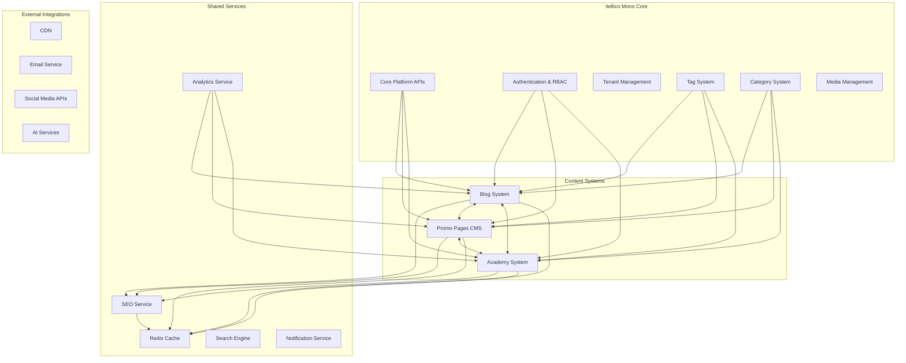

# itellico Mono Systems Integration Guide

## 🚀 Overview

This guide covers the integration of the three major content systems within the itellico Mono: **Blog System**, **Promo Pages CMS**, and **Academy System**. It provides implementation roadmaps, integration patterns, and best practices for creating a cohesive content ecosystem.

## 📋 Table of Contents

- [Integration Architecture](#integration-architecture)
- [Cross-System Data Flow](#cross-system-data-flow)
- [Shared Infrastructure](#shared-infrastructure)
- [Implementation Roadmap](#implementation-roadmap)
- [Integration Patterns](#integration-patterns)
- [API Gateway & Routing](#api-gateway--routing)
- [Content Interlinking Strategy](#content-interlinking-strategy)
- [SEO & Performance Integration](#seo--performance-integration)
- [Security & Permissions](#security--permissions)
- [Monitoring & Analytics](#monitoring--analytics)
- [Deployment Strategy](#deployment-strategy)
- [Maintenance & Scaling](#maintenance--scaling)

---

## 🏗️ Integration Architecture

### System Overview



### Core Integration Principles

1. **Shared Infrastructure**: All systems use common Mono platform services
2. **Cross-Content Linking**: Intelligent content relationships across systems
3. **Unified SEO**: Consistent SEO optimization across all content types
4. **Centralized Analytics**: Holistic content performance tracking
5. **Progressive Enhancement**: Each system can function independently

---

## 🔄 Cross-System Data Flow

### Content Relationship Matrix

| Source System | Target System | Integration Type | Use Cases |
|---------------|---------------|-----------------|-----------|
| **Blog → Academy** | Content Reference | Required reading, course supplements | Blog articles as lesson prerequisites |
| **Blog → Promo** | Featured Content | Latest articles preview | Homepage article showcases |
| **Academy → Blog** | Content Generation | Course-related articles | Expert insights from instructors |
| **Academy → Promo** | Achievement Display | Certificates, success stories | Social proof and testimonials |
| **Promo → Academy** | Lead Generation | Course enrollment CTAs | Convert visitors to students |
| **Promo → Blog** | Content Discovery | Article recommendations | Educate prospects before conversion |

### Data Integration Patterns

#### 1. Reference Integration
```typescript
interface ContentReference {
  sourceSystem: 'blog' | 'academy' | 'promo';
  sourceId: string;
  targetSystem: 'blog' | 'academy' | 'promo';
  targetId: string;
  relationType: 'required' | 'recommended' | 'related' | 'featured';
  weight: number; // 1-100 for ranking
  context?: string;
  isActive: boolean;
}

// Example: Blog article required for academy lesson
const blogToAcademyReference: ContentReference = {
  sourceSystem: 'blog',
  sourceId: 'blog-post-uuid-123',
  targetSystem: 'academy',
  targetId: 'lesson-uuid-456',
  relationType: 'required',
  weight: 100,
  context: 'Must read before lesson quiz',
  isActive: true
};
```

#### 2. Featured Content Integration
```typescript
interface FeaturedContentConfig {
  componentType: string; // e.g., 'BLOG_PREVIEW', 'COURSE_SHOWCASE'
  contentSource: {
    system: 'blog' | 'academy';
    filters: {
      categories?: string[];
      tags?: string[];
      status?: string;
      featured?: boolean;
      publishedAfter?: Date;
    };
    sorting: {
      field: string;
      direction: 'asc' | 'desc';
    };
    limit: number;
  };
  displayConfig: {
    showExcerpt: boolean;
    showAuthor: boolean;
    showDate: boolean;
    showThumbnail: boolean;
    layout: 'grid' | 'list' | 'carousel';
  };
  refreshInterval: number; // Minutes
}
```

#### 3. Analytics Integration
```typescript
interface CrossSystemAnalytics {
  contentJourney: {
    userId: string;
    sessionId: string;
    touchpoints: {
      system: 'blog' | 'academy' | 'promo';
      contentId: string;
      action: 'view' | 'engage' | 'convert' | 'complete';
      timestamp: Date;
      duration: number;
      metadata: Record<string, any>;
    }[];
  };
  
  conversionFunnels: {
    funnelName: string;
    steps: {
      system: string;
      contentType: string;
      action: string;
      conversionRate: number;
    }[];
  };
  
  contentPerformance: {
    crossReferences: {
      sourceContent: string;
      targetContent: string;
      clickThroughRate: number;
      conversionRate: number;
    }[];
  };
}
```

---

## 🛠️ Shared Infrastructure

### Unified Services Layer

#### Content Service Interface
```typescript
interface UnifiedContentService {
  // Cross-system content search
  searchContent(query: ContentSearchQuery): Promise<ContentSearchResult[]>;
  
  // Content recommendations
  getRecommendations(contentId: string, system: ContentSystem): Promise<ContentRecommendation[]>;
  
  // Content relationships
  createContentLink(source: ContentRef, target: ContentRef, type: LinkType): Promise<ContentLink>;
  getContentLinks(contentId: string, system: ContentSystem): Promise<ContentLink[]>;
  
  // Content analytics
  trackContentInteraction(interaction: ContentInteraction): Promise<void>;
  getContentAnalytics(contentId: string, system: ContentSystem): Promise<ContentAnalytics>;
}

interface ContentSearchQuery {
  query: string;
  systems: ContentSystem[];
  contentTypes: string[];
  filters: {
    categories?: string[];
    tags?: string[];
    language?: string;
    publishedAfter?: Date;
    difficulty?: string;
  };
  sorting: {
    field: string;
    direction: 'asc' | 'desc';
  };
  pagination: {
    page: number;
    limit: number;
  };
}

type ContentSystem = 'blog' | 'academy' | 'promo';
type LinkType = 'required' | 'recommended' | 'related' | 'featured' | 'prerequisite';
```

#### Unified SEO Service
```typescript
class UnifiedSEOService {
  // Generate SEO data for any content type
  async generateSEOData(content: UniversalContent): Promise<SEOData> {
    const seoData: SEOData = {
      title: this.optimizeTitle(content.title, content.type),
      metaDescription: this.generateMetaDescription(content),
      keywords: await this.extractKeywords(content),
      canonicalUrl: this.generateCanonicalUrl(content),
      openGraph: this.generateOpenGraphData(content),
      structuredData: this.generateStructuredData(content),
      hreflangAlternatives: await this.generateHreflangAlternatives(content)
    };
    
    // AI optimization
    seoData.aiOptimization = await this.optimizeForAISearch(content, seoData);
    
    return seoData;
  }
  
  // Cross-system internal linking
  async generateInternalLinks(content: UniversalContent): Promise<InternalLink[]> {
    const links: InternalLink[] = [];
    
    // Find related content across all systems
    const relatedContent = await this.contentService.searchContent({
      query: content.extractedKeywords.join(' '),
      systems: ['blog', 'academy', 'promo'],
      contentTypes: this.getCompatibleContentTypes(content.type),
      filters: {
        language: content.language,
        publishedAfter: new Date(Date.now() - 365 * 24 * 60 * 60 * 1000) // Last year
      },
      sorting: { field: 'relevance', direction: 'desc' },
      pagination: { page: 1, limit: 20 }
    });
    
    // Generate contextual links
    for (const related of relatedContent) {
      const linkSuggestion = await this.generateLinkSuggestion(content, related);
      if (linkSuggestion.relevanceScore > 0.7) {
        links.push(linkSuggestion);
      }
    }
    
    return links.sort((a, b) => b.relevanceScore - a.relevanceScore).slice(0, 10);
  }
}

interface UniversalContent {
  id: string;
  system: ContentSystem;
  type: string;
  title: string;
  content: string;
  excerpt?: string;
  language: string;
  categories: string[];
  tags: string[];
  author?: string;
  publishedAt?: Date;
  extractedKeywords: string[];
  metadata: Record<string, any>;
}
```

#### Unified Caching Strategy
```typescript
class UnifiedCacheService {
  private redis: Redis;
  
  // Cache patterns for cross-system content
  private readonly CACHE_PATTERNS = {
    // Content caching
    CONTENT: 'tenant:{tenantId}:{system}:content:{id}',
    CONTENT_LIST: 'tenant:{tenantId}:{system}:list:{hash}',
    
    // Cross-system relationships
    CONTENT_LINKS: 'tenant:{tenantId}:links:{sourceSystem}:{sourceId}',
    RECOMMENDATIONS: 'tenant:{tenantId}:recommendations:{system}:{contentId}',
    
    // SEO data
    SEO_DATA: 'tenant:{tenantId}:seo:{system}:{contentId}',
    INTERNAL_LINKS: 'tenant:{tenantId}:internal-links:{system}:{contentId}',
    
    // Analytics
    CONTENT_ANALYTICS: 'tenant:{tenantId}:analytics:{system}:{contentId}:{period}',
    CROSS_SYSTEM_ANALYTICS: 'tenant:{tenantId}:cross-analytics:{period}',
    
    // Search results
    SEARCH_RESULTS: 'search:{tenantId}:{queryHash}',
    FEATURED_CONTENT: 'tenant:{tenantId}:featured:{componentType}:{hash}'
  };
  
  async cacheContent(
    tenantId: number, 
    system: ContentSystem, 
    content: any, 
    ttl: number = 3600
  ): Promise<void> {
    const key = this.formatKey(this.CACHE_PATTERNS.CONTENT, {
      tenantId,
      system,
      id: content.id
    });
    
    await this.redis.setex(key, ttl, JSON.stringify(content));
  }
  
  async getCachedContent(
    tenantId: number, 
    system: ContentSystem, 
    contentId: string
  ): Promise<any | null> {
    const key = this.formatKey(this.CACHE_PATTERNS.CONTENT, {
      tenantId,
      system,
      id: contentId
    });
    
    const cached = await this.redis.get(key);
    return cached ? JSON.parse(cached) : null;
  }
  
  async invalidateContentCache(
    tenantId: number, 
    system: ContentSystem, 
    contentId: string
  ): Promise<void> {
    // Invalidate direct content cache
    const contentKey = this.formatKey(this.CACHE_PATTERNS.CONTENT, {
      tenantId,
      system,
      id: contentId
    });
    await this.redis.del(contentKey);
    
    // Invalidate related caches
    await this.invalidateRelatedCaches(tenantId, system, contentId);
  }
  
  private async invalidateRelatedCaches(
    tenantId: number, 
    system: ContentSystem, 
    contentId: string
  ): Promise<void> {
    const patterns = [
      `tenant:${tenantId}:links:*:${contentId}`,
      `tenant:${tenantId}:links:${system}:${contentId}:*`,
      `tenant:${tenantId}:recommendations:*:${contentId}`,
      `tenant:${tenantId}:seo:${system}:${contentId}`,
      `tenant:${tenantId}:internal-links:${system}:${contentId}`,
      `tenant:${tenantId}:featured:*`
    ];
    
    for (const pattern of patterns) {
      const keys = await this.redis.keys(pattern);
      if (keys.length > 0) {
        await this.redis.del(...keys);
      }
    }
  }
}
```

---

## 📅 Implementation Roadmap

### Phase 1: Foundation & Core Integration (Weeks 1-8)

#### Weeks 1-2: Shared Infrastructure
**Blog System Foundation**
- [ ] Database models and migrations
- [ ] Basic CRUD API endpoints
- [ ] Blog role integration with RBAC
- [ ] Tag/category system integration

**Promo CMS Foundation**
- [ ] Component library setup
- [ ] Page template system
- [ ] Basic drag-and-drop interface
- [ ] Tenant isolation implementation

**Academy Foundation**
- [ ] Course and lesson models
- [ ] Enrollment system
- [ ] Basic progress tracking
- [ ] Quiz infrastructure

#### Weeks 3-4: Cross-System Services
**Unified Content Service**
- [ ] Content search across systems
- [ ] Content relationship management
- [ ] Basic recommendation engine
- [ ] Cross-system analytics foundation

**SEO Integration**
- [ ] Unified SEO service
- [ ] Meta tag management
- [ ] Basic schema markup
- [ ] Internal linking foundation

#### Weeks 5-6: Basic Content Integration
**Blog ↔ Academy Integration**
- [ ] Required reading system
- [ ] Blog post lesson linking
- [ ] Reading progress tracking
- [ ] Basic content recommendations

**Blog ↔ Promo Integration**
- [ ] Featured blog posts component
- [ ] Latest articles preview
- [ ] Blog content in promo pages
- [ ] Cross-system navigation

#### Weeks 7-8: Foundation Testing
- [ ] Integration testing
- [ ] Performance optimization
- [ ] Security audit
- [ ] Documentation updates

### Phase 2: Advanced Features & Content Strategy (Weeks 9-16)

#### Weeks 9-10: Advanced Blog System
**SEO & AI Optimization**
- [ ] Real-time SEO analysis
- [ ] AI search optimization
- [ ] Cornerstone content system
- [ ] Advanced internal linking

**Multilingual Support**
- [ ] Content translation workflows
- [ ] Hreflang generation
- [ ] Language management interface
- [ ] Localized SEO optimization

#### Weeks 11-12: Enhanced Promo CMS
**Advanced Components**
- [ ] Live data integration components
- [ ] Dynamic content updates
- [ ] Advanced template system
- [ ] Performance optimization

**Multilingual CMS**
- [ ] Translation management
- [ ] Component translation interface
- [ ] Language-specific layouts
- [ ] Hreflang automation

#### Weeks 13-14: Academy Content Integration
**Advanced Learning Features**
- [ ] Adaptive learning paths
- [ ] Content recommendation engine
- [ ] Cross-system skill tracking
- [ ] Certificate integration

**Blog-Academy Deep Integration**
- [ ] Intelligent content linking
- [ ] Course-blog synchronization
- [ ] Reading analytics
- [ ] Content gap analysis

#### Weeks 15-16: System Optimization
**Performance & Analytics**
- [ ] Advanced caching strategies
- [ ] Cross-system analytics
- [ ] Performance monitoring
- [ ] User experience optimization

### Phase 3: Advanced Integration & AI Features (Weeks 17-24)

#### Weeks 17-18: Intelligent Content Discovery
**AI-Powered Recommendations**
- [ ] Machine learning content recommendations
- [ ] User behavior analysis
- [ ] Content performance prediction
- [ ] Personalized learning paths

**Advanced Search**
- [ ] Cross-system semantic search
- [ ] Natural language queries
- [ ] Content similarity detection
- [ ] Automated tagging

#### Weeks 19-20: Content Automation
**Automated Content Flows**
- [ ] Auto-generated course suggestions from blog content
- [ ] Automated promo page updates
- [ ] Content freshness monitoring
- [ ] SEO optimization automation

**Content Quality Assurance**
- [ ] Automated content auditing
- [ ] Link validation
- [ ] SEO compliance checking
- [ ] Content performance monitoring

#### Weeks 21-22: Advanced Analytics & Reporting
**Cross-System Analytics**
- [ ] Content journey tracking
- [ ] Conversion funnel analysis
- [ ] ROI measurement
- [ ] Predictive analytics

**Business Intelligence**
- [ ] Content strategy insights
- [ ] User engagement patterns
- [ ] Revenue attribution
- [ ] Performance dashboards

#### Weeks 23-24: Launch Preparation
**Production Readiness**
- [ ] Comprehensive testing
- [ ] Performance optimization
- [ ] Security hardening
- [ ] Documentation completion

**Training & Rollout**
- [ ] User training materials
- [ ] Admin documentation
- [ ] Rollout planning
- [ ] Support preparation

---

## 🔗 Integration Patterns

### 1. Content Reference Pattern

```typescript
class ContentReferenceService {
  async createReference(
    sourceSystem: ContentSystem,
    sourceId: string,
    targetSystem: ContentSystem,
    targetId: string,
    type: ReferenceType,
    metadata?: any
  ): Promise<ContentReference> {
    const reference = await this.db.contentReference.create({
      data: {
        sourceSystem,
        sourceId,
        targetSystem,
        targetId,
        type,
        metadata,
        tenantId: this.getTenantId()
      }
    });
    
    // Invalidate related caches
    await this.cacheService.invalidateContentReferences(sourceSystem, sourceId);
    await this.cacheService.invalidateContentReferences(targetSystem, targetId);
    
    return reference;
  }
  
  async getReferences(
    system: ContentSystem,
    contentId: string,
    direction: 'incoming' | 'outgoing' | 'both' = 'both'
  ): Promise<ContentReference[]> {
    const cacheKey = `content-references:${system}:${contentId}:${direction}`;
    const cached = await this.cacheService.get(cacheKey);
    
    if (cached) return cached;
    
    const where: any = { tenantId: this.getTenantId() };
    
    if (direction === 'incoming') {
      where.targetSystem = system;
      where.targetId = contentId;
    } else if (direction === 'outgoing') {
      where.sourceSystem = system;
      where.sourceId = contentId;
    } else {
      where.OR = [
        { sourceSystem: system, sourceId: contentId },
        { targetSystem: system, targetId: contentId }
      ];
    }
    
    const references = await this.db.contentReference.findMany({ where });
    
    await this.cacheService.set(cacheKey, references, 1800); // 30 minutes
    return references;
  }
}

enum ReferenceType {
  REQUIRED = 'required',
  RECOMMENDED = 'recommended',
  RELATED = 'related',
  FEATURED = 'featured',
  PREREQUISITE = 'prerequisite',
  FOLLOW_UP = 'follow_up'
}
```

### 2. Featured Content Pattern

```typescript
class FeaturedContentService {
  async getFeaturedContent(
    componentConfig: FeaturedContentConfig,
    tenantId: number
  ): Promise<FeaturedContentResult[]> {
    const cacheKey = this.generateCacheKey(componentConfig, tenantId);
    const cached = await this.cacheService.get(cacheKey);
    
    if (cached) return cached;
    
    let content: any[] = [];
    
    switch (componentConfig.contentSource.system) {
      case 'blog':
        content = await this.getBlogContent(componentConfig, tenantId);
        break;
      case 'academy':
        content = await this.getAcademyContent(componentConfig, tenantId);
        break;
    }
    
    const results = content.map(item => this.transformForDisplay(item, componentConfig));
    
    await this.cacheService.set(
      cacheKey, 
      results, 
      componentConfig.refreshInterval * 60
    );
    
    return results;
  }
  
  private async getBlogContent(
    config: FeaturedContentConfig,
    tenantId: number
  ): Promise<any[]> {
    return await this.db.blogPost.findMany({
      where: {
        tenantId,
        status: 'PUBLISHED',
        ...(config.contentSource.filters.categories && {
          categories: {
            some: {
              name: { in: config.contentSource.filters.categories }
            }
          }
        }),
        ...(config.contentSource.filters.featured && {
          isFeatured: true
        }),
        ...(config.contentSource.filters.publishedAfter && {
          publishedAt: { gte: config.contentSource.filters.publishedAfter }
        })
      },
      include: {
        author: { include: { profile: true } },
        categories: true,
        tags: { include: { tag: true } }
      },
      orderBy: {
        [config.contentSource.sorting.field]: config.contentSource.sorting.direction
      },
      take: config.contentSource.limit
    });
  }
  
  private transformForDisplay(
    content: any,
    config: FeaturedContentConfig
  ): FeaturedContentResult {
    return {
      id: content.uuid,
      title: content.title,
      excerpt: config.displayConfig.showExcerpt ? content.excerpt : undefined,
      author: config.displayConfig.showAuthor ? content.author : undefined,
      publishedAt: config.displayConfig.showDate ? content.publishedAt : undefined,
      thumbnail: config.displayConfig.showThumbnail ? content.featuredImage : undefined,
      url: this.generateContentUrl(content),
      metadata: {
        system: config.contentSource.system,
        contentType: content.type || 'post',
        categories: content.categories?.map(c => c.name) || [],
        tags: content.tags?.map(t => t.tag.name) || []
      }
    };
  }
}

interface FeaturedContentResult {
  id: string;
  title: string;
  excerpt?: string;
  author?: any;
  publishedAt?: Date;
  thumbnail?: string;
  url: string;
  metadata: {
    system: ContentSystem;
    contentType: string;
    categories: string[];
    tags: string[];
  };
}
```

### 3. Cross-System Navigation Pattern

```typescript
class NavigationService {
  async generateCrossSystemNavigation(
    currentContent: {
      system: ContentSystem;
      id: string;
      type: string;
    },
    tenantId: number
  ): Promise<NavigationSuggestion[]> {
    const suggestions: NavigationSuggestion[] = [];
    
    // Get content references
    const references = await this.contentReferenceService.getReferences(
      currentContent.system,
      currentContent.id,
      'both'
    );
    
    // Add direct references
    for (const ref of references) {
      const isOutgoing = ref.sourceSystem === currentContent.system && 
                        ref.sourceId === currentContent.id;
      
      const targetSystem = isOutgoing ? ref.targetSystem : ref.sourceSystem;
      const targetId = isOutgoing ? ref.targetId : ref.sourceId;
      
      const targetContent = await this.getContentSummary(targetSystem, targetId);
      
      suggestions.push({
        type: ref.type,
        direction: isOutgoing ? 'outgoing' : 'incoming',
        content: targetContent,
        weight: this.calculateNavigationWeight(ref, currentContent),
        context: ref.metadata?.context
      });
    }
    
    // Add AI-generated suggestions
    const aiSuggestions = await this.generateAISuggestions(currentContent, tenantId);
    suggestions.push(...aiSuggestions);
    
    // Sort by weight and return top suggestions
    return suggestions
      .sort((a, b) => b.weight - a.weight)
      .slice(0, 10);
  }
  
  private async generateAISuggestions(
    currentContent: any,
    tenantId: number
  ): Promise<NavigationSuggestion[]> {
    // Use content similarity and user behavior to suggest related content
    const contentVector = await this.generateContentVector(currentContent);
    const similarContent = await this.findSimilarContent(contentVector, tenantId);
    
    return similarContent.map(content => ({
      type: 'ai_suggested',
      direction: 'outgoing',
      content: content,
      weight: content.similarityScore * 50, // Scale similarity to weight
      context: 'AI-suggested based on content similarity'
    }));
  }
}

interface NavigationSuggestion {
  type: string;
  direction: 'incoming' | 'outgoing';
  content: ContentSummary;
  weight: number;
  context?: string;
}

interface ContentSummary {
  id: string;
  system: ContentSystem;
  title: string;
  excerpt: string;
  url: string;
  type: string;
  publishedAt?: Date;
  thumbnail?: string;
}
```

---

## 🛡️ API Gateway & Routing

### Unified API Structure

```typescript
// Unified API routing structure
const API_ROUTES = {
  // System-specific routes
  blog: {
    posts: '/api/v1/blog/posts',
    categories: '/api/v1/blog/categories',
    tags: '/api/v1/blog/tags',
    seo: '/api/v1/blog/seo',
    analytics: '/api/v1/blog/analytics'
  },
  
  promo: {
    pages: '/api/v1/promo/pages',
    templates: '/api/v1/promo/templates',
    components: '/api/v1/promo/components',
    featured: '/api/v1/promo/featured-content'
  },
  
  academy: {
    courses: '/api/v1/academy/courses',
    lessons: '/api/v1/academy/lessons',
    enrollments: '/api/v1/academy/enrollments',
    certificates: '/api/v1/academy/certificates',
    careerPaths: '/api/v1/academy/career-paths'
  },
  
  // Cross-system routes
  unified: {
    search: '/api/v1/content/search',
    recommendations: '/api/v1/content/recommendations',
    links: '/api/v1/content/links',
    analytics: '/api/v1/content/analytics',
    seo: '/api/v1/content/seo'
  }
};

// API Gateway configuration
class APIGateway {
  async routeRequest(request: APIRequest): Promise<APIResponse> {
    // Authentication and authorization
    const authResult = await this.authenticate(request);
    if (!authResult.success) {
      return this.unauthorizedResponse();
    }
    
    // Rate limiting
    const rateLimitResult = await this.checkRateLimit(request);
    if (!rateLimitResult.allowed) {
      return this.rateLimitResponse();
    }
    
    // Tenant context
    const tenantContext = await this.extractTenantContext(request);
    
    // Route to appropriate service
    const route = this.parseRoute(request.path);
    const service = this.getService(route.system);
    
    // Add cross-system context
    const enrichedRequest = await this.enrichRequest(request, tenantContext);
    
    // Execute request
    const response = await service.handleRequest(enrichedRequest);
    
    // Add cross-system data if requested
    if (request.headers['x-include-cross-system']) {
      response.data = await this.addCrossSystemData(response.data, route);
    }
    
    return response;
  }
  
  private async addCrossSystemData(
    data: any, 
    route: ParsedRoute
  ): Promise<any> {
    if (route.system === 'blog' && route.resource === 'posts' && data.id) {
      // Add related academy courses and promo pages
      data.relatedContent = await this.contentService.getRecommendations(
        data.id, 
        'blog'
      );
    }
    
    if (route.system === 'academy' && route.resource === 'courses' && data.id) {
      // Add related blog articles
      data.requiredReading = await this.contentService.getReferences(
        'academy',
        data.id
      ).filter(ref => ref.targetSystem === 'blog');
    }
    
    return data;
  }
}
```

### Cross-System API Endpoints

#### Unified Content Search
```typescript
GET /api/v1/content/search
Query Parameters:
- q: string (search query)
- systems: string[] (blog,academy,promo)
- content_types: string[]
- categories: string[]
- tags: string[]
- language: string
- page: number
- limit: number

Response: {
  results: ContentSearchResult[];
  aggregations: {
    systems: { system: string; count: number }[];
    contentTypes: { type: string; count: number }[];
    categories: { category: string; count: number }[];
  };
  pagination: PaginationData;
}
```

#### Content Recommendations
```typescript
GET /api/v1/content/recommendations/:system/:contentId
Query Parameters:
- target_systems: string[] (systems to include in recommendations)
- limit: number
- include_metadata: boolean

Response: {
  recommendations: ContentRecommendation[];
  algorithm: string;
  generated_at: Date;
}
```

#### Cross-System Analytics
```typescript
GET /api/v1/content/analytics/cross-system
Query Parameters:
- period: string (7d, 30d, 90d, 1y)
- systems: string[]
- content_ids: string[]

Response: {
  contentJourneys: ContentJourney[];
  conversionFunnels: ConversionFunnel[];
  crossSystemMetrics: {
    totalViews: number;
    averageEngagementTime: number;
    conversionRate: number;
    topPerformingContent: ContentSummary[];
  };
}
```

---

## 🔍 Content Interlinking Strategy

### Intelligent Link Discovery

```typescript
class IntelligentLinkingService {
  async generateContentLinks(
    content: UniversalContent,
    targetSystems: ContentSystem[] = ['blog', 'academy', 'promo']
  ): Promise<ContentLinkSuggestion[]> {
    const suggestions: ContentLinkSuggestion[] = [];
    
    // Extract content features for matching
    const contentFeatures = await this.extractContentFeatures(content);
    
    for (const system of targetSystems) {
      if (system === content.system) continue; // Skip same system
      
      const systemSuggestions = await this.findSystemLinks(
        contentFeatures,
        system,
        content.tenantId
      );
      
      suggestions.push(...systemSuggestions);
    }
    
    // Rank suggestions by relevance
    return this.rankLinkSuggestions(suggestions, content);
  }
  
  private async extractContentFeatures(content: UniversalContent): Promise<ContentFeatures> {
    return {
      keywords: await this.extractKeywords(content.content),
      topics: await this.extractTopics(content.content),
      entities: await this.extractEntities(content.content),
      sentiment: await this.analyzeSentiment(content.content),
      readingLevel: this.calculateReadingLevel(content.content),
      categories: content.categories,
      tags: content.tags,
      contentType: content.type,
      language: content.language
    };
  }
  
  private async findSystemLinks(
    features: ContentFeatures,
    targetSystem: ContentSystem,
    tenantId: number
  ): Promise<ContentLinkSuggestion[]> {
    let targetContent: any[] = [];
    
    switch (targetSystem) {
      case 'blog':
        targetContent = await this.findBlogLinks(features, tenantId);
        break;
      case 'academy':
        targetContent = await this.findAcademyLinks(features, tenantId);
        break;
      case 'promo':
        targetContent = await this.findPromoLinks(features, tenantId);
        break;
    }
    
    return targetContent.map(content => ({
      targetSystem,
      targetId: content.id,
      targetTitle: content.title,
      targetUrl: this.generateContentUrl(content, targetSystem),
      relevanceScore: this.calculateRelevance(features, content),
      linkType: this.determineLinkType(features, content),
      suggestedAnchorText: this.generateAnchorText(features, content),
      context: this.generateLinkContext(features, content)
    }));
  }
  
  private async findBlogLinks(
    features: ContentFeatures,
    tenantId: number
  ): Promise<any[]> {
    // Find blog posts with similar keywords, topics, or categories
    const query = {
      bool: {
        should: [
          { terms: { keywords: features.keywords } },
          { terms: { topics: features.topics } },
          { terms: { categories: features.categories } },
          { terms: { tags: features.tags } }
        ],
        must: [
          { term: { tenantId } },
          { term: { status: 'PUBLISHED' } },
          { term: { language: features.language } }
        ]
      }
    };
    
    return await this.searchService.search('blog_posts', query, {
      size: 50,
      _source: ['id', 'title', 'excerpt', 'keywords', 'categories', 'readingTime']
    });
  }
  
  private async findAcademyLinks(
    features: ContentFeatures,
    tenantId: number
  ): Promise<any[]> {
    // Find courses and lessons related to content
    const courseQuery = {
      bool: {
        should: [
          { terms: { keywords: features.keywords } },
          { terms: { skills: features.topics } },
          { terms: { categories: features.categories } }
        ],
        must: [
          { term: { tenantId } },
          { term: { status: 'PUBLISHED' } }
        ]
      }
    };
    
    return await this.searchService.search('academy_courses', courseQuery, {
      size: 20,
      _source: ['id', 'title', 'description', 'level', 'estimatedHours']
    });
  }
  
  private calculateRelevance(
    sourceFeatures: ContentFeatures,
    targetContent: any
  ): number {
    let relevanceScore = 0;
    
    // Keyword overlap
    const keywordOverlap = this.calculateOverlap(
      sourceFeatures.keywords,
      targetContent.keywords || []
    );
    relevanceScore += keywordOverlap * 0.4;
    
    // Topic similarity
    const topicSimilarity = this.calculateOverlap(
      sourceFeatures.topics,
      targetContent.topics || []
    );
    relevanceScore += topicSimilarity * 0.3;
    
    // Category relevance
    const categoryRelevance = this.calculateOverlap(
      sourceFeatures.categories,
      targetContent.categories || []
    );
    relevanceScore += categoryRelevance * 0.2;
    
    // Content type compatibility
    const typeCompatibility = this.calculateTypeCompatibility(
      sourceFeatures.contentType,
      targetContent.type
    );
    relevanceScore += typeCompatibility * 0.1;
    
    return Math.min(relevanceScore, 1.0);
  }
  
  private determineLinkType(
    features: ContentFeatures,
    targetContent: any
  ): LinkType {
    const relevance = this.calculateRelevance(features, targetContent);
    
    if (relevance > 0.8) return 'required';
    if (relevance > 0.6) return 'recommended';
    if (relevance > 0.4) return 'related';
    return 'supplementary';
  }
}

interface ContentFeatures {
  keywords: string[];
  topics: string[];
  entities: string[];
  sentiment: number;
  readingLevel: number;
  categories: string[];
  tags: string[];
  contentType: string;
  language: string;
}

interface ContentLinkSuggestion {
  targetSystem: ContentSystem;
  targetId: string;
  targetTitle: string;
  targetUrl: string;
  relevanceScore: number;
  linkType: LinkType;
  suggestedAnchorText: string[];
  context: string;
}

type LinkType = 'required' | 'recommended' | 'related' | 'supplementary';
```

### Automated Link Maintenance

```typescript
class LinkMaintenanceService {
  async validateAllLinks(tenantId: number): Promise<LinkValidationReport> {
    const allLinks = await this.contentReferenceService.getAllLinks(tenantId);
    const validationResults: LinkValidationResult[] = [];
    
    for (const link of allLinks) {
      const result = await this.validateLink(link);
      validationResults.push(result);
      
      if (!result.isValid) {
        await this.handleBrokenLink(link, result);
      }
    }
    
    return {
      totalLinks: allLinks.length,
      validLinks: validationResults.filter(r => r.isValid).length,
      brokenLinks: validationResults.filter(r => !r.isValid).length,
      results: validationResults,
      recommendations: await this.generateMaintenanceRecommendations(validationResults)
    };
  }
  
  private async validateLink(link: ContentReference): Promise<LinkValidationResult> {
    try {
      // Check if target content still exists
      const targetExists = await this.contentService.contentExists(
        link.targetSystem,
        link.targetId
      );
      
      if (!targetExists) {
        return {
          linkId: link.id,
          isValid: false,
          error: 'Target content not found',
          suggestions: await this.findReplacementContent(link)
        };
      }
      
      // Check if target content is still published
      const targetContent = await this.contentService.getContent(
        link.targetSystem,
        link.targetId
      );
      
      if (targetContent.status !== 'PUBLISHED') {
        return {
          linkId: link.id,
          isValid: false,
          error: 'Target content is not published',
          suggestions: []
        };
      }
      
      // Check relevance (may have changed over time)
      const currentRelevance = await this.calculateCurrentRelevance(link);
      if (currentRelevance < 0.3) {
        return {
          linkId: link.id,
          isValid: true,
          warning: 'Link relevance has decreased',
          suggestions: await this.findBetterLinks(link)
        };
      }
      
      return { linkId: link.id, isValid: true };
      
    } catch (error) {
      return {
        linkId: link.id,
        isValid: false,
        error: error.message,
        suggestions: []
      };
    }
  }
  
  private async handleBrokenLink(
    link: ContentReference,
    validationResult: LinkValidationResult
  ): Promise<void> {
    // Log the broken link
    await this.auditService.logBrokenLink(link, validationResult);
    
    // Notify content managers
    await this.notificationService.sendBrokenLinkNotification(link);
    
    // Auto-fix if possible
    if (validationResult.suggestions && validationResult.suggestions.length > 0) {
      const bestSuggestion = validationResult.suggestions[0];
      if (bestSuggestion.confidence > 0.8) {
        await this.autoReplaceLink(link, bestSuggestion);
      }
    }
    
    // Disable link temporarily
    await this.contentReferenceService.disableLink(link.id);
  }
}

interface LinkValidationResult {
  linkId: string;
  isValid: boolean;
  error?: string;
  warning?: string;
  suggestions?: LinkSuggestion[];
}

interface LinkSuggestion {
  targetSystem: ContentSystem;
  targetId: string;
  targetTitle: string;
  confidence: number;
  reason: string;
}
```

---

## 🎯 SEO & Performance Integration

### Unified SEO Management

```typescript
class UnifiedSEOManager {
  async optimizeContent(
    content: UniversalContent,
    optimization: SEOOptimization
  ): Promise<SEOResult> {
    const result: SEOResult = {
      contentId: content.id,
      system: content.system,
      optimizations: [],
      score: 0,
      warnings: [],
      recommendations: []
    };
    
    // Title optimization
    if (optimization.optimizeTitle) {
      const titleOpt = await this.optimizeTitle(content);
      result.optimizations.push(titleOpt);
    }
    
    // Meta description optimization
    if (optimization.optimizeMetaDescription) {
      const metaOpt = await this.optimizeMetaDescription(content);
      result.optimizations.push(metaOpt);
    }
    
    // Content structure optimization
    if (optimization.optimizeStructure) {
      const structureOpt = await this.optimizeContentStructure(content);
      result.optimizations.push(structureOpt);
    }
    
    // Internal linking optimization
    if (optimization.optimizeInternalLinks) {
      const linkOpt = await this.optimizeInternalLinks(content);
      result.optimizations.push(linkOpt);
    }
    
    // Cross-system optimization
    if (optimization.crossSystemOptimization) {
      const crossOpt = await this.optimizeCrossSystemSEO(content);
      result.optimizations.push(crossOpt);
    }
    
    // Calculate overall score
    result.score = this.calculateSEOScore(result.optimizations);
    
    // Generate recommendations
    result.recommendations = await this.generateSEORecommendations(content, result);
    
    return result;
  }
  
  private async optimizeCrossSystemSEO(content: UniversalContent): Promise<SEOOptimizationResult> {
    const optimizations: string[] = [];
    
    // Find related content for internal linking
    const relatedContent = await this.intelligentLinkingService.generateContentLinks(content);
    
    // Suggest cross-system canonical URLs
    const canonicalSuggestion = await this.suggestCanonicalUrl(content);
    if (canonicalSuggestion) {
      optimizations.push(`Suggested canonical URL: ${canonicalSuggestion}`);
    }
    
    // Optimize for content clusters
    const clusterOptimization = await this.optimizeForContentClusters(content);
    optimizations.push(...clusterOptimization);
    
    // Suggest schema markup enhancements
    const schemaEnhancements = await this.suggestSchemaEnhancements(content);
    optimizations.push(...schemaEnhancements);
    
    return {
      type: 'cross_system_seo',
      optimizations,
      impact: 'medium',
      implementationDifficulty: 'low'
    };
  }
  
  private async optimizeForContentClusters(content: UniversalContent): Promise<string[]> {
    const optimizations: string[] = [];
    
    // Identify content cluster opportunities
    const clusters = await this.identifyContentClusters(content);
    
    for (const cluster of clusters) {
      if (cluster.gapAnalysis.missingContent.length > 0) {
        optimizations.push(
          `Create content for cluster "${cluster.topic}": ${cluster.gapAnalysis.missingContent.join(', ')}`
        );
      }
      
      if (cluster.linkOpportunities.length > 0) {
        optimizations.push(
          `Add internal links to strengthen "${cluster.topic}" cluster`
        );
      }
    }
    
    return optimizations;
  }
  
  async generateSitemaps(tenantId: number): Promise<SitemapCollection> {
    const sitemaps: SitemapCollection = {
      main: [],
      blog: [],
      academy: [],
      promo: []
    };
    
    // Generate blog sitemap
    const blogPosts = await this.db.blogPost.findMany({
      where: { tenantId, status: 'PUBLISHED' },
      select: { slug: true, updatedAt: true, priority: true, language: true }
    });
    
    sitemaps.blog = blogPosts.map(post => ({
      url: `/blog/${post.slug}`,
      lastModified: post.updatedAt,
      changeFrequency: 'weekly',
      priority: post.priority || 0.7,
      alternateLanguages: this.getAlternateLanguageUrls(post, 'blog')
    }));
    
    // Generate academy sitemap
    const courses = await this.db.academyCourse.findMany({
      where: { tenantId, status: 'PUBLISHED' },
      select: { slug: true, updatedAt: true, language: true }
    });
    
    sitemaps.academy = courses.map(course => ({
      url: `/academy/courses/${course.slug}`,
      lastModified: course.updatedAt,
      changeFrequency: 'monthly',
      priority: 0.8,
      alternateLanguages: this.getAlternateLanguageUrls(course, 'academy')
    }));
    
    // Generate promo pages sitemap
    const promoPages = await this.db.promoPage.findMany({
      where: { tenantId, status: 'PUBLISHED' },
      select: { slug: true, updatedAt: true, language: true }
    });
    
    sitemaps.promo = promoPages.map(page => ({
      url: `/${page.slug}`,
      lastModified: page.updatedAt,
      changeFrequency: 'monthly',
      priority: 0.9,
      alternateLanguages: this.getAlternateLanguageUrls(page, 'promo')
    }));
    
    // Combine all for main sitemap
    sitemaps.main = [...sitemaps.blog, ...sitemaps.academy, ...sitemaps.promo];
    
    return sitemaps;
  }
}

interface SEOOptimization {
  optimizeTitle: boolean;
  optimizeMetaDescription: boolean;
  optimizeStructure: boolean;
  optimizeInternalLinks: boolean;
  crossSystemOptimization: boolean;
  aiSearchOptimization: boolean;
}

interface SEOResult {
  contentId: string;
  system: ContentSystem;
  optimizations: SEOOptimizationResult[];
  score: number;
  warnings: string[];
  recommendations: string[];
}

interface SitemapCollection {
  main: SitemapEntry[];
  blog: SitemapEntry[];
  academy: SitemapEntry[];
  promo: SitemapEntry[];
}

interface SitemapEntry {
  url: string;
  lastModified: Date;
  changeFrequency: 'always' | 'hourly' | 'daily' | 'weekly' | 'monthly' | 'yearly' | 'never';
  priority: number;
  alternateLanguages?: { language: string; url: string }[];
}
```

### Performance Optimization

```typescript
class PerformanceOptimizationService {
  async optimizeContentDelivery(tenantId: number): Promise<PerformanceOptimization> {
    const optimization: PerformanceOptimization = {
      tenantId,
      optimizations: [],
      estimatedImprovements: {},
      implementationPlan: []
    };
    
    // Image optimization analysis
    const imageOpt = await this.analyzeImageOptimization(tenantId);
    optimization.optimizations.push(imageOpt);
    
    // Cache optimization
    const cacheOpt = await this.analyzeCacheOptimization(tenantId);
    optimization.optimizations.push(cacheOpt);
    
    // Content compression
    const compressionOpt = await this.analyzeCompressionOpportunities(tenantId);
    optimization.optimizations.push(compressionOpt);
    
    // Database query optimization
    const queryOpt = await this.analyzeQueryOptimization(tenantId);
    optimization.optimizations.push(queryOpt);
    
    // CDN configuration
    const cdnOpt = await this.analyzeCDNConfiguration(tenantId);
    optimization.optimizations.push(cdnOpt);
    
    // Calculate estimated improvements
    optimization.estimatedImprovements = this.calculatePerformanceImprovements(
      optimization.optimizations
    );
    
    return optimization;
  }
  
  private async analyzeImageOptimization(tenantId: number): Promise<OptimizationResult> {
    const images = await this.getContentImages(tenantId);
    const issues: string[] = [];
    const recommendations: string[] = [];
    
    for (const image of images) {
      if (image.size > 500000) { // 500KB
        issues.push(`Large image: ${image.url} (${Math.round(image.size / 1024)}KB)`);
      }
      
      if (!image.formats.includes('webp')) {
        recommendations.push(`Convert ${image.url} to WebP format`);
      }
      
      if (!image.altText) {
        issues.push(`Missing alt text: ${image.url}`);
      }
    }
    
    return {
      category: 'image_optimization',
      issues,
      recommendations,
      impact: 'high',
      estimatedImprovement: {
        loadTime: '-30%',
        seoScore: '+10 points'
      }
    };
  }
  
  private async analyzeCacheOptimization(tenantId: number): Promise<OptimizationResult> {
    const cacheAnalysis = await this.analyzeCachePerformance(tenantId);
    const recommendations: string[] = [];
    
    if (cacheAnalysis.hitRate < 0.8) {
      recommendations.push('Increase cache TTL for static content');
      recommendations.push('Implement edge caching for frequently accessed content');
    }
    
    if (cacheAnalysis.missLatency > 200) {
      recommendations.push('Optimize database queries for cache misses');
      recommendations.push('Implement cache warming for popular content');
    }
    
    return {
      category: 'cache_optimization',
      issues: [],
      recommendations,
      impact: 'high',
      estimatedImprovement: {
        responseTime: '-40%',
        serverLoad: '-25%'
      }
    };
  }
  
  async implementPerformanceOptimizations(
    tenantId: number,
    optimizations: string[]
  ): Promise<ImplementationResult> {
    const results: ImplementationResult = {
      tenantId,
      completedOptimizations: [],
      failedOptimizations: [],
      performanceImpact: {}
    };
    
    for (const optimization of optimizations) {
      try {
        await this.implementOptimization(tenantId, optimization);
        results.completedOptimizations.push(optimization);
      } catch (error) {
        results.failedOptimizations.push({
          optimization,
          error: error.message
        });
      }
    }
    
    // Measure performance impact
    results.performanceImpact = await this.measurePerformanceImpact(tenantId);
    
    return results;
  }
}

interface PerformanceOptimization {
  tenantId: number;
  optimizations: OptimizationResult[];
  estimatedImprovements: {
    loadTime?: string;
    seoScore?: string;
    responseTime?: string;
    serverLoad?: string;
  };
  implementationPlan: ImplementationStep[];
}

interface OptimizationResult {
  category: string;
  issues: string[];
  recommendations: string[];
  impact: 'low' | 'medium' | 'high';
  estimatedImprovement: Record<string, string>;
}
```

---

## 🔐 Security & Permissions

### Cross-System Security Model

```typescript
class CrossSystemSecurityManager {
  async validateCrossSystemAccess(
    userId: number,
    sourceSystem: ContentSystem,
    sourceId: string,
    targetSystem: ContentSystem,
    targetId: string,
    action: string
  ): Promise<SecurityValidationResult> {
    const result: SecurityValidationResult = {
      allowed: false,
      reason: '',
      requiredPermissions: [],
      securityLevel: 'denied'
    };
    
    // Check basic system access
    const sourceAccess = await this.checkSystemAccess(userId, sourceSystem, action);
    const targetAccess = await this.checkSystemAccess(userId, targetSystem, 'read');
    
    if (!sourceAccess.allowed || !targetAccess.allowed) {
      result.reason = 'Insufficient system permissions';
      result.requiredPermissions = [
        ...sourceAccess.requiredPermissions,
        ...targetAccess.requiredPermissions
      ];
      return result;
    }
    
    // Check content-specific permissions
    const sourceContentAccess = await this.checkContentAccess(
      userId, sourceSystem, sourceId, action
    );
    const targetContentAccess = await this.checkContentAccess(
      userId, targetSystem, targetId, 'read'
    );
    
    if (!sourceContentAccess.allowed || !targetContentAccess.allowed) {
      result.reason = 'Insufficient content permissions';
      return result;
    }
    
    // Check cross-system linking permissions
    const linkingAccess = await this.checkLinkingPermissions(
      userId, sourceSystem, targetSystem
    );
    
    if (!linkingAccess.allowed) {
      result.reason = 'Cross-system linking not permitted';
      return result;
    }
    
    // Check tenant boundaries
    const tenantValidation = await this.validateTenantBoundaries(
      sourceSystem, sourceId, targetSystem, targetId
    );
    
    if (!tenantValidation.valid) {
      result.reason = 'Cross-tenant access denied';
      result.securityLevel = 'security_violation';
      return result;
    }
    
    result.allowed = true;
    result.securityLevel = 'approved';
    return result;
  }
  
  async auditCrossSystemAccess(
    userId: number,
    action: CrossSystemAction,
    result: SecurityValidationResult
  ): Promise<void> {
    await this.auditService.logCrossSystemAccess({
      userId,
      action,
      result,
      timestamp: new Date(),
      ipAddress: this.getClientIP(),
      userAgent: this.getUserAgent(),
      sessionId: this.getSessionId()
    });
    
    // Alert on security violations
    if (result.securityLevel === 'security_violation') {
      await this.securityAlertService.sendSecurityAlert({
        type: 'cross_system_violation',
        userId,
        action,
        severity: 'high'
      });
    }
  }
  
  private async validateTenantBoundaries(
    sourceSystem: ContentSystem,
    sourceId: string,
    targetSystem: ContentSystem,
    targetId: string
  ): Promise<TenantValidationResult> {
    const sourceTenant = await this.getContentTenant(sourceSystem, sourceId);
    const targetTenant = await this.getContentTenant(targetSystem, targetId);
    
    if (sourceTenant !== targetTenant) {
      return {
        valid: false,
        reason: 'Content belongs to different tenants',
        sourceTenant,
        targetTenant
      };
    }
    
    return { valid: true, sourceTenant, targetTenant };
  }
}

interface CrossSystemAction {
  type: 'link_create' | 'link_read' | 'link_update' | 'link_delete' | 'content_reference';
  sourceSystem: ContentSystem;
  sourceId: string;
  targetSystem: ContentSystem;
  targetId: string;
  metadata?: any;
}

interface SecurityValidationResult {
  allowed: boolean;
  reason: string;
  requiredPermissions: string[];
  securityLevel: 'approved' | 'restricted' | 'denied' | 'security_violation';
}
```

### Content Security Policies

```typescript
class ContentSecurityPolicyManager {
  async enforceContentSecurity(
    content: UniversalContent,
    context: SecurityContext
  ): Promise<SecurityEnforcementResult> {
    const policies = await this.getApplicablePolicies(content, context);
    const violations: SecurityViolation[] = [];
    const enforcements: SecurityEnforcement[] = [];
    
    for (const policy of policies) {
      const result = await this.evaluatePolicy(content, policy, context);
      
      if (result.violated) {
        violations.push({
          policyId: policy.id,
          violation: result.violation,
          severity: policy.severity,
          action: policy.enforcementAction
        });
        
        if (policy.enforcementAction === 'block') {
          return {
            allowed: false,
            violations,
            reason: `Content blocked by policy: ${policy.name}`
          };
        } else if (policy.enforcementAction === 'sanitize') {
          const sanitized = await this.sanitizeContent(content, policy);
          enforcements.push({
            policyId: policy.id,
            action: 'sanitize',
            changes: sanitized.changes
          });
        }
      }
    }
    
    return {
      allowed: true,
      violations,
      enforcements,
      sanitizedContent: this.applySanitizations(content, enforcements)
    };
  }
  
  private async getApplicablePolicies(
    content: UniversalContent,
    context: SecurityContext
  ): Promise<SecurityPolicy[]> {
    return await this.db.securityPolicy.findMany({
      where: {
        tenantId: context.tenantId,
        isActive: true,
        OR: [
          { scope: 'global' },
          { scope: 'system', systemTarget: content.system },
          { scope: 'content_type', contentTypeTarget: content.type }
        ]
      }
    });
  }
}

interface SecurityPolicy {
  id: string;
  name: string;
  scope: 'global' | 'system' | 'content_type';
  systemTarget?: ContentSystem;
  contentTypeTarget?: string;
  rules: SecurityRule[];
  severity: 'low' | 'medium' | 'high' | 'critical';
  enforcementAction: 'warn' | 'sanitize' | 'block';
}

interface SecurityRule {
  type: 'content_filter' | 'link_validation' | 'metadata_check' | 'permission_check';
  parameters: any;
  condition: string; // JSONPath or similar
}
```

---

## 📊 Monitoring & Analytics

### Unified Analytics Dashboard

```typescript
class UnifiedAnalyticsService {
  async generateDashboard(
    tenantId: number,
    timeRange: TimeRange,
    includeProjections: boolean = false
  ): Promise<AnalyticsDashboard> {
    const dashboard: AnalyticsDashboard = {
      tenantId,
      timeRange,
      generatedAt: new Date(),
      overview: await this.generateOverview(tenantId, timeRange),
      systemMetrics: await this.generateSystemMetrics(tenantId, timeRange),
      crossSystemMetrics: await this.generateCrossSystemMetrics(tenantId, timeRange),
      contentPerformance: await this.generateContentPerformance(tenantId, timeRange),
      userEngagement: await this.generateUserEngagement(tenantId, timeRange),
      conversionFunnels: await this.generateConversionFunnels(tenantId, timeRange),
      projections: includeProjections ? 
        await this.generateProjections(tenantId, timeRange) : undefined
    };
    
    return dashboard;
  }
  
  private async generateCrossSystemMetrics(
    tenantId: number,
    timeRange: TimeRange
  ): Promise<CrossSystemMetrics> {
    // Content journey analysis
    const journeys = await this.analyzeContentJourneys(tenantId, timeRange);
    
    // Cross-system conversion rates
    const conversions = await this.analyzeCrossSystemConversions(tenantId, timeRange);
    
    // Content interlinking effectiveness
    const linkingEffectiveness = await this.analyzeLinkingEffectiveness(tenantId, timeRange);
    
    // System interdependencies
    const interdependencies = await this.analyzeSystemInterdependencies(tenantId, timeRange);
    
    return {
      contentJourneys: {
        totalJourneys: journeys.total,
        averageJourneyLength: journeys.averageLength,
        commonPaths: journeys.commonPaths,
        dropoffPoints: journeys.dropoffPoints
      },
      conversions: {
        blogToAcademy: conversions.blogToAcademy,
        academyToBlog: conversions.academyToBlog,
        promoToAcademy: conversions.promoToAcademy,
        promoToBlog: conversions.promoToBlog,
        overallConversionRate: conversions.overall
      },
      interlinking: {
        totalLinks: linkingEffectiveness.totalLinks,
        clickThroughRate: linkingEffectiveness.clickThroughRate,
        mostEffectiveLinks: linkingEffectiveness.topPerforming,
        leastEffectiveLinks: linkingEffectiveness.underperforming
      },
      interdependencies: {
        systemDependencyMap: interdependencies.dependencyMap,
        criticalPaths: interdependencies.criticalPaths,
        redundancyAnalysis: interdependencies.redundancy
      }
    };
  }
  
  async trackContentInteraction(interaction: ContentInteraction): Promise<void> {
    // Store interaction
    await this.db.contentInteraction.create({
      data: {
        userId: interaction.userId,
        sessionId: interaction.sessionId,
        tenantId: interaction.tenantId,
        system: interaction.system,
        contentId: interaction.contentId,
        action: interaction.action,
        duration: interaction.duration,
        metadata: interaction.metadata,
        timestamp: new Date()
      }
    });
    
    // Update real-time metrics
    await this.updateRealTimeMetrics(interaction);
    
    // Trigger recommendations update if significant interaction
    if (this.isSignificantInteraction(interaction)) {
      await this.recommendationService.updateUserProfile(
        interaction.userId,
        interaction
      );
    }
    
    // Check for conversion events
    await this.checkConversionEvents(interaction);
  }
  
  private async analyzeContentJourneys(
    tenantId: number,
    timeRange: TimeRange
  ): Promise<ContentJourneyAnalysis> {
    const interactions = await this.db.contentInteraction.findMany({
      where: {
        tenantId,
        timestamp: {
          gte: timeRange.start,
          lte: timeRange.end
        }
      },
      orderBy: [
        { sessionId: 'asc' },
        { timestamp: 'asc' }
      ]
    });
    
    // Group by session to create journeys
    const journeyMap = new Map<string, ContentInteraction[]>();
    for (const interaction of interactions) {
      if (!journeyMap.has(interaction.sessionId)) {
        journeyMap.set(interaction.sessionId, []);
      }
      journeyMap.get(interaction.sessionId)!.push(interaction);
    }
    
    const journeys = Array.from(journeyMap.values());
    
    // Analyze journey patterns
    const commonPaths = this.findCommonJourneyPaths(journeys);
    const dropoffPoints = this.identifyDropoffPoints(journeys);
    const averageLength = journeys.reduce((sum, journey) => sum + journey.length, 0) / journeys.length;
    
    return {
      total: journeys.length,
      averageLength,
      commonPaths,
      dropoffPoints
    };
  }
  
  async generateInsights(
    tenantId: number,
    timeRange: TimeRange
  ): Promise<AnalyticsInsight[]> {
    const insights: AnalyticsInsight[] = [];
    
    // Content performance insights
    const contentInsights = await this.generateContentInsights(tenantId, timeRange);
    insights.push(...contentInsights);
    
    // User behavior insights
    const behaviorInsights = await this.generateBehaviorInsights(tenantId, timeRange);
    insights.push(...behaviorInsights);
    
    // Cross-system optimization insights
    const optimizationInsights = await this.generateOptimizationInsights(tenantId, timeRange);
    insights.push(...optimizationInsights);
    
    // Anomaly detection insights
    const anomalyInsights = await this.detectAnomalies(tenantId, timeRange);
    insights.push(...anomalyInsights);
    
    return insights.sort((a, b) => b.impact - a.impact);
  }
}

interface AnalyticsDashboard {
  tenantId: number;
  timeRange: TimeRange;
  generatedAt: Date;
  overview: OverviewMetrics;
  systemMetrics: SystemMetrics[];
  crossSystemMetrics: CrossSystemMetrics;
  contentPerformance: ContentPerformanceMetrics;
  userEngagement: UserEngagementMetrics;
  conversionFunnels: ConversionFunnel[];
  projections?: ProjectionData;
}

interface ContentInteraction {
  userId: number;
  sessionId: string;
  tenantId: number;
  system: ContentSystem;
  contentId: string;
  action: 'view' | 'engage' | 'share' | 'convert' | 'complete';
  duration: number; // milliseconds
  metadata?: any;
  timestamp: Date;
}

interface AnalyticsInsight {
  id: string;
  type: 'performance' | 'behavior' | 'optimization' | 'anomaly';
  title: string;
  description: string;
  impact: number; // 1-100
  actionable: boolean;
  recommendations: string[];
  data: any;
}
```

### Real-time Monitoring

```typescript
class RealTimeMonitoringService {
  private websocketConnections = new Map<string, WebSocket>();
  private metricsBuffer = new Map<string, any[]>();
  
  async startRealTimeMonitoring(tenantId: number): Promise<void> {
    // Start collecting metrics
    this.startMetricsCollection(tenantId);
    
    // Setup alerts
    await this.setupAlerts(tenantId);
    
    // Initialize real-time dashboard
    await this.initializeRealTimeDashboard(tenantId);
  }
  
  private startMetricsCollection(tenantId: number): void {
    const interval = setInterval(async () => {
      const metrics = await this.collectCurrentMetrics(tenantId);
      
      // Store in buffer
      const key = `tenant:${tenantId}`;
      if (!this.metricsBuffer.has(key)) {
        this.metricsBuffer.set(key, []);
      }
      
      const buffer = this.metricsBuffer.get(key)!;
      buffer.push(metrics);
      
      // Keep only last 100 data points
      if (buffer.length > 100) {
        buffer.shift();
      }
      
      // Broadcast to connected clients
      this.broadcastMetrics(tenantId, metrics);
      
      // Check for alerts
      await this.checkAlerts(tenantId, metrics);
      
    }, 5000); // Every 5 seconds
    
    // Store interval for cleanup
    this.monitoringIntervals.set(tenantId, interval);
  }
  
  private async collectCurrentMetrics(tenantId: number): Promise<RealTimeMetrics> {
    const now = new Date();
    const lastMinute = new Date(now.getTime() - 60000);
    
    // Collect metrics from all systems
    const [blogMetrics, academyMetrics, promoMetrics] = await Promise.all([
      this.collectBlogMetrics(tenantId, lastMinute, now),
      this.collectAcademyMetrics(tenantId, lastMinute, now),
      this.collectPromoMetrics(tenantId, lastMinute, now)
    ]);
    
    return {
      timestamp: now,
      tenantId,
      blog: blogMetrics,
      academy: academyMetrics,
      promo: promoMetrics,
      overall: this.calculateOverallMetrics([blogMetrics, academyMetrics, promoMetrics])
    };
  }
  
  private broadcastMetrics(tenantId: number, metrics: RealTimeMetrics): void {
    const message = JSON.stringify({
      type: 'metrics_update',
      data: metrics
    });
    
    // Send to all connected clients for this tenant
    this.websocketConnections.forEach((ws, connectionId) => {
      if (connectionId.includes(`tenant:${tenantId}`) && ws.readyState === WebSocket.OPEN) {
        ws.send(message);
      }
    });
  }
  
  async setupAlert(alert: AlertConfiguration): Promise<void> {
    await this.db.alertConfiguration.create({
      data: alert
    });
    
    // Add to active monitoring
    this.activeAlerts.set(alert.id, alert);
  }
  
  private async checkAlerts(tenantId: number, metrics: RealTimeMetrics): Promise<void> {
    const alerts = this.activeAlerts.values();
    
    for (const alert of alerts) {
      if (alert.tenantId !== tenantId) continue;
      
      const triggered = await this.evaluateAlert(alert, metrics);
      
      if (triggered && !this.isAlertCooldown(alert.id)) {
        await this.triggerAlert(alert, metrics);
        this.setAlertCooldown(alert.id, alert.cooldownMinutes);
      }
    }
  }
  
  private async triggerAlert(
    alert: AlertConfiguration,
    metrics: RealTimeMetrics
  ): Promise<void> {
    // Log alert
    await this.auditService.logAlert(alert, metrics);
    
    // Send notifications based on alert severity
    switch (alert.severity) {
      case 'critical':
        await this.notificationService.sendCriticalAlert(alert, metrics);
        break;
      case 'high':
        await this.notificationService.sendHighPriorityAlert(alert, metrics);
        break;
      case 'medium':
        await this.notificationService.sendMediumPriorityAlert(alert, metrics);
        break;
      case 'low':
        await this.notificationService.sendLowPriorityAlert(alert, metrics);
        break;
    }
    
    // Execute automated responses if configured
    if (alert.automatedResponse) {
      await this.executeAutomatedResponse(alert, metrics);
    }
  }
}

interface RealTimeMetrics {
  timestamp: Date;
  tenantId: number;
  blog: SystemMetrics;
  academy: SystemMetrics;
  promo: SystemMetrics;
  overall: OverallMetrics;
}

interface AlertConfiguration {
  id: string;
  tenantId: number;
  name: string;
  description: string;
  condition: AlertCondition;
  severity: 'low' | 'medium' | 'high' | 'critical';
  cooldownMinutes: number;
  isActive: boolean;
  automatedResponse?: AutomatedResponse;
}

interface AlertCondition {
  metric: string;
  operator: '>' | '<' | '=' | '!=' | '>=' | '<=';
  threshold: number;
  timeWindow: number; // minutes
}
```

---

## 🚀 Deployment Strategy

### Environment Configuration

```typescript
interface DeploymentConfiguration {
  environment: 'development' | 'staging' | 'production';
  systems: {
    blog: SystemDeploymentConfig;
    academy: SystemDeploymentConfig;
    promo: SystemDeploymentConfig;
  };
  infrastructure: InfrastructureConfig;
  database: DatabaseConfig;
  cache: CacheConfig;
  monitoring: MonitoringConfig;
  security: SecurityConfig;
}

interface SystemDeploymentConfig {
  enabled: boolean;
  features: FeatureFlags;
  scaling: ScalingConfig;
  resources: ResourceAllocation;
  environment: EnvironmentVariables;
}

interface FeatureFlags {
  crossSystemLinking: boolean;
  aiOptimization: boolean;
  realTimeAnalytics: boolean;
  advancedCaching: boolean;
  multilingual: boolean;
  advancedSEO: boolean;
}

const DEPLOYMENT_CONFIGS: Record<string, DeploymentConfiguration> = {
  development: {
    environment: 'development',
    systems: {
      blog: {
        enabled: true,
        features: {
          crossSystemLinking: true,
          aiOptimization: false,
          realTimeAnalytics: false,
          advancedCaching: false,
          multilingual: true,
          advancedSEO: true
        },
        scaling: { minInstances: 1, maxInstances: 1 },
        resources: { cpu: '0.5', memory: '1Gi' },
        environment: { LOG_LEVEL: 'debug', CACHE_TTL: '300' }
      },
      academy: {
        enabled: true,
        features: {
          crossSystemLinking: true,
          aiOptimization: false,
          realTimeAnalytics: false,
          advancedCaching: false,
          multilingual: true,
          advancedSEO: false
        },
        scaling: { minInstances: 1, maxInstances: 1 },
        resources: { cpu: '0.5', memory: '1Gi' },
        environment: { LOG_LEVEL: 'debug', CACHE_TTL: '300' }
      },
      promo: {
        enabled: true,
        features: {
          crossSystemLinking: true,
          aiOptimization: false,
          realTimeAnalytics: false,
          advancedCaching: false,
          multilingual: true,
          advancedSEO: true
        },
        scaling: { minInstances: 1, maxInstances: 1 },
        resources: { cpu: '0.5', memory: '1Gi' },
        environment: { LOG_LEVEL: 'debug', CACHE_TTL: '300' }
      }
    },
    infrastructure: {
      database: { instances: 1, backup: false },
      redis: { instances: 1, persistence: false },
      loadBalancer: { enabled: false },
      cdn: { enabled: false }
    },
    monitoring: { level: 'basic', retention: '7d' }
  },
  
  production: {
    environment: 'production',
    systems: {
      blog: {
        enabled: true,
        features: {
          crossSystemLinking: true,
          aiOptimization: true,
          realTimeAnalytics: true,
          advancedCaching: true,
          multilingual: true,
          advancedSEO: true
        },
        scaling: { minInstances: 2, maxInstances: 10 },
        resources: { cpu: '2', memory: '4Gi' },
        environment: { LOG_LEVEL: 'info', CACHE_TTL: '3600' }
      },
      academy: {
        enabled: true,
        features: {
          crossSystemLinking: true,
          aiOptimization: true,
          realTimeAnalytics: true,
          advancedCaching: true,
          multilingual: true,
          advancedSEO: true
        },
        scaling: { minInstances: 2, maxInstances: 8 },
        resources: { cpu: '2', memory: '4Gi' },
        environment: { LOG_LEVEL: 'info', CACHE_TTL: '3600' }
      },
      promo: {
        enabled: true,
        features: {
          crossSystemLinking: true,
          aiOptimization: true,
          realTimeAnalytics: true,
          advancedCaching: true,
          multilingual: true,
          advancedSEO: true
        },
        scaling: { minInstances: 2, maxInstances: 6 },
        resources: { cpu: '1', memory: '2Gi' },
        environment: { LOG_LEVEL: 'info', CACHE_TTL: '3600' }
      }
    },
    infrastructure: {
      database: { instances: 3, backup: true, replication: true },
      redis: { instances: 3, persistence: true, clustering: true },
      loadBalancer: { enabled: true, healthChecks: true },
      cdn: { enabled: true, globalDistribution: true }
    },
    monitoring: { level: 'comprehensive', retention: '90d' }
  }
};
```

### Deployment Pipeline

```yaml
# .github/workflows/deploy-content-systems.yml
name: Deploy Content Systems

on:
  push:
    branches: [main]
  pull_request:
    branches: [main]

jobs:
  test:
    runs-on: ubuntu-latest
    steps:
      - uses: actions/checkout@v3
      
      - name: Setup Node.js
        uses: actions/setup-node@v3
        with:
          node-version: '18'
          
      - name: Install dependencies
        run: |
          npm ci
          cd apps/api && npm ci
          
      - name: Run tests
        run: |
          npm run test
          npm run test:integration
          npm run test:e2e
          
      - name: Build systems
        run: |
          npm run build
          cd apps/api && npm run build
          
  deploy-staging:
    needs: test
    if: github.ref == 'refs/heads/main'
    runs-on: ubuntu-latest
    environment: staging
    steps:
      - uses: actions/checkout@v3
      
      - name: Deploy to staging
        run: |
          ./scripts/deploy.sh staging
          
      - name: Run smoke tests
        run: |
          ./scripts/smoke-tests.sh staging
          
  deploy-production:
    needs: [test, deploy-staging]
    if: github.ref == 'refs/heads/main'
    runs-on: ubuntu-latest
    environment: production
    steps:
      - uses: actions/checkout@v3
      
      - name: Deploy to production
        run: |
          ./scripts/deploy.sh production
          
      - name: Run health checks
        run: |
          ./scripts/health-checks.sh production
          
      - name: Notify deployment
        run: |
          ./scripts/notify-deployment.sh production
```

### Migration Strategy

```typescript
class MigrationOrchestrator {
  async executeMigration(
    fromVersion: string,
    toVersion: string,
    tenantId?: number
  ): Promise<MigrationResult> {
    const migrationPlan = await this.createMigrationPlan(fromVersion, toVersion);
    const result: MigrationResult = {
      fromVersion,
      toVersion,
      tenantId,
      steps: [],
      success: false,
      startTime: new Date()
    };
    
    try {
      // Pre-migration validation
      await this.validateMigrationPreconditions(migrationPlan, tenantId);
      
      // Create backup
      const backup = await this.createBackup(tenantId);
      result.backupId = backup.id;
      
      // Execute migration steps
      for (const step of migrationPlan.steps) {
        const stepResult = await this.executeMigrationStep(step, tenantId);
        result.steps.push(stepResult);
        
        if (!stepResult.success) {
          await this.rollbackMigration(result, backup);
          throw new Error(`Migration step failed: ${step.name}`);
        }
      }
      
      // Post-migration validation
      await this.validateMigrationResult(migrationPlan, tenantId);
      
      // Update version
      await this.updateSystemVersion(toVersion, tenantId);
      
      result.success = true;
      result.endTime = new Date();
      
      return result;
      
    } catch (error) {
      result.success = false;
      result.error = error.message;
      result.endTime = new Date();
      
      // Attempt rollback if not already done
      if (result.backupId && !result.rolledBack) {
        await this.rollbackMigration(result, await this.getBackup(result.backupId));
      }
      
      throw error;
    }
  }
  
  private async executeMigrationStep(
    step: MigrationStep,
    tenantId?: number
  ): Promise<MigrationStepResult> {
    const stepResult: MigrationStepResult = {
      stepName: step.name,
      startTime: new Date(),
      success: false
    };
    
    try {
      switch (step.type) {
        case 'database':
          await this.executeDatabaseMigration(step, tenantId);
          break;
        case 'data_transform':
          await this.executeDataTransformation(step, tenantId);
          break;
        case 'cache_update':
          await this.updateCacheStructure(step, tenantId);
          break;
        case 'index_rebuild':
          await this.rebuildSearchIndexes(step, tenantId);
          break;
        case 'feature_toggle':
          await this.updateFeatureFlags(step, tenantId);
          break;
        default:
          throw new Error(`Unknown migration step type: ${step.type}`);
      }
      
      stepResult.success = true;
      stepResult.endTime = new Date();
      
    } catch (error) {
      stepResult.success = false;
      stepResult.error = error.message;
      stepResult.endTime = new Date();
    }
    
    return stepResult;
  }
}

interface MigrationPlan {
  fromVersion: string;
  toVersion: string;
  description: string;
  estimatedDuration: number; // minutes
  steps: MigrationStep[];
  rollbackPlan: RollbackStep[];
  prerequisites: string[];
  postMigrationTasks: string[];
}

interface MigrationStep {
  name: string;
  type: 'database' | 'data_transform' | 'cache_update' | 'index_rebuild' | 'feature_toggle';
  description: string;
  script?: string;
  rollbackScript?: string;
  validateScript?: string;
  estimatedDuration: number;
  critical: boolean;
}
```

---

## 🔧 Maintenance & Scaling

### Automated Maintenance

```typescript
class MaintenanceOrchestrator {
  async scheduleMaintenanceTasks(): Promise<void> {
    // Daily maintenance tasks
    cron.schedule('0 2 * * *', async () => {
      await this.runDailyMaintenance();
    });
    
    // Weekly maintenance tasks
    cron.schedule('0 3 * * 0', async () => {
      await this.runWeeklyMaintenance();
    });
    
    // Monthly maintenance tasks
    cron.schedule('0 4 1 * *', async () => {
      await this.runMonthlyMaintenance();
    });
  }
  
  private async runDailyMaintenance(): Promise<void> {
    const tasks = [
      this.cleanupExpiredCache(),
      this.optimizeSearchIndexes(),
      this.validateContentLinks(),
      this.updateContentStatistics(),
      this.cleanupOldLogs(),
      this.runPerformanceAnalysis()
    ];
    
    await Promise.allSettled(tasks);
  }
  
  private async runWeeklyMaintenance(): Promise<void> {
    const tasks = [
      this.rebuildSearchIndexes(),
      this.optimizeDatabaseIndexes(),
      this.cleanupOldAuditLogs(),
      this.generateWeeklyReports(),
      this.updateSitemaps(),
      this.validateSystemIntegrity()
    ];
    
    await Promise.allSettled(tasks);
  }
  
  private async runMonthlyMaintenance(): Promise<void> {
    const tasks = [
      this.archiveOldContent(),
      this.cleanupUnusedAssets(),
      this.optimizeDatabase(),
      this.generateMonthlyAnalytics(),
      this.reviewSecurityPolicies(),
      this.updateDependencies()
    ];
    
    await Promise.allSettled(tasks);
  }
  
  async validateContentLinks(): Promise<ValidationReport> {
    const report: ValidationReport = {
      totalLinks: 0,
      validLinks: 0,
      brokenLinks: 0,
      issues: []
    };
    
    const tenants = await this.db.tenant.findMany({ where: { isActive: true } });
    
    for (const tenant of tenants) {
      const tenantValidation = await this.linkMaintenanceService.validateAllLinks(tenant.id);
      
      report.totalLinks += tenantValidation.totalLinks;
      report.validLinks += tenantValidation.validLinks;
      report.brokenLinks += tenantValidation.brokenLinks;
      report.issues.push(...tenantValidation.results.filter(r => !r.isValid));
    }
    
    // Auto-fix high confidence issues
    const autoFixableIssues = report.issues.filter(issue => 
      issue.suggestions && issue.suggestions[0]?.confidence > 0.9
    );
    
    for (const issue of autoFixableIssues) {
      await this.autoFixLink(issue);
    }
    
    return report;
  }
}
```

### Auto-scaling Configuration

```typescript
class AutoScalingManager {
  async configureAutoScaling(): Promise<void> {
    const scalingPolicies = [
      {
        system: 'blog',
        metric: 'cpu_utilization',
        threshold: 70,
        action: 'scale_up',
        minInstances: 2,
        maxInstances: 10,
        cooldown: 300 // seconds
      },
      {
        system: 'academy',
        metric: 'active_users',
        threshold: 100,
        action: 'scale_up',
        minInstances: 2,
        maxInstances: 8,
        cooldown: 300
      },
      {
        system: 'promo',
        metric: 'requests_per_minute',
        threshold: 1000,
        action: 'scale_up',
        minInstances: 1,
        maxInstances: 6,
        cooldown: 300
      }
    ];
    
    for (const policy of scalingPolicies) {
      await this.cloudProvider.createAutoScalingPolicy(policy);
    }
  }
  
  async monitorScalingEvents(): Promise<void> {
    // Monitor and log scaling events
    this.cloudProvider.onScalingEvent(async (event) => {
      await this.auditService.logScalingEvent(event);
      
      if (event.type === 'scale_up') {
        await this.notificationService.sendScalingAlert(event);
      }
      
      // Update load balancer configuration
      await this.updateLoadBalancerConfig(event);
    });
  }
}
```

### Performance Monitoring

```typescript
class PerformanceMonitor {
  async startPerformanceMonitoring(): Promise<void> {
    // Monitor API response times
    this.monitorAPIPerformance();
    
    // Monitor database performance
    this.monitorDatabasePerformance();
    
    // Monitor cache performance
    this.monitorCachePerformance();
    
    // Monitor cross-system integration performance
    this.monitorIntegrationPerformance();
  }
  
  private monitorAPIPerformance(): void {
    // Track response times for all API endpoints
    setInterval(async () => {
      const endpoints = this.getAPIEndpoints();
      
      for (const endpoint of endpoints) {
        const metrics = await this.measureEndpointPerformance(endpoint);
        
        if (metrics.averageResponseTime > this.getThreshold(endpoint)) {
          await this.alertService.sendPerformanceAlert(endpoint, metrics);
        }
        
        await this.metricsService.recordAPIMetrics(endpoint, metrics);
      }
    }, 60000); // Every minute
  }
  
  private async measureEndpointPerformance(endpoint: APIEndpoint): Promise<PerformanceMetrics> {
    const startTime = Date.now();
    
    try {
      const response = await this.makeTestRequest(endpoint);
      const endTime = Date.now();
      
      return {
        endpoint: endpoint.path,
        responseTime: endTime - startTime,
        statusCode: response.status,
        success: response.status < 400,
        timestamp: new Date()
      };
    } catch (error) {
      return {
        endpoint: endpoint.path,
        responseTime: -1,
        statusCode: 500,
        success: false,
        error: error.message,
        timestamp: new Date()
      };
    }
  }
}
```

---

## 📋 Implementation Checklist

### Phase 1: Foundation (Weeks 1-8)
- [ ] Database models for all three systems
- [ ] Basic API endpoints implementation
- [ ] Shared infrastructure services
- [ ] Authentication and RBAC integration
- [ ] Basic caching implementation
- [ ] Initial admin interfaces
- [ ] Cross-system service foundation

### Phase 2: Integration (Weeks 9-16)
- [ ] Content reference system
- [ ] Cross-system linking implementation
- [ ] Unified SEO service
- [ ] Basic analytics integration
- [ ] Featured content components
- [ ] Blog-Academy integration
- [ ] Initial multilingual support

### Phase 3: Advanced Features (Weeks 17-24)
- [ ] AI-powered recommendations
- [ ] Advanced SEO optimization
- [ ] Real-time analytics
- [ ] Performance optimization
- [ ] Security hardening
- [ ] Monitoring and alerting
- [ ] Deployment automation

### Quality Gates
- [ ] All unit tests passing (>90% coverage)
- [ ] Integration tests completed
- [ ] Performance benchmarks met
- [ ] Security audit completed
- [ ] Documentation up to date
- [ ] User acceptance testing passed
- [ ] Production deployment successful

---

This comprehensive integration guide provides the foundation for implementing a cohesive, high-performance content ecosystem within the itellico Mono, ensuring all three systems work together seamlessly while maintaining their individual strengths and capabilities.