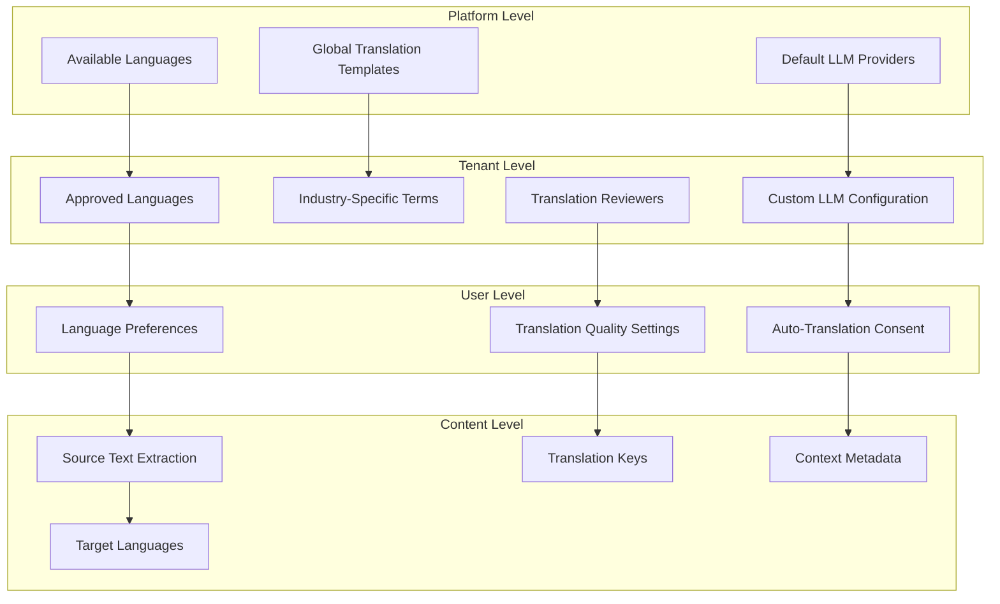
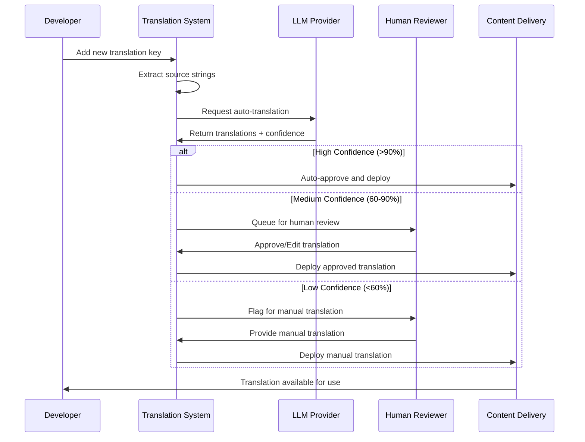

# 🌍 itellico Mono - Translation Management System

## 📋 Overview

The itellico Mono implements a **comprehensive multi-language translation system** designed to support global creative industries with **LLM-powered automation** and **human quality assurance**. The system supports **hierarchical language configuration** from platform to user level with **real-time translation workflows**.

### **Key Features**

- **🤖 LLM-Powered Auto-Translation:** Context-aware translation with multiple provider support
- **👥 Human Review Workflow:** Quality assurance with translation approval process
- **🏢 Multi-Level Configuration:** Platform → Tenant → User language settings
- **📊 Quality Scoring:** Confidence metrics and translation quality tracking
- **🔄 Real-Time Updates:** Live translation status and progress tracking
- **📁 Version Control:** Translation history and rollback capabilities

---

## 🏗️ System Architecture

### **Translation Hierarchy**



### **Translation Pipeline**



---

## 🔧 Technical Implementation

### **Database Schema**

```sql
-- Platform-level language configuration
CREATE TABLE supported_languages (
    id SERIAL PRIMARY KEY,
    code VARCHAR(10) UNIQUE NOT NULL, -- 'en-US', 'es-ES', 'fr-FR'
    name VARCHAR(100) NOT NULL,
    native_name VARCHAR(100) NOT NULL,
    rtl BOOLEAN DEFAULT FALSE,
    enabled BOOLEAN DEFAULT TRUE,
    created_at TIMESTAMP DEFAULT NOW()
);

-- Tenant language settings
CREATE TABLE tenant_language_settings (
    id SERIAL PRIMARY KEY,
    tenant_id INTEGER REFERENCES tenants(id) ON DELETE CASCADE,
    language_code VARCHAR(10) REFERENCES supported_languages(code),
    is_default BOOLEAN DEFAULT FALSE,
    enabled BOOLEAN DEFAULT TRUE,
    auto_translate_enabled BOOLEAN DEFAULT TRUE,
    human_review_required BOOLEAN DEFAULT FALSE,
    created_at TIMESTAMP DEFAULT NOW(),
    
    UNIQUE(tenant_id, language_code)
);

-- Translation strings and metadata
CREATE TABLE translation_strings (
    id SERIAL PRIMARY KEY,
    tenant_id INTEGER REFERENCES tenants(id) ON DELETE CASCADE,
    key VARCHAR(500) NOT NULL,
    namespace VARCHAR(100) DEFAULT 'common',
    source_language VARCHAR(10) DEFAULT 'en-US',
    source_text TEXT NOT NULL,
    context TEXT, -- Additional context for translators
    pluralization_rules JSONB, -- For complex plural forms
    variables JSONB, -- Variable placeholders in the text
    created_at TIMESTAMP DEFAULT NOW(),
    updated_at TIMESTAMP DEFAULT NOW(),
    
    UNIQUE(tenant_id, key, namespace)
);

-- Translation entries for each language
CREATE TABLE translations (
    id SERIAL PRIMARY KEY,
    string_id INTEGER REFERENCES translation_strings(id) ON DELETE CASCADE,
    language_code VARCHAR(10) REFERENCES supported_languages(code),
    translated_text TEXT NOT NULL,
    translation_method ENUM('manual', 'llm_auto', 'llm_assisted') NOT NULL,
    confidence_score FLOAT CHECK (confidence_score >= 0 AND confidence_score <= 1),
    status ENUM('pending', 'approved', 'rejected', 'needs_review') DEFAULT 'pending',
    translated_by INTEGER REFERENCES users(id),
    reviewed_by INTEGER REFERENCES users(id),
    llm_provider VARCHAR(50), -- 'openai', 'anthropic', 'google'
    llm_model VARCHAR(100),
    translation_notes TEXT,
    created_at TIMESTAMP DEFAULT NOW(),
    updated_at TIMESTAMP DEFAULT NOW(),
    
    UNIQUE(string_id, language_code)
);

-- Translation quality metrics
CREATE TABLE translation_quality_metrics (
    id SERIAL PRIMARY KEY,
    translation_id INTEGER REFERENCES translations(id) ON DELETE CASCADE,
    metric_type VARCHAR(50) NOT NULL, -- 'fluency', 'accuracy', 'consistency'
    score FLOAT CHECK (score >= 0 AND score <= 1),
    calculated_at TIMESTAMP DEFAULT NOW()
);

-- LLM provider configuration per tenant
CREATE TABLE tenant_llm_translation_config (
    id SERIAL PRIMARY KEY,
    tenant_id INTEGER REFERENCES tenants(id) ON DELETE CASCADE,
    provider_name VARCHAR(50) NOT NULL, -- 'openai', 'anthropic', 'google'
    api_key_encrypted TEXT, -- Encrypted API key
    model_name VARCHAR(100),
    max_tokens INTEGER DEFAULT 1000,
    temperature FLOAT DEFAULT 0.3,
    custom_prompts JSONB, -- Custom translation prompts
    enabled BOOLEAN DEFAULT TRUE,
    priority INTEGER DEFAULT 1, -- Provider preference order
    created_at TIMESTAMP DEFAULT NOW(),
    
    UNIQUE(tenant_id, provider_name)
);

-- Indexes for performance
CREATE INDEX idx_translation_strings_tenant_key ON translation_strings(tenant_id, key);
CREATE INDEX idx_translations_string_language ON translations(string_id, language_code);
CREATE INDEX idx_translations_status ON translations(status);
CREATE INDEX idx_tenant_language_settings_tenant ON tenant_language_settings(tenant_id);
```

### **Service Layer Implementation**

```typescript
// Translation Management Service
export class TranslationService {
  constructor(private tenantId: number) {}

  /**
   * Extract translatable strings from source code
   */
  async extractStringsFromSource(filePaths: string[]): Promise<TranslationString[]> {
    const extractedStrings: TranslationString[] = [];
    
    for (const filePath of filePaths) {
      const content = await fs.readFile(filePath, 'utf8');
      
      // Extract t('key') patterns
      const tFunctionRegex = /t\(['"`]([^'"`]+)['"`]\)/g;
      const matches = [...content.matchAll(tFunctionRegex)];
      
      for (const match of matches) {
        const key = match[1];
        const context = this.extractContext(content, match.index!);
        
        extractedStrings.push({
          tenantId: this.tenantId,
          key,
          namespace: this.getNamespaceFromPath(filePath),
          sourceText: key, // Default to key, can be overridden
          context,
        });
      }
    }
    
    return this.deduplicateStrings(extractedStrings);
  }

  /**
   * Auto-translate using LLM providers
   */
  async autoTranslate(
    stringId: number,
    targetLanguages: string[]
  ): Promise<Translation[]> {
    const sourceString = await this.getTranslationString(stringId);
    const llmConfig = await this.getLLMConfig();
    const translations: Translation[] = [];

    for (const targetLang of targetLanguages) {
      try {
        const translation = await this.callLLMProvider(
          sourceString,
          targetLang,
          llmConfig
        );
        
        translations.push({
          stringId,
          languageCode: targetLang,
          translatedText: translation.text,
          translationMethod: 'llm_auto',
          confidenceScore: translation.confidence,
          status: translation.confidence > 0.9 ? 'approved' : 'needs_review',
          llmProvider: llmConfig.provider,
          llmModel: llmConfig.model,
        });
      } catch (error) {
        console.error(`Translation failed for ${targetLang}:`, error);
        
        // Create pending translation for manual review
        translations.push({
          stringId,
          languageCode: targetLang,
          translatedText: sourceString.sourceText, // Fallback to source
          translationMethod: 'manual',
          confidenceScore: 0,
          status: 'needs_review',
        });
      }
    }

    return await this.saveTranslations(translations);
  }

  /**
   * Call LLM provider for translation
   */
  private async callLLMProvider(
    sourceString: TranslationString,
    targetLanguage: string,
    config: LLMConfig
  ): Promise<{ text: string; confidence: number }> {
    const prompt = this.buildTranslationPrompt(
      sourceString,
      targetLanguage,
      config.customPrompts
    );

    switch (config.provider) {
      case 'openai':
        return await this.callOpenAI(prompt, config);
      case 'anthropic':
        return await this.callAnthropic(prompt, config);
      case 'google':
        return await this.callGoogleTranslate(prompt, config);
      default:
        throw new Error(`Unsupported LLM provider: ${config.provider}`);
    }
  }

  /**
   * Build context-aware translation prompt
   */
  private buildTranslationPrompt(
    sourceString: TranslationString,
    targetLanguage: string,
    customPrompts?: Record<string, string>
  ): string {
    const basePrompt = customPrompts?.translation || `
You are a professional translator specializing in creative industry terminology.
Translate the following text from English to ${targetLanguage}.

Context: ${sourceString.context || 'General application text'}
Namespace: ${sourceString.namespace}
Variables: ${JSON.stringify(sourceString.variables || {})}

Text to translate: "${sourceString.sourceText}"

Requirements:
1. Maintain the same tone and style
2. Preserve any variable placeholders (e.g., {{name}}, {count})
3. Consider the creative industry context
4. Ensure cultural appropriateness
5. Keep technical terms consistent

Provide only the translation without explanations.
`;

    return basePrompt.trim();
  }

  /**
   * Human review workflow
   */
  async submitForReview(translationId: number, reviewerId: number): Promise<void> {
    await db.translation.update({
      where: { id: translationId },
      data: {
        status: 'needs_review',
        reviewedBy: reviewerId,
        updatedAt: new Date(),
      },
    });

    // Notify reviewer
    await this.notifyReviewer(translationId, reviewerId);
  }

  /**
   * Approve translation
   */
  async approveTranslation(
    translationId: number,
    reviewerId: number,
    edits?: string
  ): Promise<void> {
    const updateData: any = {
      status: 'approved',
      reviewedBy: reviewerId,
      updatedAt: new Date(),
    };

    if (edits) {
      updateData.translatedText = edits;
      updateData.translationMethod = 'llm_assisted';
    }

    await db.translation.update({
      where: { id: translationId },
      data: updateData,
    });

    // Invalidate translation cache
    await this.invalidateTranslationCache(translationId);
    
    // Generate new translation files
    await this.generateTranslationFiles();
  }

  /**
   * Generate JSON translation files for deployment
   */
  async generateTranslationFiles(): Promise<void> {
    const languages = await this.getTenantLanguages();
    
    for (const language of languages) {
      const translations = await this.getApprovedTranslations(language.code);
      const translationsByNamespace = this.groupByNamespace(translations);
      
      for (const [namespace, translations] of Object.entries(translationsByNamespace)) {
        const filePath = `public/locales/${language.code}/${namespace}.json`;
        const content = this.formatTranslationFile(translations);
        
        await fs.writeFile(filePath, JSON.stringify(content, null, 2));
        
        // Upload to CDN
        await this.uploadToCDN(filePath, language.code, namespace);
      }
    }
  }

  /**
   * Quality scoring for translations
   */
  async calculateQualityScore(translationId: number): Promise<number> {
    const translation = await this.getTranslation(translationId);
    const metrics = [];

    // Fluency score (LLM-based)
    const fluencyScore = await this.assessFluency(translation);
    metrics.push({ type: 'fluency', score: fluencyScore });

    // Accuracy score (compared to reference)
    const accuracyScore = await this.assessAccuracy(translation);
    metrics.push({ type: 'accuracy', score: accuracyScore });

    // Consistency score (compared to existing translations)
    const consistencyScore = await this.assessConsistency(translation);
    metrics.push({ type: 'consistency', score: consistencyScore });

    // Save metrics
    await this.saveQualityMetrics(translationId, metrics);

    // Calculate weighted average
    const overallScore = metrics.reduce((sum, metric) => sum + metric.score, 0) / metrics.length;
    
    return overallScore;
  }
}
```

### **Frontend Translation Hook**

```typescript
// Translation hook with cache management
export function useTranslation(namespace: string = 'common') {
  const { locale } = useRouter();
  const [translations, setTranslations] = useState<Record<string, string>>({});
  const [isLoading, setIsLoading] = useState(true);

  useEffect(() => {
    loadTranslations(locale, namespace)
      .then(setTranslations)
      .finally(() => setIsLoading(false));
  }, [locale, namespace]);

  const t = useCallback(
    (key: string, variables?: Record<string, any>): string => {
      const translation = translations[key] || key;
      
      if (!variables) return translation;
      
      // Replace variables in translation
      return Object.entries(variables).reduce(
        (text, [variable, value]) =>
          text.replace(new RegExp(`{{${variable}}}`, 'g'), String(value)),
        translation
      );
    },
    [translations]
  );

  return { t, isLoading, locale };
}

// Translation management hook for admin
export function useTranslationManagement(tenantId: number) {
  const queryClient = useQueryClient();

  const { data: translationStrings, isLoading } = useQuery({
    queryKey: ['translation-strings', tenantId],
    queryFn: () => fetchTranslationStrings(tenantId),
  });

  const autoTranslateMutation = useMutation({
    mutationFn: (data: { stringId: number; targetLanguages: string[] }) =>
      autoTranslateString(tenantId, data.stringId, data.targetLanguages),
    onSuccess: () => {
      queryClient.invalidateQueries({ queryKey: ['translation-strings', tenantId] });
    },
  });

  const approveTranslationMutation = useMutation({
    mutationFn: (data: { translationId: number; edits?: string }) =>
      approveTranslation(tenantId, data.translationId, data.edits),
    onSuccess: () => {
      queryClient.invalidateQueries({ queryKey: ['translation-strings', tenantId] });
    },
  });

  return {
    translationStrings,
    isLoading,
    autoTranslate: autoTranslateMutation.mutate,
    approveTranslation: approveTranslationMutation.mutate,
    isAutoTranslating: autoTranslateMutation.isPending,
    isApproving: approveTranslationMutation.isPending,
  };
}
```

---

## 🎨 Admin Interface Components

### **Translation Management Dashboard**

```typescript
// Translation management interface
export function TranslationManagementDashboard({ tenantId }: { tenantId: number }) {
  const [selectedLanguage, setSelectedLanguage] = useState<string>('');
  const [statusFilter, setStatusFilter] = useState<TranslationStatus>('all');
  
  const {
    translationStrings,
    isLoading,
    autoTranslate,
    approveTranslation,
  } = useTranslationManagement(tenantId);

  const { data: languages } = useQuery({
    queryKey: ['tenant-languages', tenantId],
    queryFn: () => fetchTenantLanguages(tenantId),
  });

  const filteredStrings = useMemo(() => {
    return translationStrings?.filter(string => {
      if (selectedLanguage && !string.translations.some(t => t.languageCode === selectedLanguage)) {
        return false;
      }
      if (statusFilter !== 'all') {
        return string.translations.some(t => t.status === statusFilter);
      }
      return true;
    });
  }, [translationStrings, selectedLanguage, statusFilter]);

  return (
    <div className="space-y-6">
      <div className="flex justify-between items-center">
        <h1 className="text-3xl font-bold">Translation Management</h1>
        <div className="flex space-x-4">
          <Select value={selectedLanguage} onValueChange={setSelectedLanguage}>
            <SelectTrigger className="w-48">
              <SelectValue placeholder="Filter by language" />
            </SelectTrigger>
            <SelectContent>
              <SelectItem value="">All Languages</SelectItem>
              {languages?.map(lang => (
                <SelectItem key={lang.code} value={lang.code}>
                  {lang.name}
                </SelectItem>
              ))}
            </SelectContent>
          </Select>
          
          <Select value={statusFilter} onValueChange={setStatusFilter}>
            <SelectTrigger className="w-48">
              <SelectValue placeholder="Filter by status" />
            </SelectTrigger>
            <SelectContent>
              <SelectItem value="all">All Status</SelectItem>
              <SelectItem value="pending">Pending</SelectItem>
              <SelectItem value="needs_review">Needs Review</SelectItem>
              <SelectItem value="approved">Approved</SelectItem>
              <SelectItem value="rejected">Rejected</SelectItem>
            </SelectContent>
          </Select>
        </div>
      </div>

      <TranslationStats tenantId={tenantId} />

      <Card>
        <CardHeader>
          <CardTitle>Translation Strings</CardTitle>
        </CardHeader>
        <CardContent>
          {isLoading ? (
            <TranslationsSkeleton />
          ) : (
            <div className="space-y-4">
              {filteredStrings?.map(string => (
                <TranslationStringCard
                  key={string.id}
                  translationString={string}
                  onAutoTranslate={autoTranslate}
                  onApprove={approveTranslation}
                />
              ))}
            </div>
          )}
        </CardContent>
      </Card>
    </div>
  );
}
```

### **Translation String Card**

```typescript
// Individual translation string management
interface TranslationStringCardProps {
  translationString: TranslationString;
  onAutoTranslate: (stringId: number, languages: string[]) => void;
  onApprove: (translationId: number, edits?: string) => void;
}

export function TranslationStringCard({
  translationString,
  onAutoTranslate,
  onApprove,
}: TranslationStringCardProps) {
  const [editingTranslation, setEditingTranslation] = useState<number | null>(null);
  const [editValue, setEditValue] = useState('');

  const handleStartEdit = (translationId: number, currentText: string) => {
    setEditingTranslation(translationId);
    setEditValue(currentText);
  };

  const handleSaveEdit = () => {
    if (editingTranslation) {
      onApprove(editingTranslation, editValue);
      setEditingTranslation(null);
      setEditValue('');
    }
  };

  return (
    <Card>
      <CardHeader>
        <div className="flex justify-between items-start">
          <div>
            <CardTitle className="text-lg">{translationString.key}</CardTitle>
            <p className="text-sm text-muted-foreground mt-1">
              {translationString.namespace} • {translationString.sourceText}
            </p>
            {translationString.context && (
              <p className="text-xs text-muted-foreground mt-2">
                <strong>Context:</strong> {translationString.context}
              </p>
            )}
          </div>
          <Button
            size="sm"
            onClick={() => onAutoTranslate(translationString.id, ['es-ES', 'fr-FR', 'de-DE'])}
          >
            Auto Translate
          </Button>
        </div>
      </CardHeader>
      <CardContent>
        <div className="space-y-4">
          {translationString.translations.map(translation => (
            <div key={translation.id} className="border rounded-lg p-4">
              <div className="flex justify-between items-start mb-2">
                <div className="flex items-center space-x-2">
                  <Badge variant={getStatusVariant(translation.status)}>
                    {translation.status}
                  </Badge>
                  <span className="text-sm font-medium">
                    {translation.languageCode}
                  </span>
                  {translation.confidenceScore && (
                    <Badge variant="outline">
                      {Math.round(translation.confidenceScore * 100)}% confidence
                    </Badge>
                  )}
                </div>
                <div className="flex space-x-2">
                  {translation.status === 'needs_review' && (
                    <>
                      <Button
                        size="sm"
                        variant="outline"
                        onClick={() => handleStartEdit(translation.id, translation.translatedText)}
                      >
                        Edit
                      </Button>
                      <Button
                        size="sm"
                        onClick={() => onApprove(translation.id)}
                      >
                        Approve
                      </Button>
                    </>
                  )}
                </div>
              </div>
              
              {editingTranslation === translation.id ? (
                <div className="space-y-2">
                  <Textarea
                    value={editValue}
                    onChange={(e) => setEditValue(e.target.value)}
                    className="min-h-[100px]"
                  />
                  <div className="flex space-x-2">
                    <Button size="sm" onClick={handleSaveEdit}>
                      Save
                    </Button>
                    <Button
                      size="sm"
                      variant="outline"
                      onClick={() => setEditingTranslation(null)}
                    >
                      Cancel
                    </Button>
                  </div>
                </div>
              ) : (
                <p className="text-sm">{translation.translatedText}</p>
              )}
              
              {translation.translationNotes && (
                <p className="text-xs text-muted-foreground mt-2">
                  <strong>Notes:</strong> {translation.translationNotes}
                </p>
              )}
            </div>
          ))}
        </div>
      </CardContent>
    </Card>
  );
}
```

---

## 🔧 LLM Provider Integration

### **Multi-Provider Support**

```typescript
// Abstract LLM provider interface
export interface LLMTranslationProvider {
  translate(
    text: string,
    sourceLanguage: string,
    targetLanguage: string,
    context?: string
  ): Promise<LLMTranslationResult>;
  
  assessQuality(
    originalText: string,
    translatedText: string,
    targetLanguage: string
  ): Promise<number>;
}

export interface LLMTranslationResult {
  translatedText: string;
  confidence: number;
  metadata?: Record<string, any>;
}

// OpenAI implementation
export class OpenAITranslationProvider implements LLMTranslationProvider {
  constructor(private config: OpenAIConfig) {}

  async translate(
    text: string,
    sourceLanguage: string,
    targetLanguage: string,
    context?: string
  ): Promise<LLMTranslationResult> {
    const prompt = this.buildPrompt(text, sourceLanguage, targetLanguage, context);
    
    const response = await fetch('https://api.openai.com/v1/chat/completions', {
      method: 'POST',
      headers: {
        'Authorization': `Bearer ${this.config.apiKey}`,
        'Content-Type': 'application/json',
      },
      body: JSON.stringify({
        model: this.config.model || 'gpt-4',
        messages: [{ role: 'user', content: prompt }],
        temperature: this.config.temperature || 0.3,
        max_tokens: this.config.maxTokens || 1000,
      }),
    });

    const result = await response.json();
    const translatedText = result.choices[0].message.content.trim();
    
    // Calculate confidence based on response metadata
    const confidence = this.calculateConfidence(result);

    return {
      translatedText,
      confidence,
      metadata: {
        usage: result.usage,
        model: this.config.model,
      },
    };
  }

  async assessQuality(
    originalText: string,
    translatedText: string,
    targetLanguage: string
  ): Promise<number> {
    const prompt = `
Rate the quality of this translation from 0.0 to 1.0:

Original: "${originalText}"
Translation: "${translatedText}"
Target Language: ${targetLanguage}

Consider accuracy, fluency, and cultural appropriateness.
Respond only with a number between 0.0 and 1.0.
`;

    const response = await fetch('https://api.openai.com/v1/chat/completions', {
      method: 'POST',
      headers: {
        'Authorization': `Bearer ${this.config.apiKey}`,
        'Content-Type': 'application/json',
      },
      body: JSON.stringify({
        model: 'gpt-3.5-turbo',
        messages: [{ role: 'user', content: prompt }],
        temperature: 0.1,
        max_tokens: 10,
      }),
    });

    const result = await response.json();
    return parseFloat(result.choices[0].message.content.trim());
  }

  private buildPrompt(
    text: string,
    sourceLanguage: string,
    targetLanguage: string,
    context?: string
  ): string {
    return `
You are a professional translator specializing in creative industry content.

Translate the following text from ${sourceLanguage} to ${targetLanguage}:
"${text}"

${context ? `Context: ${context}` : ''}

Requirements:
- Maintain the original tone and style
- Preserve any placeholder variables (e.g., {{name}})
- Use industry-appropriate terminology
- Ensure cultural sensitivity
- Provide only the translation, no explanations

Translation:`;
  }

  private calculateConfidence(apiResponse: any): number {
    // Implement confidence calculation based on:
    // - Response metadata
    // - Token usage efficiency
    // - Model certainty indicators
    const baseConfidence = 0.8;
    
    if (apiResponse.usage?.total_tokens > 500) {
      return Math.max(0.5, baseConfidence - 0.1);
    }
    
    return baseConfidence;
  }
}

// Anthropic implementation
export class AnthropicTranslationProvider implements LLMTranslationProvider {
  constructor(private config: AnthropicConfig) {}

  async translate(
    text: string,
    sourceLanguage: string,
    targetLanguage: string,
    context?: string
  ): Promise<LLMTranslationResult> {
    // Similar implementation for Anthropic Claude
    // ... implementation details
  }

  async assessQuality(): Promise<number> {
    // Quality assessment using Claude
    // ... implementation details
  }
}

// Provider factory
export class LLMTranslationFactory {
  static createProvider(config: LLMConfig): LLMTranslationProvider {
    switch (config.provider) {
      case 'openai':
        return new OpenAITranslationProvider(config);
      case 'anthropic':
        return new AnthropicTranslationProvider(config);
      case 'google':
        return new GoogleTranslationProvider(config);
      default:
        throw new Error(`Unsupported LLM provider: ${config.provider}`);
    }
  }
}
```

---

## 📊 Quality Assurance & Metrics

### **Translation Quality Dashboard**

```typescript
// Quality metrics component
export function TranslationQualityDashboard({ tenantId }: { tenantId: number }) {
  const { data: qualityMetrics } = useQuery({
    queryKey: ['translation-quality', tenantId],
    queryFn: () => fetchTranslationQualityMetrics(tenantId),
  });

  const { data: providerStats } = useQuery({
    queryKey: ['llm-provider-stats', tenantId],
    queryFn: () => fetchLLMProviderStats(tenantId),
  });

  return (
    <div className="grid grid-cols-1 md:grid-cols-2 lg:grid-cols-3 gap-6">
      <Card>
        <CardHeader>
          <CardTitle>Overall Quality Score</CardTitle>
        </CardHeader>
        <CardContent>
          <div className="text-3xl font-bold">
            {(qualityMetrics?.overallScore * 100).toFixed(1)}%
          </div>
          <p className="text-muted-foreground">
            Average across all translations
          </p>
        </CardContent>
      </Card>

      <Card>
        <CardHeader>
          <CardTitle>Auto-Translation Success Rate</CardTitle>
        </CardHeader>
        <CardContent>
          <div className="text-3xl font-bold">
            {(qualityMetrics?.autoApprovalRate * 100).toFixed(1)}%
          </div>
          <p className="text-muted-foreground">
            High-confidence auto-approvals
          </p>
        </CardContent>
      </Card>

      <Card>
        <CardHeader>
          <CardTitle>Human Review Queue</CardTitle>
        </CardHeader>
        <CardContent>
          <div className="text-3xl font-bold">
            {qualityMetrics?.pendingReviews || 0}
          </div>
          <p className="text-muted-foreground">
            Translations awaiting review
          </p>
        </CardContent>
      </Card>

      <Card className="md:col-span-2">
        <CardHeader>
          <CardTitle>Quality by Language</CardTitle>
        </CardHeader>
        <CardContent>
          <div className="space-y-4">
            {qualityMetrics?.byLanguage?.map(lang => (
              <div key={lang.code} className="flex items-center justify-between">
                <span className="font-medium">{lang.name}</span>
                <div className="flex items-center space-x-2">
                  <div className="w-32 bg-muted rounded-full h-2">
                    <div
                      className="bg-primary h-2 rounded-full"
                      style={{ width: `${lang.qualityScore * 100}%` }}
                    />
                  </div>
                  <span className="text-sm text-muted-foreground">
                    {(lang.qualityScore * 100).toFixed(1)}%
                  </span>
                </div>
              </div>
            ))}
          </div>
        </CardContent>
      </Card>

      <Card>
        <CardHeader>
          <CardTitle>LLM Provider Performance</CardTitle>
        </CardHeader>
        <CardContent>
          <div className="space-y-3">
            {providerStats?.map(provider => (
              <div key={provider.name} className="flex justify-between items-center">
                <span className="font-medium">{provider.name}</span>
                <div className="text-right">
                  <div className="text-sm font-medium">
                    {(provider.avgConfidence * 100).toFixed(1)}%
                  </div>
                  <div className="text-xs text-muted-foreground">
                    {provider.totalTranslations} translations
                  </div>
                </div>
              </div>
            ))}
          </div>
        </CardContent>
      </Card>
    </div>
  );
}
```

---

## 🚀 Deployment & CDN Integration

### **Translation File Generation**

```typescript
// Generate and deploy translation files
export class TranslationDeploymentService {
  constructor(private tenantId: number) {}

  async deployTranslations(): Promise<void> {
    const languages = await this.getTenantLanguages();
    const deploymentResults = [];

    for (const language of languages) {
      const result = await this.deployLanguage(language.code);
      deploymentResults.push(result);
    }

    await this.updateDeploymentStatus(deploymentResults);
    await this.invalidateCDNCache();
  }

  private async deployLanguage(languageCode: string): Promise<DeploymentResult> {
    try {
      // Get approved translations
      const translations = await this.getApprovedTranslations(languageCode);
      const translationsByNamespace = this.groupByNamespace(translations);

      const fileResults = [];

      for (const [namespace, namespaceTranslations] of Object.entries(translationsByNamespace)) {
        // Generate JSON file
        const content = this.formatTranslationFile(namespaceTranslations);
        const fileName = `${languageCode}/${namespace}.json`;
        
        // Upload to CDN
        const cdnUrl = await this.uploadToCDN(fileName, content);
        
        fileResults.push({
          namespace,
          fileName,
          cdnUrl,
          translationCount: Object.keys(namespaceTranslations).length,
        });
      }

      return {
        languageCode,
        success: true,
        files: fileResults,
        deployedAt: new Date(),
      };
    } catch (error) {
      return {
        languageCode,
        success: false,
        error: error.message,
        deployedAt: new Date(),
      };
    }
  }

  private formatTranslationFile(translations: Record<string, string>): string {
    // Create nested object structure from dot-notation keys
    const nested = {};
    
    for (const [key, value] of Object.entries(translations)) {
      this.setNestedValue(nested, key, value);
    }

    return JSON.stringify(nested, null, 2);
  }

  private setNestedValue(obj: any, path: string, value: string): void {
    const keys = path.split('.');
    let current = obj;

    for (let i = 0; i < keys.length - 1; i++) {
      const key = keys[i];
      if (!(key in current)) {
        current[key] = {};
      }
      current = current[key];
    }

    current[keys[keys.length - 1]] = value;
  }

  private async uploadToCDN(fileName: string, content: string): Promise<string> {
    // Upload to S3/CloudFlare/etc.
    const buffer = Buffer.from(content, 'utf8');
    
    const uploadResult = await this.s3Client.upload({
      Bucket: 'translations-cdn',
      Key: `${this.tenantId}/${fileName}`,
      Body: buffer,
      ContentType: 'application/json',
      CacheControl: 'public, max-age=3600', // 1 hour cache
    }).promise();

    return uploadResult.Location;
  }

  private async invalidateCDNCache(): Promise<void> {
    // Invalidate CDN cache for updated translation files
    await this.cdnService.invalidate([
      `/translations/${this.tenantId}/*`
    ]);
  }
}
```

---

## 🔧 Implementation Checklist

### **Phase 1: Foundation (Week 1-2)**
- [ ] **Database Schema:** Create translation tables with proper indexes
- [ ] **Basic Service Layer:** Translation CRUD operations
- [ ] **String Extraction:** Automated extraction from source code
- [ ] **Simple Admin Interface:** Basic translation management

### **Phase 2: LLM Integration (Week 3-4)**
- [ ] **LLM Provider Setup:** OpenAI/Anthropic integration
- [ ] **Auto-Translation Pipeline:** Automated translation workflow
- [ ] **Confidence Scoring:** Quality assessment system
- [ ] **Review Workflow:** Human approval process

### **Phase 3: Advanced Features (Week 5-6)**
- [ ] **Multi-Provider Support:** Multiple LLM provider options
- [ ] **Quality Metrics:** Comprehensive quality tracking
- [ ] **CDN Deployment:** Automated file generation and upload
- [ ] **Real-Time Updates:** Live translation status updates

### **Phase 4: Optimization (Week 7-8)**
- [ ] **Performance Tuning:** Optimize translation processing
- [ ] **Cache Management:** Translation cache invalidation
- [ ] **Monitoring Dashboard:** Quality and usage analytics
- [ ] **Documentation:** Complete API and usage documentation

---

## 📊 Success Metrics

### **Quality Targets**
- **Auto-Translation Accuracy:** >85% for high-confidence translations
- **Human Review Efficiency:** <2 hours average review time
- **Translation Coverage:** 100% of UI strings in all supported languages
- **Quality Score:** >90% average quality rating

### **Performance Targets**
- **Translation Speed:** <5 seconds for auto-translation
- **File Generation:** <30 seconds for full deployment
- **CDN Update:** <1 minute propagation time
- **API Response:** <100ms for translation lookups

### **Business Impact**
- **Time Savings:** 80% reduction in manual translation time
- **Cost Efficiency:** 60% reduction in translation costs
- **Quality Consistency:** Standardized terminology across languages
- **User Experience:** Seamless multi-language support

---

**Last Updated:** January 13, 2025  
**Version:** 1.0.0  
**Status:** Architecture Complete - Ready for Implementation

This translation management system provides enterprise-grade multi-language support with automated workflows and quality assurance, designed to scale with the itellico Mono's global expansion.