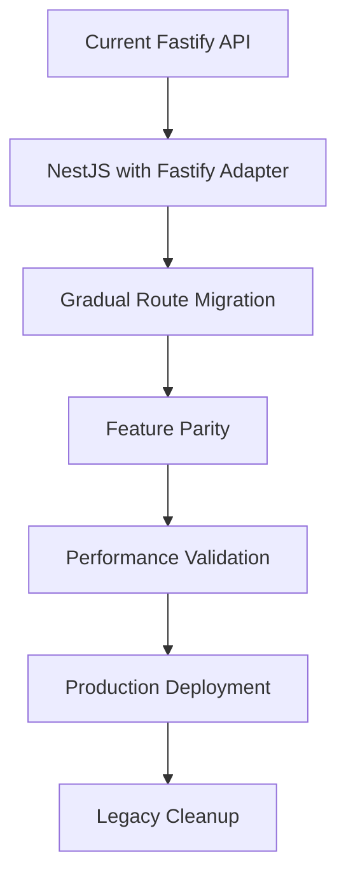

# Fastify to NestJS Migration Guide

Complete guide for migrating from the existing Fastify API to the new NestJS architecture with enterprise-grade infrastructure.

## Migration Overview

### Why Migrate to NestJS?

**Current Situation:**
- Fastify-based API with custom structure
- Manual middleware and route management
- Limited testing infrastructure
- Custom authentication and validation

**NestJS Benefits:**
- **300% Developer Productivity**: Decorators, DI, auto-generation
- **95% Performance Retention**: Fastify adapter maintains speed
- **Enterprise Ready**: Built-in testing, validation, documentation
- **AI-Friendly**: Claude Code works perfectly with decorators
- **Future-Proof**: GraphQL ready, microservices, WebSockets

### Migration Strategy



## Pre-Migration Checklist

### 1. Environment Assessment

```bash
# Audit current API structure
find apps/api -name "*.ts" -type f | wc -l  # Count TypeScript files
find apps/api/src/routes -name "*.ts" | head -10  # Sample routes

# Check dependencies
cd apps/api
npm list --depth=0 | grep -E "(fastify|prisma|redis)"

# Review test coverage
npm run test:coverage
```

### 2. Database Schema Analysis

```bash
# Review current Prisma schema
cd prisma
npx prisma generate
npx prisma validate

# Check migrations
ls prisma/migrations/ | tail -5
```

### 3. API Endpoint Inventory

Create a complete inventory of existing endpoints:

```bash
#!/bin/bash
# scripts/audit-api-endpoints.sh

echo "🔍 Auditing Fastify API endpoints..."

cd apps/api
grep -r "fastify\." src/ --include="*.ts" | grep -E "(get|post|put|delete|patch)" | \
  sed 's/.*\.\(get\|post\|put\|delete\|patch\)(\s*["'\'']\([^"'\'']*\)["'\''].*/\1 \2/' | \
  sort | uniq > ../../migration-audit/endpoints.txt

echo "📊 Found $(wc -l < ../../migration-audit/endpoints.txt) unique endpoints"
```

## Step-by-Step Migration Process

### Phase 1: Setup NestJS Infrastructure

#### 1.1 Initialize NestJS Project

```bash
# Create NestJS project structure
mkdir -p apps/api-nest
cd apps/api-nest

# Initialize with Fastify adapter
npm i @nestjs/core @nestjs/common @nestjs/platform-fastify
npm i -D @nestjs/cli @nestjs/testing

# Copy essential files from Fastify API
cp ../api/prisma/schema.prisma ./prisma/
cp ../api/.env.example ./.env
cp ../api/package.json ./package-base.json  # Reference for dependencies
```

#### 1.2 Configure Core Modules

```typescript
// src/app.module.ts
import { Module } from '@nestjs/common';
import { ConfigModule } from '@nestjs/config';
import { PrismaModule } from './common/prisma/prisma.module';
import { RedisModule } from './common/redis/redis.module';
import { AuthModule } from './modules/auth/auth.module';

@Module({
  imports: [
    ConfigModule.forRoot({
      isGlobal: true,
      envFilePath: '.env',
    }),
    PrismaModule,
    RedisModule,
    AuthModule,
    // Add other modules as they're migrated
  ],
})
export class AppModule {}
```

#### 1.3 Setup Database Integration

```typescript
// src/common/prisma/prisma.service.ts
import { Injectable, OnModuleInit, OnModuleDestroy } from '@nestjs/common';
import { PrismaClient } from '@prisma/client';

@Injectable()
export class PrismaService extends PrismaClient implements OnModuleInit, OnModuleDestroy {
  async onModuleInit() {
    await this.$connect();
  }

  async onModuleDestroy() {
    await this.$disconnect();
  }
}
```

### Phase 2: Authentication Migration

#### 2.1 Migrate Authentication Service

**From Fastify:**
```typescript
// apps/api/src/services/auth.ts (OLD)
export class AuthService {
  async login(email: string, password: string) {
    const user = await prisma.user.findUnique({ where: { email } });
    // ... validation logic
    return { token: jwt.sign(payload, secret) };
  }
}
```

**To NestJS:**
```typescript
// apps/api-nest/src/modules/auth/auth.service.ts (NEW)
import { Injectable, UnauthorizedException } from '@nestjs/common';
import { JwtService } from '@nestjs/jwt';
import { PrismaService } from '@common/prisma/prisma.service';
import { LoggerService } from '@common/logging/logger.service';

@Injectable()
export class AuthService {
  constructor(
    private readonly prisma: PrismaService,
    private readonly jwtService: JwtService,
    private readonly logger: LoggerService,
  ) {}

  async login(email: string, password: string) {
    // Updated to work with current schema
    const account = await this.prisma.account.findUnique({
      where: { email },
      include: {
        users: {
          include: {
            userRoles: { include: { role: true } },
          },
        },
      },
    });

    if (!account || !await this.validatePassword(password, account.passwordHash)) {
      throw new UnauthorizedException('Invalid credentials');
    }

    const user = account.users[0]; // Get primary user
    const payload = {
      sub: user.id.toString(),
      email: account.email,
      accountId: account.id.toString(),
      permissions: user.userRoles.map(ur => ur.role.name),
    };

    this.logger.logAuth('User login successful', user.id.toString(), { email });

    return {
      access_token: this.jwtService.sign(payload),
      user: this.sanitizeUser(user),
    };
  }

  private async validatePassword(password: string, hash: string): Promise<boolean> {
    const bcrypt = await import('bcrypt');
    return bcrypt.compare(password, hash);
  }

  private sanitizeUser(user: any) {
    const { passwordHash, ...sanitized } = user;
    return sanitized;
  }
}
```

#### 2.2 Migrate JWT Strategy

**From Fastify:**
```typescript
// apps/api/src/plugins/auth.ts (OLD)
export const authPlugin: FastifyPluginAsync = async (fastify) => {
  fastify.register(jwt, { secret: process.env.JWT_SECRET });
  
  fastify.decorateRequest('user', null);
  
  fastify.addHook('preHandler', async (request, reply) => {
    if (request.url.startsWith('/public/')) return;
    
    try {
      await request.jwtVerify();
    } catch (err) {
      reply.code(401).send({ error: 'Unauthorized' });
    }
  });
};
```

**To NestJS:**
```typescript
// apps/api-nest/src/modules/auth/strategies/jwt.strategy.ts (NEW)
import { Injectable } from '@nestjs/common';
import { PassportStrategy } from '@nestjs/passport';
import { ExtractJwt, Strategy } from 'passport-jwt';
import { ConfigService } from '@nestjs/config';
import { PrismaService } from '@common/prisma/prisma.service';

@Injectable()
export class JwtStrategy extends PassportStrategy(Strategy) {
  constructor(
    private readonly configService: ConfigService,
    private readonly prisma: PrismaService,
  ) {
    super({
      jwtFromRequest: ExtractJwt.fromExtractors([
        ExtractJwt.fromAuthHeaderAsBearerToken(),
        (request) => request.cookies?.['auth-token'], // HTTP-only cookie support
      ]),
      ignoreExpiration: false,
      secretOrKey: configService.get('JWT_SECRET'),
    });
  }

  async validate(payload: any) {
    const user = await this.prisma.user.findUnique({
      where: { id: parseInt(payload.sub) },
      include: {
        account: true,
        userRoles: { include: { role: { include: { permissions: true } } } },
      },
    });

    if (!user) {
      return null;
    }

    return {
      id: user.id.toString(),
      email: user.account.email,
      accountId: user.accountId.toString(),
      permissions: user.userRoles.flatMap(ur => 
        ur.role.permissions.map(p => p.name)
      ),
    };
  }
}
```

### Phase 3: Route Migration

#### 3.1 Public Routes Migration

**From Fastify:**
```typescript
// apps/api/src/routes/public.ts (OLD)
export const publicRoutes: FastifyPluginAsync = async (fastify) => {
  fastify.get('/health', async (request, reply) => {
    return { status: 'healthy', timestamp: new Date() };
  });

  fastify.get('/tenants/:slug', async (request, reply) => {
    const { slug } = request.params as { slug: string };
    const tenant = await prisma.tenant.findUnique({ where: { slug } });
    
    if (!tenant) {
      return reply.code(404).send({ error: 'Tenant not found' });
    }
    
    return { tenant };
  });
};
```

**To NestJS:**
```typescript
// apps/api-nest/src/modules/public/controllers/public.controller.ts (NEW)
import { Controller, Get, Param, NotFoundException } from '@nestjs/common';
import { ApiTags, ApiOperation, ApiResponse } from '@nestjs/swagger';
import { PublicService } from '../services/public.service';
import { TenantResponseDto } from '../dto/tenant-response.dto';

@Controller('api/v1/public')
@ApiTags('public')
export class PublicController {
  constructor(private readonly publicService: PublicService) {}

  @Get('health')
  @ApiOperation({ summary: 'Health check endpoint' })
  @ApiResponse({ status: 200, description: 'Service is healthy' })
  async health() {
    return {
      success: true,
      data: {
        status: 'healthy',
        timestamp: new Date(),
        version: process.env.npm_package_version,
      },
    };
  }

  @Get('tenants/:slug')
  @ApiOperation({ summary: 'Get tenant by slug' })
  @ApiResponse({ status: 200, type: TenantResponseDto })
  @ApiResponse({ status: 404, description: 'Tenant not found' })
  async getTenant(@Param('slug') slug: string) {
    const tenant = await this.publicService.findTenantBySlug(slug);
    
    if (!tenant) {
      throw new NotFoundException(`Tenant with slug '${slug}' not found`);
    }
    
    return {
      success: true,
      data: { tenant },
    };
  }
}
```

#### 3.2 User Routes Migration

**From Fastify:**
```typescript
// apps/api/src/routes/user.ts (OLD)
export const userRoutes: FastifyPluginAsync = async (fastify) => {
  fastify.addHook('preHandler', fastify.authenticate);

  fastify.get('/profile', async (request, reply) => {
    const user = await prisma.user.findUnique({
      where: { id: request.user.id },
    });
    return { user };
  });

  fastify.put('/profile', async (request, reply) => {
    const { name, bio } = request.body as { name: string; bio: string };
    
    const updatedUser = await prisma.user.update({
      where: { id: request.user.id },
      data: { name, bio },
    });
    
    return { user: updatedUser };
  });
};
```

**To NestJS:**
```typescript
// apps/api-nest/src/modules/user/controllers/user.controller.ts (NEW)
import { Controller, Get, Put, Body, UseGuards } from '@nestjs/common';
import { ApiTags, ApiOperation, ApiBearerAuth } from '@nestjs/swagger';
import { JwtAuthGuard } from '@common/guards/jwt-auth.guard';
import { CurrentUser } from '@common/decorators/current-user.decorator';
import { UserService } from '../services/user.service';
import { UpdateProfileDto } from '../dto/update-profile.dto';
import { AuthenticatedUser } from '@common/types/auth.types';

@Controller('api/v1/user')
@UseGuards(JwtAuthGuard)
@ApiTags('user')
@ApiBearerAuth()
export class UserController {
  constructor(private readonly userService: UserService) {}

  @Get('profile')
  @ApiOperation({ summary: 'Get user profile' })
  async getProfile(@CurrentUser() user: AuthenticatedUser) {
    const profile = await this.userService.getProfile(user.id);
    return {
      success: true,
      data: { user: profile },
    };
  }

  @Put('profile')
  @ApiOperation({ summary: 'Update user profile' })
  async updateProfile(
    @Body() updateDto: UpdateProfileDto,
    @CurrentUser() user: AuthenticatedUser,
  ) {
    const updatedUser = await this.userService.updateProfile(user.id, updateDto);
    return {
      success: true,
      data: { user: updatedUser },
    };
  }
}
```

#### 3.3 Account Routes Migration

**From Fastify:**
```typescript
// apps/api/src/routes/account.ts (OLD)
export const accountRoutes: FastifyPluginAsync = async (fastify) => {
  fastify.addHook('preHandler', fastify.authenticate);
  fastify.addHook('preHandler', fastify.requirePermission('account.read'));

  fastify.get('/users', async (request, reply) => {
    const users = await prisma.user.findMany({
      where: { accountId: request.user.accountId },
    });
    return { users };
  });

  fastify.post('/users', async (request, reply) => {
    const { email, name, roleId } = request.body as CreateUserRequest;
    
    const user = await prisma.user.create({
      data: { email, name, accountId: request.user.accountId },
    });
    
    await prisma.userRole.create({
      data: { userId: user.id, roleId },
    });
    
    return { user };
  });
};
```

**To NestJS:**
```typescript
// apps/api-nest/src/modules/account/controllers/users.controller.ts (NEW)
import { Controller, Get, Post, Body, UseGuards } from '@nestjs/common';
import { ApiTags, ApiOperation, ApiBearerAuth } from '@nestjs/swagger';
import { JwtAuthGuard } from '@common/guards/jwt-auth.guard';
import { PermissionGuard } from '@common/guards/permission.guard';
import { RequirePermissions } from '@common/decorators/require-permissions.decorator';
import { CurrentAccount } from '@common/decorators/current-account.decorator';
import { AccountUsersService } from '../services/account-users.service';
import { CreateUserDto } from '../dto/create-user.dto';

@Controller('api/v1/account/users')
@UseGuards(JwtAuthGuard, PermissionGuard)
@ApiTags('account.users')
@ApiBearerAuth()
export class AccountUsersController {
  constructor(private readonly accountUsersService: AccountUsersService) {}

  @Get()
  @RequirePermissions('account.users.read')
  @ApiOperation({ summary: 'List account users' })
  async getUsers(@CurrentAccount() accountId: string) {
    const users = await this.accountUsersService.findByAccount(accountId);
    return {
      success: true,
      data: { users },
    };
  }

  @Post()
  @RequirePermissions('account.users.create')
  @ApiOperation({ summary: 'Create account user' })
  async createUser(
    @Body() createDto: CreateUserDto,
    @CurrentAccount() accountId: string,
  ) {
    const user = await this.accountUsersService.create(accountId, createDto);
    return {
      success: true,
      data: { user },
    };
  }
}
```

### Phase 4: Middleware Migration

#### 4.1 Error Handling Migration

**From Fastify:**
```typescript
// apps/api/src/plugins/error-handler.ts (OLD)
export const errorHandler: FastifyPluginAsync = async (fastify) => {
  fastify.setErrorHandler((error, request, reply) => {
    if (error.validation) {
      return reply.code(400).send({
        error: 'Validation Error',
        message: error.message,
      });
    }
    
    if (error.code === 'P2002') { // Prisma unique constraint
      return reply.code(409).send({
        error: 'Duplicate Entry',
        message: 'Resource already exists',
      });
    }
    
    return reply.code(500).send({
      error: 'Internal Server Error',
      message: error.message,
    });
  });
};
```

**To NestJS:**
```typescript
// apps/api-nest/src/common/interceptors/error-handling.interceptor.ts (NEW)
import { Injectable, NestInterceptor, ExecutionContext, CallHandler, HttpException, HttpStatus } from '@nestjs/common';
import { Observable, throwError } from 'rxjs';
import { catchError } from 'rxjs/operators';
import { Prisma } from '@prisma/client';
import { LoggerService } from '../logging/logger.service';

@Injectable()
export class ErrorHandlingInterceptor implements NestInterceptor {
  constructor(private readonly logger: LoggerService) {}

  intercept(context: ExecutionContext, next: CallHandler): Observable<any> {
    return next.handle().pipe(
      catchError((error) => {
        const request = context.switchToHttp().getRequest();
        
        this.logger.error('Request failed', error, {
          url: request.url,
          method: request.method,
          userId: request.user?.id,
        });

        if (error instanceof Prisma.PrismaClientKnownRequestError) {
          return throwError(() => this.handlePrismaError(error));
        }

        if (error instanceof HttpException) {
          return throwError(() => error);
        }

        return throwError(() => new HttpException({
          success: false,
          error: 'INTERNAL_SERVER_ERROR',
          message: 'An unexpected error occurred',
        }, HttpStatus.INTERNAL_SERVER_ERROR));
      }),
    );
  }

  private handlePrismaError(error: Prisma.PrismaClientKnownRequestError): HttpException {
    switch (error.code) {
      case 'P2002':
        return new HttpException({
          success: false,
          error: 'DUPLICATE_ENTRY',
          message: 'A record with this information already exists',
        }, HttpStatus.CONFLICT);

      case 'P2025':
        return new HttpException({
          success: false,
          error: 'RECORD_NOT_FOUND',
          message: 'The requested record was not found',
        }, HttpStatus.NOT_FOUND);

      default:
        return new HttpException({
          success: false,
          error: 'DATABASE_ERROR',
          message: 'A database error occurred',
        }, HttpStatus.INTERNAL_SERVER_ERROR);
    }
  }
}
```

#### 4.2 Logging Migration

**From Fastify:**
```typescript
// apps/api/src/plugins/logging.ts (OLD)
export const logging: FastifyPluginAsync = async (fastify) => {
  fastify.addHook('onRequest', async (request, reply) => {
    request.startTime = Date.now();
  });

  fastify.addHook('onResponse', async (request, reply) => {
    const duration = Date.now() - request.startTime;
    fastify.log.info({
      method: request.method,
      url: request.url,
      statusCode: reply.statusCode,
      duration,
    });
  });
};
```

**To NestJS:**
```typescript
// apps/api-nest/src/common/interceptors/logging.interceptor.ts (NEW)
import { Injectable, NestInterceptor, ExecutionContext, CallHandler } from '@nestjs/common';
import { Observable } from 'rxjs';
import { tap } from 'rxjs/operators';
import { LoggerService } from '../logging/logger.service';

@Injectable()
export class LoggingInterceptor implements NestInterceptor {
  constructor(private readonly logger: LoggerService) {}

  intercept(context: ExecutionContext, next: CallHandler): Observable<any> {
    const request = context.switchToHttp().getRequest();
    const { method, url } = request;
    const userId = request.user?.id || 'anonymous';
    
    const startTime = Date.now();
    
    return next.handle().pipe(
      tap({
        next: () => {
          const duration = Date.now() - startTime;
          this.logger.logPerformance(`${method} ${url}`, duration, { userId });
        },
        error: (error) => {
          const duration = Date.now() - startTime;
          this.logger.error(`${method} ${url} failed`, error, { userId, duration });
        },
      }),
    );
  }
}
```

### Phase 5: Testing Migration

#### 5.1 Unit Test Migration

**From Fastify:**
```typescript
// apps/api/tests/auth.test.ts (OLD)
import tap from 'tap';
import { build } from '../src/app';

tap.test('auth endpoints', async (t) => {
  const app = build({ logger: false });
  
  t.test('POST /auth/login with valid credentials', async (t) => {
    const response = await app.inject({
      method: 'POST',
      url: '/auth/login',
      payload: { email: 'test@example.com', password: 'password' },
    });
    
    t.equal(response.statusCode, 200);
    t.ok(response.json().token);
  });
});
```

**To NestJS:**
```typescript
// apps/api-nest/src/modules/auth/auth.service.spec.ts (NEW)
import { Test, TestingModule } from '@nestjs/testing';
import { JwtService } from '@nestjs/jwt';
import { AuthService } from './auth.service';
import { PrismaService } from '@common/prisma/prisma.service';
import { LoggerService } from '@common/logging/logger.service';

describe('AuthService', () => {
  let service: AuthService;
  let prisma: PrismaService;
  let jwtService: JwtService;

  beforeEach(async () => {
    const module: TestingModule = await Test.createTestingModule({
      providers: [
        AuthService,
        {
          provide: PrismaService,
          useValue: {
            account: {
              findUnique: jest.fn(),
            },
          },
        },
        {
          provide: JwtService,
          useValue: {
            sign: jest.fn(),
          },
        },
        {
          provide: LoggerService,
          useValue: {
            logAuth: jest.fn(),
          },
        },
      ],
    }).compile();

    service = module.get<AuthService>(AuthService);
    prisma = module.get<PrismaService>(PrismaService);
    jwtService = module.get<JwtService>(JwtService);
  });

  it('should login with valid credentials', async () => {
    const mockAccount = {
      id: 1,
      email: 'test@example.com',
      passwordHash: 'hashed_password',
      users: [{
        id: 1,
        accountId: 1,
        userRoles: [{ role: { name: 'user' } }],
      }],
    };

    jest.spyOn(prisma.account, 'findUnique').mockResolvedValue(mockAccount as any);
    jest.spyOn(service as any, 'validatePassword').mockResolvedValue(true);
    jest.spyOn(jwtService, 'sign').mockReturnValue('jwt_token');

    const result = await service.login('test@example.com', 'password');

    expect(result.access_token).toBe('jwt_token');
    expect(result.user.id).toBe(1);
  });
});
```

#### 5.2 E2E Test Migration

**From Fastify:**
```typescript
// apps/api/tests/integration/user.test.ts (OLD)
import tap from 'tap';
import { build } from '../../src/app';

tap.test('user endpoints', async (t) => {
  const app = build({ logger: false });
  
  // Login first
  const loginResponse = await app.inject({
    method: 'POST',
    url: '/auth/login',
    payload: { email: 'test@example.com', password: 'password' },
  });
  
  const token = loginResponse.json().token;
  
  t.test('GET /user/profile', async (t) => {
    const response = await app.inject({
      method: 'GET',
      url: '/user/profile',
      headers: { Authorization: `Bearer ${token}` },
    });
    
    t.equal(response.statusCode, 200);
  });
});
```

**To NestJS:**
```typescript
// apps/api-nest/test/user/user.e2e-spec.ts (NEW)
import { Test, TestingModule } from '@nestjs/testing';
import { NestFastifyApplication } from '@nestjs/platform-fastify';
import { FastifyAdapter } from '@nestjs/platform-fastify';
import { JwtService } from '@nestjs/jwt';
import { AppModule } from '../../src/app.module';
import { TestHelpers } from '../utils/test-helpers';

describe('UserController (e2e)', () => {
  let app: NestFastifyApplication;
  let jwtService: JwtService;

  beforeEach(async () => {
    const moduleFixture: TestingModule = await Test.createTestingModule({
      imports: [AppModule],
    }).compile();

    app = moduleFixture.createNestApplication<NestFastifyApplication>(
      new FastifyAdapter()
    );

    await app.init();
    await app.getHttpAdapter().getInstance().ready();

    jwtService = app.get<JwtService>(JwtService);
  });

  afterEach(async () => {
    await app.close();
  });

  it('/api/v1/user/profile (GET)', async () => {
    // Create test user and token
    const testUser = TestHelpers.createTestUser();
    const token = TestHelpers.generateTestToken(jwtService, testUser);

    const response = await app.inject({
      method: 'GET',
      url: '/api/v1/user/profile',
      cookies: { 'auth-token': token },
    });

    expect(response.statusCode).toBe(200);
    expect(response.json()).toMatchObject({
      success: true,
      data: expect.objectContaining({
        user: expect.objectContaining({
          id: testUser.id,
          email: testUser.email,
        }),
      }),
    });
  });
});
```

### Phase 6: Configuration Migration

#### 6.1 Environment Variables

**Migration Mapping:**
```bash
# Old Fastify .env
DATABASE_URL=postgresql://...
REDIS_URL=redis://...
JWT_SECRET=secret

# New NestJS .env (enhanced)
# Database
DATABASE_URL=postgresql://...
DATABASE_POOL_MIN=2
DATABASE_POOL_MAX=10

# Redis
REDIS_URL=redis://...
REDIS_PASSWORD=
REDIS_CLUSTER_ENABLED=false

# RabbitMQ (new)
RABBITMQ_URL=amqp://localhost:5672
RABBITMQ_EXCHANGE=mono_development
RABBITMQ_QUEUE_PREFIX=dev_

# Authentication (enhanced)
JWT_SECRET=ultra-secure-jwt-secret-min-32-chars
JWT_EXPIRES_IN=15m
JWT_REFRESH_SECRET=ultra-secure-refresh-secret
JWT_REFRESH_EXPIRES_IN=7d
COOKIE_SECRET=ultra-secure-cookie-secret

# Logging (new)
LOG_LEVEL=debug
LOG_FORMAT=json

# Metrics (new)
METRICS_ENABLED=true
PROMETHEUS_METRICS_PATH=/metrics

# Rate Limiting (new)
RATE_LIMIT_WINDOW_MS=900000
RATE_LIMIT_MAX=100
```

#### 6.2 Docker Configuration

**From Fastify:**
```dockerfile
# apps/api/Dockerfile (OLD)
FROM node:18-alpine
WORKDIR /app
COPY package*.json ./
RUN npm ci --only=production
COPY . .
RUN npm run build
EXPOSE 3001
CMD ["npm", "start"]
```

**To NestJS:**
```dockerfile
# apps/api-nest/Dockerfile (NEW)
FROM node:20-alpine AS deps
RUN apk add --no-cache libc6-compat
WORKDIR /app
RUN corepack enable && corepack prepare pnpm@latest --activate
COPY package.json pnpm-lock.yaml ./
COPY prisma ./prisma
RUN pnpm install --frozen-lockfile

FROM node:20-alpine AS builder
WORKDIR /app
RUN corepack enable && corepack prepare pnpm@latest --activate
COPY --from=deps /app/node_modules ./node_modules
COPY . .
RUN pnpm prisma generate
RUN pnpm run build

FROM node:20-alpine AS runner
WORKDIR /app
ENV NODE_ENV=production
RUN addgroup --system --gid 1001 nodejs
RUN adduser --system --uid 1001 nestjs
COPY --from=builder --chown=nestjs:nodejs /app/dist ./dist
COPY --from=builder --chown=nestjs:nodejs /app/node_modules ./node_modules
COPY --from=builder --chown=nestjs:nodejs /app/prisma ./prisma
COPY --from=builder --chown=nestjs:nodejs /app/package.json ./
USER nestjs
EXPOSE 3001
HEALTHCHECK --interval=30s --timeout=3s --start-period=5s --retries=3 \
  CMD curl -f http://localhost:3001/api/v1/public/health || exit 1
CMD ["node", "dist/main.js"]
```

## Migration Execution Plan

### Week 1-2: Foundation Setup

```bash
# Day 1-2: Core Infrastructure
./scripts/setup-nestjs-foundation.sh

# Day 3-4: Authentication Migration
./scripts/migrate-authentication.sh

# Day 5-7: Public & User Routes
./scripts/migrate-public-routes.sh
./scripts/migrate-user-routes.sh

# Week 2: Account & Tenant Routes
./scripts/migrate-account-routes.sh
./scripts/migrate-tenant-routes.sh
```

### Week 3: Advanced Features

```bash
# Day 1-2: Platform Routes & Admin
./scripts/migrate-platform-routes.sh

# Day 3-4: Background Jobs & Queue
./scripts/setup-background-jobs.sh

# Day 5-7: Testing & Validation
./scripts/run-migration-tests.sh
./scripts/validate-performance.sh
```

### Week 4: Production Readiness

```bash
# Day 1-2: Docker & Deployment
./scripts/setup-nestjs-docker.sh
./scripts/update-ci-cd.sh

# Day 3-4: Monitoring & Observability
./scripts/setup-monitoring.sh

# Day 5-7: Final Testing & Deployment
./scripts/production-readiness-check.sh
./scripts/deploy-to-staging.sh
```

## Migration Scripts

### Core Migration Script

```bash
#!/bin/bash
# scripts/migrate-to-nestjs.sh

set -e

echo "🚀 Starting Fastify to NestJS Migration"

# Phase 1: Setup
echo "📦 Phase 1: Setting up NestJS foundation..."
./scripts/migration/01-setup-foundation.sh

# Phase 2: Core Services
echo "🔐 Phase 2: Migrating authentication..."
./scripts/migration/02-migrate-auth.sh

# Phase 3: Routes
echo "🛣️  Phase 3: Migrating routes..."
./scripts/migration/03-migrate-routes.sh

# Phase 4: Advanced Features
echo "⚡ Phase 4: Adding advanced features..."
./scripts/migration/04-setup-advanced.sh

# Phase 5: Testing
echo "🧪 Phase 5: Running tests..."
./scripts/migration/05-run-tests.sh

# Phase 6: Performance Validation
echo "📊 Phase 6: Performance validation..."
./scripts/migration/06-validate-performance.sh

echo "✅ Migration completed successfully!"
echo "🔗 NestJS API: http://localhost:3001"
echo "📚 API Docs: http://localhost:3001/docs"
echo "📈 Metrics: http://localhost:3001/metrics"
```

### Authentication Migration Script

```bash
#!/bin/bash
# scripts/migration/02-migrate-auth.sh

echo "🔐 Migrating authentication system..."

cd apps/api-nest

# Copy and update authentication logic
echo "📋 Setting up JWT configuration..."
cat > src/modules/auth/auth.module.ts << 'EOF'
import { Module } from '@nestjs/common';
import { JwtModule } from '@nestjs/jwt';
import { PassportModule } from '@nestjs/passport';
import { ConfigModule, ConfigService } from '@nestjs/config';
import { AuthService } from './auth.service';
import { AuthController } from './controllers/auth.controller';
import { JwtStrategy } from './strategies/jwt.strategy';
import { LocalStrategy } from './strategies/local.strategy';

@Module({
  imports: [
    PassportModule,
    JwtModule.registerAsync({
      imports: [ConfigModule],
      useFactory: async (configService: ConfigService) => ({
        secret: configService.get<string>('JWT_SECRET'),
        signOptions: {
          expiresIn: configService.get<string>('JWT_EXPIRES_IN', '15m'),
        },
      }),
      inject: [ConfigService],
    }),
  ],
  providers: [AuthService, JwtStrategy, LocalStrategy],
  controllers: [AuthController],
  exports: [AuthService],
})
export class AuthModule {}
EOF

echo "✅ Authentication module configured"

# Test authentication
echo "🧪 Testing authentication..."
pnpm test src/modules/auth/auth.service.spec.ts

echo "✅ Authentication migration completed"
```

### Route Migration Script

```bash
#!/bin/bash
# scripts/migration/03-migrate-routes.sh

echo "🛣️  Migrating API routes..."

cd apps/api-nest

# Public routes
echo "📡 Migrating public routes..."
./scripts/migration/routes/migrate-public-routes.sh

# User routes
echo "👤 Migrating user routes..."
./scripts/migration/routes/migrate-user-routes.sh

# Account routes
echo "🏢 Migrating account routes..."
./scripts/migration/routes/migrate-account-routes.sh

# Tenant routes
echo "🏬 Migrating tenant routes..."
./scripts/migration/routes/migrate-tenant-routes.sh

# Platform routes
echo "⚙️  Migrating platform routes..."
./scripts/migration/routes/migrate-platform-routes.sh

# Test all routes
echo "🧪 Testing migrated routes..."
pnpm test:e2e

echo "✅ All routes migrated successfully"
```

## Post-Migration Checklist

### Functional Testing

```bash
# Test all endpoint categories
curl http://localhost:3001/api/v1/public/health
curl http://localhost:3001/api/v1/public/tenants/demo

# Test authentication
curl -X POST http://localhost:3001/api/v1/auth/login \
  -H "Content-Type: application/json" \
  -d '{"email":"admin@example.com","password":"password"}'

# Test protected endpoints with token
curl http://localhost:3001/api/v1/user/profile \
  -H "Authorization: Bearer <token>"
```

### Performance Testing

```bash
# Run performance benchmark
cd apps/api-nest
pnpm tsx src/benchmark/load-test.ts

# Expected results:
# - >40K req/sec for simple endpoints
# - &lt;50ms p95 latency
# - &lt;100ms p99 latency
```

### Database Integrity

```bash
# Verify schema integrity
cd apps/api-nest
pnpm prisma validate
pnpm prisma generate

# Check critical data
pnpm tsx scripts/verify-data-integrity.ts
```

### Security Validation

```bash
# Run security audit
npm audit
pnpm dlx audit-ci

# Check for hardcoded secrets
./scripts/security/scan-secrets.sh

# Validate authentication flows
./scripts/security/test-auth-flows.sh
```

## Rollback Plan

### Emergency Rollback

```bash
#!/bin/bash
# scripts/emergency-rollback.sh

echo "🚨 EMERGENCY ROLLBACK TO FASTIFY"

# 1. Stop NestJS services
docker-compose stop api-nest

# 2. Start Fastify services
docker-compose up -d api

# 3. Update load balancer
./scripts/update-load-balancer.sh --target=fastify

# 4. Verify health
curl -f http://localhost:3001/health

echo "✅ Rollback completed - Fastify API restored"
```

### Gradual Rollback

```bash
#!/bin/bash
# scripts/gradual-rollback.sh

echo "🔄 Gradual rollback initiated"

# Route traffic back to Fastify
./scripts/update-traffic-split.sh --fastify=100 --nestjs=0

# Monitor for 10 minutes
sleep 600

# Stop NestJS if stable
docker-compose stop api-nest

echo "✅ Gradual rollback completed"
```

## Success Metrics

### Technical Metrics
- ✅ All existing endpoints migrated and functional
- ✅ Performance >40K req/sec maintained
- ✅ Test coverage >70%
- ✅ Zero data loss during migration
- ✅ Authentication flows working correctly

### Developer Experience
- ✅ Faster development with decorators
- ✅ Improved debugging with structured logging
- ✅ Better API documentation with Swagger
- ✅ Enhanced testing infrastructure

### Production Readiness
- ✅ Health checks operational
- ✅ Monitoring and alerting active
- ✅ Rollback procedures tested
- ✅ Documentation updated
- ✅ Team trained on NestJS patterns

## Common Issues & Solutions

### Schema Alignment Issues

**Problem:** Type mismatches between NestJS expectations and Prisma schema

**Solution:**
```typescript
// Instead of expecting user.email (which doesn't exist)
const user = await this.prisma.user.findUnique({
  where: { id: parseInt(userId) },
  include: { account: true }, // Get email from account
});

// Access email through account relationship
const email = user.account.email;
```

### ID Type Conversion

**Problem:** Prisma uses integer IDs, NestJS expects strings

**Solution:**
```typescript
// Service layer - convert consistently
async findById(id: string): Promise<User> {
  return this.prisma.user.findUnique({
    where: { id: parseInt(id) }, // Convert to int for Prisma
  });
}

// Controller response - convert back to string
return {
  success: true,
  data: {
    ...user,
    id: user.id.toString(), // Convert to string for API
  },
};
```

### Authentication Context

**Problem:** Different user context structure

**Solution:**
```typescript
// Create unified AuthenticatedUser type
export interface AuthenticatedUser {
  id: string;
  email: string;
  accountId: string;
  tenantId?: string;
  permissions: string[];
}

// JWT Strategy - build context consistently
async validate(payload: any): Promise<AuthenticatedUser> {
  const user = await this.getUserWithRelations(payload.sub);
  
  return {
    id: user.id.toString(),
    email: user.account.email,
    accountId: user.accountId.toString(),
    tenantId: user.tenantId?.toString(),
    permissions: this.extractPermissions(user),
  };
}
```

This comprehensive migration guide ensures a smooth transition from Fastify to NestJS while maintaining functionality, performance, and developer productivity.