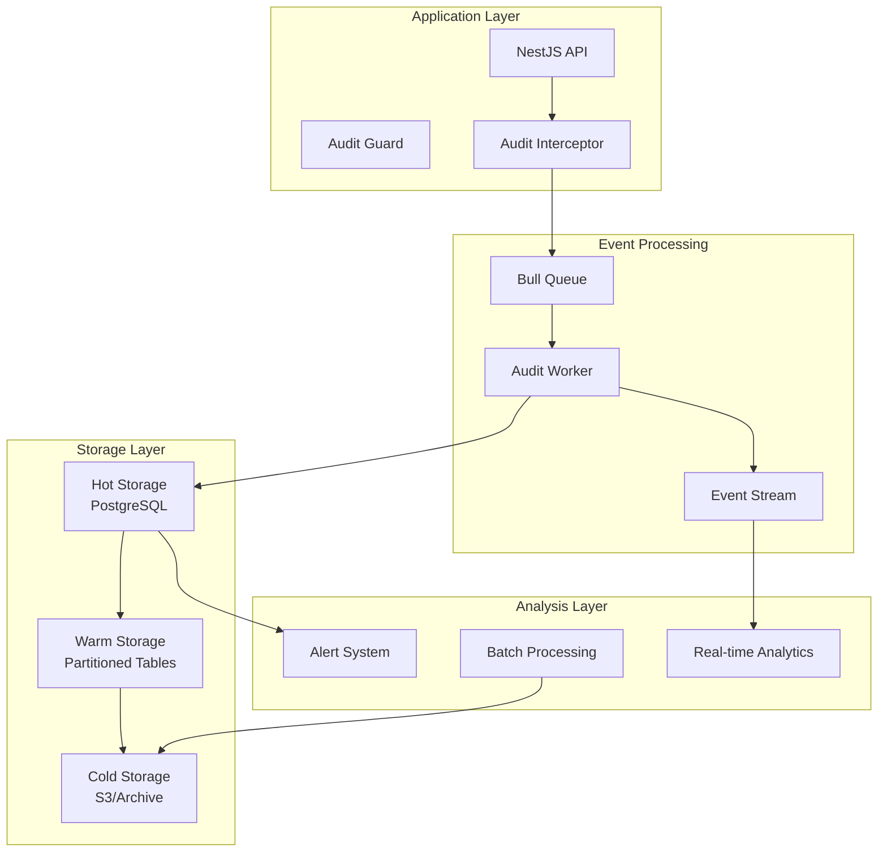

# Comprehensive Audit Trail System Design

## Overview

The audit trail system provides complete tracking of all data changes, access patterns, and system events across the itellico platform. It ensures compliance, security, and operational visibility.

## Architecture



## Audit Categories

### 1. Data Change Audit
Tracks all CRUD operations on business entities

### 2. Access Audit
Records who accessed what data and when

### 3. Permission Audit
Logs all permission checks and authorization decisions

### 4. System Event Audit
Captures configuration changes, deployments, errors

### 5. Security Audit
Tracks authentication, suspicious activities, breaches

### 6. Compliance Audit
Ensures regulatory compliance (GDPR, HIPAA, etc.)

## Database Schema

### Core Audit Tables

```prisma
// Main audit log table (partitioned by month)
model AuditLog {
  // Identifiers
  uuid        String   @id @default(dbgenerated("gen_random_uuid()")) @db.Uuid
  id          BigInt   @unique @default(autoincrement())
  
  // Event Classification
  category    AuditCategory  // DATA_CHANGE|ACCESS|PERMISSION|SYSTEM|SECURITY
  eventType   String   @db.VarChar(50)   // create|update|delete|read|export
  severity    AuditSeverity @default(INFO) // DEBUG|INFO|WARN|ERROR|CRITICAL
  
  // Entity Information
  entityType  String   @db.VarChar(50)   // user|account|tenant|permission
  entityId    String   @db.Uuid
  entityName  String?  @db.VarChar(255)  // Human-readable identifier
  
  // Actor Information
  actorType   ActorType     // USER|SYSTEM|API|SCHEDULED
  actorId     String?  @db.Uuid
  userId      Int?
  tenantId    Int
  accountId   Int?
  
  // Request Context
  ipAddress   String?  @db.Inet          // Supports IPv4 and IPv6
  userAgent   String?  @db.Text
  sessionId   String?  @db.Uuid
  requestId   String?  @db.Uuid
  apiVersion  String?  @db.VarChar(20)
  endpoint    String?  @db.VarChar(255)
  httpMethod  String?  @db.VarChar(10)
  
  // Change Details
  operation   String   @db.VarChar(100)  // Specific operation performed
  changes     Json?    // {"field": {"old": "value1", "new": "value2"}}
  metadata    Json?    // Additional context
  
  // Security Context
  permissionUsed String? @db.VarChar(255) // platform.users.delete
  mfaVerified Boolean  @default(false)
  riskScore   Int?     // 0-100 risk assessment
  
  // Performance Metrics
  duration    Int?     // Operation duration in milliseconds
  queryCount  Int?     // Number of DB queries
  
  // Status
  status      AuditStatus @default(COMPLETED)
  errorCode   String?  @db.VarChar(50)
  errorMessage String? @db.Text
  
  // Timestamp
  createdAt   DateTime @default(now()) @db.Timestamptz(6)
  
  // Relations
  user        User?    @relation(fields: [userId], references: [id])
  tenant      Tenant   @relation(fields: [tenantId], references: [id])
  account     Account? @relation(fields: [accountId], references: [id])
  
  // Indexes for performance
  @@index([tenantId, createdAt(sort: Desc)])
  @@index([userId, createdAt(sort: Desc)])
  @@index([entityType, entityId, createdAt(sort: Desc)])
  @@index([category, eventType, createdAt(sort: Desc)])
  @@index([createdAt])
  @@index([requestId])
  @@index([sessionId])
  
  @@map("audit_logs")
}

// Data access patterns for analytics
model DataAccessLog {
  // Identifiers
  uuid        String   @id @default(dbgenerated("gen_random_uuid()")) @db.Uuid
  id          BigInt   @unique @default(autoincrement())
  
  // Access Information
  userId      Int
  tenantId    Int
  resourceType String  @db.VarChar(50)   // report|export|api|ui
  resourceId  String?  @db.Uuid
  
  // Access Details
  accessType  String   @db.VarChar(50)   // view|download|export|share
  recordCount Int?     // Number of records accessed
  fields      String[] // Fields that were accessed
  filters     Json?    // Query filters applied
  
  // Context
  purpose     String?  @db.Text          // Reason for access
  authorized  Boolean  @default(true)
  
  // Performance
  responseTime Int?    // milliseconds
  dataSize    BigInt?  // bytes
  
  // Timestamp
  accessedAt  DateTime @default(now()) @db.Timestamptz(6)
  
  // Relations
  user        User     @relation(fields: [userId], references: [id])
  tenant      Tenant   @relation(fields: [tenantId], references: [id])
  
  // Indexes
  @@index([userId, accessedAt(sort: Desc)])
  @@index([resourceType, accessedAt(sort: Desc)])
  @@index([tenantId, accessedAt(sort: Desc)])
  
  @@map("data_access_logs")
}

// Security-specific events
model SecurityAuditLog {
  // Identifiers
  uuid        String   @id @default(dbgenerated("gen_random_uuid()")) @db.Uuid
  id          BigInt   @unique @default(autoincrement())
  
  // Event Information
  eventType   SecurityEventType // LOGIN|LOGOUT|FAILED_LOGIN|PASSWORD_CHANGE|MFA|SUSPICIOUS
  severity    SecuritySeverity  // LOW|MEDIUM|HIGH|CRITICAL
  
  // Actor
  userId      Int?
  email       String?  @db.VarChar(255)
  ipAddress   String   @db.Inet
  
  // Event Details
  success     Boolean
  failureReason String? @db.VarChar(255)
  attempts    Int      @default(1)
  
  // Threat Detection
  threatIndicators Json?   // Suspicious patterns detected
  geoLocation Json?         // IP geolocation data
  deviceFingerprint String? @db.VarChar(255)
  
  // Response
  actionTaken String?  @db.VarChar(255) // blocked|challenged|allowed
  alertSent   Boolean  @default(false)
  
  // Timestamp
  occurredAt  DateTime @default(now()) @db.Timestamptz(6)
  
  // Relations
  user        User?    @relation(fields: [userId], references: [id])
  
  // Indexes
  @@index([userId, occurredAt(sort: Desc)])
  @@index([eventType, occurredAt(sort: Desc)])
  @@index([ipAddress])
  @@index([severity, occurredAt(sort: Desc)])
  
  @@map("security_audit_logs")
}

// Compliance-specific tracking
model ComplianceAuditLog {
  // Identifiers
  uuid        String   @id @default(dbgenerated("gen_random_uuid()")) @db.Uuid
  id          BigInt   @unique @default(autoincrement())
  
  // Compliance Event
  regulation  String   @db.VarChar(50)   // GDPR|HIPAA|SOC2|PCI
  requirement String   @db.VarChar(255)  // Specific requirement
  eventType   String   @db.VarChar(100)  // data_retention|consent|export|deletion
  
  // Subject
  subjectType String   @db.VarChar(50)   // user|data|system
  subjectId   String   @db.Uuid
  
  // Action
  action      String   @db.Text
  outcome     ComplianceOutcome // COMPLIANT|NON_COMPLIANT|EXCEPTION
  evidence    Json?    // Supporting evidence
  
  // Review
  reviewRequired Boolean @default(false)
  reviewedBy  Int?
  reviewedAt  DateTime?
  reviewNotes String?  @db.Text
  
  // Metadata
  automatedCheck Boolean @default(true)
  policyVersion String? @db.VarChar(20)
  
  // Timestamp
  occurredAt  DateTime @default(now()) @db.Timestamptz(6)
  
  // Relations
  reviewer    User?    @relation(fields: [reviewedBy], references: [id])
  
  // Indexes
  @@index([regulation, occurredAt(sort: Desc)])
  @@index([outcome, occurredAt(sort: Desc)])
  @@index([reviewRequired])
  
  @@map("compliance_audit_logs")
}

// Aggregated audit metrics for dashboards
model AuditMetrics {
  // Identifiers
  uuid        String   @id @default(dbgenerated("gen_random_uuid()")) @db.Uuid
  
  // Dimensions
  tenantId    Int
  metricDate  DateTime @db.Date
  category    AuditCategory
  
  // Metrics
  totalEvents BigInt
  uniqueUsers Int
  failedOps   Int
  avgDuration Float    // milliseconds
  
  // Top Lists
  topUsers    Json     // [{userId, count}]
  topEntities Json     // [{entityType, count}]
  topOps      Json     // [{operation, count}]
  
  // Anomalies
  anomalies   Json?    // Detected unusual patterns
  
  // Metadata
  computedAt  DateTime @default(now())
  
  // Relations
  tenant      Tenant   @relation(fields: [tenantId], references: [id])
  
  // Indexes
  @@unique([tenantId, metricDate, category])
  @@index([metricDate])
  
  @@map("audit_metrics")
}

// Audit retention policies
model AuditRetentionPolicy {
  // Identifiers
  uuid        String   @id @default(dbgenerated("gen_random_uuid()")) @db.Uuid
  id          Int      @unique @default(autoincrement())
  
  // Policy Scope
  tenantId    Int?     // Null for global policies
  category    AuditCategory
  
  // Retention Rules
  hotDays     Int      @default(30)    // Days in hot storage
  warmDays    Int      @default(365)   // Days in warm storage
  coldDays    Int      @default(2555)  // Days in cold storage (7 years)
  
  // Purge Rules
  purgeEnabled Boolean @default(false)
  purgeAfterDays Int?  
  
  // Exceptions
  legalHold   Boolean  @default(false)
  exceptions  Json?    // Specific rules for certain event types
  
  // Status
  isActive    Boolean  @default(true)
  
  // Audit
  createdAt   DateTime @default(now())
  updatedAt   DateTime @updatedAt
  
  // Relations
  tenant      Tenant?  @relation(fields: [tenantId], references: [id])
  
  // Indexes
  @@unique([tenantId, category])
  
  @@map("audit_retention_policies")
}

// Enums
enum AuditCategory {
  DATA_CHANGE
  ACCESS
  PERMISSION
  SYSTEM
  SECURITY
  COMPLIANCE
  
  @@map("audit_category")
}

enum AuditSeverity {
  DEBUG
  INFO
  WARN
  ERROR
  CRITICAL
  
  @@map("audit_severity")
}

enum AuditStatus {
  PENDING
  COMPLETED
  FAILED
  PARTIAL
  
  @@map("audit_status")
}

enum ActorType {
  USER
  SYSTEM
  API
  SCHEDULED
  EXTERNAL
  
  @@map("actor_type")
}

enum SecurityEventType {
  LOGIN
  LOGOUT
  FAILED_LOGIN
  PASSWORD_CHANGE
  PASSWORD_RESET
  MFA_ENABLED
  MFA_DISABLED
  MFA_CHALLENGE
  ACCOUNT_LOCKED
  SUSPICIOUS_ACTIVITY
  API_KEY_CREATED
  API_KEY_REVOKED
  
  @@map("security_event_type")
}

enum SecuritySeverity {
  LOW
  MEDIUM
  HIGH
  CRITICAL
  
  @@map("security_severity")
}

enum ComplianceOutcome {
  COMPLIANT
  NON_COMPLIANT
  EXCEPTION
  PENDING_REVIEW
  
  @@map("compliance_outcome")
}
```

## Implementation Patterns

### NestJS Audit Interceptor

```typescript
@Injectable()
export class AuditInterceptor implements NestInterceptor {
  constructor(
    private readonly auditService: AuditService,
    private readonly requestContext: RequestContext,
  ) {}

  intercept(context: ExecutionContext, next: CallHandler): Observable<any> {
    const request = context.switchToHttp().getRequest();
    const handler = context.getHandler();
    const controller = context.getClass();
    
    // Get audit metadata
    const auditConfig = Reflect.getMetadata('audit', handler) || 
                       Reflect.getMetadata('audit', controller);
    
    if (!auditConfig?.enabled) {
      return next.handle();
    }
    
    const startTime = Date.now();
    const auditContext = {
      category: auditConfig.category || AuditCategory.DATA_CHANGE,
      eventType: auditConfig.eventType || this.inferEventType(request),
      entityType: auditConfig.entityType,
      userId: request.user?.id,
      tenantId: request.user?.tenantId,
      ipAddress: request.ip,
      userAgent: request.headers['user-agent'],
      sessionId: request.session?.id,
      requestId: request.id,
      endpoint: request.url,
      httpMethod: request.method,
    };
    
    return next.handle().pipe(
      tap({
        next: (data) => {
          // Audit successful operations
          this.auditService.logEvent({
            ...auditContext,
            status: AuditStatus.COMPLETED,
            duration: Date.now() - startTime,
            changes: this.extractChanges(request, data),
            metadata: {
              responseStatus: 200,
              responseSize: JSON.stringify(data).length,
            },
          });
        },
        error: (error) => {
          // Audit failed operations
          this.auditService.logEvent({
            ...auditContext,
            status: AuditStatus.FAILED,
            severity: AuditSeverity.ERROR,
            duration: Date.now() - startTime,
            errorCode: error.code,
            errorMessage: error.message,
            metadata: {
              stackTrace: error.stack,
            },
          });
        },
      }),
    );
  }
}
```

### Audit Decorators

```typescript
// Method decorator for custom audit configuration
export function Audit(config: AuditConfig) {
  return (target: any, propertyKey: string, descriptor: PropertyDescriptor) => {
    Reflect.defineMetadata('audit', config, descriptor.value);
    return descriptor;
  };
}

// Usage example
@Controller('users')
export class UserController {
  @Post()
  @Audit({
    enabled: true,
    category: AuditCategory.DATA_CHANGE,
    eventType: 'create',
    entityType: 'user',
    severity: AuditSeverity.INFO,
  })
  async createUser(@Body() dto: CreateUserDto) {
    // Implementation
  }
  
  @Delete(':id')
  @Audit({
    enabled: true,
    category: AuditCategory.DATA_CHANGE,
    eventType: 'delete',
    entityType: 'user',
    severity: AuditSeverity.WARN,
    includeRequestBody: false, // Sensitive operation
  })
  async deleteUser(@Param('id') id: string) {
    // Implementation
  }
}
```

### Audit Service

```typescript
@Injectable()
export class AuditService {
  constructor(
    private readonly prisma: PrismaService,
    private readonly queue: Queue,
    private readonly cache: CacheService,
  ) {}
  
  async logEvent(event: AuditEventDto): Promise<void> {
    // Add to queue for async processing
    await this.queue.add('audit-event', event, {
      attempts: 3,
      backoff: {
        type: 'exponential',
        delay: 1000,
      },
    });
    
    // For critical events, also log synchronously
    if (event.severity === AuditSeverity.CRITICAL) {
      await this.logCriticalEvent(event);
    }
  }
  
  private async logCriticalEvent(event: AuditEventDto): Promise<void> {
    // Direct database write for critical events
    await this.prisma.auditLog.create({
      data: {
        ...event,
        changes: event.changes ? JSON.stringify(event.changes) : null,
        metadata: event.metadata ? JSON.stringify(event.metadata) : null,
      },
    });
    
    // Trigger alerts
    await this.triggerSecurityAlert(event);
  }
  
  async queryAuditLogs(filters: AuditQueryDto): Promise<AuditLog[]> {
    // Implement efficient querying with caching
    const cacheKey = `audit:query:${JSON.stringify(filters)}`;
    
    return this.cache.remember(cacheKey, 300, async () => {
      return this.prisma.auditLog.findMany({
        where: this.buildWhereClause(filters),
        orderBy: { createdAt: 'desc' },
        take: filters.limit || 100,
        skip: filters.offset || 0,
      });
    });
  }
}
```

## Storage Strategy

### Hot Storage (0-30 days)
- PostgreSQL main tables
- Full indexing for fast queries
- Real-time analytics support

### Warm Storage (30-365 days)
- PostgreSQL partitioned tables
- Reduced indexes
- Compressed storage

### Cold Storage (1-7 years)
- S3/Cloud storage
- Parquet format
- Batch query only

## Query Patterns

### Recent Activity
```sql
-- User's recent activity
SELECT * FROM audit_logs
WHERE user_id = ?
AND created_at > NOW() - INTERVAL '24 hours'
ORDER BY created_at DESC
LIMIT 100;
```

### Suspicious Activity Detection
```sql
-- Failed login attempts
SELECT 
  ip_address,
  COUNT(*) as attempts,
  MIN(occurred_at) as first_attempt,
  MAX(occurred_at) as last_attempt
FROM security_audit_logs
WHERE event_type = 'FAILED_LOGIN'
AND occurred_at > NOW() - INTERVAL '1 hour'
GROUP BY ip_address
HAVING COUNT(*) > 5;
```

### Compliance Reporting
```sql
-- GDPR data access report
SELECT 
  u.email,
  COUNT(DISTINCT dal.resource_id) as resources_accessed,
  SUM(dal.record_count) as total_records,
  MAX(dal.accessed_at) as last_access
FROM data_access_logs dal
JOIN users u ON dal.user_id = u.id
WHERE dal.accessed_at >= DATE_TRUNC('month', CURRENT_DATE)
GROUP BY u.email;
```

## Performance Optimizations

### 1. Partitioning
```sql
-- Partition by month
CREATE TABLE audit_logs_2024_01 PARTITION OF audit_logs
FOR VALUES FROM ('2024-01-01') TO ('2024-02-01');
```

### 2. Indexes
```sql
-- Covering index for common queries
CREATE INDEX idx_audit_tenant_time_category 
ON audit_logs(tenant_id, created_at DESC, category)
INCLUDE (event_type, user_id, entity_type, entity_id);
```

### 3. Materialized Views
```sql
-- Daily audit summary
CREATE MATERIALIZED VIEW audit_daily_summary AS
SELECT 
  DATE_TRUNC('day', created_at) as audit_date,
  tenant_id,
  category,
  COUNT(*) as event_count,
  COUNT(DISTINCT user_id) as unique_users
FROM audit_logs
GROUP BY 1, 2, 3;
```

## Alerting Rules

### Real-time Alerts
1. Multiple failed login attempts (>5 in 10 minutes)
2. Privilege escalation attempts
3. Mass data exports (>10000 records)
4. Configuration changes in production
5. Suspicious API usage patterns

### Daily Reports
1. User activity summary
2. Failed operations report
3. Performance degradation alerts
4. Compliance violations
5. Security incident summary

## Retention and Purging

### Automated Retention
```typescript
@Cron('0 2 * * *') // 2 AM daily
async processRetention() {
  // Move to warm storage
  await this.moveToWarmStorage(30);
  
  // Move to cold storage
  await this.moveToColdStorage(365);
  
  // Purge old data
  await this.purgeOldData(2555); // 7 years
}
```

## Privacy Considerations

### Data Minimization
- Don't log sensitive data (passwords, tokens)
- Hash/mask PII in audit logs
- Use references instead of full data

### Right to be Forgotten
- Implement audit log anonymization
- Maintain audit integrity while removing PII
- Document deletion requests

## Next Steps

1. Implement database migrations for audit tables
2. Create NestJS audit module
3. Set up event processing queue
4. Configure storage lifecycle
5. Build audit dashboard
6. Create compliance reports
7. Set up alerting system