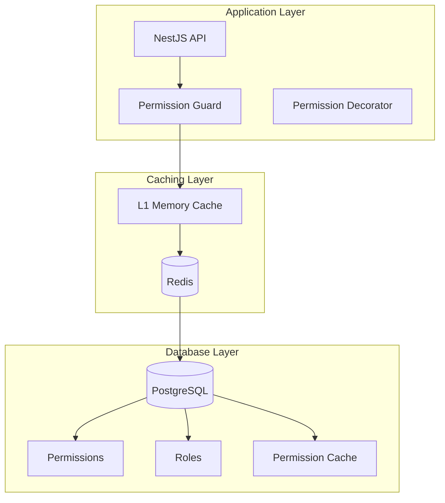

# Enterprise Permission System Design (RBAC + Redis)

## Architecture Overview



## Core Design Principles

1. **UUID-First**: All entities use PostgreSQL UUID as primary identifier
2. **Hierarchical Permissions**: Domain → Resource → Action → Scope pattern
3. **Multi-Level Caching**: L1 (Memory) → L2 (Redis) → L3 (PostgreSQL)
4. **Audit Everything**: Every permission check and change is logged
5. **Performance First**: Sub-millisecond permission checks via caching
6. **5-Tier Aware**: Platform → Tenant → Account → User → Public

## Database Schema

### 1. Core Permission Tables

```prisma
model Permission {
  // Identifiers
  uuid        String   @id @default(dbgenerated("gen_random_uuid()")) @db.Uuid
  id          Int      @unique @default(autoincrement())
  
  // Hierarchical pattern: platform.tenants.create.all
  domain      String   @db.VarChar(50)  // platform|tenant|account|user|public
  resource    String   @db.VarChar(50)  // users|settings|billing|reports
  action      String   @db.VarChar(50)  // create|read|update|delete|execute
  scope       String?  @db.VarChar(50)  // own|team|tenant|all
  
  // Metadata
  name        String   @unique @db.VarChar(255) // "platform.tenants.create"
  displayName String   @db.VarChar(255) // "Create Tenants"
  description String?  @db.Text
  category    String   @db.VarChar(50)  // admin|management|operations
  
  // System flags
  isSystem    Boolean  @default(false)  // Cannot be modified
  isActive    Boolean  @default(true)
  isDangerous Boolean  @default(false)  // Requires extra confirmation
  
  // Caching configuration
  cacheTTL    Int      @default(3600)   // seconds
  cacheLevel  String   @default("L2")   // L1|L2|L3
  
  // Audit
  createdAt   DateTime @default(now()) @db.Timestamptz(6)
  updatedAt   DateTime @updatedAt @db.Timestamptz(6)
  createdBy   Int?
  
  // Relations
  roles       RolePermission[]
  users       UserPermission[]
  conditions  PermissionCondition[]
  
  // Indexes for performance
  @@unique([domain, resource, action, scope])
  @@index([domain])
  @@index([resource])
  @@index([isActive])
  @@index([category])
  
  @@map("permissions")
}

model Role {
  // Identifiers
  uuid        String   @id @default(dbgenerated("gen_random_uuid()")) @db.Uuid
  id          Int      @unique @default(autoincrement())
  
  // Role information
  name        String   @db.VarChar(100)
  code        String   @unique @db.VarChar(50) // PLATFORM_ADMIN, TENANT_ADMIN
  displayName String   @db.VarChar(255)
  description String?  @db.Text
  
  // Hierarchy
  tier        String   @db.VarChar(20)  // platform|tenant|account|user
  level       Int      @default(0)       // 100=platform, 80=tenant, 60=account, 40=user
  parentId    Int?
  
  // Tenant scoping
  tenantId    Int?     // Null for platform roles
  
  // System flags
  isSystem    Boolean  @default(false)
  isActive    Boolean  @default(true)
  isDefault   Boolean  @default(false)  // Auto-assigned to new users
  
  // Limits
  maxUsers    Int?     // Max users who can have this role
  
  // Audit
  createdAt   DateTime @default(now()) @db.Timestamptz(6)
  updatedAt   DateTime @updatedAt @db.Timestamptz(6)
  createdBy   Int?
  
  // Relations
  parent      Role?     @relation("RoleHierarchy", fields: [parentId], references: [id])
  children    Role[]    @relation("RoleHierarchy")
  permissions RolePermission[]
  users       UserRole[]
  tenant      Tenant?   @relation(fields: [tenantId], references: [id])
  
  // Indexes
  @@index([tier])
  @@index([level])
  @@index([tenantId, isActive])
  @@index([code])
  
  @@map("roles")
}

model RolePermission {
  // Identifiers
  uuid         String   @id @default(dbgenerated("gen_random_uuid()")) @db.Uuid
  
  // Relations
  roleId       Int
  permissionId Int
  
  // Conditions
  conditions   Json?    // {"timeRange": "business_hours", "ipRange": "10.0.0.0/8"}
  
  // Inheritance
  isInherited  Boolean  @default(false)
  inheritedFrom Int?    // Parent role ID
  
  // Audit
  grantedAt    DateTime @default(now()) @db.Timestamptz(6)
  grantedBy    Int?
  expiresAt    DateTime? @db.Timestamptz(6)
  
  // Relations
  role         Role     @relation(fields: [roleId], references: [id], onDelete: Cascade)
  permission   Permission @relation(fields: [permissionId], references: [id])
  
  // Indexes
  @@unique([roleId, permissionId])
  @@index([permissionId])
  @@index([expiresAt])
  
  @@map("role_permissions")
}

model UserRole {
  // Identifiers  
  uuid        String   @id @default(dbgenerated("gen_random_uuid()")) @db.Uuid
  
  // Relations
  userId      Int
  roleId      Int
  
  // Tenant context
  tenantId    Int      // Which tenant context this role applies to
  
  // Validity
  validFrom   DateTime @default(now()) @db.Timestamptz(6)
  validUntil  DateTime? @db.Timestamptz(6)
  
  // Assignment metadata
  assignedBy  Int
  assignReason String?  @db.Text
  priority    Int      @default(0)  // Higher priority roles override
  
  // Audit
  createdAt   DateTime @default(now()) @db.Timestamptz(6)
  updatedAt   DateTime @updatedAt @db.Timestamptz(6)
  
  // Relations
  user        User     @relation(fields: [userId], references: [id], onDelete: Cascade)
  role        Role     @relation(fields: [roleId], references: [id])
  tenant      Tenant   @relation(fields: [tenantId], references: [id])
  assigner    User     @relation("RoleAssigner", fields: [assignedBy], references: [id])
  
  // Indexes
  @@unique([userId, roleId, tenantId])
  @@index([userId, tenantId])
  @@index([validUntil])
  @@index([priority])
  
  @@map("user_roles")
}

model UserPermission {
  // Identifiers
  uuid         String   @id @default(dbgenerated("gen_random_uuid()")) @db.Uuid
  
  // Relations
  userId       Int
  permissionId Int
  
  // Grant type
  granted      Boolean  @default(true)  // Can be negative (deny)
  
  // Context
  tenantId     Int?
  resourceType String?  @db.VarChar(50)
  resourceId   String?  @db.Uuid
  
  // Conditions
  conditions   Json?    // {"ipRange": "10.0.0.0/8", "mfaRequired": true}
  
  // Validity
  validFrom    DateTime @default(now()) @db.Timestamptz(6)
  validUntil   DateTime? @db.Timestamptz(6)
  
  // Assignment
  grantedBy    Int
  grantReason  String?  @db.Text
  priority     Int      @default(0)  // Explicit > Role-based
  
  // Audit
  createdAt    DateTime @default(now()) @db.Timestamptz(6)
  updatedAt    DateTime @updatedAt @db.Timestamptz(6)
  
  // Relations
  user         User     @relation(fields: [userId], references: [id], onDelete: Cascade)
  permission   Permission @relation(fields: [permissionId], references: [id])
  tenant       Tenant?  @relation(fields: [tenantId], references: [id])
  granter      User     @relation("PermissionGranter", fields: [grantedBy], references: [id])
  
  // Indexes
  @@unique([userId, permissionId, resourceType, resourceId])
  @@index([userId, granted])
  @@index([validUntil])
  @@index([resourceType, resourceId])
  
  @@map("user_permissions")
}
```

### 2. Caching Tables

```prisma
model PermissionCache {
  // Identifiers
  uuid        String   @id @default(dbgenerated("gen_random_uuid()")) @db.Uuid
  
  // Cache key
  cacheKey    String   @unique @db.VarChar(255)  // "user:123:tenant:456:permissions"
  userId      Int
  tenantId    Int
  context     String   @db.VarChar(50)  // "platform"|"tenant"|"account"
  
  // Cached data
  permissions String[] // Array of permission patterns
  roles       Int[]    // Array of role IDs
  metadata    Json     // Additional context
  
  // Cache metadata
  computedAt  DateTime @db.Timestamptz(6)
  expiresAt   DateTime @db.Timestamptz(6)
  accessCount Int      @default(0)
  lastAccessed DateTime @default(now()) @db.Timestamptz(6)
  
  // Version control
  version     Int      @default(1)
  hash        String   @db.VarChar(64)  // SHA256 of permissions
  
  // Redis sync
  inRedis     Boolean  @default(false)
  redisKey    String?  @db.VarChar(255)
  redisTTL    Int?
  
  // Relations
  user        User     @relation(fields: [userId], references: [id], onDelete: Cascade)
  tenant      Tenant   @relation(fields: [tenantId], references: [id])
  
  // Indexes
  @@index([userId, tenantId])
  @@index([expiresAt])
  @@index([lastAccessed])
  
  @@map("permission_cache")
}

model CacheInvalidation {
  // Identifiers
  uuid        String   @id @default(dbgenerated("gen_random_uuid()")) @db.Uuid
  id          BigInt   @unique @default(autoincrement())
  
  // Invalidation target
  targetType  String   @db.VarChar(50)  // "user"|"role"|"permission"|"tenant"
  targetId    String   @db.VarChar(255)
  pattern     String?  @db.VarChar(255) // Wildcard pattern for bulk invalidation
  
  // Metadata
  reason      String   @db.Text
  invalidatedBy Int
  invalidatedAt DateTime @default(now()) @db.Timestamptz(6)
  
  // Processing
  processed   Boolean  @default(false)
  processedAt DateTime? @db.Timestamptz(6)
  
  // Indexes
  @@index([targetType, targetId])
  @@index([processed, invalidatedAt])
  
  @@map("cache_invalidations")
}
```

### 3. Audit Tables

```prisma
model PermissionAudit {
  // Identifiers
  uuid        String   @id @default(dbgenerated("gen_random_uuid()")) @db.Uuid
  id          BigInt   @unique @default(autoincrement())
  
  // Audit event
  eventType   String   @db.VarChar(50)  // "check"|"grant"|"revoke"|"expire"
  userId      Int
  tenantId    Int
  
  // Permission details
  permission  String   @db.VarChar(255)
  resource    String?  @db.VarChar(255)
  action      String   @db.VarChar(50)
  result      Boolean  // Granted or denied
  
  // Context
  ipAddress   String?  @db.VarChar(45)
  userAgent   String?  @db.Text
  requestId   String?  @db.Uuid
  sessionId   String?  @db.Uuid
  
  // Performance
  checkDurationMs Int?
  cacheHit    Boolean  @default(false)
  cacheLevel  String?  @db.VarChar(10)  // "L1"|"L2"|"L3"
  
  // Metadata
  metadata    Json?
  timestamp   DateTime @default(now()) @db.Timestamptz(6)
  
  // Relations
  user        User     @relation(fields: [userId], references: [id])
  tenant      Tenant   @relation(fields: [tenantId], references: [id])
  
  // Indexes
  @@index([userId, timestamp])
  @@index([eventType])
  @@index([result])
  @@index([timestamp])
  
  @@map("permission_audit")
}

model PermissionChangeLog {
  // Identifiers
  uuid        String   @id @default(dbgenerated("gen_random_uuid()")) @db.Uuid
  id          BigInt   @unique @default(autoincrement())
  
  // Change details
  changeType  String   @db.VarChar(50)  // "role_assigned"|"permission_granted"|"role_modified"
  entityType  String   @db.VarChar(50)  // "user"|"role"|"permission"
  entityId    Int
  
  // What changed
  fieldName   String?  @db.VarChar(100)
  oldValue    Json?
  newValue    Json?
  
  // Who and when
  changedBy   Int
  changedAt   DateTime @default(now()) @db.Timestamptz(6)
  changeReason String? @db.Text
  
  // Approval workflow
  requiresApproval Boolean @default(false)
  approvedBy  Int?
  approvedAt  DateTime? @db.Timestamptz(6)
  
  // Relations
  changer     User     @relation("ChangeAuthor", fields: [changedBy], references: [id])
  approver    User?    @relation("ChangeApprover", fields: [approvedBy], references: [id])
  
  // Indexes
  @@index([entityType, entityId])
  @@index([changedAt])
  @@index([changeType])
  
  @@map("permission_change_log")
}
```

## Redis Caching Strategy

### Cache Key Structure
```
# User permissions in tenant context
permissions:user:{userId}:tenant:{tenantId}

# User roles
roles:user:{userId}

# Permission definitions (rarely change)
permissions:definition:{permissionId}

# Role permissions (changes occasionally)
permissions:role:{roleId}

# Tenant permission settings
permissions:tenant:{tenantId}:config
```

### Cache Layers

#### L1 - Memory Cache (Node.js)
- **TTL**: 60 seconds
- **Size**: 1000 entries per instance
- **Use**: Hot data, current user session

#### L2 - Redis Cache
- **TTL**: 3600 seconds (1 hour)
- **Use**: Shared across instances
- **Eviction**: LRU when memory limit reached

#### L3 - PostgreSQL Cache Table
- **TTL**: 24 hours
- **Use**: Fallback, analytics, debugging
- **Cleanup**: Daily cron job

### Cache Invalidation

```typescript
// Invalidation triggers
- User role assignment/removal
- Permission grant/revoke  
- Role permission changes
- User deactivation
- Tenant settings change

// Invalidation pattern
1. Mark DB cache as invalid
2. Delete from Redis (pattern matching)
3. Broadcast invalidation event
4. Clear L1 cache on all instances
```

## NestJS Implementation

### Permission Guard
```typescript
@Injectable()
export class PermissionGuard implements CanActivate {
  constructor(
    private permissionService: PermissionService,
    private cacheService: CacheService,
  ) {}

  async canActivate(context: ExecutionContext): Promise<boolean> {
    const request = context.switchToHttp().getRequest();
    const user = request.user;
    const requiredPermissions = this.reflector.get<string[]>(
      'permissions',
      context.getHandler(),
    );

    // Check cache first
    const cacheKey = `permissions:user:${user.id}:tenant:${user.tenantId}`;
    const cached = await this.cacheService.get(cacheKey);
    
    if (cached) {
      return this.checkPermissions(cached, requiredPermissions);
    }

    // Load from database
    const permissions = await this.permissionService.getUserPermissions(user);
    
    // Cache for next time
    await this.cacheService.set(cacheKey, permissions, 3600);
    
    return this.checkPermissions(permissions, requiredPermissions);
  }
}
```

### Permission Service
```typescript
@Injectable()
export class PermissionService {
  constructor(
    private prisma: PrismaService,
    private redis: RedisService,
    private cache: CacheService,
  ) {}

  async getUserPermissions(user: User): Promise<string[]> {
    // Multi-level cache check
    const permissions = await this.cache.getWithFallback(
      `permissions:user:${user.id}`,
      async () => {
        // Load from database
        const userPermissions = await this.loadUserPermissions(user);
        const rolePermissions = await this.loadRolePermissions(user);
        
        // Merge and deduplicate
        return this.mergePermissions(userPermissions, rolePermissions);
      },
      { ttl: 3600 },
    );

    // Audit the check
    await this.auditPermissionCheck(user, permissions);
    
    return permissions;
  }

  async invalidateUserPermissions(userId: number): Promise<void> {
    // Invalidate all cache layers
    const patterns = [
      `permissions:user:${userId}:*`,
      `roles:user:${userId}`,
    ];

    // Redis invalidation
    for (const pattern of patterns) {
      await this.redis.deletePattern(pattern);
    }

    // DB cache invalidation
    await this.prisma.permissionCache.updateMany({
      where: { userId },
      data: { expiresAt: new Date() },
    });

    // Broadcast to other instances
    await this.redis.publish('cache:invalidate', {
      type: 'permission',
      userId,
    });
  }
}
```

## Permission Patterns

### Hierarchical Permissions
```
platform.*                    # All platform permissions
platform.tenants.*            # All tenant management
platform.tenants.create       # Create tenant
platform.tenants.read.all     # Read all tenants
platform.tenants.update.own   # Update own tenant

tenant.*                      # All tenant permissions  
tenant.accounts.*             # All account management
tenant.accounts.create        # Create accounts
tenant.accounts.read.all      # Read all accounts in tenant

account.*                     # All account permissions
account.users.*               # All user management
account.users.create          # Create users
account.users.read.own        # Read own user data

user.*                        # All user permissions
user.profile.*                # Profile management
user.profile.read.own         # Read own profile
user.profile.update.own       # Update own profile
```

### Permission Conditions
```json
{
  "timeRange": {
    "start": "09:00",
    "end": "17:00",
    "timezone": "UTC"
  },
  "ipRange": ["10.0.0.0/8", "192.168.0.0/16"],
  "mfaRequired": true,
  "maxUsagePerDay": 1000,
  "validCountries": ["US", "GB", "DE"]
}
```

## Security Considerations

1. **Permission Explosion**: Use patterns and wildcards carefully
2. **Cache Poisoning**: Validate all cached data
3. **Privilege Escalation**: Audit all permission changes
4. **Performance**: Monitor cache hit rates
5. **Consistency**: Handle cache invalidation carefully

## Migration Strategy

### Phase 1: Add New Tables
```sql
-- Add new permission tables
-- Add UUID fields to existing tables
-- Create indexes
```

### Phase 2: Data Migration
```sql
-- Migrate existing roles
-- Generate permission records
-- Build initial cache
```

### Phase 3: Application Update
```typescript
// Update guards
// Implement caching
// Add audit logging
```

### Phase 4: Cleanup
```sql
-- Remove old permission tables
-- Update foreign keys
-- Optimize indexes
```

## Performance Targets

- Permission check: < 1ms (L1 cache hit)
- Permission check: < 10ms (L2 cache hit)
- Permission check: < 50ms (database query)
- Cache invalidation: < 100ms
- Bulk permission load: < 200ms for 1000 permissions