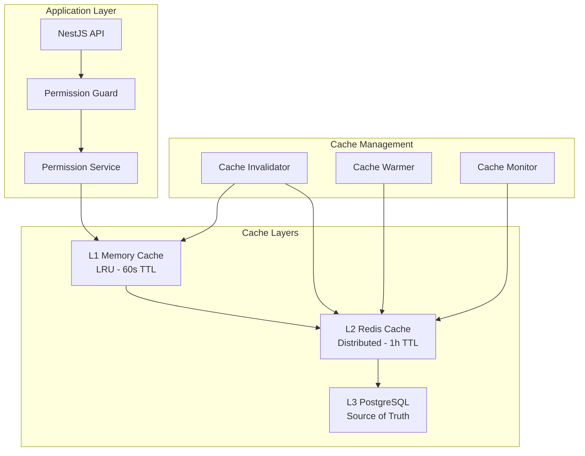

# Redis Permission Caching System Design

## Overview

This document outlines the implementation of a high-performance, multi-level permission caching system using Redis for the itellico platform. The system provides sub-millisecond permission checks while maintaining consistency and security.

## Architecture



## Cache Key Strategy

### Key Patterns

```typescript
// User permissions in tenant context
`perm:user:${userId}:tenant:${tenantId}`

// User effective permissions (computed)
`perm:effective:${userId}:tenant:${tenantId}`

// Role permissions (rarely changes)
`perm:role:${roleId}`

// Permission definitions (static)
`perm:def:${permissionId}`
`perm:def:pattern:${domain}.${resource}.${action}`

// User roles in tenant
`roles:user:${userId}:tenant:${tenantId}`

// Cache metadata
`perm:meta:${userId}:version`
`perm:meta:${userId}:computed`

// Invalidation patterns
`perm:inv:user:${userId}:*`
`perm:inv:role:${roleId}:*`
`perm:inv:tenant:${tenantId}:*`
```

### Cache Data Structure

```typescript
interface CachedPermissions {
  // User identification
  userId: number;
  tenantId: number;
  
  // Permissions
  permissions: string[];           // Flat list for fast lookup
  permissionTree: PermissionTree; // Hierarchical for pattern matching
  
  // Roles
  roles: {
    id: number;
    code: string;
    level: number;
    permissions: string[];
  }[];
  
  // Metadata
  computedAt: Date;
  expiresAt: Date;
  version: number;
  hash: string; // SHA256 of permissions for validation
  
  // Context
  conditions: Record<string, any>; // Dynamic conditions
  scope: PermissionScope;
}

interface PermissionTree {
  [domain: string]: {
    [resource: string]: {
      [action: string]: {
        allowed: boolean;
        scope?: string;
        conditions?: any;
      }
    }
  }
}
```

## Redis Implementation

### Connection Configuration

```typescript
// redis.config.ts
import { RedisModuleOptions } from '@nestjs-modules/ioredis';

export const redisConfig: RedisModuleOptions = {
  config: {
    host: process.env.REDIS_HOST || 'localhost',
    port: parseInt(process.env.REDIS_PORT || '6379'),
    password: process.env.REDIS_PASSWORD,
    db: parseInt(process.env.REDIS_DB || '0'),
    
    // Performance options
    enableReadyCheck: true,
    maxRetriesPerRequest: 3,
    enableOfflineQueue: true,
    
    // Connection pool
    connectionName: 'permissions',
    lazyConnect: false,
    
    // Timeouts
    connectTimeout: 10000,
    commandTimeout: 5000,
    
    // Retry strategy
    retryStrategy: (times: number) => {
      if (times > 3) return null;
      return Math.min(times * 100, 3000);
    },
  },
};

// For high availability
export const redisClusterConfig: RedisModuleOptions = {
  config: {
    clusters: [
      {
        host: process.env.REDIS_MASTER_HOST,
        port: parseInt(process.env.REDIS_MASTER_PORT || '6379'),
      },
    ],
    redisOptions: {
      password: process.env.REDIS_PASSWORD,
      readOnly: true,
    },
    
    // Cluster options
    enableReadyCheck: true,
    scaleReads: 'slave',
    maxRedirections: 16,
    retryDelayOnFailover: 100,
    retryDelayOnClusterDown: 300,
    slotsRefreshTimeout: 2000,
  },
};
```

### Cache Service Implementation

```typescript
// redis-cache.service.ts
import { Injectable, OnModuleInit, OnModuleDestroy } from '@nestjs/common';
import { InjectRedis } from '@nestjs-modules/ioredis';
import Redis from 'ioredis';
import { createHash } from 'crypto';

@Injectable()
export class RedisCacheService implements OnModuleInit, OnModuleDestroy {
  private readonly defaultTTL = 3600; // 1 hour
  private readonly lockTTL = 5; // 5 seconds for distributed locks
  
  constructor(@InjectRedis() private readonly redis: Redis) {}

  async onModuleInit() {
    // Test connection
    await this.redis.ping();
    
    // Load Lua scripts
    await this.loadLuaScripts();
  }

  async onModuleDestroy() {
    await this.redis.quit();
  }

  // Basic operations
  async get<T>(key: string): Promise<T | null> {
    const value = await this.redis.get(key);
    if (!value) return null;
    
    try {
      return JSON.parse(value);
    } catch {
      return value as any;
    }
  }

  async set<T>(
    key: string, 
    value: T, 
    ttl: number = this.defaultTTL
  ): Promise<void> {
    const serialized = typeof value === 'string' 
      ? value 
      : JSON.stringify(value);
    
    await this.redis.setex(key, ttl, serialized);
  }

  async delete(pattern: string): Promise<number> {
    const keys = await this.redis.keys(pattern);
    if (keys.length === 0) return 0;
    
    return await this.redis.del(...keys);
  }

  // Atomic operations
  async getset<T>(key: string, value: T): Promise<T | null> {
    const oldValue = await this.redis.getset(key, JSON.stringify(value));
    return oldValue ? JSON.parse(oldValue) : null;
  }

  async incr(key: string): Promise<number> {
    return await this.redis.incr(key);
  }

  // Hash operations for structured data
  async hgetall(key: string): Promise<Record<string, string>> {
    return await this.redis.hgetall(key);
  }

  async hset(
    key: string, 
    field: string, 
    value: string
  ): Promise<number> {
    return await this.redis.hset(key, field, value);
  }

  async hmset(
    key: string, 
    data: Record<string, any>
  ): Promise<void> {
    await this.redis.hmset(key, data);
  }

  // Set operations for permissions
  async sadd(key: string, ...members: string[]): Promise<number> {
    return await this.redis.sadd(key, ...members);
  }

  async smembers(key: string): Promise<string[]> {
    return await this.redis.smembers(key);
  }

  async sismember(key: string, member: string): Promise<boolean> {
    const result = await this.redis.sismember(key, member);
    return result === 1;
  }

  // Distributed locking
  async acquireLock(
    key: string, 
    identifier: string, 
    ttl: number = this.lockTTL
  ): Promise<boolean> {
    const result = await this.redis.set(
      `lock:${key}`,
      identifier,
      'PX',
      ttl * 1000,
      'NX'
    );
    return result === 'OK';
  }

  async releaseLock(key: string, identifier: string): Promise<boolean> {
    const script = `
      if redis.call("get", KEYS[1]) == ARGV[1] then
        return redis.call("del", KEYS[1])
      else
        return 0
      end
    `;
    
    const result = await this.redis.eval(
      script,
      1,
      `lock:${key}`,
      identifier
    );
    return result === 1;
  }

  // Batch operations
  async mget<T>(keys: string[]): Promise<(T | null)[]> {
    const values = await this.redis.mget(...keys);
    return values.map(v => v ? JSON.parse(v) : null);
  }

  async pipeline(operations: any[]): Promise<any[]> {
    const pipeline = this.redis.pipeline();
    
    for (const op of operations) {
      pipeline[op.command](...op.args);
    }
    
    const results = await pipeline.exec();
    return results?.map(([err, result]) => {
      if (err) throw err;
      return result;
    }) || [];
  }

  // Cache warming
  async warmCache(keys: string[], loader: (key: string) => Promise<any>): Promise<void> {
    const pipeline = this.redis.pipeline();
    
    for (const key of keys) {
      const value = await loader(key);
      if (value) {
        pipeline.setex(key, this.defaultTTL, JSON.stringify(value));
      }
    }
    
    await pipeline.exec();
  }

  // Cache statistics
  async getStats(): Promise<any> {
    const info = await this.redis.info('stats');
    const dbSize = await this.redis.dbsize();
    
    return {
      dbSize,
      info: this.parseRedisInfo(info),
    };
  }

  private parseRedisInfo(info: string): Record<string, any> {
    const lines = info.split('\r\n');
    const stats: Record<string, any> = {};
    
    for (const line of lines) {
      if (line.includes(':')) {
        const [key, value] = line.split(':');
        stats[key] = value;
      }
    }
    
    return stats;
  }

  // Lua scripts for atomic operations
  private async loadLuaScripts() {
    // Script to check multiple permissions atomically
    this.redis.defineCommand('checkPermissions', {
      numberOfKeys: 1,
      lua: `
        local permissions = cjson.decode(ARGV[1])
        local results = {}
        
        for i, perm in ipairs(permissions) do
          local exists = redis.call('sismember', KEYS[1], perm)
          table.insert(results, exists)
        end
        
        return results
      `,
    });
  }
}
```

### Permission Cache Service

```typescript
// permission-cache.service.ts
import { Injectable } from '@nestjs/common';
import { RedisCacheService } from './redis-cache.service';
import { PrismaService } from '@/prisma/prisma.service';
import { createHash } from 'crypto';

@Injectable()
export class PermissionCacheService {
  private readonly TTL = {
    USER_PERMISSIONS: 3600,      // 1 hour
    ROLE_PERMISSIONS: 86400,     // 24 hours
    PERMISSION_DEFINITIONS: 604800, // 7 days
  };

  constructor(
    private readonly cache: RedisCacheService,
    private readonly prisma: PrismaService,
  ) {}

  async getUserPermissions(
    userId: number,
    tenantId: number
  ): Promise<string[]> {
    const cacheKey = `perm:user:${userId}:tenant:${tenantId}`;
    
    // Try cache first
    const cached = await this.cache.get<string[]>(cacheKey);
    if (cached) {
      return cached;
    }

    // Use distributed lock to prevent cache stampede
    const lockId = Math.random().toString(36);
    const lockAcquired = await this.cache.acquireLock(cacheKey, lockId, 5);
    
    if (!lockAcquired) {
      // Another process is computing, wait and retry
      await new Promise(resolve => setTimeout(resolve, 100));
      return this.getUserPermissions(userId, tenantId);
    }

    try {
      // Double-check cache after acquiring lock
      const cachedAfterLock = await this.cache.get<string[]>(cacheKey);
      if (cachedAfterLock) {
        return cachedAfterLock;
      }

      // Compute permissions
      const permissions = await this.computeUserPermissions(userId, tenantId);
      
      // Cache with TTL
      await this.cache.set(
        cacheKey,
        permissions,
        this.TTL.USER_PERMISSIONS
      );
      
      // Also cache metadata
      await this.cachePermissionMetadata(userId, tenantId, permissions);
      
      return permissions;
    } finally {
      await this.cache.releaseLock(cacheKey, lockId);
    }
  }

  private async computeUserPermissions(
    userId: number,
    tenantId: number
  ): Promise<string[]> {
    // Get user's roles
    const userRoles = await this.prisma.userRole.findMany({
      where: {
        userId,
        tenantId,
        OR: [
          { validUntil: null },
          { validUntil: { gte: new Date() } },
        ],
      },
      include: {
        role: {
          include: {
            permissions: {
              include: {
                permission: true,
              },
            },
          },
        },
      },
    });

    // Get direct user permissions
    const userPermissions = await this.prisma.userPermission.findMany({
      where: {
        userId,
        granted: true,
        OR: [
          { tenantId: null },
          { tenantId },
        ],
        AND: [
          { validFrom: { lte: new Date() } },
          {
            OR: [
              { validUntil: null },
              { validUntil: { gte: new Date() } },
            ],
          },
        ],
      },
      include: {
        permission: true,
      },
    });

    // Combine and deduplicate permissions
    const allPermissions = new Set<string>();

    // Add role permissions
    for (const userRole of userRoles) {
      for (const rolePerm of userRole.role.permissions) {
        const perm = rolePerm.permission;
        const pattern = `${perm.domain}.${perm.resource}.${perm.action}`;
        if (perm.scope) {
          allPermissions.add(`${pattern}.${perm.scope}`);
        } else {
          allPermissions.add(pattern);
        }
      }
    }

    // Add direct permissions
    for (const userPerm of userPermissions) {
      const perm = userPerm.permission;
      const pattern = `${perm.domain}.${perm.resource}.${perm.action}`;
      if (perm.scope) {
        allPermissions.add(`${pattern}.${perm.scope}`);
      } else {
        allPermissions.add(pattern);
      }
    }

    // Add hierarchical permissions
    const expandedPermissions = this.expandPermissions(Array.from(allPermissions));
    
    return expandedPermissions;
  }

  private expandPermissions(permissions: string[]): string[] {
    const expanded = new Set<string>(permissions);

    for (const perm of permissions) {
      const parts = perm.split('.');
      
      // Add wildcard expansions
      // platform.users.create -> platform.users.*, platform.*
      for (let i = parts.length - 1; i > 0; i--) {
        const wildcard = parts.slice(0, i).concat('*').join('.');
        expanded.add(wildcard);
      }
    }

    return Array.from(expanded).sort();
  }

  private async cachePermissionMetadata(
    userId: number,
    tenantId: number,
    permissions: string[]
  ): Promise<void> {
    const hash = createHash('sha256')
      .update(permissions.join(','))
      .digest('hex');

    const metadata = {
      version: 1,
      computedAt: new Date().toISOString(),
      permissionCount: permissions.length,
      hash,
    };

    await this.cache.set(
      `perm:meta:${userId}:${tenantId}`,
      metadata,
      this.TTL.USER_PERMISSIONS
    );
  }

  async invalidateUserPermissions(
    userId: number,
    tenantId?: number
  ): Promise<void> {
    if (tenantId) {
      // Invalidate specific tenant context
      await this.cache.delete(`perm:user:${userId}:tenant:${tenantId}`);
      await this.cache.delete(`perm:meta:${userId}:${tenantId}`);
    } else {
      // Invalidate all tenant contexts for user
      await this.cache.delete(`perm:user:${userId}:*`);
      await this.cache.delete(`perm:meta:${userId}:*`);
    }

    // Also invalidate in PostgreSQL cache
    await this.prisma.permissionCache.updateMany({
      where: { userId },
      data: { expiresAt: new Date() },
    });
  }

  async invalidateRolePermissions(roleId: number): Promise<void> {
    // Find all users with this role
    const affectedUsers = await this.prisma.userRole.findMany({
      where: { roleId },
      select: { userId: true, tenantId: true },
      distinct: ['userId', 'tenantId'],
    });

    // Invalidate each user's cache
    for (const { userId, tenantId } of affectedUsers) {
      await this.invalidateUserPermissions(userId, tenantId);
    }

    // Invalidate role cache
    await this.cache.delete(`perm:role:${roleId}`);
  }

  async warmUserCache(userId: number): Promise<void> {
    // Get all tenant contexts for user
    const tenantContexts = await this.prisma.userRole.findMany({
      where: { userId },
      select: { tenantId: true },
      distinct: ['tenantId'],
    });

    // Warm cache for each context
    for (const { tenantId } of tenantContexts) {
      await this.getUserPermissions(userId, tenantId);
    }
  }

  async checkPermission(
    userId: number,
    tenantId: number,
    permission: string
  ): Promise<boolean> {
    const permissions = await this.getUserPermissions(userId, tenantId);
    
    // Direct match
    if (permissions.includes(permission)) {
      return true;
    }

    // Wildcard match
    const parts = permission.split('.');
    for (let i = parts.length - 1; i > 0; i--) {
      const wildcard = parts.slice(0, i).concat('*').join('.');
      if (permissions.includes(wildcard)) {
        return true;
      }
    }

    return false;
  }

  async checkPermissions(
    userId: number,
    tenantId: number,
    requiredPermissions: string[]
  ): Promise<boolean[]> {
    const permissions = await this.getUserPermissions(userId, tenantId);
    const permSet = new Set(permissions);

    return requiredPermissions.map(required => {
      // Direct match
      if (permSet.has(required)) {
        return true;
      }

      // Wildcard match
      const parts = required.split('.');
      for (let i = parts.length - 1; i > 0; i--) {
        const wildcard = parts.slice(0, i).concat('*').join('.');
        if (permSet.has(wildcard)) {
          return true;
        }
      }

      return false;
    });
  }

  async getCacheStats(): Promise<any> {
    const stats = await this.cache.getStats();
    const patterns = [
      'perm:user:*',
      'perm:role:*',
      'perm:def:*',
      'perm:meta:*',
    ];

    const counts: Record<string, number> = {};
    for (const pattern of patterns) {
      const keys = await this.cache.redis.keys(pattern);
      counts[pattern] = keys.length;
    }

    return {
      ...stats,
      patterns: counts,
    };
  }
}
```

### Memory Cache Layer (L1)

```typescript
// memory-cache.service.ts
import { Injectable } from '@nestjs/common';
import * as NodeCache from 'node-cache';

@Injectable()
export class MemoryCacheService {
  private cache: NodeCache;
  private readonly stats = {
    hits: 0,
    misses: 0,
    sets: 0,
    deletes: 0,
  };

  constructor() {
    this.cache = new NodeCache({
      stdTTL: 60,           // 60 seconds default TTL
      checkperiod: 120,     // Check for expired keys every 2 minutes
      useClones: false,     // Don't clone objects (performance)
      maxKeys: 10000,       // Maximum keys to prevent memory bloat
    });

    // Track statistics
    this.cache.on('set', () => this.stats.sets++);
    this.cache.on('del', () => this.stats.deletes++);
  }

  get<T>(key: string): T | undefined {
    const value = this.cache.get<T>(key);
    if (value !== undefined) {
      this.stats.hits++;
    } else {
      this.stats.misses++;
    }
    return value;
  }

  set<T>(key: string, value: T, ttl?: number): boolean {
    return this.cache.set(key, value, ttl || 60);
  }

  del(key: string | string[]): number {
    return this.cache.del(key);
  }

  flush(): void {
    this.cache.flushAll();
  }

  getStats() {
    const keys = this.cache.keys();
    const hitRate = this.stats.hits / (this.stats.hits + this.stats.misses) || 0;

    return {
      ...this.stats,
      hitRate: (hitRate * 100).toFixed(2) + '%',
      keys: keys.length,
      memoryUsage: process.memoryUsage().heapUsed,
    };
  }
}
```

### Multi-Level Cache Service

```typescript
// multi-level-cache.service.ts
import { Injectable } from '@nestjs/common';
import { MemoryCacheService } from './memory-cache.service';
import { RedisCacheService } from './redis-cache.service';
import { PrismaService } from '@/prisma/prisma.service';

@Injectable()
export class MultiLevelCacheService {
  constructor(
    private readonly l1Cache: MemoryCacheService,
    private readonly l2Cache: RedisCacheService,
    private readonly prisma: PrismaService,
  ) {}

  async get<T>(
    key: string,
    loader?: () => Promise<T>,
    options?: {
      l1TTL?: number;
      l2TTL?: number;
      l3TTL?: number;
    }
  ): Promise<T | null> {
    // Check L1 (Memory)
    const l1Value = this.l1Cache.get<T>(key);
    if (l1Value !== undefined) {
      return l1Value;
    }

    // Check L2 (Redis)
    const l2Value = await this.l2Cache.get<T>(key);
    if (l2Value !== null) {
      // Populate L1
      this.l1Cache.set(key, l2Value, options?.l1TTL);
      return l2Value;
    }

    // Check L3 (PostgreSQL) or use loader
    let value: T | null = null;

    if (loader) {
      value = await loader();
    } else {
      // Try to load from PostgreSQL cache
      const cached = await this.prisma.permissionCache.findUnique({
        where: { cacheKey: key },
      });

      if (cached && cached.expiresAt > new Date()) {
        value = cached.permissions as any;
      }
    }

    if (value !== null) {
      // Populate both L1 and L2
      this.l1Cache.set(key, value, options?.l1TTL);
      await this.l2Cache.set(key, value, options?.l2TTL);

      // Optionally update L3
      if (options?.l3TTL) {
        await this.updateL3Cache(key, value, options.l3TTL);
      }
    }

    return value;
  }

  async set<T>(
    key: string,
    value: T,
    options?: {
      l1TTL?: number;
      l2TTL?: number;
      l3TTL?: number;
    }
  ): Promise<void> {
    // Set in all levels
    this.l1Cache.set(key, value, options?.l1TTL);
    await this.l2Cache.set(key, value, options?.l2TTL);

    if (options?.l3TTL) {
      await this.updateL3Cache(key, value, options.l3TTL);
    }
  }

  async invalidate(pattern: string): Promise<void> {
    // Invalidate L1 (simple pattern matching)
    const l1Keys = this.l1Cache.cache.keys();
    const toDelete = l1Keys.filter(key => 
      key.includes(pattern.replace('*', ''))
    );
    this.l1Cache.del(toDelete);

    // Invalidate L2
    await this.l2Cache.delete(pattern);

    // Invalidate L3
    await this.prisma.permissionCache.updateMany({
      where: {
        cacheKey: {
          contains: pattern.replace('*', ''),
        },
      },
      data: {
        expiresAt: new Date(),
      },
    });
  }

  private async updateL3Cache<T>(
    key: string,
    value: T,
    ttl: number
  ): Promise<void> {
    const expiresAt = new Date(Date.now() + ttl * 1000);
    
    await this.prisma.permissionCache.upsert({
      where: { cacheKey: key },
      create: {
        cacheKey: key,
        userId: this.extractUserId(key),
        tenantId: this.extractTenantId(key),
        context: this.extractContext(key),
        permissions: value as any,
        roles: [],
        metadata: {},
        computedAt: new Date(),
        expiresAt,
        version: 1,
        hash: this.computeHash(value),
      },
      update: {
        permissions: value as any,
        computedAt: new Date(),
        expiresAt,
        version: { increment: 1 },
        hash: this.computeHash(value),
        accessCount: { increment: 1 },
        lastAccessed: new Date(),
      },
    });
  }

  private extractUserId(key: string): number {
    const match = key.match(/user:(\d+)/);
    return match ? parseInt(match[1]) : 0;
  }

  private extractTenantId(key: string): number {
    const match = key.match(/tenant:(\d+)/);
    return match ? parseInt(match[1]) : 0;
  }

  private extractContext(key: string): string {
    if (key.includes('platform')) return 'platform';
    if (key.includes('tenant')) return 'tenant';
    if (key.includes('account')) return 'account';
    return 'user';
  }

  private computeHash(value: any): string {
    const crypto = require('crypto');
    return crypto
      .createHash('sha256')
      .update(JSON.stringify(value))
      .digest('hex');
  }

  async getStats(): Promise<any> {
    const l1Stats = this.l1Cache.getStats();
    const l2Stats = await this.l2Cache.getStats();
    
    const l3Stats = await this.prisma.permissionCache.aggregate({
      _count: true,
      _avg: {
        accessCount: true,
      },
    });

    return {
      l1: l1Stats,
      l2: l2Stats,
      l3: l3Stats,
    };
  }
}
```

## Cache Warming Strategy

```typescript
// cache-warmer.service.ts
import { Injectable } from '@nestjs/common';
import { Cron, CronExpression } from '@nestjs/schedule';
import { PermissionCacheService } from './permission-cache.service';
import { PrismaService } from '@/prisma/prisma.service';

@Injectable()
export class CacheWarmerService {
  constructor(
    private readonly permissionCache: PermissionCacheService,
    private readonly prisma: PrismaService,
  ) {}

  @Cron(CronExpression.EVERY_HOUR)
  async warmActiveUserCaches() {
    // Get recently active users
    const activeUsers = await this.prisma.user.findMany({
      where: {
        account: {
          lastLoginAt: {
            gte: new Date(Date.now() - 24 * 60 * 60 * 1000), // Last 24 hours
          },
        },
      },
      select: {
        id: true,
        account: {
          select: {
            tenantId: true,
          },
        },
      },
      take: 1000, // Limit to prevent overload
    });

    // Warm caches in batches
    const batchSize = 10;
    for (let i = 0; i < activeUsers.length; i += batchSize) {
      const batch = activeUsers.slice(i, i + batchSize);
      
      await Promise.all(
        batch.map(user =>
          this.permissionCache.getUserPermissions(
            user.id,
            user.account.tenantId
          )
        )
      );
      
      // Small delay between batches
      await new Promise(resolve => setTimeout(resolve, 100));
    }
  }

  @Cron(CronExpression.EVERY_DAY_AT_3AM)
  async warmRoleCaches() {
    // Warm frequently used role permissions
    const roles = await this.prisma.role.findMany({
      where: {
        isActive: true,
        isSystem: true,
      },
      include: {
        permissions: {
          include: {
            permission: true,
          },
        },
      },
    });

    for (const role of roles) {
      const permissions = role.permissions.map(rp => {
        const p = rp.permission;
        return `${p.domain}.${p.resource}.${p.action}${p.scope ? '.' + p.scope : ''}`;
      });

      await this.permissionCache.cache.set(
        `perm:role:${role.id}`,
        permissions,
        86400 // 24 hours
      );
    }
  }
}
```

## Performance Monitoring

```typescript
// cache-monitor.service.ts
import { Injectable } from '@nestjs/common';
import { Cron } from '@nestjs/schedule';
import { MultiLevelCacheService } from './multi-level-cache.service';
import { MetricsService } from '@/metrics/metrics.service';

@Injectable()
export class CacheMonitorService {
  constructor(
    private readonly cache: MultiLevelCacheService,
    private readonly metrics: MetricsService,
  ) {}

  @Cron('*/10 * * * * *') // Every 10 seconds
  async collectMetrics() {
    const stats = await this.cache.getStats();

    // L1 Metrics
    this.metrics.gauge('cache.l1.hit_rate', parseFloat(stats.l1.hitRate));
    this.metrics.gauge('cache.l1.keys', stats.l1.keys);
    this.metrics.gauge('cache.l1.memory_mb', stats.l1.memoryUsage / 1024 / 1024);

    // L2 Metrics
    this.metrics.gauge('cache.l2.db_size', stats.l2.dbSize);
    this.metrics.gauge('cache.l2.connected_clients', stats.l2.info.connected_clients);
    
    // L3 Metrics
    this.metrics.gauge('cache.l3.entries', stats.l3._count);
    this.metrics.gauge('cache.l3.avg_access_count', stats.l3._avg.accessCount);
  }

  async healthCheck(): Promise<{
    healthy: boolean;
    details: any;
  }> {
    try {
      // Test L1
      const l1Test = this.cache.l1Cache.set('health:test', 'ok');
      
      // Test L2
      await this.cache.l2Cache.set('health:test', 'ok', 10);
      const l2Test = await this.cache.l2Cache.get('health:test');
      
      // Test L3
      const l3Test = await this.prisma.permissionCache.count();

      return {
        healthy: l1Test && l2Test === 'ok' && l3Test >= 0,
        details: {
          l1: l1Test ? 'healthy' : 'unhealthy',
          l2: l2Test === 'ok' ? 'healthy' : 'unhealthy',
          l3: l3Test >= 0 ? 'healthy' : 'unhealthy',
        },
      };
    } catch (error) {
      return {
        healthy: false,
        details: {
          error: error.message,
        },
      };
    }
  }
}
```

## Testing

```typescript
// permission-cache.service.spec.ts
describe('PermissionCacheService', () => {
  let service: PermissionCacheService;
  let cache: RedisCacheService;
  let prisma: PrismaService;

  beforeEach(async () => {
    const module = await Test.createTestingModule({
      providers: [
        PermissionCacheService,
        {
          provide: RedisCacheService,
          useValue: createMock<RedisCacheService>(),
        },
        {
          provide: PrismaService,
          useValue: createMock<PrismaService>(),
        },
      ],
    }).compile();

    service = module.get<PermissionCacheService>(PermissionCacheService);
    cache = module.get<RedisCacheService>(RedisCacheService);
    prisma = module.get<PrismaService>(PrismaService);
  });

  describe('getUserPermissions', () => {
    it('should return cached permissions', async () => {
      const permissions = ['platform.users.read', 'platform.users.create'];
      cache.get.mockResolvedValueOnce(permissions);

      const result = await service.getUserPermissions(1, 1);

      expect(result).toEqual(permissions);
      expect(cache.get).toHaveBeenCalledWith('perm:user:1:tenant:1');
      expect(prisma.userRole.findMany).not.toHaveBeenCalled();
    });

    it('should compute and cache permissions on miss', async () => {
      cache.get.mockResolvedValueOnce(null);
      cache.acquireLock.mockResolvedValueOnce(true);
      
      // Mock database queries
      prisma.userRole.findMany.mockResolvedValueOnce([
        // Mock role data
      ]);
      prisma.userPermission.findMany.mockResolvedValueOnce([
        // Mock permission data
      ]);

      const result = await service.getUserPermissions(1, 1);

      expect(cache.set).toHaveBeenCalled();
      expect(cache.releaseLock).toHaveBeenCalled();
    });

    it('should handle concurrent requests', async () => {
      cache.get.mockResolvedValueOnce(null);
      cache.acquireLock.mockResolvedValueOnce(false);

      // Simulate another process computing
      setTimeout(() => {
        cache.get.mockResolvedValueOnce(['platform.users.read']);
      }, 50);

      const result = await service.getUserPermissions(1, 1);

      expect(result).toEqual(['platform.users.read']);
    });
  });

  describe('checkPermission', () => {
    it('should check direct permission match', async () => {
      jest.spyOn(service, 'getUserPermissions').mockResolvedValueOnce([
        'platform.users.read',
        'platform.users.create',
      ]);

      const hasPermission = await service.checkPermission(
        1,
        1,
        'platform.users.read'
      );

      expect(hasPermission).toBe(true);
    });

    it('should check wildcard permission match', async () => {
      jest.spyOn(service, 'getUserPermissions').mockResolvedValueOnce([
        'platform.users.*',
      ]);

      const hasPermission = await service.checkPermission(
        1,
        1,
        'platform.users.delete'
      );

      expect(hasPermission).toBe(true);
    });
  });
});
```

## Integration with NestJS

```typescript
// permission.module.ts
import { Module, Global } from '@nestjs/common';
import { RedisModule } from '@nestjs-modules/ioredis';
import { ScheduleModule } from '@nestjs/schedule';
import { redisConfig } from './redis.config';
import { RedisCacheService } from './services/redis-cache.service';
import { MemoryCacheService } from './services/memory-cache.service';
import { MultiLevelCacheService } from './services/multi-level-cache.service';
import { PermissionCacheService } from './services/permission-cache.service';
import { CacheWarmerService } from './services/cache-warmer.service';
import { CacheMonitorService } from './services/cache-monitor.service';

@Global()
@Module({
  imports: [
    RedisModule.forRoot(redisConfig),
    ScheduleModule.forRoot(),
  ],
  providers: [
    RedisCacheService,
    MemoryCacheService,
    MultiLevelCacheService,
    PermissionCacheService,
    CacheWarmerService,
    CacheMonitorService,
  ],
  exports: [
    PermissionCacheService,
    MultiLevelCacheService,
  ],
})
export class PermissionCacheModule {}
```

## Usage in Guards

```typescript
// permission.guard.ts
import { Injectable, CanActivate, ExecutionContext } from '@nestjs/common';
import { Reflector } from '@nestjs/core';
import { PermissionCacheService } from '@/permission-cache/permission-cache.service';

@Injectable()
export class PermissionGuard implements CanActivate {
  constructor(
    private readonly reflector: Reflector,
    private readonly permissionCache: PermissionCacheService,
  ) {}

  async canActivate(context: ExecutionContext): Promise<boolean> {
    const requiredPermissions = this.reflector.getAllAndOverride<string[]>(
      'permissions',
      [context.getHandler(), context.getClass()]
    );

    if (!requiredPermissions || requiredPermissions.length === 0) {
      return true;
    }

    const request = context.switchToHttp().getRequest();
    const user = request.user;

    if (!user) {
      return false;
    }

    // Check all required permissions
    const results = await this.permissionCache.checkPermissions(
      user.id,
      user.tenantId,
      requiredPermissions
    );

    // All permissions must be granted
    return results.every(result => result === true);
  }
}
```

## Performance Benchmarks

### Expected Performance

| Operation | L1 Hit | L2 Hit | L3 Hit | Full Compute |
|-----------|--------|--------|--------|--------------|
| Single Permission Check | &lt;0.1ms | &lt;1ms | &lt;5ms | &lt;50ms |
| Batch Permission Check (10) | &lt;0.2ms | &lt;2ms | &lt;10ms | &lt;100ms |
| Cache Invalidation | &lt;0.1ms | &lt;5ms | &lt;10ms | - |
| Cache Warming (per user) | - | &lt;10ms | &lt;20ms | &lt;100ms |

### Monitoring Queries

```sql
-- Cache hit rates
SELECT 
  DATE_TRUNC('hour', last_accessed) as hour,
  COUNT(*) as total_requests,
  SUM(CASE WHEN cache_hit THEN 1 ELSE 0 END) as cache_hits,
  (SUM(CASE WHEN cache_hit THEN 1 ELSE 0 END)::FLOAT / COUNT(*)) * 100 as hit_rate
FROM permission_cache
WHERE last_accessed > NOW() - INTERVAL '24 hours'
GROUP BY 1
ORDER BY 1 DESC;

-- Cache performance by context
SELECT 
  context,
  AVG(access_count) as avg_access_count,
  COUNT(*) as total_entries,
  AVG(EXTRACT(EPOCH FROM (expires_at - computed_at))) as avg_ttl_seconds
FROM permission_cache
WHERE expires_at > NOW()
GROUP BY context;
```

## Next Steps

1. Configure Redis connection
2. Implement cache services
3. Add to permission module
4. Update permission guard
5. Set up monitoring
6. Load test caching
7. Document cache operations