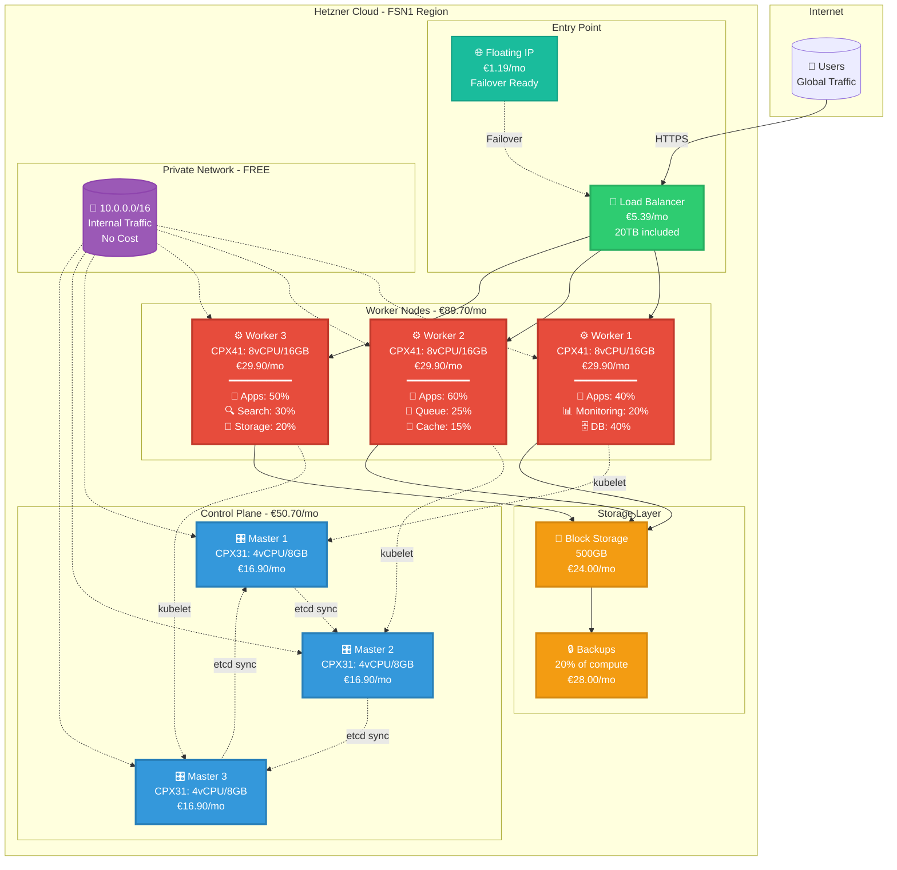
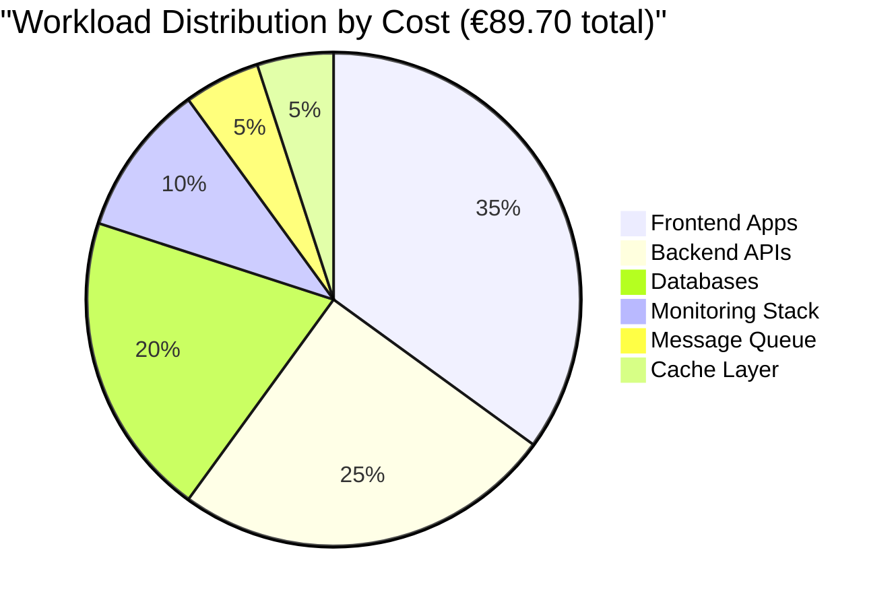
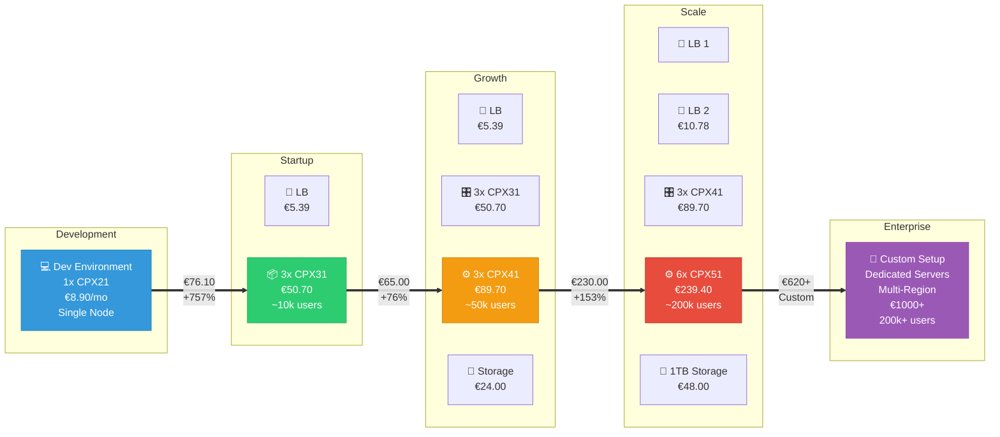

# Kubernetes Cost Optimization & Hetzner Pricing Guide

This guide provides detailed cost analysis for running Kubernetes on Hetzner Cloud, including pricing breakdowns, optimization strategies, and budget planning.

## 🏗️ Kubernetes Architecture & Cost Visualization



### 💵 Total Monthly Cost Breakdown

<div style={{background: 'linear-gradient(135deg, #667eea 0%, #764ba2 100%)', padding: '30px', borderRadius: '15px', color: 'white', margin: '20px 0'}}>
  <div style={{display: 'grid', gridTemplateColumns: 'repeat(auto-fit, minmax(200px, 1fr))', gap: '20px', textAlign: 'center'}}>
    <div style={{background: 'rgba(255,255,255,0.1)', padding: '20px', borderRadius: '10px'}}>
      <div style={{fontSize: '2em', fontWeight: 'bold'}}>€50.70</div>
      <div style={{opacity: 0.9}}>Control Plane</div>
      <div style={{fontSize: '0.8em', opacity: 0.7}}>3x Masters (HA)</div>
    </div>
    <div style={{background: 'rgba(255,255,255,0.1)', padding: '20px', borderRadius: '10px'}}>
      <div style={{fontSize: '2em', fontWeight: 'bold'}}>€89.70</div>
      <div style={{opacity: 0.9}}>Worker Nodes</div>
      <div style={{fontSize: '0.8em', opacity: 0.7}}>3x Workers (Apps)</div>
    </div>
    <div style={{background: 'rgba(255,255,255,0.1)', padding: '20px', borderRadius: '10px'}}>
      <div style={{fontSize: '2em', fontWeight: 'bold'}}>€30.58</div>
      <div style={{opacity: 0.9}}>Infrastructure</div>
      <div style={{fontSize: '0.8em', opacity: 0.7}}>LB + Storage + IP</div>
    </div>
    <div style={{background: 'rgba(255,255,255,0.1)', padding: '20px', borderRadius: '10px'}}>
      <div style={{fontSize: '2em', fontWeight: 'bold'}}>€28.00</div>
      <div style={{opacity: 0.9}}>Backups</div>
      <div style={{fontSize: '0.8em', opacity: 0.7}}>Disaster Recovery</div>
    </div>
  </div>
  <div style={{textAlign: 'center', marginTop: '30px', paddingTop: '20px', borderTop: '1px solid rgba(255,255,255,0.3)'}}>
    <div style={{fontSize: '3em', fontWeight: 'bold'}}>€198.98</div>
    <div style={{fontSize: '1.2em', opacity: 0.9}}>Total Monthly Cost</div>
    <div style={{fontSize: '0.9em', opacity: 0.7}}>~€6.63 per day | ~€0.28 per hour</div>
  </div>
</div>

### 🎯 Service Distribution Across Workers



## 📊 Hetzner Cloud Kubernetes Cost Overview

### Production-Ready Setup (Single Region)

| Component | Specification | Monthly Cost | Purpose |
|-----------|--------------|--------------|---------|
| **Control Plane** | | | |
| 3x CPX31 | 4 vCPU, 8GB RAM, 160GB NVMe | €50.70 | HA Control Plane (etcd, API server) |
| **Worker Nodes** | | | |
| 3x CPX41 | 8 vCPU, 16GB RAM, 240GB NVMe | €89.70 | Application workloads |
| **Load Balancer** | | | |
| 1x LB11 | 20TB traffic included | €5.39 | Ingress traffic distribution |
| **Storage** | | | |
| 500GB Block Storage | Persistent volumes | €24.00 | Database storage, uploads |
| **Networking** | | | |
| 1x Floating IP | Failover support | €1.19 | High availability |
| Private Network | Internal communication | FREE | Secure inter-node traffic |
| **Backup** | | | |
| Automated Backups | 20% of server costs | €28.00 | Disaster recovery |
| **Total** | | **€198.98/month** | Complete HA setup |

### 🌍 Multi-Region Setup (2 Zones)

| Configuration | Monthly Cost | Use Case |
|---------------|--------------|----------|
| 2x Single Region Setup | €397.96 | Geographic redundancy |
| Cross-region traffic | ~€1.19/TB | After 20TB/region |
| GeoDNS Service | ~€10-20 | Global traffic routing |
| **Total Estimate** | **~€420/month** | Full DR capability |

## 💰 Development vs Production Environments

### 🛠️ Development Environment - Minimal Setup

<div style={{background: '#f8f9fa', padding: '20px', borderRadius: '10px', marginBottom: '30px'}}>
  <h4 style={{marginTop: 0}}>Purpose: Local development, testing, CI/CD</h4>
  <p>No high availability required, single-node or minimal cluster</p>
</div>

| Component Group | Item | Specification | Cost/Month | Required? |
|----------------|------|---------------|------------|-----------|
| **Compute** | | | | |
| | Single Node K3s | CPX21: 3 vCPU, 4GB RAM | €8.90 | ✅ Yes |
| | OR Mini Cluster | 1x CPX21 + 2x CX21 | €21.70 | Optional |
| **Storage** | | | | |
| | Local Storage | 80GB included | €0.00 | ✅ Yes |
| | Extra Volume | 50GB for data | €2.40 | Optional |
| **Networking** | | | | |
| | Load Balancer | Not needed | €0.00 | ❌ No |
| | Public IP | 1 included | €0.00 | ✅ Yes |
| | **Total (Minimal)** | | **€8.90** | |
| | **Total (Cluster)** | | **€24.10** | |

### 🚀 Production Environment - Staged Growth

<div style={{background: '#e3f2fd', padding: '20px', borderRadius: '10px', marginBottom: '30px'}}>
  <h4 style={{marginTop: 0}}>Purpose: Live traffic, high availability, scalability</h4>
  <p>Starts small with 20-30 concurrent users, scales as you grow</p>
</div>

#### Stage 1: Startup (20-30 concurrent users)

| Component Group | Item | Specification | Cost/Month | Purpose |
|----------------|------|---------------|------------|---------|
| **Control Plane** | | | | |
| | Master Node | 1x CPX21: 3 vCPU, 4GB | €8.90 | K8s control |
| **Worker Nodes** | | | | |
| | Worker 1 | 1x CPX31: 4 vCPU, 8GB | €16.90 | Apps + DB |
| | Worker 2 | 1x CPX31: 4 vCPU, 8GB | €16.90 | Apps + Cache |
| **Load Balancing** | | | | |
| | Hetzner LB | LB11: Basic | €5.39 | Traffic distribution |
| **Storage** | | | | |
| | Database Volume | 100GB SSD | €4.80 | PostgreSQL data |
| | Backup Storage | 50GB | €2.40 | Daily backups |
| **Networking** | | | | |
| | Floating IP | For failover | €1.19 | High availability |
| | **Stage 1 Total** | | **€56.48/month** | |

#### Stage 2: Growth (100-500 concurrent users)

| Component Group | Item | Specification | Cost/Month | Changes from Stage 1 |
|----------------|------|---------------|------------|---------------------|
| **Control Plane** | | | | |
| | Master Nodes | 3x CPX21 (HA) | €26.70 | +€17.80 (HA setup) |
| **Worker Nodes** | | | | |
| | App Workers | 2x CPX31: 4 vCPU, 8GB | €33.80 | Same nodes |
| | DB Worker | 1x CPX41: 8 vCPU, 16GB | €29.90 | +€29.90 (dedicated) |
| **Load Balancing** | | | | |
| | Hetzner LB | LB11: Basic | €5.39 | No change |
| **Storage** | | | | |
| | Database Volume | 250GB SSD | €12.00 | +€7.20 (growth) |
| | App Storage | 100GB | €4.80 | +€4.80 (new) |
| | Backup Storage | 200GB | €9.60 | +€7.20 (growth) |
| **Monitoring** | | | | |
| | Monitoring Node | 1x CX21: 2 vCPU, 4GB | €6.49 | +€6.49 (new) |
| | **Stage 2 Total** | | **€128.68/month** | +€72.20 |

#### Stage 3: Scale (1000+ concurrent users)

| Component Group | Item | Specification | Cost/Month | Changes from Stage 2 |
|----------------|------|---------------|------------|---------------------|
| **Control Plane** | | | | |
| | Master Nodes | 3x CPX31 (HA) | €50.70 | +€24.00 (upgrade) |
| **Worker Nodes** | | | | |
| | App Workers | 3x CPX41: 8 vCPU, 16GB | €89.70 | +€55.90 (scale) |
| | DB Cluster | 2x CPX41: 8 vCPU, 16GB | €59.80 | +€29.90 (HA DB) |
| **Load Balancing** | | | | |
| | Hetzner LB | LB21: Standard | €10.78 | +€5.39 (upgrade) |
| **Storage** | | | | |
| | Database Volume | 500GB SSD | €24.00 | +€12.00 (growth) |
| | App Storage | 250GB | €12.00 | +€7.20 (growth) |
| | Backup Storage | 500GB | €24.00 | +€14.40 (growth) |
| **Monitoring** | | | | |
| | Monitoring Stack | 1x CPX31: 4 vCPU, 8GB | €16.90 | +€10.41 (upgrade) |
| **Caching** | | | | |
| | Redis Dedicated | Part of workers | €0.00 | Included |
| | **Stage 3 Total** | | **€287.88/month** | +€159.20 |

### 📊 Quick Comparison Summary

| Environment | Users | High Availability | Monthly Cost | Key Components |
|------------|-------|-------------------|--------------|----------------|
| **Dev - Minimal** | 1-5 devs | ❌ No | €8.90 | 1 node, no LB |
| **Dev - Team** | 5-10 devs | ❌ No | €24.10 | 3 nodes, no LB |
| **Prod - Stage 1** | 20-30 | ⚠️ Basic | €56.48 | 2 workers, 1 LB |
| **Prod - Stage 2** | 100-500 | ✅ Yes | €128.68 | 3 workers, HA control |
| **Prod - Stage 3** | 1000+ | ✅ Full | €287.88 | 5 workers, full HA |

### 💡 Key Differences: Dev vs Production

| Aspect | Development | Production |
|--------|-------------|------------|
| **Load Balancer** | ❌ Not needed | ✅ Required |
| **High Availability** | ❌ Single points OK | ✅ No single points |
| **Backups** | ⚠️ Optional | ✅ Mandatory |
| **Monitoring** | ⚠️ Basic logs | ✅ Full stack |
| **SSL Certificates** | 🔒 Self-signed OK | 🔒 Valid certs required |
| **Resource Limits** | 📊 Flexible | 📊 Strictly defined |
| **Downtime** | ✅ Acceptable | ❌ Must minimize |

### 📈 Scaling Path Visualization



## 🚀 Service-Specific Costs

### Containerized Services Pricing

| Service | Resource Requirements | Est. Monthly Share | Notes |
|---------|---------------------|-------------------|--------|
| **PostgreSQL** | 2 vCPU, 4GB RAM, 100GB | €15-20 | Primary database |
| **Redis** | 1 vCPU, 2GB RAM | €5-8 | Caching layer |
| **RabbitMQ** | 2 vCPU, 4GB RAM | €10-15 | Message queue |
| **Grafana** | 1 vCPU, 2GB RAM | €5-8 | Monitoring |
| **Prometheus** | 2 vCPU, 4GB RAM, 50GB | €12-18 | Metrics storage |
| **Elasticsearch** | 4 vCPU, 8GB RAM, 200GB | €30-40 | Log aggregation |
| **MinIO** | 2 vCPU, 4GB RAM, 500GB | €25-35 | Object storage |

## 📈 Traffic & Bandwidth Costs

| Traffic Type | Included | Overage Cost | Optimization |
|-------------|----------|--------------|--------------|
| **Ingress** | Unlimited | FREE | - |
| **Egress** | 20TB/LB | €1.19/TB | Use CDN for static assets |
| **Inter-zone** | Depends | €1.19/TB | Use private networks |
| **Backups** | Depends | €1.19/TB | Compress before transfer |

## 🛠️ Cost Optimization Strategies

### 1. **Right-Sizing Nodes**

```yaml
# Node pool configuration example
apiVersion: cluster.k8s.io/v1alpha1
kind: MachinePool
spec:
  replicas: 3
  template:
    spec:
      providerSpec:
        serverType: cpx31  # Start small, scale up
        placementGroup: spread  # Distribute across failure domains
```

### 2. **Autoscaling Configuration**

```yaml
# Cluster Autoscaler for Hetzner
apiVersion: apps/v1
kind: Deployment
metadata:
  name: cluster-autoscaler
spec:
  template:
    spec:
      containers:
      - image: k8s.gcr.io/autoscaling/cluster-autoscaler:v1.27.0
        name: cluster-autoscaler
        command:
        - ./cluster-autoscaler
        - --nodes=1:10:CPX31:fsn1:pool1  # Min:Max:Type:Location:Pool
        - --nodes=1:5:CPX41:fsn1:pool2
```

### 3. **ARM-Based Servers (40% Savings)**

| Intel/AMD Server | ARM Equivalent | Savings |
|-----------------|----------------|---------|
| CPX31 (€16.90) | CAX31 (€10.90) | €6/month (35%) |
| CPX41 (€29.90) | CAX41 (€19.90) | €10/month (33%) |
| CX51 (€39.90) | CAX51 (€25.90) | €14/month (35%) |

### 4. **Spot Instances for Non-Critical Workloads**

- Hetzner Server Auction: Up to 50% savings
- Best for: Batch jobs, CI/CD runners, development environments
- Not suitable for: Databases, stateful services

## 📊 Monthly Budget Calculator

### Small SaaS Application
```
Base Infrastructure:
- 3x CAX31 (ARM):           €32.70
- 1x Load Balancer:         €5.39
- 200GB Block Storage:      €9.60
- Backups (20%):           €9.54
-----------------------------------
Total:                     €57.23/month
```

### Medium Multi-Tenant Platform
```
Infrastructure:
- 3x CPX41 (Workers):       €89.70
- 3x CPX31 (Control):       €50.70
- 2x Load Balancers:        €10.78
- 500GB Block Storage:      €24.00
- 1TB Bandwidth extra:      €1.19
- Backups (20%):           €35.27
-----------------------------------
Total:                    €211.64/month
```

### Enterprise Platform
```
Multi-Region Setup:
- 6x CPX51 (Workers):      €239.40
- 3x CPX41 (Control):       €89.70
- 3x Load Balancers:        €16.17
- 2TB Block Storage:        €96.00
- Floating IPs (3x):        €3.57
- Backups (20%):           €88.97
- Monitoring Stack:         €30.00
-----------------------------------
Total:                    €563.81/month
```

## 🔍 Cost Monitoring Setup

### 1. **Prometheus Cost Exporter**
```yaml
apiVersion: v1
kind: ConfigMap
metadata:
  name: cost-model
data:
  CPU: "0.031611"     # €/vCPU/hour
  RAM: "0.004480"     # €/GB/hour
  Storage: "0.00006667" # €/GB/hour
  LoadBalancer: "0.00748" # €/hour
```

### 2. **Grafana Dashboard**
- Track resource usage by namespace
- Cost allocation by team/project
- Budget alerts and forecasting

### 3. **Cost Allocation Tags**
```yaml
apiVersion: v1
kind: Namespace
metadata:
  name: team-frontend
  labels:
    cost-center: "engineering"
    team: "frontend"
    budget: "500"  # Monthly EUR
```

## 💡 Money-Saving Tips

1. **Use Private Networks**: Free internal traffic
2. **Implement Caching**: Reduce compute and bandwidth
3. **Schedule Dev Environments**: Shut down nights/weekends
4. **Optimize Images**: Smaller containers = less storage
5. **Regular Cleanup**: Remove unused volumes and snapshots
6. **Long-term Commitments**: Contact Hetzner for volume discounts

## 📋 Decision Matrix

| If You Need... | Choose... | Monthly Cost |
|----------------|-----------|--------------|
| Quick prototype | 1x CPX21 | €8.90 |
| Small production | 3x CPX31 + LB | €85 |
| HA production | Full setup (table above) | €199 |
| Global presence | Multi-region | €420 |
| Maximum savings | ARM servers | -35% |
| Predictable costs | Reserved capacity | Contact sales |

## 🚨 Hidden Costs to Consider

- **Bandwidth overages**: Plan for traffic spikes
- **Backup storage**: Grows over time
- **Monitoring stack**: ~€30-50/month extra
- **SSL certificates**: Free with cert-manager
- **Domain/DNS**: ~€10-20/year
- **External services**: CI/CD, image registry

---

**Note**: Prices based on Hetzner Cloud pricing as of 2024. Always check [console.hetzner.cloud](https://console.hetzner.cloud/projects) for current rates. Prices exclude VAT and may vary by region.