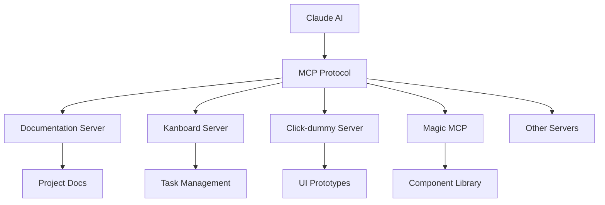

# MCP Servers Documentation

Model Context Protocol (MCP) servers extend Claude's capabilities by providing direct access to project resources, tools, and services.

## Quick Links

- 🚀 **[Claude Code Setup Guide](./claude-code-setup.md)** - Complete configuration guide for all MCP servers
- 📖 [Configuration Reference](./claude-code-setup.md#complete-configuration) - Full JSON configuration
- 🔧 [Troubleshooting](./claude-code-setup.md#troubleshooting) - Common issues and solutions

## Available MCP Servers

### Core Development Servers

| Server | Purpose | Status |
|--------|---------|--------|
| [Documentation Server](./docs-server.md) | Semantic search through project docs | ✅ Active |
| [Kanboard Server](./kanboard-server.md) | Project management integration | ✅ Active |
| [Click-dummy Server](./click-dummy-server.md) | UI prototype exploration | ✅ Active |
| [Sequential Thinking](./sequential-thinking.md) | Complex problem solving | ✅ Active |
| [Magic MCP](./magic-mcp.md) | UI component generation | ✅ Active |
| [Puppeteer](./puppeteer.md) | Browser automation | ✅ Active |

### Architecture



## Quick Start

### 1. Enable MCP Servers

MCP servers are configured in Claude's settings. Each server provides specific capabilities:

```yaml
# Example MCP configuration
mcp_servers:
  - name: docs-mcp
    type: documentation
    path: ./mcp/docs-server
  
  - name: kanboard-mcp
    type: project-management
    api_url: http://localhost:4041
```

### 2. Using MCP Servers

In Claude, MCP functions are called with the prefix `mcp__[server-name]__[function]`:

```javascript
// Search documentation
mcp__docs-mcp__search_documentation({
  query: "RBAC implementation",
  category: "architecture"
});

// Create Kanban task
mcp__kanboard-mcp__create_task({
  title: "Implement user dashboard",
  project_id: 1
});

// Search UI prototypes
mcp__click-dummy-mcp__search_click_dummy({
  query: "user profile",
  tier: "account"
});
```

## Server Categories

### 1. Documentation & Knowledge
- **docs-mcp**: Project documentation search
- **click-dummy-mcp**: UI prototype patterns
- **sequential-thinking**: Problem decomposition

### 2. Project Management
- **kanboard-mcp**: Task tracking and management

### 3. Code Generation
- **magic-mcp**: UI component generation
- **21st-mcp**: Advanced component inspiration

### 4. Testing & Automation
- **puppeteer**: Browser automation and testing

## Best Practices

### 1. Server Selection
- Use the most specific server for your task
- Combine multiple servers for complex workflows
- Check server status before relying on functionality

### 2. Error Handling
```javascript
try {
  const result = await mcp__kanboard-mcp__get_task({ task_id: 42 });
} catch (error) {
  // Handle server unavailability
  console.error('Kanboard server error:', error);
}
```

### 3. Performance
- Cache frequently accessed data
- Use batch operations when available
- Minimize cross-server dependencies

## Troubleshooting

### Common Issues

| Issue | Solution |
|-------|----------|
| Server not responding | Check Docker container status |
| Authentication errors | Verify API credentials |
| Function not found | Update server configuration |
| Timeout errors | Check network connectivity |

### Debug Commands

```bash
# Check MCP server status
docker ps | grep mcp

# View server logs
docker logs [container-name]

# Test server connectivity
curl http://localhost:[port]/health
```

## Development

### Adding New MCP Servers

1. Create server implementation
2. Add Docker configuration
3. Update MCP settings
4. Document in this section
5. Add integration tests

### Server Requirements

- RESTful API or direct integration
- Error handling and logging
- Performance monitoring
- Security considerations
- Documentation

## Related Documentation

- [MCP Protocol Specification](https://modelcontextprotocol.io)
- [Docker Services](../deployment/docker/)
- [API Integration](../../architecture/api-design/)
- [Development Workflow](../workflows/)