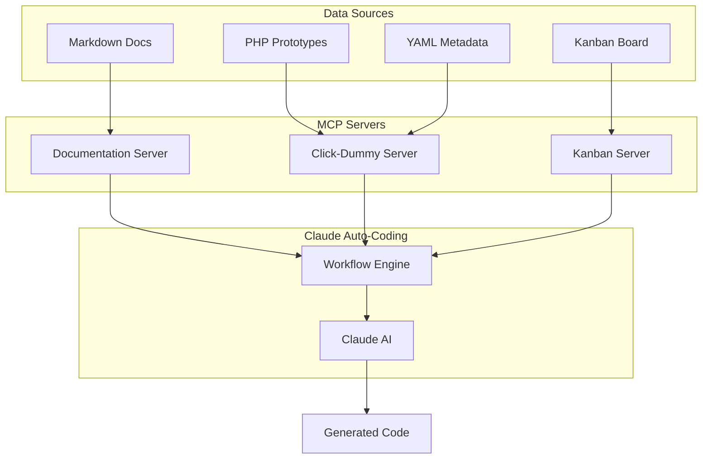

# Intelligent Auto-Coding System

A comprehensive integration of documentation, click-dummy prototypes, and Kanban tasks for intelligent code generation with Claude.

## Overview

The itellico Mono project uses an intelligent auto-coding system that combines:

1. **MCP Documentation Server** - Searchable project documentation
2. **Click-Dummy Prototypes** - Interactive UI/UX reference implementations
3. **Kanban Integration** - Task tracking and progress management
4. **Feature Mappings** - Links between prototypes and actual code

## System Architecture



## Auto-Coding Workflow

### 1. Task Initiation

When Claude receives a development task, it automatically:

```typescript
// 1. Search documentation
const docs = await mcp.searchDocumentation(feature);

// 2. Find click-dummy prototype
const prototype = await mcp.searchClickDummy(feature);

// 3. Check Kanban tasks
const tasks = await mcp.listTasks({ query: feature });

// 4. Get implementation map
const map = await mcp.getFeatureImplementationMap(feature);
```

### 2. Information Gathering

Claude gathers comprehensive information:

- **Documentation**: Architecture patterns, API design, data models
- **Click-Dummy**: UI components, user flows, visual design
- **Metadata**: Features, permissions, API endpoints
- **Kanban**: Related tasks, implementation status

### 3. Code Generation

Based on gathered information, Claude:

1. Follows established patterns from documentation
2. Implements UI matching click-dummy prototypes
3. Creates proper API endpoints with permissions
4. Updates Kanban task status
5. Generates tests following patterns

## Click-Dummy Metadata

Each prototype includes a `.metadata.yaml` file:

```yaml
path: tenant/talent/index.php
tier: tenant
title: Talent Database Management
description: Comprehensive talent management system
features:
  - talent-profiles
  - advanced-search
  - bulk-operations
components:
  - data-table
  - search-filters
  - profile-cards
implementation_status: partial
related_docs:
  - /docs/tenant/core-management/talent-database.md
related_tasks:
  - TENANT-010: Talent search implementation
permissions:
  - tenant.talent.view
  - tenant.talent.create
api_endpoints:
  - /api/v1/tenant/talent
  - /api/v1/tenant/talent/search
implementation_files:
  frontend:
    - apps/web/src/pages/tenant/talent/
    - apps/web/src/components/tenant/TalentTable.tsx
  api:
    - apps/api/src/routes/tenant/talent/
    - apps/api/src/services/talent-service.ts
```

## Feature Mapping

The `feature-mappings.yaml` file links prototypes to implementation:

```yaml
talent-management:
  clickDummy: tenant/talent/index.php
  implementation:
    frontend:
      - apps/web/src/pages/tenant/talent/index.tsx
      - apps/web/src/components/tenant/TalentTable.tsx
    api:
      - apps/api/src/routes/tenant/talent/index.ts
      - apps/api/src/services/talent-service.ts
  status: partial
  kanbanTasks:
    - "2" # Talent Search Implementation
    - "3" # Bulk Operations API
```

## MCP Server Commands

### Documentation Server

```bash
# Search documentation
mcp__itellico-mono-docs__search_documentation("talent search")

# Get architecture info
mcp__itellico-mono-docs__get_architecture_info("api", "patterns")

# Get workflow
mcp__itellico-mono-docs__get_development_workflow("new-feature")

# Get code patterns
mcp__itellico-mono-docs__get_code_patterns("component", "react")
```

### Click-Dummy Server

```bash
# Search prototypes
mcp__click-dummy__search_click_dummy("schema builder", "platform")

# Get prototype details
mcp__click-dummy__get_prototype_details("platform/schemas/builder.php")

# List features
mcp__click-dummy__list_prototype_features("tenant")

# Get implementation map
mcp__click-dummy__get_feature_implementation_map("talent-management")

# Get UI components
mcp__click-dummy__get_ui_components("table")
```

### Kanban Server

```bash
# List tasks
mcp__itellico-mono-kanboard__list_tasks(1, "active")

# Create task
mcp__itellico-mono-kanboard__create_task("Implement schema builder", 1)

# Update task
mcp__itellico-mono-kanboard__update_task(2, { is_active: 0 })

# Add comment
mcp__itellico-mono-kanboard__add_comment(2, "Implementation complete")
```

## Example: Implementing a Feature

### User Request
"Implement the schema builder feature"

### Claude's Auto-Coding Process

1. **Search Documentation**
   ```
   Found: /docs/platform/developer-tools/schema-builder.md
   Pattern: Drag-and-drop interface with field types
   ```

2. **Find Click-Dummy**
   ```
   Found: platform/schemas/builder.php
   Features: drag-drop, field-types, validation-rules
   Components: form-builder, preview-panel
   ```

3. **Check Kanban**
   ```
   Task #1: "Schema Builder UI Implementation"
   Status: not_started
   ```

4. **Get Implementation Map**
   ```
   Frontend: SchemaBuilder.tsx, FieldTypeSelector.tsx
   API: /api/v1/platform/schemas
   Permissions: platform.schemas.create
   ```

5. **Generate Code**
   - Creates React components matching click-dummy
   - Implements API following documented patterns
   - Adds proper permissions
   - Writes tests

6. **Update Status**
   - Marks Kanban task as complete
   - Updates documentation
   - Updates metadata status

## Best Practices

1. **Always Search First**
   - Documentation for patterns
   - Click-dummy for UI reference
   - Kanban for task status

2. **Follow Established Patterns**
   - Use existing component patterns
   - Match API response formats
   - Implement proper permissions

3. **Keep Metadata Updated**
   - Update implementation_status
   - Add new related_docs
   - Link Kanban tasks

4. **Test Everything**
   - Unit tests for components
   - API endpoint tests
   - Integration tests

## Creating New Features

### 1. Create Click-Dummy Prototype
```php
// php/click-dummy/new-feature/index.php
<?php include '../includes/header.php'; ?>
<!-- Prototype HTML -->
```

### 2. Add Metadata
```yaml
# new-feature/index.metadata.yaml
path: new-feature/index.php
tier: platform
title: New Feature
features: [...]
```

### 3. Update Feature Mapping
```yaml
# feature-mappings.yaml
new-feature:
  clickDummy: new-feature/index.php
  implementation:
    frontend: []
    api: []
  status: not_implemented
```

### 4. Create Kanban Task
```bash
mcp__itellico-mono-kanboard__create_task("Implement new feature")
```

## Troubleshooting

### MCP Server Not Found
```bash
# Build the click-dummy server
cd mcp-servers/click-dummy
pnpm install
pnpm build
```

### Metadata Not Loading
- Ensure `.metadata.yaml` files are properly formatted
- Check file paths are relative to click-dummy root

### Feature Mapping Issues
- Verify `feature-mappings.yaml` syntax
- Ensure all paths exist

## Related Documentation

- [MCP Server Setup](/development/tools/mcp-servers)
- [Click-Dummy Guide](/development/prototypes/click-dummy)
- [Kanban Workflow](/development/workflows/kanban)
- [API Patterns](/architecture/api-design)